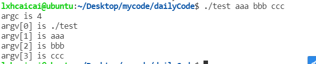
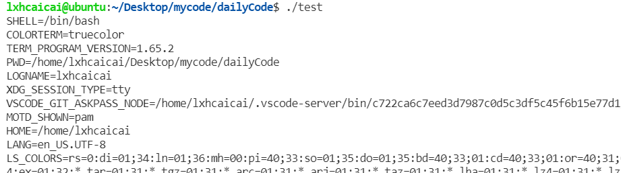

# 算法题部分

[P1177 【模板】快速排序](https://www.luogu.com.cn/problem/P1177)

```cpp
#include <iostream>
#include <vector>

using namespace std;
const int N = 1e5 + 100;

vector<int> a(N);

int main() {
	
	int n;
	cin >> n;
	for(int i = 1; i <= n; i ++) {
		cin >> a[i];
	}
	
	auto qsort = [&](auto self, int l, int r) -> void{
		int mid = a[(l + r) >> 1], i = l, j = r;
		while(i < j) {
			while(a[i] < mid) i ++;
			while(a[j] > mid) j --;
			if(i <= j){
				swap(a[i], a[j]);
				i ++, j --;
			}
		}
		if(i < r) self(self, i, r);
		if(j > l) self(self, l, j);
	};
	
	qsort(qsort, 1, n);
	
	for(int i=1;i<=n;i++) printf("%d ",a[i]);
	
	return 0;
} 
```

Java 版本

```java
import java.util.Scanner;

/**
 * @ClassName Main
 * @Description TODD
 * @Autor LXH
 * @Date 2022/6/10 22:30
 */

public class Main {
    final static int N = (int) (1e5 + 100);

    static int a[] = new int[N];
    static int n = 0;

    static void qsort(int l, int r) {
        int mid = a[(l + r) >> 1], i = l, j = r;
        while(i < j) {
            while(a[i] < mid) i ++;
            while(a[j] > mid) j --;

            if (i <= j) {
               int tmp = a[i];
               a[i] = a[j];
               a[j] = tmp;

               i ++; j --;
            }
        }
        if (i < r) qsort(i, r);
        if (l < j) qsort(l, j);
    }

    public static void main(String[] args) {

        Scanner scanner = new Scanner(System.in);
        n = scanner.nextInt();
        for(int i = 1; i <= n; i ++) {
            a[i] = scanner.nextInt();
        }
        qsort(1, n);
        for(int i =1; i <= n; i ++) {
            System.out.printf("%d ", a[i]);
        }
    }
}

```

Java api 版本

```java
import java.util.Arrays;
import java.util.Scanner;

/**
 * @ClassName Main
 * @Description TODD
 * @Autor LXH
 * @Date 2022/6/10 22:30
 */

public class Main {

    public static void main(String[] args) {
        Scanner scanner = new Scanner(System.in);
        int n = scanner.nextInt();
        int a[] = new int[n + 2];
        for (int i = 1; i <= n; i ++) {
            a[i] = scanner.nextInt();
        }
        // 初始位置加上偏移量 比如说 n 个数组 1~ n 排序
        Arrays.sort(a, 1, n + 1);

        for(int i = 1; i <= n; i ++) {
            System.out.printf("%d ", a[i]);
        }
    }
}

```


# 技术部分

## C语言格式化输出

 **格式化输出**

printf 函数函数声明

```cpp
int printf(const char *format, ...);
```

 **类型符（type）**

它用以表示输出数据的类型，以下是常用类型的汇总，不常用的就不列了。

%hd、%d、%ld 以十进制、有符号的形式输出 short、int、long 类型的整数。

%hu、%u、%lu 以十进制、无符号的形式输出 short、int、long 类型的整数

%c 输出字符。

%lf 以普通方式输出double（float弃用，long doube无用）。

%e 以科学计数法输出double。

%s 输出字符串。

%p 输出内存的地址。

**宽度（width）**

```cpp
 printf("=%12s=\n","abc");     // 输出=         abc=
 printf("=%12d=\n",123);       // 输出=         123=
 printf("=%12lf=\n",123.5);    // 输出=  123.500000=
```

 **对齐标志（flags）**

flags它用于控制输出内容的对齐方式。

**不填或+**：输出的内容右对齐，这是缺省的方式.

**-**：输出的内容左对齐。

**精度（prec）**

如果输出的内容是浮点数，它用于控制输出内容的精度，也就是说小数点后面保留多少位，后面的数四舍五入。

```cpp
  printf("=%12.2lf=\n",123.5);   // 输出=      123.50=
  printf("=%.2lf=\n",123.5);     // 输出=123.50=
  printf("=%12.2e=\n",123500000000.0);  // 输出=    1.24e+11=
  printf("=%.2e=\n",123500000000.0);    // 输出=1.24e+11=
```

## 格式化输出到字符串

```cpp
int printf(const char *format, ...);
int sprintf(char *str, const char *format, ...);
int snprintf(char *str, size_t size, const char *format, ...);
```

功能：printf是把结果输出到屏幕，sprintf把格式化输出的内容保存到字符串str中，snprintf的n类似于strncpy中的n，意思是只获取输出结果的前n-1个字符，不是n个字符。

示例(book.c)

```c
/*
 * 程序名：book.c，此程序演示格式化输出sprintf和snprintf函数。
 * 
*/
#include <stdio.h>
#include <string.h>
 
int main()
{
  char str[301];
 
  // 格式化输出到str中
  sprintf(str,"%d,%c,%f,%s",10,'A',25.97,"一共输入了三个数。");
  printf("%s\n",str);
 
  // 格式化输出到str中，只截取前7个字符
  snprintf(str,8,"%d,%c,%f,%s",10,'A',25.97,"一共输入了三个数。");
  printf("%s\n",str);
}
```

运行结果：

>10,A,25.970000,一共输入了三个数。
>10,A,25

### C语言代码的多行书写

如果我们在一行代码的行尾放置一个反斜杠，c语言编译器会忽略行尾的换行符，而把下一行的内容也算作是本行的内容。这里反斜杠起到了续行的作用。

```c
strcpy(str,"aaaaaaaaaa\
bbbbbbbbb");
```


## 小实验

编写解析XML字符串的函数族，解析XML字符串。

```c
#include <stdio.h>
#include <string.h>

struct st_girl
{
  char name[51];   // 姓名
  int  age;        // 年龄
  int  height;     // 身高，单位：cm
  double weight;     // 体重，单位：kg
  char sc[31];     // 身材，火辣；普通；飞机场
};

// 解析XML字符串的函数族，支持int、char *和double三种类型。
// 返回值：0-成功，-1-失败。
int GetXMLBuffer_Int(const char *in_XMLBuffer,const char *in_FieldName,int *out_Value);
int GetXMLBuffer_Str(const char *in_XMLBuffer,const char *in_FieldName,char *out_Value);
int GetXMLBuffer_Double(const char *in_XMLBuffer,const char *in_FieldName,double *out_Value);
 
int main()
{
  struct st_girl stgirl;
  memset(&stgirl,0,sizeof(struct st_girl));

  strcpy(stgirl.name,"西施");
  stgirl.age=18;
  stgirl.height=168;
  stgirl.weight=45.5;
  strcpy(stgirl.sc,"火辣");

  char str[301];
  memset(str,0,sizeof(str));

  sprintf(str,\
         "<name>%s</name><age>%d</age><height>%d</height><weight>%.2lf</weight><sc>%s</sc>",\
          stgirl.name,stgirl.age,stgirl.height,stgirl.weight,stgirl.sc);
  
  printf("=%s=\n",str);

  memset(&stgirl,0,sizeof(struct st_girl));
  GetXMLBuffer_Str(str,"name", stgirl.name);
  GetXMLBuffer_Int(str,"age" ,&stgirl.age);
  printf("name=%s,age=%d\n",stgirl.name,stgirl.age);
}

// <name>西施</name><age>18</age><height>168</height><weight>45.50</weight><sc>火辣</sc>
int GetXMLBuffer_Str(const char *in_XMLBuffer,const char *in_FieldName,char *out_Value)
{
  if (out_Value==0) return -1;  // 如果out_Value是空地址，返回失败。

  char *start=0,*end=0;
  char m_SFieldName[51],m_EFieldName[51];  // 字段的开始和结束标签。

  int m_NameLen = strlen(in_FieldName);  // 字段名长度。
  memset(m_SFieldName,0,sizeof(m_SFieldName));
  memset(m_EFieldName,0,sizeof(m_EFieldName));

  snprintf(m_SFieldName,50,"<%s>",in_FieldName);
  snprintf(m_EFieldName,50,"</%s>",in_FieldName);

  start=0; end=0;

  start = (char *)strstr(in_XMLBuffer,m_SFieldName);  // 字段开始标签的位置

  if (start != 0)
  {
    end   = (char *)strstr(start,m_EFieldName);  // 字段结束标签的位置。
  }

  if ((start==0) || (end == 0)) return -1;

  int   m_ValueLen = end - start - m_NameLen - 2;  // 字段值的长度。

  strncpy(out_Value,start+m_NameLen+2,m_ValueLen);  // 获取字段的值。

  out_Value[m_ValueLen]=0;

  return 0;
}


int GetXMLBuffer_Int(const char *in_XMLBuffer,const char *in_FieldName,int *out_Value)
{
  char strvalue[51];
  memset(strvalue,0,sizeof(strvalue));

  if (GetXMLBuffer_Str(in_XMLBuffer,in_FieldName,strvalue)!=0) return -1;

  (*out_Value)=atoi(strvalue);

  return 0;
}
```

## main 函数的参数

**main函数的参数**

main函数有三个参数，argc、argv和envp，它的标准写法如下：

```
int main(int argc,char *argv[],char *envp[])
```

int argc，存放了命令行参数的个数。

char *argv[]，是个字符串的数组，每个元素都是一个字符指针，指向一个字符串，即命令行中的每一个参数。

char *envp[]，也是一个字符串的数组，这个数组的每一个元素是指向一个环境变量的字符指针。


示例 book.c

```c
#include <stdio.h>
 
int main(int argc,char *argv[])
{
  int ii=0;
 
  // 显示参数的个数
  printf("argc is %d\n",argc);
 
  // 列出全部的参数
  for (ii=0;ii<argc;ii++)
  {
    printf("argv[%d] is %s\n",ii,argv[ii]);
  }
}
```

运行结果：



注意几个事项：

1）argc的值是参数个数加1，因为程序名称是程序的第一个参数，即argv[0]，在上面的示例中，argv[0]是./book101。

2）main函数的参数，不管是书写的整数还是浮点数，全部被认为是字符串。

3）参数的命名argc和argv是程序员的约定，您也可以用argd或args，但是不建议这么做。

**envp参数**

test.c

```c
#include <stdio.h>
 
int main(int argc,char *argv[],char *envp[])
{
  int ii = 0;
 
  while (envp[ii] != 0)  // 数组最后一个元素是0
  {
    printf("%s\n",envp[ii]); ii++;
  }
}
```

运行结果



## 动态内存管理

 **malloc 函数**

函数的原型：

```c
void *malloc(unsigned int size)；
```

malloc的作用是向系统申请一块大小为size的连续内存空间，如果申请失败，函数返回0，如果申请成功，返回成功分配内存块的起始地址。

例如：

```c
  malloc(100)； // 申请 100 个字节的临时分配域，返回值为其第一个字节的地址
```

malloc的返回值的地址的基类型为 void，即不指向任何类型的数据，只提供一个地址，程序中需要定义一个指针来指向动态分配的内存地址。

例如：

```c
  int *pi=malloc(sizeof(int));
```


示例 

test.c

```c
#include <stdio.h>
#include <stdlib.h>
#include <string.h>
 
struct st_girl  // 超女结构体
{
  char name[50];     // 姓名
  int  age;          // 年龄
};
 
int main(int argc,char *argv[])
{
  int    *pi=malloc(sizeof(int));    // 分配int类型大小的内存
  long   *pl=malloc(sizeof(long));   // 分配long类型大小的内存
  double *pd=malloc(sizeof(double)); // 分配double类型大小的内存
  char   *pc=malloc(101);            // 分配101字节的内存，可存放100个字符的字符串
  struct st_girl *pst=malloc(sizeof(struct st_girl)); // 分配struct st_girl结构体大小的内存
 
  // 以下代码是像普通指针和变量一样使用动态分配的内存
  *pi=10;     printf("*pi=%d\n",*pi);
  *pl=20;     printf("*pl=%d\n",*pl);
  *pd=10.5;   printf("*pd=%.1f\n",*pd);
  strcpy(pc,"西施"); printf("*pc=%s\n",pc);
  strcpy(pst->name,"杨玉环"); pst->age=21;
  printf("name=%s,age=%d\n",pst->name,pst->age);
 
  // 释放动态分配的内存
  free(pi); free(pl); free(pd); free(pc); free(pst);
}
```

运行结果：

>*pi=10
>*pl=20
>*pd=10.5
>*pc=西施
>name=杨玉环,age=21

**野指针**

野指针就是无效的指针，与空指针不同，野指针无法通过简单地判断是否为 NULL避免，而只能通过养成良好的编程习惯来尽力减少。

**内存指针变量未初始化**

指针变量刚被创建时不一定会自动初始化成为空指针（与编译器有关），它的缺省值是可能随机的，它会随便乱指。所以，指针变量在创建的同时应当被初始化，要么将指针的值设置为0，要么让它指向合法的内存。

```c
  int *pi=0;
```

或

```c
  int i;
  int *pi=&i;
```

**内存释放后之后指针未置空**

调用free函数把指针所指的内存给释放掉，但指针不一定会赋值 0（也与编译器有关），如果对释放后的指针进行操作，相当于非法操作内存。释放内存后应立即将指针置为0。

```c
  free(pi);
  pi=0;
```