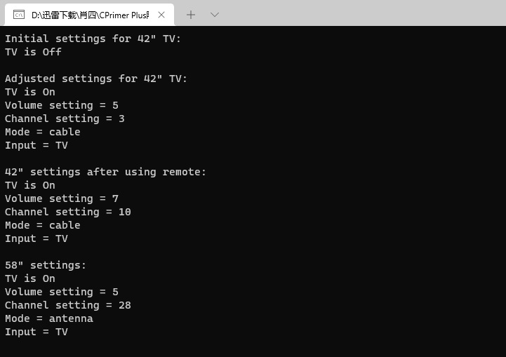
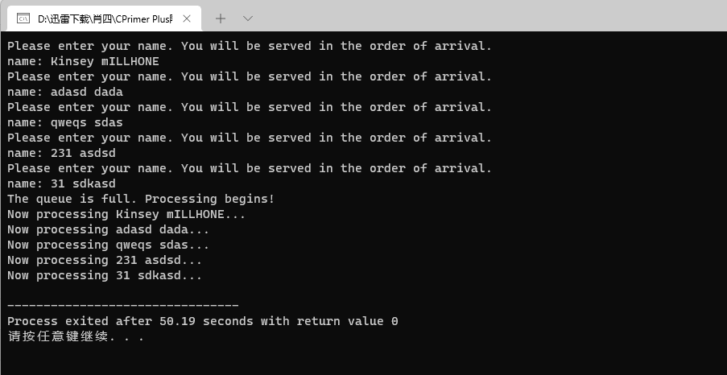
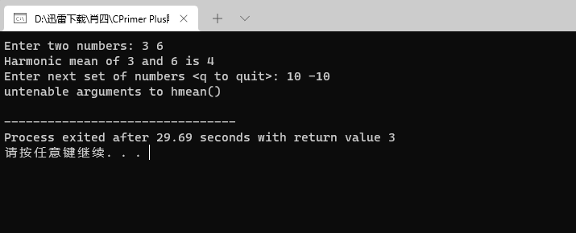
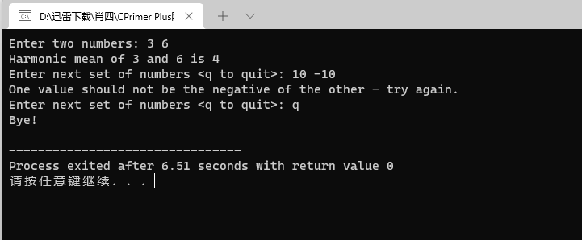
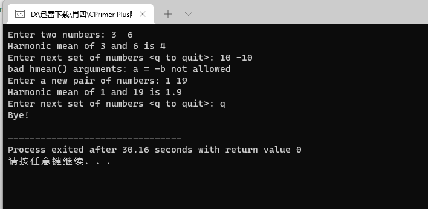
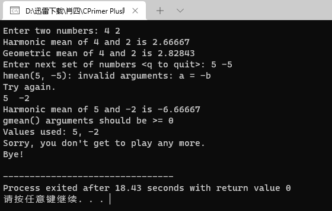
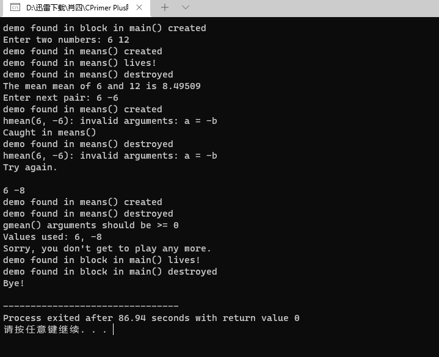
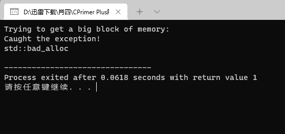
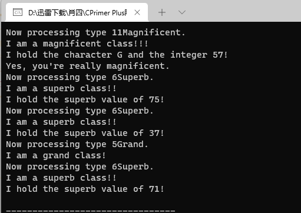
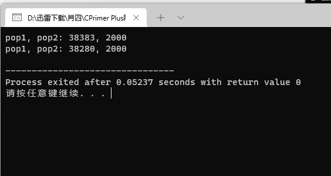

# 算法部分

[【模板】轻重链剖分/树链剖分](https://www.luogu.com.cn/problem/P3384)

C++ 版本

```cpp
#include <vector>
#include <iostream>

using namespace std;

using i64 = long long;

const int N = 1E5 +100;

vector<int> head(N,0), edge(N << 1, 0), ver(N << 1, 0), nex(N << 1, 0);
int tot = 0;

void addedge(int x, int y, int z) {
	ver[++tot] = y, nex[tot] = head[x], head[x] =tot; edge[tot] = z;
}

vector<int> son(N,0), dfn(N,0), fa(N,0), rnk(N,0);
vector<int> d(N, 0), siz(N, 0), top(N, 0);
int cnt = 0;

#define lc (p << 1)
#define rc (p << 1 | 1)
#define mid ((t[p].l + t[p].r) >> 1)

struct Segment{
	int l, r;
	i64 dat, lz;
};

vector<Segment> t(N << 2);

int mod;

int n, root, m, w[N];

void pushup(int p) {
	t[p].dat = (t[lc].dat + t[rc].dat) % mod;
}

void build(int p, int l, int r) {
	t[p].l = l, t[p].r = r;
	t[p].lz = 0;
	if(l == r) {
		t[p].dat = w[rnk[l]];
		return;
	}
	build(lc, l, mid);
	build(rc, mid + 1, r);
	pushup(p); 
}

void spread(int p) {
	if(t[p].lz == 0) return;
	t[lc].dat = (t[lc].dat + (t[lc].r - t[lc].l + 1) * t[p].lz) % mod; 
	t[rc].dat = (t[rc].dat + (t[rc].r - t[rc].l + 1) * t[p].lz) % mod;
	t[lc].lz = (t[lc].lz + t[p].lz) % mod;
	t[rc].lz = (t[rc].lz + t[p].lz) % mod;
	t[p].lz = 0;
}

i64 query(int p, int l ,int r){
	if(l <= t[p].l && t[p].r <= r) {
		return t[p].dat;
	}
	spread(p);
	i64 val = 0;
	if(l <= mid) val += query(lc, l, r);
	if(r > mid) val += query(rc, l, r);
	return val % mod; 
}

void update(int p, int l, int r, int val ){
	if(l <= t[p].l && t[p].r <= r) {
		t[p].dat = (t[p].dat + (t[p].r - t[p].l + 1) * val) % mod;
		t[p].lz = (t[p].lz + val ) % mod;
		return;
	}
	spread(p);
	if(l <= mid) update(lc, l, r, val);
	if(r > mid) update(rc, l, r, val);
	pushup(p); 
}

void dfs1(int x,int f){
	d[x]=d[f]+1;
	siz[x]=1;
	fa[x]=f;
	int maxson=-1;
	for(int i=head[x];i;i=nex[i]){
		int y=ver[i];
		if(y==f) continue;
		dfs1(y,x);
		siz[x]+=siz[y];
		if(siz[y]>maxson) son[x]=y,maxson=siz[y];
	}
}

void dfs2(int x,int t){
	dfn[x]=++cnt;
	top[x]=t;
	rnk[cnt]=x;
	if(!son[x]) return;
	dfs2(son[x],t);
	for(int i=head[x];i;i=nex[i]){
		int y=ver[i];
		if(y!=son[x]&&y!=fa[x])
			dfs2(y,y);
	}
}

int qRange(int x, int y) {
	int ans = 0;
	while(top[x]!=top[y]) {
		if(d[top[x]] < d[top[y]]) swap(x, y);
		int res = query(1, dfn[top[x]], dfn[x]);
		ans = (ans + res) % mod;
		x = fa[top[x]];
	}
	if(d[x] > d[y]) swap(x, y);
	int res = query(1, dfn[x], dfn[y]);
	ans = (ans + res) % mod;
	return ans;
}

void updRange(int x, int y, int val) {
	val %= mod;
	while(top[x] != top[ y]) {
		if(d[top[x]] < d[top[y]]) swap(x, y);
		update(1, dfn[top[x]], dfn[x], val);
		x = fa[top[x]];
	}
	if(d[x] > d[y]) swap(x, y);
	update(1, dfn[x], dfn[y], val);
} 

int qSon(int x) {
	int res = query(1, dfn[x], dfn[x] + siz[x] - 1);
	return res;
} 

void updSon(int x, int val) {
	update(1, dfn[x], dfn[x]+ siz[x] - 1, val); 
} 

int main() {
	cin >> n>> m >> root >> mod;
	for(int i = 1; i <= n; i ++) cin >> w[i];
	for(int i = 1; i <= n - 1; i ++) {
		int x, y;
		cin >> x >> y;
		addedge(x, y, 1);
		addedge(y, x, 1);
	}
	
	dfs1(root, 0);
	dfs2(root, root);
	build(1, 1, n);
	
	for(int i = 1; i <= m; i ++) {
		int op, x, y, k;
		cin >> op;
		if(op == 1){
			cin >> x >> y >> k;
			updRange(x, y, k);
		}
		else if(op == 2) {
			cin >> x >> y;
			printf("%d\n", qRange(x, y));
		}
		else if(op == 3){
			cin >> x >> k;
			updSon(x, k); 
		}
		else if(op == 4) {
			cin >> x;
			cout << qSon(x) << endl; 
		}
	}
	
	return 0;;
}
```

GO 版本：

```go
package main

import (
	"bufio"
	"fmt"
	"os"
)

const N int = 1e5 + 100

var head, ver, nex, edge [N << 1]int
var tot int = 0

func addedge(x int, y int, z int) {
	tot++
	ver[tot] = y
	nex[tot] = head[x]
	head[x] = tot
	edge[tot] = z
}

var son, dfn, fa, rnk [N]int
var d, siz, top [N]int

type Segment struct {
	l, r, dat, lz int
}

var t [N << 2]Segment
var mod int
var n, root, m, cnt int
var w [N]int

func pushup(p int) {
	lc := p << 1
	rc := p<<1 | 1
	t[p].dat = (t[lc].dat + t[rc].dat) % mod
}

func build(p int, l int, r int) {
	t[p].l = l
	t[p].r = r
	t[p].lz = 0
	if l == r {
		t[p].dat = w[rnk[l]]
		return
	}
	mid := (l + r) >> 1
	lc := p << 1
	rc := p<<1 | 1
	build(lc, l, mid)
	build(rc, mid+1, r)
	pushup(p)
}

func spread(p int) {
	if t[p].lz == 0 {
		return
	}
	lc := p << 1
	rc := p<<1 | 1
	t[lc].dat = (t[lc].dat + (t[lc].r-t[lc].l+1)*t[p].lz) % mod
	t[rc].dat = (t[rc].dat + (t[rc].r-t[rc].l+1)*t[p].lz) % mod
	t[lc].lz = (t[lc].lz + t[p].lz) % mod
	t[rc].lz = (t[rc].lz + t[p].lz) % mod
	t[p].lz = 0
}

func query(p int, l int, r int) int {
	if l <= t[p].l && t[p].r <= r {
		return t[p].dat
	}
	spread(p)
	var val int = 0
	mid := (t[p].l + t[p].r) >> 1
	lc := p << 1
	rc := p<<1 | 1
	if l <= mid {
		val += query(lc, l, r)
	}
	if r > mid {
		val += query(rc, l, r)
	}
	return val % mod
}

func update(p int, l int, r int, val int) {
	if l <= t[p].l && t[p].r <= r {
		t[p].dat = (t[p].dat + (t[p].r-t[p].l+1)*val) % mod
		t[p].lz = (t[p].lz + val) % mod
		return
	}
	spread(p)
	mid := (t[p].l + t[p].r) >> 1
	lc := p << 1
	rc := p<<1 | 1
	if l <= mid {
		update(lc, l, r, val)
	}
	if r > mid {
		update(rc, l, r, val)
	}
	pushup(p)
}

func dfs1(x int, f int) {
	d[x] = d[f] + 1
	siz[x] = 1
	fa[x] = f
	var maxson int = -1
	for i := head[x]; i != 0; i = nex[i] {
		y := ver[i]
		if y == f {
			continue
		}
		dfs1(y, x)
		siz[x] += siz[y]
		if siz[y] > maxson {
			son[x] = y
			maxson = siz[y]
		}
	}
}

func dfs2(x int, t int) {
	cnt++
	dfn[x] = cnt
	top[x] = t
	rnk[cnt] = x
	if son[x] == 0 {
		return
	}
	dfs2(son[x], t)
	for i := head[x]; i != 0; i = nex[i] {
		y := ver[i]
		if y != son[x] && y != fa[x] {
			dfs2(y, y)
		}
	}
}

func qRange(x int, y int) int {
	var ans int = 0
	for top[x] != top[y] {
		if d[top[x]] < d[top[y]] {
			x, y = y, x
		}
		res := query(1, dfn[top[x]], dfn[x])
		ans = (ans + res) % mod
		x = fa[top[x]]
	}
	if d[x] > d[y] {
		x, y = y, x
	}
	res := query(1, dfn[x], dfn[y])
	ans = (ans + res) % mod
	return ans
}

func updRange(x int, y int, val int) {
	val %= mod
	for top[x] != top[y] {
		if d[top[x]] < d[top[y]] {
			x, y = y, x
		}
		update(1, dfn[top[x]], dfn[x], val)
		x = fa[top[x]]
	}
	if d[x] > d[y] {
		x, y = y, x
	}
	update(1, dfn[x], dfn[y], val)
}

func qSon(x int) int {
	return query(1, dfn[x], dfn[x]+siz[x]-1)
}

func updSon(x int, val int) {
	update(1, dfn[x], dfn[x]+siz[x]-1, val)
}

func main() {
	var in = bufio.NewScanner(os.Stdin)
	in.Split(bufio.ScanWords)
	read := func() (x int) {
		in.Scan()
		for _, b := range in.Bytes() {
			x = (x << 3) + (x << 1) + int(b-'0')
		}
		return x
	}

	n, m, root, mod = read(), read(), read(), read()

	for i := 1; i <= n; i++ {
		w[i] = read()
	}
	for i := 1; i <= n-1; i++ {
		x, y := read(), read()
		addedge(x, y, 1)
		addedge(y, x, 1)
	}
	dfs1(root, 0)
	dfs2(root, root)
	build(1, 1, n)

	for i := 1; i <= m; i++ {
		op := read()
		if op == 1 {
			x, y, k := read(), read(), read()
			updRange(x, y, k)
		} else if op == 2 {
			x, y := read(), read()
			fmt.Println(qRange(x, y))
		} else if op == 3 {
			x, k := read(), read()
			updSon(x, k)

		} else if op == 4 {
			x := read()
			fmt.Println(qSon(x))
		}
	}
}
```


# C++ 部分

## 第 15 章 友元异常和其他


**友元**

友元类： 友元类的所有方法都可以访问原始类的私有成员和保护成员、


tv.h

```cpp
// tv.h -- Tv and Remote classes
#ifndef TV_H_
#define TV_H_

class Tv
{
public:
    friend class Remote;   // Remote can access Tv private parts
    enum {Off, On};
    enum {MinVal,MaxVal = 20};
    enum {Antenna, Cable};
    enum {TV, DVD};

    Tv(int s = Off, int mc = 125) : state(s), volume(5),
        maxchannel(mc), channel(2), mode(Cable), input(TV) {}
    void onoff() {state = (state == On)? Off : On;}
    bool ison() const {return state == On;}
    bool volup();
    bool voldown();
    void chanup();
    void chandown();
    void set_mode() {mode = (mode == Antenna)? Cable : Antenna;}
    void set_input() {input = (input == TV)? DVD : TV;}
    void settings() const; // display all settings
private:
    int state;             // on or off
    int volume;            // assumed to be digitized
    int maxchannel;        // maximum number of channels
    int channel;           // current channel setting
    int mode;              // broadcast or cable
    int input;             // TV or DVD
};

class Remote
{
private:
    int mode;              // controls TV or DVD
public:
    Remote(int m = Tv::TV) : mode(m) {}
    bool volup(Tv & t) { return t.volup();}
    bool voldown(Tv & t) { return t.voldown();}
    void onoff(Tv & t) { t.onoff(); }
    void chanup(Tv & t) {t.chanup();}
    void chandown(Tv & t) {t.chandown();}
    void set_chan(Tv & t, int c) {t.channel = c;}
    void set_mode(Tv & t) {t.set_mode();}
    void set_input(Tv & t) {t.set_input();}
};
#endif
```


tv.cpp

```cpp
// tv.cpp -- methods for the Tv class (Remote methods are inline)
#include <iostream>
#include "tv.h"

bool Tv::volup()
{
    if (volume < MaxVal)
    {
        volume++;
        return true;
    }
    else
        return false;
}
bool Tv::voldown()
{
    if (volume > MinVal)
    {
        volume--;
        return true;
    }
    else
        return false;
}

void Tv::chanup()
{
    if (channel < maxchannel)
        channel++;
    else
        channel = 1;
}

void Tv::chandown()
{
    if (channel > 1)
        channel--;
    else
        channel = maxchannel;
}

void Tv::settings() const
{
    using std::cout;
    using std::endl;
    cout << "TV is " << (state == Off? "Off" : "On") << endl;
    if (state == On)
    {
        cout << "Volume setting = " << volume << endl;
        cout << "Channel setting = " << channel << endl;
        cout << "Mode = "
            << (mode == Antenna? "antenna" : "cable") << endl;
        cout << "Input = "
            << (input == TV? "TV" : "DVD") << endl;
    }
}
```

use_tv.cpp

```cpp
//use_tv.cpp -- using the Tv and Remote classes
#include <iostream>
#include "tv.cpp"

int main()
{
    using std::cout;
    Tv s42;
    cout << "Initial settings for 42\" TV:\n";
    s42.settings();
    s42.onoff();
    s42.chanup();
    cout << "\nAdjusted settings for 42\" TV:\n";
    s42.settings();

    Remote grey;

    grey.set_chan(s42, 10);
    grey.volup(s42);
    grey.volup(s42);
    cout << "\n42\" settings after using remote:\n";
    s42.settings();

    Tv s58(Tv::On);
    s58.set_mode();
    grey.set_chan(s58,28);
    cout << "\n58\" settings:\n";
    s58.settings();
    // std::cin.get();
    return 0; 
}
```



**友元成员函数**

tvfm.h

```cpp
// tvfm.h -- Tv and Remote classes using a friend member
#ifndef TVFM_H_
#define TVFM_H_

class Tv;                       // forward declaration

class Remote
{
public:
    enum State{Off, On};
    enum {MinVal,MaxVal = 20};
    enum {Antenna, Cable};
    enum {TV, DVD};
private:
    int mode;
public:
    Remote(int m = TV) : mode(m) {}
    bool volup(Tv & t);         // prototype only
    bool voldown(Tv & t);
    void onoff(Tv & t);
    void chanup(Tv & t);
    void chandown(Tv & t);
    void set_mode(Tv & t);
    void set_input(Tv & t);
    void set_chan(Tv & t, int c);
};

class Tv
{
public:
    friend void Remote::set_chan(Tv & t, int c);
    enum State{Off, On};
    enum {MinVal,MaxVal = 20};
    enum {Antenna, Cable};
    enum {TV, DVD};

    Tv(int s = Off, int mc = 125) : state(s), volume(5),
        maxchannel(mc), channel(2), mode(Cable), input(TV) {}
    void onoff() {state = (state == On)? Off : On;}
    bool ison() const {return state == On;}
    bool volup();
    bool voldown();
    void chanup();
    void chandown();
    void set_mode() {mode = (mode == Antenna)? Cable : Antenna;}
    void set_input() {input = (input == TV)? DVD : TV;}
    void settings() const;
private:
    int state;
    int volume;
    int maxchannel;
    int channel;
    int mode;
    int input;
};

// Remote methods as inline functions
inline bool Remote::volup(Tv & t) { return t.volup();}
inline bool Remote::voldown(Tv & t) { return t.voldown();}
inline void Remote::onoff(Tv & t) { t.onoff(); }
inline void Remote::chanup(Tv & t) {t.chanup();}
inline void Remote::chandown(Tv & t) {t.chandown();}
inline void Remote::set_mode(Tv & t) {t.set_mode();}
inline void Remote::set_input(Tv & t) {t.set_input();}
inline void Remote::set_chan(Tv & t, int c) {t.channel = c;} 
#endif
```

**嵌套类**

queuetp.h

```cpp
// queuetp.h -- queue template with a nested class
#ifndef QUEUETP_H_
#define QUEUETP_H_

template <class Item>
class QueueTP
{
private:
    enum {Q_SIZE = 10};
    // Node is a nested class definition
    class Node
    {
    public:
        Item item;
        Node * next;
        Node(const Item & i):item(i), next(0){ }
    };
    Node * front;       // pointer to front of Queue
    Node * rear;        // pointer to rear of Queue
    int items;          // current number of items in Queue
    const int qsize;    // maximum number of items in Queue
    QueueTP(const QueueTP & q) : qsize(0) {}
    QueueTP & operator=(const QueueTP & q) { return *this; }
public:
    QueueTP(int qs = Q_SIZE);
    ~QueueTP();
    bool isempty() const
    {
        return items == 0;
    }
    bool isfull() const
    {
        return items == qsize;
    }
    int queuecount() const
    {
        return items;
    }
    bool enqueue(const Item &item); // add item to end
    bool dequeue(Item &item);       // remove item from front
};

// QueueTP methods
template <class Item>
QueueTP<Item>::QueueTP(int qs) : qsize(qs)
{
    front = rear = 0;
    items = 0;
}

template <class Item>
QueueTP<Item>::~QueueTP()
{
    Node * temp;
    while (front != 0)      // while queue is not yet empty
    {
        temp = front;       // save address of front item
        front = front->next;// reset pointer to next item
        delete temp;        // delete former front
    }
}

// Add item to queue
template <class Item>
bool QueueTP<Item>::enqueue(const Item & item)
{
    if (isfull())
        return false;
    Node * add = new Node(item);    // create node
// on failure, new throws std::bad_alloc exception
    items++;
    if (front == 0)         // if queue is empty,
        front = add;        // place item at front
    else
        rear->next = add;   // else place at rear
    rear = add;             // have rear point to new node
    return true;
}

// Place front item into item variable and remove from queue
template <class Item>
bool QueueTP<Item>::dequeue(Item & item)
{
    if (front == 0)
        return false;
    item = front->item;     // set item to first item in queue
    items--;
    Node * temp = front;    // save location of first item
    front = front->next;    // reset front to next item
    delete temp;            // delete former first item
    if (items == 0)
        rear = 0;
    return true; 
}

#endif
```

nested.cpp

```cpp
// nested.cpp -- using a queue that has a nested class
#include <iostream>

#include <string>
#include "queuetp.h"

int main()
{
    using std::string;
    using std::cin;
    using std::cout;

    QueueTP<string> cs(5);
    string temp;

    while(!cs.isfull())
    {
        cout << "Please enter your name. You will be "
                "served in the order of arrival.\n"
                "name: ";
        getline(cin, temp);
        cs.enqueue(temp);
    }
    cout << "The queue is full. Processing begins!\n";

    while (!cs.isempty())
    {
        cs.dequeue(temp);
        cout << "Now processing " << temp << "...\n";
    }
    // cin.get();
    return 0; 
}	
```



**异常**

abort()  函数

error1.cpp

```cpp
//error1.cpp -- using the abort() function
#include <iostream>
#include <cstdlib>
double hmean(double a, double b);

int main()
{
    double x, y, z;

    std::cout << "Enter two numbers: ";
    while (std::cin >> x >> y)
    {
        z = hmean(x,y);
        std::cout << "Harmonic mean of " << x << " and " << y
            << " is " << z << std::endl;
        std::cout << "Enter next set of numbers <q to quit>: ";
    }
    std::cout << "Bye!\n";
    return 0;
}

double hmean(double a, double b)
{
    if (a == -b)
    {
        std::cout << "untenable arguments to hmean()\n";
        std::abort();
    }
    return 2.0 * a * b / (a + b); 
}
```




**返回错误码：**

一种比异常更灵活的方法是，使用函数的返回值来指出问题。

error2.cpp

```cpp
//error2.cpp -- returning an error code
#include <iostream>
#include <cfloat>  // (or float.h) for DBL_MAX

bool hmean(double a, double b, double * ans);

int main()
{
    double x, y, z;

    std::cout << "Enter two numbers: ";
    while (std::cin >> x >> y)
    {
        if (hmean(x,y,&z))
            std::cout << "Harmonic mean of " << x << " and " << y
                << " is " << z << std::endl;
        else
            std::cout << "One value should not be the negative "
                << "of the other - try again.\n";
        std::cout << "Enter next set of numbers <q to quit>: ";
    }
    std::cout << "Bye!\n";
    return 0;
}

bool hmean(double a, double b, double * ans)
{
    if (a == -b)
    {
        *ans = DBL_MAX;
        return false;
    }
    else
    {
        *ans = 2.0 * a * b / (a + b);
        return true;
    }
}
```



**异常机制**

error3.cpp

```cpp
// error3.cpp -- using an exception
#include <iostream>
double hmean(double a, double b);

int main()
{
    double x, y, z;

    std::cout << "Enter two numbers: ";
    while (std::cin >> x >> y)
    {
        try {                   // start of try block
            z = hmean(x,y);
        }                       // end of try block
        catch (const char * s)  // start of exception handler
        {
            std::cout << s << std::endl;
            std::cout << "Enter a new pair of numbers: ";
            continue;
        }                       // end of handler
        std::cout << "Harmonic mean of " << x << " and " << y
            << " is " << z << std::endl;
        std::cout << "Enter next set of numbers <q to quit>: ";
    }
    std::cout << "Bye!\n";
    return 0;
}

double hmean(double a, double b)
{
    if (a == -b)
        throw "bad hmean() arguments: a = -b not allowed";
    return 2.0 * a * b / (a + b); 
}
```



**将对象用作异常类型**

引发异常的函数将传递一个对象，这样做的优点之一是，可以使用不同的异常类型来区分不同函数在不同情况引发的异常。

exc_mean.h

```cpp
// exc_mean.h  -- exception classes for hmean(), gmean()
#include <iostream>

class bad_hmean
{
private:
    double v1;
    double v2;
public:
    bad_hmean(double a = 0, double b = 0) : v1(a), v2(b){}
    void mesg();
};

inline void bad_hmean::mesg()
{   
    std::cout << "hmean(" << v1 << ", " << v2 <<"): "
              << "invalid arguments: a = -b\n";
}

class bad_gmean
{
public:
    double v1;
    double v2;
    bad_gmean(double a = 0, double b = 0) : v1(a), v2(b){}
    const char * mesg();
};

inline const char * bad_gmean::mesg()
{  
    return "gmean() arguments should be >= 0\n";
}
```


error4.cpp

```cpp
//error4.cpp ?using exception classes
#include <iostream>
#include <cmath> // or math.h, unix users may need -lm flag
#include "exc_mean.h"
// function prototypes
double hmean(double a, double b);
double gmean(double a, double b);
int main()
{
    using std::cout;
    using std::cin;
    using std::endl;
    
    double x, y, z;

    cout << "Enter two numbers: ";
    while (cin >> x >> y)
    {
        try {                  // start of try block
            z = hmean(x,y);
            cout << "Harmonic mean of " << x << " and " << y
                << " is " << z << endl;
            cout << "Geometric mean of " << x << " and " << y
                << " is " << gmean(x,y) << endl;
            cout << "Enter next set of numbers <q to quit>: ";
        }// end of try block
        catch (bad_hmean & bg)    // start of catch block
        {
            bg.mesg();
            cout << "Try again.\n";
            continue;
        }                  
        catch (bad_gmean & hg) 
        {
            cout << hg.mesg();
            cout << "Values used: " << hg.v1 << ", " 
                 << hg.v2 << endl;
            cout << "Sorry, you don't get to play any more.\n";
            break;
        } // end of catch block
    }
    cout << "Bye!\n";
    // cin.get();
    // cin.get();
    return 0;
}

double hmean(double a, double b)
{
    if (a == -b)
        throw bad_hmean(a,b);
    return 2.0 * a * b / (a + b);
}

double gmean(double a, double b)
{
    if (a < 0 || b < 0)
        throw bad_gmean(a,b);
    return std::sqrt(a * b); 
}
```

78`

**栈退解**

exc_mean.h

```cpp
// exc_mean.h  -- exception classes for hmean(), gmean()
#include <iostream>

class bad_hmean
{
private:
    double v1;
    double v2;
public:
    bad_hmean(double a = 0, double b = 0) : v1(a), v2(b){}
    void mesg();
};

inline void bad_hmean::mesg()
{   
    std::cout << "hmean(" << v1 << ", " << v2 <<"): "
              << "invalid arguments: a = -b\n";
}

class bad_gmean
{
public:
    double v1;
    double v2;
    bad_gmean(double a = 0, double b = 0) : v1(a), v2(b){}
    const char * mesg();
};

inline const char * bad_gmean::mesg()
{  
    return "gmean() arguments should be >= 0\n";
}
```

error5.cpp

```cpp
//error5.cpp -- unwinding the stack
#include <iostream>
#include <cmath> // or math.h, unix users may need -lm flag
#include <string>
#include "exc_mean.h"

class demo
{
private:
    std::string word;
public:
    demo (const std::string & str)
    {
        
        word = str;
        std::cout << "demo " << word << " created\n";
    }
    ~demo()
    {
        std::cout << "demo " << word << " destroyed\n";
    }
    void show() const
    {
        std::cout << "demo " << word << " lives!\n";
    }
}; 

// function prototypes
double hmean(double a, double b);
double gmean(double a, double b);
double means(double a, double b);

int main()
{
    using std::cout;
    using std::cin;
    using std::endl;
    
    double x, y, z;
	{
        demo d1("found in block in main()");
        cout << "Enter two numbers: ";
        while (cin >> x >> y)
        {
               try {                  // start of try block
                   z = means(x,y);
                   cout << "The mean mean of " << x << " and " << y
                           << " is " << z << endl;
                   cout << "Enter next pair: ";
               } // end of try block
               catch (bad_hmean & bg)    // start of catch block
               {
                   bg.mesg();
                   cout << "Try again.\n";
                   continue;
               }                  
               catch (bad_gmean & hg) 
               {
                   cout << hg.mesg();
                   cout << "Values used: " << hg.v1 << ", " 
                           << hg.v2 << endl;
                   cout << "Sorry, you don't get to play any more.\n";
                   break;
               } // end of catch block
        }
        d1.show();
    }
    cout << "Bye!\n";
    // cin.get();
    // cin.get();
    return 0;
}

double hmean(double a, double b)
{
    if (a == -b)
        throw bad_hmean(a,b);
    return 2.0 * a * b / (a + b);
}

double gmean(double a, double b)
{
    if (a < 0 || b < 0)
        throw bad_gmean(a,b);
    return std::sqrt(a * b); 
}

double means(double a, double b)
{
    double am, hm, gm;
    demo d2("found in means()");
    am = (a + b) / 2.0;    // arithmetic mean
    try 
    {
        hm = hmean(a,b);
        gm = gmean(a,b);
    }
    catch (bad_hmean & bg) // start of catch block
    {
        bg.mesg();
        std::cout << "Caught in means()\n";
        throw;             // rethrows the exception 
    }          
    d2.show();
    return (am + hm + gm) / 3.0;
}
```



**exception 类**

newexcp.cpp

```cpp
// newexcp.cpp -- the bad_alloc exception
#include <iostream>
#include <new>
#include <cstdlib>  // for exit(), EXIT_FAILURE
using namespace std;

struct Big
{
    double stuff[20000];
};

int main()
{
    Big * pb;
    try {
        cout << "Trying to get a big block of memory:\n";
        pb = new Big[100000]; // 1,600,000,0000 bytes
        cout << "Got past the new request:\n";
    }
    catch (bad_alloc & ba)
    {
        cout << "Caught the exception!\n";
        cout << ba.what() << endl;
        exit(EXIT_FAILURE);
    }
    cout << "Memory successfully allocated\n";
    pb[0].stuff[0] = 4;
    cout << pb[0].stuff[0] << endl;
    delete [] pb;
    // cin.get();
    return 0; 
}
```



**异常，类和继承**

sales.h

```cpp
// sales.h  -- exceptions and inheritance
#include <stdexcept>
#include <string>

class Sales
{
public:
    enum {MONTHS = 12};   // could be a static const
    class bad_index : public std::logic_error
    {
    private:
        int bi;  // bad index value
    public:
        explicit bad_index(int ix,
            const std::string & s = "Index error in Sales object\n");
        int bi_val() const {return bi;}
        virtual ~bad_index() throw() {}
    };
    explicit Sales(int yy = 0);
    Sales(int yy, const double * gr, int n);
    virtual ~Sales() { }
    int Year() const { return year; }
    virtual double operator[](int i) const;
    virtual double & operator[](int i);
private:
    double gross[MONTHS];
    int year;
};

class LabeledSales : public Sales
{
  public:
    class nbad_index : public Sales::bad_index
    {
    private:
        std::string lbl;
    public:
        nbad_index(const std::string & lb, int ix,
           const std::string & s = "Index error in LabeledSales object\n");
        const std::string & label_val() const {return lbl;}
        virtual ~nbad_index() throw() {}
     };
    explicit LabeledSales(const std::string & lb = "none", int yy = 0);
    LabeledSales(const std::string & lb, int yy, const double * gr, int n);
    virtual ~LabeledSales() { }
    const std::string & Label() const {return label;}
    virtual double operator[](int i) const;
    virtual double & operator[](int i);
private:
    std::string label;
};
```

sales.cpp

```cpp
// sales.cpp -- Sales implementation
#include "sales.h"
using std::string;

Sales::bad_index::bad_index(int ix, const string & s )
    : std::logic_error(s), bi(ix)
{
}

Sales::Sales(int yy)
{
    year = yy;
    for (int i = 0; i < MONTHS; ++i)
        gross[i] = 0;
}

Sales::Sales(int yy, const double * gr, int n)
{
    year = yy;
    int lim = (n < MONTHS)? n : MONTHS;
    int i;
    for (i = 0; i < lim; ++i)
        gross[i] = gr[i];
    // for i > n and i < MONTHS
    for ( ; i < MONTHS; ++i)
        gross[i] = 0;
}

double Sales::operator[](int i) const
{
    if(i < 0 || i >= MONTHS)
        throw bad_index(i);
    return gross[i];
}

double & Sales::operator[](int i)
{
    if(i < 0 || i >= MONTHS)
        throw bad_index(i);
    return gross[i];
}

LabeledSales::nbad_index::nbad_index(const string & lb, int ix,
           const string & s ) : Sales::bad_index(ix, s)
{
    lbl = lb;
}

LabeledSales::LabeledSales(const string & lb, int yy)
         : Sales(yy)
{
    label = lb;
}

LabeledSales::LabeledSales(const string & lb, int yy, const double * gr, int n)
        : Sales(yy, gr, n)
{
    label = lb;
}

double LabeledSales::operator[](int i) const
{    if(i < 0 || i >= MONTHS)
        throw nbad_index(Label(), i);
    return Sales::operator[](i);
}

double & LabeledSales::operator[](int i)
{
    if(i < 0 || i >= MONTHS)
        throw nbad_index(Label(), i);
    return Sales::operator[](i);
}
```


use_sales.cpp

```cpp
// use_sales.cpp  -- nested exceptions
#include <iostream>
#include "sales.cpp"

int main()
{
    using std::cout;
    using std::cin;
    using std::endl;

    double vals1[12] =
    {
        1220, 1100, 1122, 2212, 1232, 2334,
        2884, 2393, 3302, 2922, 3002, 3544
    };

    double vals2[12] =
    {
        12, 11, 22, 21, 32, 34,
        28, 29, 33, 29, 32, 35
    };

    Sales sales1(2011, vals1, 12);
    LabeledSales sales2("Blogstar",2012, vals2, 12 );

    cout << "First try block:\n";
    try
    {
        int i;
        cout << "Year = " << sales1.Year() << endl;
        for (i = 0; i < 12; ++i)
        {

            cout << sales1[i] << ' ';
            if (i % 6 == 5)
                cout << endl;
        }
        cout << "Year = " << sales2.Year() << endl;
        cout << "Label = " << sales2.Label() << endl;
        for (i = 0; i <= 12; ++i)
        {

            cout << sales2[i] << ' ';
            if (i % 6 == 5)
                cout << endl;
        }
        cout << "End of try block 1.\n";
   }
   catch(LabeledSales::nbad_index & bad)
   {
        cout << bad.what();
        cout << "Company: " << bad.label_val() << endl;
        cout << "bad index: " << bad.bi_val() << endl;
   }
   catch(Sales::bad_index & bad)
   {
        cout << bad.what();
        cout << "bad index: " << bad.bi_val() << endl;
   }
   cout << "\nNext try block:\n";
   try
    {
        sales2[2] = 37.5;
        sales1[20] = 23345;
        cout << "End of try block 2.\n";
   }
   catch(LabeledSales::nbad_index & bad)
   {
        cout << bad.what();
        cout << "Company: " << bad.label_val() << endl;
        cout << "bad index: " << bad.bi_val() << endl;
   }
   catch(Sales::bad_index & bad)
   {
        cout << bad.what();
        cout << "bad index: " << bad.bi_val() << endl;
   }
   cout << "done\n";
   // std::cin.get();
   return 0;
}
```

**RTTI: 运行阶段类型识别**

**dynamic_cast  运算符**

用法

```;
Superb *p, = dynamic_cast<Superb *>(pg);
```

指正pg的类型能否被安全地转换为Subperb *? 如果可以，运算符返回对象的地址，否则返回一个空指针、

rtti1.cpp

```cpp
// rtti1.cpp -- using the RTTI dynamic_cast operator
#include <iostream>
#include <cstdlib>
#include <ctime>

using std::cout;

class Grand
{
private:
    int hold;
public:
    Grand(int h = 0) : hold(h) {}
    virtual void Speak() const { cout << "I am a grand class!\n";}
    virtual int Value() const { return hold; }
};

class Superb : public Grand
{
public:
    Superb(int h = 0) : Grand(h) {}
    void Speak() const {cout << "I am a superb class!!\n"; }
    virtual void Say() const
        { cout << "I hold the superb value of " << Value() << "!\n";}
};

class Magnificent : public Superb
{
private:
    char ch;
public:
    Magnificent(int h = 0, char c = 'A') : Superb(h), ch(c) {}
    void Speak() const {cout << "I am a magnificent class!!!\n";}
    void Say() const {cout << "I hold the character " << ch <<
               " and the integer "  << Value() << "!\n"; }
};

Grand * GetOne();

int main()
{
    std::srand(std::time(0));
    Grand * pg;
    Superb * ps;
    for (int i = 0; i < 5; i++)
    {
        pg = GetOne();
        pg->Speak();
        if( ps = dynamic_cast<Superb *>(pg))
            ps->Say();
    }
    // std::cin.get();
    return 0;
}

Grand * GetOne()    // generate one of three kinds of objects randomly
{
    Grand * p;
    switch( std::rand() % 3)
    {
        case 0: p = new Grand(std::rand() % 100);
                    break;
        case 1: p = new Superb(std::rand() % 100);
                    break;
        case 2: p = new Magnificent(std::rand() % 100, 
                              'A' + std::rand() % 26);
                    break;
    }
    return p; 
}
```

rtti2.cpp

```cpp
// rtti2.cpp  -- using dynamic_cast, typeid, and type_info
#include <iostream>
#include <cstdlib>
#include <ctime>
#include <typeinfo>
using namespace std;

class Grand
{
private:
    int hold;
public:
    Grand(int h = 0) : hold(h) {}
    virtual void Speak() const { cout << "I am a grand class!\n";}
    virtual int Value() const { return hold; }
};

class Superb : public Grand
{
public:
    Superb(int h = 0) : Grand(h) {}
    void Speak() const {cout << "I am a superb class!!\n"; }
    virtual void Say() const
        { cout << "I hold the superb value of " << Value() << "!\n";}
};

class Magnificent : public Superb
{
private:
    char ch;
public:
    Magnificent(int h = 0, char cv = 'A') : Superb(h), ch(cv) {}
    void Speak() const {cout << "I am a magnificent class!!!\n";}
    void Say() const {cout << "I hold the character " << ch <<
               " and the integer "  << Value() << "!\n"; }
};

Grand * GetOne();
int main()
{
    srand(time(0));
    Grand * pg;
    Superb * ps;
    for (int i = 0; i < 5; i++)
    {
        pg = GetOne();
        cout << "Now processing type " << typeid(*pg).name() << ".\n";
        pg->Speak();
        if( ps = dynamic_cast<Superb *>(pg))
            ps->Say();
        if (typeid(Magnificent) == typeid(*pg))
            cout << "Yes, you're really magnificent.\n";
    }
    // std::cin.get();
    return 0;
}

Grand * GetOne()
{
    Grand * p;

    switch( rand() % 3)
    {
        case 0: p = new Grand(rand() % 100);
                    break;
        case 1: p = new Superb(rand() % 100);
                    break;
        case 2: p = new Magnificent(rand() % 100, 'A' + rand() % 26);
                    break;
    }
    return p; 
}
```



constcast.cpp

```cpp
// constcast.cpp -- using const_cast<>
#include <iostream>
using std::cout;
using std::endl;

void change(const int * pt, int n);

int main()
{
    int pop1 = 38383;
    const int pop2 = 2000;

    cout << "pop1, pop2: " << pop1 << ", " << pop2 << endl;
    change(&pop1, -103);
    change(&pop2, -103);
    cout << "pop1, pop2: " << pop1 << ", " << pop2 << endl;
    // std::cin.get();
    return 0;
}

void change(const int * pt, int n)
{
    int * pc;
  
    pc = const_cast<int *>(pt);
    *pc += n;
 
}
```



# C++ 八股文

- **指针和引用的区别**

  指针保存的是指向对象的地址，引用相当于变量的别名

  引用在定义的时候必须初始化，指针没有这个要求

  指针可以改变地址，引用必须从一而终

  不存在空应引用，但是存在空指针NULL，相对而言引用更加安全

  引用的创建不会调用类的拷贝构造函数

- **new/delete与malloc/free的区别**

  new是运算符，malloc是C语言库函数

  new可以重载，malloc不能重载

  new的变量是数据类型，malloc的是字节大小

  new可以调用构造函数，delete可以调用析构函数，malloc/free不能

  new返回的是指定对象的指针，而malloc返回的是void*，因此malloc的返回值一般都需要进行类型转化

  malloc分配的内存不够的时候可以使用realloc扩容，new没有这样的操作

  new内存分配失败抛出bad_malloc，malloc内存分配失败返回NULL值、

-  **c++11 完美转发 std::forward()**

  当我们将一个右值引用传入函数时，他在实参中有了命名，所以继续往下传或者调用其他函数时，根据C++ 标准的定义，这个参数变成了一个左值。那么他永远不会调用接下来函数的右值版本，这可能在一些情况下造成拷贝。为了解决这个问题 C++ 11引入了完美转发，根据右值判断的推倒，调用forward 传出的值，若原来是一个右值，那么他转出来就是一个右值，否则为一个左值。
  这样的处理就完美的转发了原有参数的左右值属性，不会造成一些不必要的拷贝。

- **静态连接与动态链接的区别**

  **静态链接**
  所谓静态链接就是在编译链接时直接将需要的执行代码拷贝到调用处，优点就是在程序发布的时候就不需要依赖库，也就是不再需要带着库一块发布，程序可以独立执行，但是体积可能会相对大一些。

  **动态链接**
  所谓动态链接就是在编译的时候不直接拷贝可执行代码，而是通过记录一系列符号和参数，在程序运行或加载时将这些信息传递给操作系统，操作系统负责将需要的动态库加载到内存中，然后程序在运行到指定的代码时，去共享执行内存中已经加载的动态库可执行代码，最终达到运行时连接的目的。优点是多个程序可以共享同一段代码，而不需要在磁盘上存储多个拷贝，缺点是由于是运行时加载，可能会影响程序的前期执行性能。

- **静态多态和动态多态**
  多态分为静态多态和动态多态。静态多态是通过重载和模板技术实现，在编译的时候确定。动态多态通过虚函数和继承关系来实现，执行动态绑定，在运行的时候确定。

- **构造函数为什么不能定义为虚函数，析构函数为什么可以？**

  虚函数的执行依赖于虚函数表。而虚函数表需要在构造函数中进行初始化工作，即初始化vptr，让他指向正确的虚函数表。而在构造对象期间，虚函数表还没有被初始化，将无法进行。

  在类的继承中，如果有基类指针指向派生类，那么用基类指针delete时，如果不定义成虚函数，派生类中派生的那部分无法析构。

  构造函数不要调用虚函数。在基类构造的时候，虚函数是非虚，不会走到派生类中，既是采用的静态绑定。显然的是：当我们构造一个子类的对象时，先调用基类的构造函数，构造子类中基类部分，子类还没有构造，还没有初始化，如果在基类的构造中调用虚函数，如果可以的话就是调用一个还没有被初始化的对象，那是很危险的，所以C++中是不可以在构造父类对象部分的时候调用子类的虚函数实现。但是不是说你不可以那么写程序，你这么写，编译器也不会报错。只是你如果这么写的话编译器不会给你调用子类的实现，而是还是调用基类的实现

- **define/const/inline的区别**
  本质：define只是字符串替换，const参与编译运行，具体的：

  define不会做类型检查，const拥有类型，会执行相应的类型检查
  . define仅仅是宏替换，不占用内存，而const会占用内存

  const内存效率更高，编译器通常将const变量保存在符号表中，而不会分配存储空间，这使得它成为一个编译期间的常量，没有存储和读取的操作

- **字节对齐的原则**

  从0位置开始存储；

  变量存储的起始位置是该变量大小的整数倍；

  结构体总的大小是其最大元素的整数倍，不足的后面要补齐；

  结构体中包含结构体，从结构体中最大元素的整数倍开始存；

  如果加入pragma pack(n) ，取n和变量自身大小较小的一个。