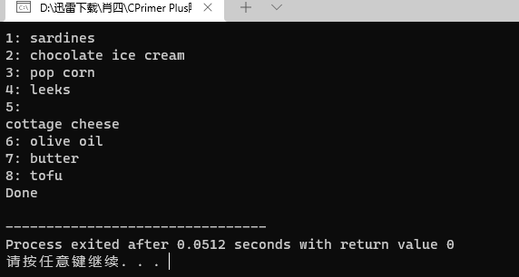

# C++ 部分

## 第16章string类和标准模板库

**string 类**

str1.cpp

```cpp
// str1.cpp -- introducing the string class
#include <iostream>
#include <string>
// using string constructors

int main()
{
    using namespace std;
    string one("Lottery Winner!");     // ctor #1
    cout << one << endl;               // overloaded <<
    string two(20, '$');               // ctor #2
    cout << two << endl;
    string three(one);                 // ctor #3
    cout << three << endl;
    one += " Oops!";                   // overloaded +=
    cout << one << endl;
    two = "Sorry! That was ";
    three[0] = 'P';
    string four;                       // ctor #4
    four = two + three;                // overloaded +, =
    cout << four << endl;
    char alls[] = "All's well that ends well";
    string five(alls,20);              // ctor #5
    cout << five << "!\n";
    string six(alls+6, alls + 10);     // ctor #6
    cout << six  << ", ";
    string seven(&five[6], &five[10]); // ctor #6 again
    cout << seven << "...\n";
    string eight(four, 7, 16);         // ctor #7
    cout << eight << " in motion!" << endl;
    // std::cin.get();
    return 0; 
}
```


str2.cpp

```cpp
// str2.cpp -- capacity() and reserve()
#include <iostream>
#include <string>
int main()
{
    using namespace std;
    string empty;
    string small = "bit";
    string larger = "Elephants are a girl's best friend";
    cout << "Sizes:\n";
    cout << "\tempty: " << empty.size() << endl;
    cout << "\tsmall: " << small.size() << endl;
    cout << "\tlarger: " << larger.size() << endl;
    cout << "Capacities:\n";
    cout << "\tempty: " << empty.capacity() << endl;
    cout << "\tsmall: " << small.capacity() << endl;
    cout << "\tlarger: " << larger.capacity() << endl;
    empty.reserve(50);
    cout << "Capacity after empty.reserve(50): " 
         << empty.capacity() << endl;
	// cin.get();
    return 0;
}
```


strfile.cpp

```cpp
// strfile.cpp -- read strings from a file
#include <iostream>
#include <fstream>
#include <string>
#include <cstdlib>
int main()
{
     using namespace std;
     ifstream fin;
     fin.open("tobuy.txt");
     if (fin.is_open() == false)
     {
        cerr << "Can't open file. Bye.\n";
        exit(EXIT_FAILURE);
     }
     string item;
     int count = 0;
     
     getline(fin, item, ':');
     while (fin)  // while input is good
     {
        ++count;
        cout << count <<": " << item << endl;
        getline(fin, item,':');     
     }
     cout << "Done\n";
     fin.close();
	 // std::cin.get();
	 // std::cin.get();
     return 0;
}
```



hangman.cpp

```cpp
// hangman.cpp -- some string methods
#include <iostream>
#include <string>
#include <cstdlib>
#include <ctime>
#include <cctype>
using std::string;
const int NUM = 26;
const string wordlist[NUM] = {"apiary", "beetle", "cereal",
    "danger", "ensign", "florid", "garage", "health", "insult",
    "jackal", "keeper", "loaner", "manage", "nonce", "onset",
    "plaid", "quilt", "remote", "stolid", "train", "useful",
    "valid", "whence", "xenon", "yearn", "zippy"};

int main()
{
    using std::cout;
    using std::cin;
    using std::tolower;
    using std::endl;
    
    std::srand(std::time(0));
    char play;
    cout << "Will you play a word game? <y/n> ";
    cin >> play;
    play = tolower(play);
    while (play == 'y')
    {
        string target = wordlist[std::rand() % NUM];
        int length = target.length();
        string attempt(length, '-');
        string badchars;
        int guesses = 6;
        cout << "Guess my secret word. It has " << length
            << " letters, and you guess\n"
            << "one letter at a time. You get " << guesses
            << " wrong guesses.\n";
        cout << "Your word: " << attempt << endl;
        while (guesses > 0 && attempt != target)
        {
            char letter;
            cout << "Guess a letter: ";
            cin >> letter;
            if (badchars.find(letter) != string::npos
                || attempt.find(letter) != string::npos)
            {
                cout << "You already guessed that. Try again.\n";
                    continue;
            }
            int loc = target.find(letter);
            if (loc == string::npos)
            {
                cout << "Oh, bad guess!\n";
                --guesses;
                badchars += letter; // add to string
            }
            else
            {
                cout << "Good guess!\n";
                attempt[loc]=letter;
                // check if letter appears again
                loc = target.find(letter, loc + 1);
                while (loc != string::npos)
                {
                    attempt[loc]=letter;
                    loc = target.find(letter, loc + 1);
                }
           }
            cout << "Your word: " << attempt << endl;
            if (attempt != target)
            {
                if (badchars.length() > 0)
                    cout << "Bad choices: " << badchars << endl;
                cout << guesses << " bad guesses left\n";
            }
        }
        if (guesses > 0)
            cout << "That's right!\n";
        else
            cout << "Sorry, the word is " << target << ".\n";

        cout << "Will you play another? <y/n> ";
        cin >> play;
        play = tolower(play);
    }

    cout << "Bye\n";

    return 0; 
}
```


**智能指针**

smrtptrs.cpp

```cpp
// smrtptrs.cpp -- using three kinds of smart pointers
#include <iostream>
#include <string>
#include <memory>

class Report
{
private:
    std::string str;
public:
    Report(const std::string s) : str(s) { std::cout << "Object created!\n"; }
    ~Report() { std::cout << "Object deleted!\n"; }
    void comment() const { std::cout << str << "\n"; }
};

int main()
{
    {
        std::auto_ptr<Report> ps (new Report("using auto_ptr"));
        ps->comment();   // use -> to invoke a member function
    }
    {
        std::shared_ptr<Report> ps (new Report("using shared_ptr"));
        ps->comment();
    }
    {
        std::unique_ptr<Report> ps (new Report("using unique_ptr"));
        ps->comment();
    }
    // std::cin.get();  
    return 0;
}
```


fowl.cpp

```cpp
// fowl.cpp  -- auto_ptr a poor choice
#include <iostream>
#include <string>
#include <memory>

int main()
{
    using namespace std;
    shared_ptr<string> films[5] =
    {
        shared_ptr<string> (new string("Fowl Balls")),
        shared_ptr<string> (new string("Duck Walks")),
        shared_ptr<string> (new string("Chicken Runs")),
        shared_ptr<string> (new string("Turkey Errors")),
        shared_ptr<string> (new string("Goose Eggs"))
    };
    shared_ptr<string> pwin;
    pwin = films[2];   // films[2] loses ownership

    cout << "The nominees for best avian baseball film are\n";
    for (int i = 0; i < 5; i++)
        cout << *films[i] << endl;
    cout << "The winner is " << *pwin << "!\n";
    // cin.get();
    return 0;
}
```


vect1.cpp

```cpp
// vect1.cpp -- introducing the vector template
#include <iostream>
#include <string>
#include <vector>

const int NUM = 5;
int main()
{
    using std::vector;
    using std::string;
    using std::cin;
    using std::cout;
    using std::endl;

    vector<int> ratings(NUM);
    vector<string> titles(NUM);
    cout << "You will do exactly as told. You will enter\n"
         << NUM << " book titles and your ratings (0-10).\n";
    int i;
    for (i = 0; i < NUM; i++)
    {
        cout << "Enter title #" << i + 1 << ": ";
        getline(cin,titles[i]);
        cout << "Enter your rating (0-10): ";
        cin >> ratings[i];
        cin.get();
    }
    cout << "Thank you. You entered the following:\n"
          << "Rating\tBook\n";
    for (i = 0; i < NUM; i++)
    {
        cout << ratings[i] << "\t" << titles[i] << endl;
    }
    // cin.get();

    return 0; 
}
```


vect2.cpp

```cpp
// vect2.cpp -- methods and iterators
#include <iostream>
#include <string>
#include <vector>

struct Review {
    std::string title;
    int rating;
};
bool FillReview(Review & rr);
void ShowReview(const Review & rr);

int main()
{
    using std::cout;
    using std::vector;
    vector<Review> books;
    Review temp;
    while (FillReview(temp))
        books.push_back(temp);
    int num = books.size();
    if (num > 0)
    {
        cout << "Thank you. You entered the following:\n"
            << "Rating\tBook\n";
        for (int i = 0; i < num; i++)
            ShowReview(books[i]);
        cout << "Reprising:\n"
            << "Rating\tBook\n";
        vector<Review>::iterator pr;
        for (pr = books.begin(); pr != books.end(); pr++)
            ShowReview(*pr);
        vector <Review> oldlist(books);     // copy constructor used
        if (num > 3)
        {
            // remove 2 items
            books.erase(books.begin() + 1, books.begin() + 3);
            cout << "After erasure:\n";
            for (pr = books.begin(); pr != books.end(); pr++)
                ShowReview(*pr);
            // insert 1 item
            books.insert(books.begin(), oldlist.begin() + 1,
                        oldlist.begin() + 2);
            cout << "After insertion:\n";
            for (pr = books.begin(); pr != books.end(); pr++)
                ShowReview(*pr);
        }
        books.swap(oldlist);
        cout << "Swapping oldlist with books:\n";
        for (pr = books.begin(); pr != books.end(); pr++)
            ShowReview(*pr);
    }
    else
        cout << "Nothing entered, nothing gained.\n";
    // std::cin.get();
	return 0;
}

bool FillReview(Review & rr)
{
    std::cout << "Enter book title (quit to quit): ";
    std::getline(std::cin,rr.title);
    if (rr.title == "quit")
        return false;
    std::cout << "Enter book rating: ";
    std::cin >> rr.rating;
    if (!std::cin)
        return false;
    // get rid of rest of input line
    while (std::cin.get() != '\n')
        continue;
    return true;
}

void ShowReview(const Review & rr)
{
    std::cout << rr.rating << "\t" << rr.title << std::endl; 
}
```


vect3.cpp

```cpp
// vect3.cpp -- using STL functions
#include <iostream>
#include <string>
#include <vector>
#include <algorithm>

struct Review {
    std::string title;
    int rating;
};

bool operator<(const Review & r1, const Review & r2);
bool worseThan(const Review & r1, const Review & r2);
bool FillReview(Review & rr);
void ShowReview(const Review & rr);
int main()
{
    using namespace std;

    vector<Review> books;
    Review temp;
    while (FillReview(temp))
        books.push_back(temp);
    if (books.size() > 0)
    {
        cout << "Thank you. You entered the following "
             << books.size() << " ratings:\n"
              << "Rating\tBook\n";
        for_each(books.begin(), books.end(), ShowReview);

        sort(books.begin(), books.end());
        cout << "Sorted by title:\nRating\tBook\n";
        for_each(books.begin(), books.end(), ShowReview);

        sort(books.begin(), books.end(), worseThan);
        cout << "Sorted by rating:\nRating\tBook\n";
        for_each(books.begin(), books.end(), ShowReview);

        random_shuffle(books.begin(), books.end());
        cout << "After shuffling:\nRating\tBook\n";
        for_each(books.begin(), books.end(), ShowReview);
    }
    else
        cout << "No entries. ";
    cout << "Bye.\n";
    // cin.get();
    return 0;
}

bool operator<(const Review & r1, const Review & r2)
{
    if (r1.title < r2.title)
        return true;
    else if (r1.title == r2.title && r1.rating < r2.rating)
        return true;
    else
        return false;
}

bool worseThan(const Review & r1, const Review & r2)
{
    if (r1.rating < r2.rating)
        return true;
    else
        return false;
}

bool FillReview(Review & rr)
{
    std::cout << "Enter book title (quit to quit): ";
    std::getline(std::cin,rr.title);
    if (rr.title == "quit")
        return false;
    std::cout << "Enter book rating: ";
    std::cin >> rr.rating;
    if (!std::cin)
        return false;
    // get rid of rest of input line
    while (std::cin.get() != '\n')
        continue;
    return true;
}

void ShowReview(const Review & rr)
{
    std::cout << rr.rating << "\t" << rr.title << std::endl; 
}
```


copyit.cpp

```cpp
// copyit.cpp -- copy() and iterators
#include <iostream>
#include <iterator>
#include <vector>

int main()
{
    using namespace std;

    int casts[10] = {6, 7, 2, 9 ,4 , 11, 8, 7, 10, 5};
    vector<int> dice(10);
    // copy from array to vector
    copy(casts, casts + 10, dice.begin());
    cout << "Let the dice be cast!\n";
    // create an ostream iterator
    ostream_iterator<int, char> out_iter(cout, " ");
    // copy from vector to output
    copy(dice.begin(), dice.end(), out_iter);
    cout << endl;
    cout <<"Implicit use of reverse iterator.\n";
    copy(dice.rbegin(), dice.rend(), out_iter);
    cout << endl;
    cout <<"Explicit use of reverse iterator.\n";
   // vector<int>::reverse_iterator ri;  // use if auto doesn't work
    for (auto ri = dice.rbegin(); ri != dice.rend(); ++ri)
        cout << *ri << ' ';
    cout << endl;
	// cin.get();
    return 0; 
}
```


inserts.cpp

```cpp
// inserts.cpp -- copy() and insert iterators
#include <iostream>
#include <string>
#include <iterator>
#include <vector>
#include <algorithm>

void output(const std::string & s) {std::cout << s << " ";}

int main()
{
    using namespace std;
    string s1[4] = {"fine", "fish", "fashion", "fate"};
    string s2[2] = {"busy", "bats"};
    string s3[2] = {"silly", "singers"};
    vector<string> words(4);
    copy(s1, s1 + 4, words.begin());
    for_each(words.begin(), words.end(), output);
    cout << endl;
 
// construct anonymous back_insert_iterator object
    copy(s2, s2 + 2, back_insert_iterator<vector<string> >(words));
    for_each(words.begin(), words.end(), output);
    cout << endl;

// construct anonymous insert_iterator object
    copy(s3, s3 + 2, insert_iterator<vector<string> >(words, words.begin()));
    for_each(words.begin(), words.end(), output);
    cout << endl;
    // cin.get();
    return 0; 
}
```


list.cpp

```cpp
// list.cpp -- using a list
#include <iostream>
#include <list>
#include <iterator>
#include <algorithm>

void outint(int n) {std::cout << n << " ";}

int main()
{
    using namespace std;
    list<int> one(5, 2); // list of 5 2s
    int stuff[5] = {1,2,4,8, 6};
    list<int> two;
    two.insert(two.begin(),stuff, stuff + 5 );
    int more[6] = {6, 4, 2, 4, 6, 5};
    list<int> three(two);
    three.insert(three.end(), more, more + 6);

    cout << "List one: ";
    for_each(one.begin(),one.end(), outint);
    cout << endl << "List two: ";
    for_each(two.begin(), two.end(), outint);
    cout << endl << "List three: ";
    for_each(three.begin(), three.end(), outint);
    three.remove(2);
    cout << endl << "List three minus 2s: ";
    for_each(three.begin(), three.end(), outint);
    three.splice(three.begin(), one);
    cout << endl << "List three after splice: ";
    for_each(three.begin(), three.end(), outint);
    cout << endl << "List one: ";
    for_each(one.begin(), one.end(), outint);
    three.unique();
    cout << endl << "List three after unique: ";
    for_each(three.begin(), three.end(), outint);
    three.sort();
    three.unique();
    cout << endl << "List three after sort & unique: ";
    for_each(three.begin(), three.end(), outint);
    two.sort();
    three.merge(two);
    cout << endl << "Sorted two merged into three: ";
    for_each(three.begin(), three.end(), outint);
    cout << endl;
    // cin.get();

    return 0; 
}
```


setops.cpp

```cpp
// setops.cpp -- some set operations
#include <iostream>
#include <string>
#include <set>
#include <algorithm>
#include <iterator>

int main()
{
    using namespace std;
    const int N = 6;
    string s1[N] = {"buffoon", "thinkers", "for", "heavy", "can", "for"};
    string s2[N] = {"metal", "any", "food", "elegant", "deliver","for"};

    set<string> A(s1, s1 + N);
    set<string> B(s2, s2 + N);

    ostream_iterator<string, char> out(cout, " ");
    cout << "Set A: ";
    copy(A.begin(), A.end(), out);
    cout << endl;
    cout << "Set B: ";
    copy(B.begin(), B.end(), out);
    cout << endl;

    cout << "Union of A and B:\n";
    set_union(A.begin(), A.end(), B.begin(), B.end(), out);
    cout << endl;

    cout << "Intersection of A and B:\n";
    set_intersection(A.begin(), A.end(), B.begin(), B.end(), out);
    cout << endl;

    cout << "Difference of A and B:\n";
    set_difference(A.begin(), A.end(), B.begin(), B.end(), out);
    cout << endl;

    set<string> C;
    cout << "Set C:\n";
    set_union(A.begin(), A.end(), B.begin(), B.end(),
        insert_iterator<set<string> >(C, C.begin()));
    copy(C.begin(), C.end(), out);
    cout << endl;

    string s3("grungy");
    C.insert(s3);
    cout << "Set C after insertion:\n";
    copy(C.begin(), C.end(),out);
    cout << endl;

    cout << "Showing a range:\n";
    copy(C.lower_bound("ghost"),C.upper_bound("spook"), out);
    cout << endl;
    // cin.get();
    return 0; 
}
```


multmap.cpp

```cpp
// multmap.cpp -- use a multimap
#include <iostream>
#include <string>
#include <map>
#include <algorithm>

typedef int KeyType;
typedef std::pair<const KeyType, std::string> Pair;
typedef std::multimap<KeyType, std::string> MapCode;

int main()
{
    using namespace std;
    MapCode codes;

    codes.insert(Pair(415, "San Francisco"));
    codes.insert(Pair(510, "Oakland"));
    codes.insert(Pair(718, "Brooklyn"));
    codes.insert(Pair(718, "Staten Island"));
    codes.insert(Pair(415, "San Rafael"));
    codes.insert(Pair(510, "Berkeley"));

    cout << "Number of cities with area code 415: "
         << codes.count(415) << endl;
    cout << "Number of cities with area code 718: "
         << codes.count(718) << endl;
    cout << "Number of cities with area code 510: "
         << codes.count(510) << endl;
    cout << "Area Code   City\n";
    MapCode::iterator it;
    for (it = codes.begin(); it != codes.end(); ++it)
        cout << "    " << (*it).first << "     "
            << (*it).second    << endl;

    pair<MapCode::iterator, MapCode::iterator> 
		 range = codes.equal_range(718);
    cout << "Cities with area code 718:\n";
    for (it = range.first; it != range.second; ++it)
        cout <<  (*it).second    << endl;
    // cin.get();
    return 0; 
}
```


functor.cpp

```cpp
// functor.cpp -- using a functor
#include <iostream>
#include <list>
#include <iterator>
#include <algorithm>

template<class T>  // functor class defines operator()()
class TooBig
{
private:
    T cutoff;
public:
    TooBig(const T & t) : cutoff(t) {}
    bool operator()(const T & v) { return v > cutoff; }
};

void outint(int n) {std::cout << n << " ";}

int main()
{
    using std::list;
    using std::cout;
    using std::endl;
	using std::for_each;
	using std::remove_if;

    TooBig<int> f100(100); // limit = 100
    int vals[10] = {50, 100, 90, 180, 60, 210, 415, 88, 188, 201};
    list<int> yadayada(vals, vals + 10); // range constructor
    list<int> etcetera(vals, vals + 10);
 
 // C++0x can use the following instead
//  list<int> yadayada = {50, 100, 90, 180, 60, 210, 415, 88, 188, 201};
//  list<int> etcetera {50, 100, 90, 180, 60, 210, 415, 88, 188, 201};

    cout << "Original lists:\n";
    for_each(yadayada.begin(), yadayada.end(), outint);
    cout << endl;
    for_each(etcetera.begin(), etcetera.end(), outint);
    cout << endl;
    yadayada.remove_if(f100);               // use a named function object
    etcetera.remove_if(TooBig<int>(200));   // construct a function object
    cout <<"Trimmed lists:\n";
    for_each(yadayada.begin(), yadayada.end(), outint);
    cout << endl;
    for_each(etcetera.begin(), etcetera.end(), outint);
    cout << endl;
    // std::cin.get();
    return 0;
}
```


funadap.cpp

```cpp
// funadap.cpp -- using function adapters
#include <iostream>
#include <vector>
#include <iterator>
#include <algorithm>
#include <functional>

void Show(double);
const int LIM = 6;
int main()
{
    using namespace std;
    double arr1[LIM] = {28, 29, 30, 35, 38, 59};
    double arr2[LIM] = {63, 65, 69, 75, 80, 99};
    vector<double> gr8(arr1, arr1 + LIM);
    vector<double> m8(arr2, arr2 + LIM);
    cout.setf(ios_base::fixed);
    cout.precision(1);
    cout << "gr8:\t";
    for_each(gr8.begin(), gr8.end(), Show);
    cout << endl;
    cout << "m8: \t";
    for_each(m8.begin(), m8.end(), Show);
    cout << endl;

    vector<double> sum(LIM);
    transform(gr8.begin(), gr8.end(), m8.begin(), sum.begin(),
              plus<double>());
    cout << "sum:\t";
    for_each(sum.begin(), sum.end(), Show);
    cout << endl;

    vector<double> prod(LIM);
    transform(gr8.begin(), gr8.end(), prod.begin(),
              bind1st(multiplies<double>(), 2.5));
    cout << "prod:\t";
    for_each(prod.begin(), prod.end(), Show);
    cout << endl;
    // cin.get();
    return 0; 
}

void Show(double v)
{
    std::cout.width(6);
    std::cout << v << ' '; 
}
```


strgstl.cpp

```cpp
// strgstl.cpp -- applying the STL to a string
#include <iostream>
#include <string>
#include <algorithm>

int main()
{
    using namespace std;
    string letters;
    
    cout << "Enter the letter grouping (quit to quit): ";
    while (cin >> letters && letters != "quit")
    {
        cout << "Permutations of " << letters << endl;
        sort(letters.begin(), letters.end());
        cout << letters << endl;
        while (next_permutation(letters.begin(), letters.end()))
            cout << letters << endl;
        cout << "Enter next sequence (quit to quit): ";
    }
    cout << "Done.\n";
    // cin.get();
    // cin.get();
    return 0;
}
```


listrmv.cpp

```cpp
// listrmv.cpp -- applying the STL to a string
#include <iostream>
#include <list>
#include <algorithm>

void Show(int);
const int LIM = 10;
int main()
{
    using namespace std;
    int ar[LIM] = {4, 5, 4, 2, 2, 3, 4, 8, 1, 4};
    list<int> la(ar, ar + LIM);
    list<int> lb(la);
    
    cout << "Original list contents:\n\t";
    for_each(la.begin(), la.end(), Show);
    cout << endl;
    la.remove(4);
    cout << "After using the remove() method:\n";
    cout << "la:\t";
    for_each(la.begin(), la.end(), Show);
    cout << endl;
    list<int>::iterator last;
    last = remove(lb.begin(), lb.end(), 4);
    cout << "After using the remove() function:\n";
    cout << "lb:\t";
    for_each(lb.begin(), lb.end(), Show);
    cout << endl;
    lb.erase(last, lb.end());
    cout << "After using the erase() method:\n";
    cout << "lb:\t";
    for_each(lb.begin(), lb.end(), Show);
    cout << endl;
    // cin.get();    
    return 0;
}

void Show(int v)
{
    std::cout << v << ' ';
}
```


usealgo.cpp

```cpp
//usealgo.cpp -- using several STL elements
#include <iostream>
#include <string>
#include <vector>
#include <set>
#include <map>
#include <iterator>
#include <algorithm>
#include <cctype>
using namespace std;

char toLower(char ch) { return tolower(ch); }
string & ToLower(string & st);
void display(const string & s);

int main()
{
    vector<string> words;
    cout << "Enter words (enter quit to quit):\n";
    string input;
    while (cin >> input && input != "quit")
        words.push_back(input);

    cout << "You entered the following words:\n";
    for_each(words.begin(), words.end(), display);
    cout << endl;

    // place words in set, converting to lowercase
    set<string> wordset;
    transform(words.begin(), words.end(),
        insert_iterator<set<string> > (wordset, wordset.begin()),
        ToLower);
    cout << "\nAlphabetic list of words:\n";
    for_each(wordset.begin(), wordset.end(), display);
    cout << endl;

    // place word and frequency in map
    map<string, int> wordmap;
    set<string>::iterator si;
    for (si = wordset.begin(); si != wordset.end(); si++)
        wordmap[*si] = count(words.begin(), words.end(), *si);

    // display map contents
    cout << "\nWord frequency:\n";
    for (si = wordset.begin(); si != wordset.end(); si++)
        cout << *si << ": " << wordmap[*si] << endl;
    // cin.get();
    // cin.get();
    return 0;
}

string & ToLower(string & st)
{
    transform(st.begin(), st.end(), st.begin(), toLower);
    return st; 
}

void display(const string & s)
{
    cout << s << " ";
}
```


valvect.cpp

```cpp
// valvect.cpp -- comparing vector and valarray
#include <iostream>
#include <valarray>
#include <vector>
#include <algorithm>
int main()
{
    using namespace std;
    vector<double> data;
    double temp;

    cout << "Enter numbers (<=0 to quit):\n";
    while (cin >> temp && temp > 0)
        data.push_back(temp);
    sort(data.begin(), data.end());
    int size = data.size();
    valarray<double> numbers(size);
    int i;
    for (i = 0; i < size; i++)
        numbers[i] = data[i];
    valarray<double> sq_rts(size);
    sq_rts = sqrt(numbers);
    valarray<double> results(size);
    results = numbers + 2.0 * sq_rts;
    cout.setf(ios_base::fixed);
    cout.precision(4);
    for (i = 0; i < size; i++)
    {
        cout.width(8);
        cout << numbers[i] << ": ";
        cout.width(8);
        cout << results[i] << endl;
    }
    cout << "done\n";
    // cin.get();
    // cin.get();

    return 0;
}
```


vslice.cpp

```cpp
// vslice.cpp -- using valarray slices
#include <iostream>
#include <valarray>
#include <cstdlib>

const int SIZE = 12;
typedef std::valarray<int> vint;     // simplify declarations
void show(const vint & v, int cols);
int main()
{
    using std::slice;                // from <valarray>
    using std::cout;
    vint valint(SIZE);               // think of as 4 rows of 3

    int i;
    for (i = 0; i < SIZE; ++i)
        valint[i] = std::rand() % 10;
    cout << "Original array:\n";
    show(valint, 3);                 // show in 3 columns
    vint vcol(valint[slice(1,4,3)]); // extract 2nd column
    cout << "Second column:\n";
    show(vcol, 1);                   // show in 1 column
    vint vrow(valint[slice(3,3,1)]); // extract 2nd row
    cout << "Second row:\n";
    show(vrow, 3);
    valint[slice(2,4,3)]  = 10;      // assign to 2nd column
    cout << "Set last column to 10:\n";
    show(valint, 3);
    cout << "Set first column to sum of next two:\n";
    // + not defined for slices, so convert to valarray<int>
    valint[slice(0,4,3)]  = vint(valint[slice(1,4,3)])
                               + vint(valint[slice(2,4,3)]);
    show(valint, 3);
    // std::cin.get();
    return 0;
}

void show(const vint & v, int cols)
{
    using std::cout;
    using std::endl;

    int lim = v.size();
    for (int i = 0; i < lim; ++i)
    {
        cout.width(3);
        cout << v[i];
        if (i % cols == cols - 1)
            cout << endl;
        else
            cout << ' ';
    }
    if (lim % cols != 0)
        cout << endl;
}
```


ilist.cpp

```cpp
// ilist.cpp  -- use initializer_list
#include <iostream>
#include <initializer_list>

double sum(std::initializer_list<double> il);
double average(const std::initializer_list<double> & ril);

int main()
{
    using std::cout;

    cout << "List 1: sum = " << sum({2,3,4})
         <<", ave = " << average({2,3,4}) << '\n';
    std::initializer_list<double> dl = {1.1, 2.2, 3.3, 4.4, 5.5};
    cout << "List 2: sum = " << sum(dl)
         <<", ave = " << average(dl) << '\n';
    dl = {16.0, 25.0, 36.0, 40.0, 64.0};
    cout << "List 3: sum = " << sum(dl)
         <<", ave = " << average(dl) << '\n';
    // std::cin.get();
    return 0;
}

double sum(std::initializer_list<double> il)
{
    double tot = 0;
    for (auto p = il.begin(); p !=il.end(); p++)
        tot += *p;
    return tot;
}

double average(const std::initializer_list<double> & ril)
{
    double tot = 0;
    int n = ril.size();
    double ave = 0.0;
    
    if (n > 0)
    {
        for (auto p = ril.begin(); p !=ril.end(); p++)
            tot += *p;
        ave = tot / n;
    }
    return ave;
}
```

