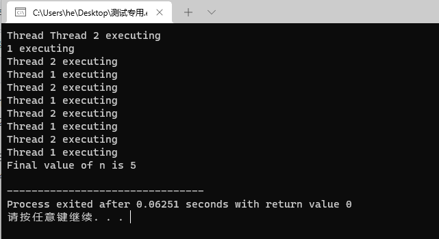
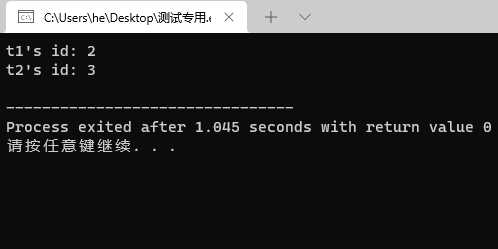
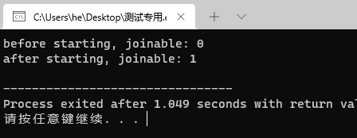
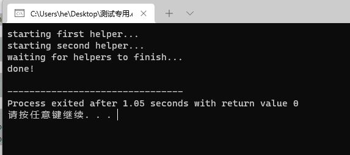
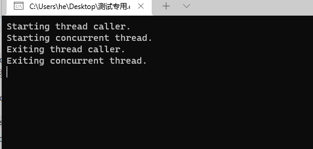
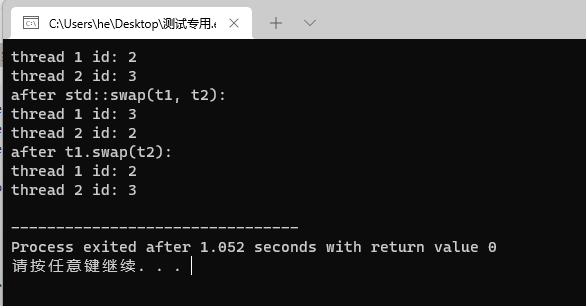
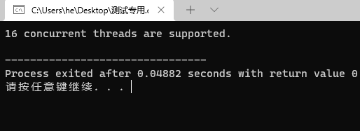
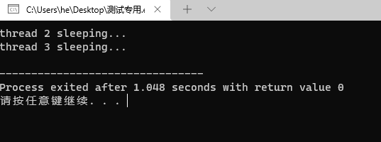
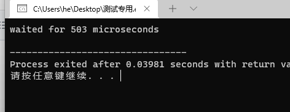
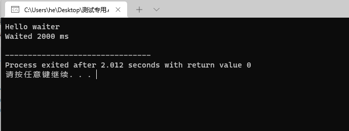

# 算法部分

[fhq 树](https://www.luogu.com.cn/problem/P3369)


```cpp
#include <iostream>
#include <random>

using namespace std;

const int N = 1e6 + 100;

#define lc (fhq[p].l)
#define rc (fhq[p].r)

struct node {
	int l, r;
	int val, key;
	int size; 
}fhq[N];

std::mt19937 rnd(233);
int tot = 0, root;

int get_node(int val) {
	fhq[++tot].val = val;
	fhq[tot].key = rnd();
	fhq[tot].size = 1;
	return tot;
}

void pushup(int p) {
	fhq[p].size = fhq[lc].size + fhq[rc].size + 1;
}

void split(int p, int val, int &x, int &y) {
	if(!p) x = y = 0;
	else {
		if(fhq[p].val <= val) {
			x = p;
			split(rc, val, rc, y);
		}
		else {
			y = p;
			split(lc, val, x, lc);
		}
		pushup(p);
	}
}

int merge(int x, int y) {
	if(!x || !y) return x + y;
	if(fhq[x].key > fhq[y].key ) {
		fhq[x].r = merge(fhq[x].r, y);
		pushup(x);
		return x;
	}
	else {
		fhq[y].l = merge(x, fhq[y].l);
		pushup(y);
		return y;
	}
}

void insert(int val) {
	int x, y;
	split(root, val, x, y);
	root = merge(merge(x, get_node(val)), y); 
}

void del(int val) {
	int x, y, z;
	split(root, val, x, z);
	split(x, val - 1, x, y);
	y = merge(fhq[y].l, fhq[y].r);
	root = merge(merge(x, y), z);
}

int getrank(int val) {
	int x, y;
	split(root, val - 1, x, y);
	int rk = fhq[x].size + 1;
	root = merge(x, y);
	return rk; 
}

int getval(int rank) {
	int p = root;
	while(p) {
		if(fhq[lc].size + 1 == rank) break;
		else if(fhq[lc].size >= rank) 
			p = lc;
		else {
			rank -= fhq[lc].size + 1;
			p = rc;
		}
	}
	return fhq[p].val;
}

int getpre(int val) {
	int x, y;
	split(root, val - 1, x, y);
	int p = x;
	while(rc) p = rc;
	root = merge(x, y);
	return fhq[p].val;
}

int getnext(int val) {
	int x, y;
	split(root, val, x, y);
	int p = y;
	while(lc) p = lc;
	root = merge(x, y);
	return fhq[p].val; 
}

int main(){
    ios::sync_with_stdio(false);
    cin.tie(0),cout.tie(0);
    int n;
    cin>>n;
    while(n--){
        int op,x;
        cin>>op>>x;
        if(op==1) insert(x);
        else if(op==2) del(x);
        else if(op==3) cout<<getrank(x)<<endl;
        else if(op==4) cout<<getval(x)<<endl;
        else if(op==5) cout<<getpre(x)<<endl;
        else if(op==6) cout<<getnext(x)<<endl;
    }
    return 0;
}
```


# c++ 11 并发编程

详细介绍 `std::thread` 的用法。

`std::thread` 在 `<thread>` 头文件中声明，因此使用 `std::thread` 需包含 `<thread>` 头文件。

**<thread> 头文件摘要**

`<thread>` 头文件声明了 std::thread 线程类及 `std::swap` (交换两个线程对象)辅助函数。另外命名空间 `std::this_thread` 也声明在 `<thread>` 头文件中。下面是 C++11 标准所定义的 `<thread>` 头文件摘要：

```cpp
namespace std {
    #define __STDCPP_THREADS__ __cplusplus
    class thread;
    void swap(thread& x, thread& y);
    namespace this_thread {
        thread::id get_id();
        void yield();

        template <class Clock, class Duration>
        void sleep_until(const chrono::time_point<Clock, Duration>& abs_time);

        template <class Rep, class Period>
        void sleep_for(const chrono::duration<Rep, Period>& rel_time);
    }        
}
```

 `std::thread` 类摘要

`std::thread` 代表了一个线程对象，C++11 标准声明如下：

```cpp
namespace std {
    class thread {
        public:
            // 类型声明:
            class id;
            typedef implementation-defined native_handle_type;

            // 构造函数、拷贝构造函数和析构函数声明:
            thread() noexcept;
            template <class F, class ...Args> explicit thread(F&& f, Args&&... args);
            ~thread();
            thread(const thread&) = delete;
            thread(thread&&) noexcept;
            thread& operator=(const thread&) = delete;
            thread& operator=(thread&&) noexcept;

            // 成员函数声明:
            void swap(thread&) noexcept;
            bool joinable() const noexcept;
            void join();
            void detach();
            id get_id() const noexcept;
            native_handle_type native_handle();
            
            // 静态成员函数声明:
            static unsigned hardware_concurrency() noexcept;
    };
}
```

`std::thread` 中主要声明三类函数：(1). 构造函数、拷贝构造函数及析构函数；(2). 成员函数；(3). 静态成员函数。另外， `std::thread::id` 表示线程 ID，同时 C++11 声明如下：

```cpp
namespace std {
    class thread::id {
        public:
            id() noexcept;
    };

    bool operator==(thread::id x, thread::id y) noexcept;
    bool operator!=(thread::id x, thread::id y) noexcept;
    bool operator<(thread::id x, thread::id y) noexcept;
    bool operator<=(thread::id x, thread::id y) noexcept;
    bool operator>(thread::id x, thread::id y) noexcept;
    bool operator>=(thread::id x, thread::id y) noexcept;

    template<class charT, class traits>
    basic_ostream<charT, traits>&
        operator<< (basic_ostream<charT, traits>& out, thread::id id);


    // Hash 支持
    template <class T> struct hash;
    template <> struct hash<thread::id>;
}
```

std::thread 各种构造函数例子如下

```cpp
#include <iostream>
#include <utility>
#include <thread>
#include <chrono>
#include <functional>
#include <atomic>

void f1(int n)
{
    for (int i = 0; i < 5; ++i) {
        std::cout << "Thread " << n << " executing\n";
        std::this_thread::sleep_for(std::chrono::milliseconds(10));
    }
}

void f2(int& n)
{
    for (int i = 0; i < 5; ++i) {
        std::cout << "Thread 2 executing\n";
        ++n;
        std::this_thread::sleep_for(std::chrono::milliseconds(10));
    }
}

int main()
{
    int n = 0;
    std::thread t1; // t1 is not a thread
    std::thread t2(f1, n + 1); // pass by value
    std::thread t3(f2, std::ref(n)); // pass by reference
    std::thread t4(std::move(t3)); // t4 is now running f2(). t3 is no longer a thread
    t2.join();
    t4.join();
    std::cout << "Final value of n is " << n << '\n';
}
```



 `std::thread` 赋值操作

| Move 赋值操作 (1)          | thread& operator=(thread&& rhs) noexcept;  |
| -------------------------- | ------------------------------------------ |
| 拷贝赋值操作 [deleted] (2) | thread& operator=(const thread&) = delete; |

1. Move 赋值操作(1)，如果当前对象不可 `joinable`，需要传递一个右值引用(`rhs`)给 `move` 赋值操作；如果当前对象可被 `joinable`，则会调用 `terminate`() 报错。
2. 拷贝赋值操作(2)，被禁用，因此 `std::thread` 对象不可拷贝赋值。

请看下面的例子：

```cpp
#include <stdio.h>
#include <stdlib.h>

#include <chrono>    // std::chrono::seconds
#include <iostream>  // std::cout
#include <thread>    // std::thread, std::this_thread::sleep_for

void thread_task(int n) {
    std::this_thread::sleep_for(std::chrono::seconds(n));
    std::cout << "hello thread "
        << std::this_thread::get_id()
        << " paused " << n << " seconds" << std::endl;
}

int main(int argc, const char *argv[])
{
    std::thread threads[5];
    std::cout << "Spawning 5 threads...\n";
    for (int i = 0; i < 5; i++) {
        threads[i] = std::thread(thread_task, i + 1);
    }
    std::cout << "Done spawning threads! Now wait for them to join\n";
    for (auto& t: threads) {
        t.join();
    }
    std::cout << "All threads joined.\n";

    return EXIT_SUCCESS;
}
```

**其他成员函数**

`get_id`: 获取线程 ID，返回一个类型为 `std::thread::id` 的对象。请看下面例子：

```cpp
  #include <iostream>
  #include <thread>
  #include <chrono>
   
  void foo()
  {
      std::this_thread::sleep_for(std::chrono::seconds(1));
  }
   
  int main()
  {
      std::thread t1(foo);
      std::thread::id t1_id = t1.get_id();
   
      std::thread t2(foo);
      std::thread::id t2_id = t2.get_id();
   
      std::cout << "t1's id: " << t1_id << '\n';
      std::cout << "t2's id: " << t2_id << '\n';
   
      t1.join();
      t2.join();
  }
```



`joinable`: 检查线程是否可被 join。检查当前的线程对象是否表示了一个活动的执行线程，由默认构造函数创建的线程是不能被 join 的。另外，如果某个线程 已经执行完任务，但是没有被 join 的话，该线程依然会被认为是一个活动的执行线程，因此也是可以被 join 的。

```cpp
  #include <iostream>
  #include <thread>
  #include <chrono>
   
  void foo()
  {
      std::this_thread::sleep_for(std::chrono::seconds(1));
  }
   
  int main()
  {
      std::thread t;
      std::cout << "before starting, joinable: " << t.joinable() << '\n';
   
      t = std::thread(foo);
      std::cout << "after starting, joinable: " << t.joinable() << '\n';
   
      t.join();
  }
```



`join`: Join 线程，调用该函数会阻塞当前线程，直到由 `*this` 所标示的线程执行完毕 join 才返回。

```cpp
 #include <iostream>
  #include <thread>
  #include <chrono>
   
  void foo()
  {
      // simulate expensive operation
      std::this_thread::sleep_for(std::chrono::seconds(1));
  }
   
  void bar()
  {
      // simulate expensive operation
      std::this_thread::sleep_for(std::chrono::seconds(1));
  }
   
  int main()
  {
      std::cout << "starting first helper...\n";
      std::thread helper1(foo);
   
      std::cout << "starting second helper...\n";
      std::thread helper2(bar);
   
      std::cout << "waiting for helpers to finish..." << std::endl;
      helper1.join();
      helper2.join();
   
      std::cout << "done!\n";
  }
```



调用 detach 函数之后：

1. `*this` 不再代表任何的线程执行实例。
2. joinable() == false
3. get_id() == std:🧵:id()

另外，如果出错或者 `joinable() == false`，则会抛出 `std::system_error`.

```cpp
    #include <iostream>
    #include <chrono>
    #include <thread>
     
    void independentThread() 
    {
        std::cout << "Starting concurrent thread.\n";
        std::this_thread::sleep_for(std::chrono::seconds(2));
        std::cout << "Exiting concurrent thread.\n";
    }
     
    void threadCaller() 
    {
        std::cout << "Starting thread caller.\n";
        std::thread t(independentThread);
        t.detach();
        std::this_thread::sleep_for(std::chrono::seconds(1));
        std::cout << "Exiting thread caller.\n";
    }
     
    int main() 
    {
        threadCaller();
        std::this_thread::sleep_for(std::chrono::seconds(5));
    }
```



`swap`: Swap 线程，交换两个线程对象所代表的底层句柄(underlying handles)。

```cpp
  #include <iostream>
  #include <thread>
  #include <chrono>
   
  void foo()
  {
      std::this_thread::sleep_for(std::chrono::seconds(1));
  }
   
  void bar()
  {
      std::this_thread::sleep_for(std::chrono::seconds(1));
  }
   
  int main()
  {
      std::thread t1(foo);
      std::thread t2(bar);
   
      std::cout << "thread 1 id: " << t1.get_id() << std::endl;
      std::cout << "thread 2 id: " << t2.get_id() << std::endl;
   
      std::swap(t1, t2);
   
      std::cout << "after std::swap(t1, t2):" << std::endl;
      std::cout << "thread 1 id: " << t1.get_id() << std::endl;
      std::cout << "thread 2 id: " << t2.get_id() << std::endl;
   
      t1.swap(t2);
   
      std::cout << "after t1.swap(t2):" << std::endl;
      std::cout << "thread 1 id: " << t1.get_id() << std::endl;
      std::cout << "thread 2 id: " << t2.get_id() << std::endl;
   
      t1.join();
      t2.join();
  }
```



`native_handle`: 返回 native handle（由于 `std::thread` 的实现和操作系统相关，因此该函数返回与 `std::thread` 具体实现相关的线程句柄，例如在符合 Posix 标准的平台下(如 Unix/Linux)是 Pthread 库）。

```cpp

```

`hardware_concurrency` [static]: 检测硬件并发特性，返回当前平台的线程实现所支持的线程并发数目，但返回值仅仅只作为系统提示(hint)。

```cpp
  #include <iostream>
  #include <thread>
   
  int main() {
      unsigned int n = std::thread::hardware_concurrency();
      std::cout << n << " concurrent threads are supported.\n";
  }
```



 `std::this_thread` 命名空间中相关辅助函数介绍

- get_id: 获取线程 ID。

```cpp
  #include <iostream>
  #include <thread>
  #include <chrono>
  #include <mutex>
   
  std::mutex g_display_mutex;
   
  void foo()
  {
      std::thread::id this_id = std::this_thread::get_id();
   
      g_display_mutex.lock();
      std::cout << "thread " << this_id << " sleeping...\n";
      g_display_mutex.unlock();
   
      std::this_thread::sleep_for(std::chrono::seconds(1));
  }
   
  int main()
  {
      std::thread t1(foo);
      std::thread t2(foo);
   
      t1.join();
      t2.join();
  }
```



yield: 当前线程放弃执行，操作系统调度另一线程继续执行。

```cpp
  #include <iostream>
  #include <chrono>
  #include <thread>
   
  // "busy sleep" while suggesting that other threads run 
  // for a small amount of time
  void little_sleep(std::chrono::microseconds us)
  {
      auto start = std::chrono::high_resolution_clock::now();
      auto end = start + us;
      do {
          std::this_thread::yield();
      } while (std::chrono::high_resolution_clock::now() < end);
  }
   
  int main()
  {
      auto start = std::chrono::high_resolution_clock::now();
   
      little_sleep(std::chrono::microseconds(100));
   
      auto elapsed = std::chrono::high_resolution_clock::now() - start;
      std::cout << "waited for "
                << std::chrono::duration_cast<std::chrono::microseconds>(elapsed).count()
                << " microseconds\n";
  }
```



sleep_for: 线程休眠某个指定的时间片(time span)，该线程才被重新唤醒，不过由于线程调度等原因，实际休眠时间可能比 `sleep_duration` 所表示的时间片更长。

```cpp
  template< class Rep, class Period >
  void sleep_for( const std::chrono::duration<Rep,Period>& sleep_duration );

  #include <iostream>
  #include <chrono>
  #include <thread>
   
  int main()
  {
      std::cout << "Hello waiter" << std::endl;
      std::chrono::milliseconds dura( 2000 );
      std::this_thread::sleep_for( dura );
      std::cout << "Waited 2000 ms\n";
  }
```

