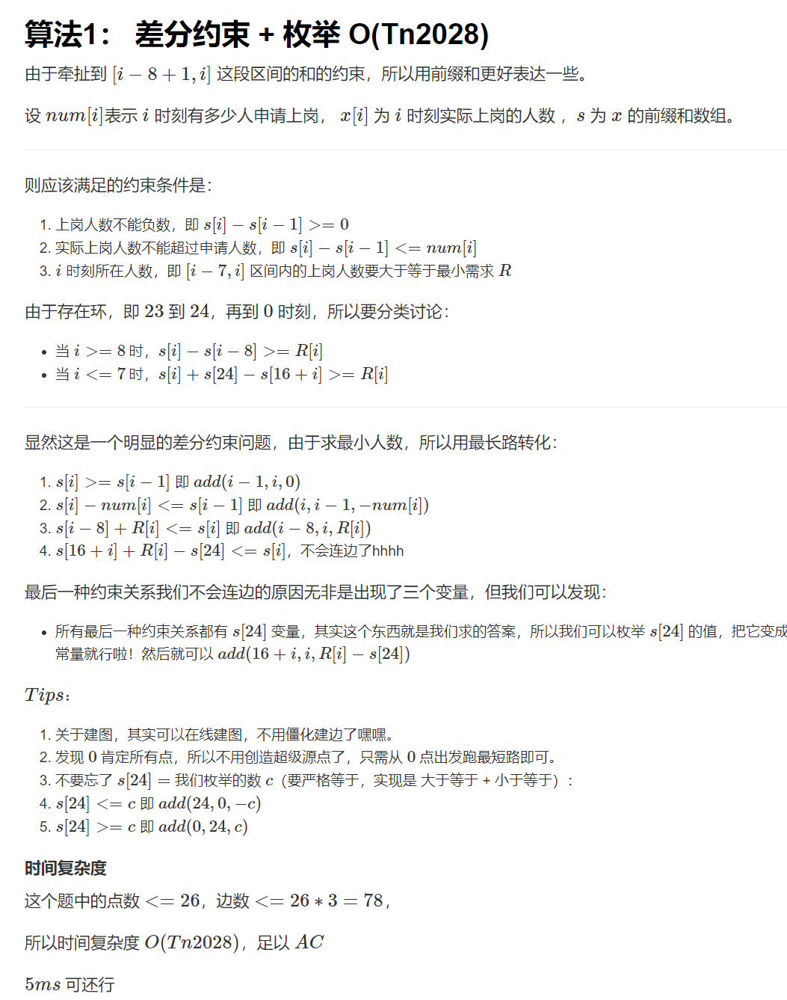

## 算法学习

### [ 雇佣收银员](https://www.acwing.com/problem/content/395/)



```java


import java.util.Arrays;
import java.util.LinkedList;
import java.util.Queue;
import java.util.Scanner;

public class Main {

    static final int N = 30;
    static final int M = 100;

    static int[] head = new int[M];
    static int[] ver = new int[M];
    static int[] edge = new int[M];
    static int[] nex = new int[M];

    static int tot = 0;
    static void addedge(int x, int y, int z) {
        ver[++ tot] = y;
        nex[tot] = head[x];
        head[x] = tot;
        edge[tot] = z;
    }

    static int[] r = new int[N];
    static int[] num = new int[N];
    static int n;


    static void build(int c) {
        Arrays.fill(head, 0);
        tot = 0;
        addedge(0, 24, c); addedge(24, 0, -c);
        for (int i = 1; i <= 7; i ++ ) addedge(i + 16, i, r[i] - c);
        for (int i = 8; i <= 24; i ++ ) addedge(i - 8, i, r[i]);
        for (int i = 1; i <= 24; i ++ ) {
            addedge(i, i - 1, -num[i]);
            addedge(i - 1, i, 0);
        }
    }

    static int[] dis = new int[N];
    static boolean[] in = new boolean[N];
    static int[] cnt = new int[N];
    static boolean spfa(int c) {
        build(c);
        Arrays.fill(dis, Integer.MIN_VALUE);
        Arrays.fill(in, false);
        Arrays.fill(cnt, 0);

        Queue<Integer> queue = new LinkedList<>();
        queue.add(0);
        dis[0] = 0;
        in[0] = true;
        while(queue.size() > 0) {
            int x = queue.peek(); queue.poll();

            in[x] = false;

            for(int i = head[x]; i != 0; i = nex[i]) {
                int y = ver[i];
                if(dis[y] < dis[x] + edge[i]) {
                    dis[y] = dis[x] + edge[i];
                    cnt[y] = cnt[x] + 1;
                    if(cnt[y] >= 25) return false;
                    if(!in[y]) {
                        in[y] = true;
                        queue.add(y);
                    }
                }
            }
        }


        return true;
    }

    public static void main(String[] args) {
        Scanner scanner = new Scanner(System.in);
        int T = scanner.nextInt();
        for(; T > 0; T --) {
            for(int i = 1; i <= 24; i ++)  {
                r[i] = scanner.nextInt();
            }
            Arrays.fill(num, 0);
            n = scanner.nextInt();
            for(int i = 1; i <= n; i ++) {
                int t = scanner.nextInt();
                num[t + 1] ++;
            }

            boolean success = false;
            for(int i = 0; i <= 1000; i ++) {
                if(spfa(i)) {
                    System.out.println(i);
                    success = true;
                    break;
                }
            }

            if(!success) System.out.println("No Solution");
        }
    }
}


```

### [轻拍牛头](https://www.acwing.com/problem/content/1293/)

```java


import java.util.Scanner;

public class Main {
    static int N = (int) (1e6 + 100);
    static int[] cnt = new int[N];
    static int[] a = new int[N];
    static int[] ans = new int[N];
    public static void main(String[] args) {
        Scanner scanner = new Scanner(System.in);
        int n = scanner.nextInt();
        for(int i = 1; i <= n; i ++) {
            a[i] = scanner.nextInt();
            cnt[a[i]] ++;
        }

        for(int i = 1; i < N; i ++) {
            if(cnt[i] == 0) continue;
            for(int j = i; j < N; j +=i) {
                ans[j] += cnt[i];
            }
        }
        for(int i = 1; i <= n; i ++) {
            System.out.println(ans[a[i]] - 1);
        }
    }
}


```

