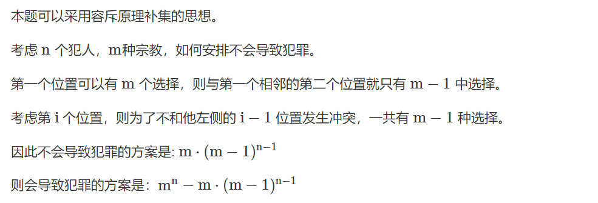

## 算法学习

### [你能回答这些问题吗](https://www.acwing.com/problem/content/246/)

```java


import java.util.Scanner;

public class Main {
    static final int N = (int) (5e5 + 100);

    static class Segment {
        int l, r;
        int tmax;
        int lmax;
        int rmax;
        int sum;


        public Segment(int l, int r, int tmax, int lmax, int rmax, int sum) {
            this.l = l;
            this.r = r;
            this.tmax = tmax;
            this.lmax = lmax;
            this.rmax = rmax;
            this.sum = sum;
        }
        public Segment() {

        }
    }

    static Segment[] t = new Segment[N << 2];

    static int[] a = new int[N];

    static void build(int p, int l, int r) {
        t[p] = new Segment();
        t[p].l = l; t[p].r = r;
        if(l == r) {
            t[p].tmax = t[p].sum = t[p].lmax = t[p].rmax = a[l];
            return;
        }
        int mid = (l + r) >> 1;
        int lc = p << 1;
        int rc = p << 1 | 1;
        build(lc, l, mid);
        build(rc, mid + 1, r);
        pushup(p);
    }

    static void merge(Segment c, Segment a, Segment b) {
        c.sum = a.sum + b.sum;
        c.tmax = Math.max(Math.max(a.tmax,b.tmax), a.rmax + b.lmax);
        c.lmax = Math.max(a.lmax, a.sum + b.lmax);
        c.rmax = Math.max(b.rmax, b.sum + a.rmax);
    }

    static void pushup(int p) {
        int lc = p << 1;
        int rc = p << 1 | 1;
        merge(t[p], t[lc], t[rc]);
    }

    static void update(int p, int x, int val) {
        if(t[p].l == t[p].r) {
            t[p].tmax = t[p].sum = t[p].lmax = t[p].rmax = val;
            return;
        }
        int mid = (t[p].l + t[p].r) >> 1;
        int lc = p << 1;
        int rc = p << 1 | 1;
        if(x <= mid) update(lc, x, val);
        if(x > mid) update(rc, x, val);
        pushup(p);
    }

    static Segment query(int p, int l, int r) {
        if(l <= t[p].l && t[p].r <= r) {
            return t[p];
        }
        int mid = (t[p].l + t[p].r) >> 1;
        int lc = p << 1;
        int rc = p << 1 | 1;
        if(r <= mid) return query(lc, l, r);
        else if(l > mid) return query(rc,l, r);
        else {
            Segment a = query(lc, l, r);
            Segment b = query(rc, l, r);
            Segment c = new Segment();
            merge(c, a, b);
            return c;
        }

    }

    public static void main(String[] args) {
        Scanner scanner = new Scanner(System.in);
        int n = scanner.nextInt();
        int m = scanner.nextInt();
        for(int i = 1; i <= n; i ++) {
            a[i] = scanner.nextInt();
        }
        build(1, 1, n);
        for(; m > 0; m --) {
            int op = scanner.nextInt();
            int x = scanner.nextInt();
            int y = scanner.nextInt();
            if(op == 1) {
                if(x > y) {
                    int tmp = y;
                    y = x;
                    x = tmp;
                }
                System.out.println(query(1, x, y).tmax);
            }
            else update(1, x, y);
        }
    }

}


```

### [越狱](https://www.acwing.com/problem/content/1292/)



```java


import java.util.Scanner;

public class Main {
    static final int MOD = (int) (1E5 + 3);
    static long ksm(long a, long b) {
        long res = 1;
        for(; b != 0; b >>= 1) {
            if((b & 1) == 1) {
                res = res * a % MOD;
            }
            a = a * a % MOD;
        }
        return res % MOD;
    }
    public static void main(String[] args) {
        Scanner scanner = new Scanner(System.in);
        long m = scanner.nextLong();
        long n = scanner.nextLong();
        long res = m*ksm(m - 1, n - 1) % MOD;
        long ans = ksm(m, n);
        System.out.println((ans - res + MOD) % MOD);
    }
}


```

