# c 语言部分

## 文件操作

**文件指针**

操作文件的时候，C语言为文件分配一个信息区，该信息区包含文件描述信息、缓冲区位置、缓冲区大小、文件读写到的位置等基本信息，这些信息用一个结构体来存放（struct _IO_FILE），这个结构体有一个别名FILE（typedef struct _IO_FILE FILE），FILE结构体和对文件操作的库函数在 stdio.h 头文件中声明的。

打开文件的时候，fopen函数中会动态分配一个FILE结构体大小的内存空间，并把FILE结构体内存的地址作为函数的返回值，程序中用FILE结构体指针存放这个地址。

关闭文件的时候，fclose函数除了关闭文件，还会释放FILE结构体占用的内存空间。FILE结构体指针习惯称为文件指针。

我们可以使用 C语言提供的库函数fopen来创建一个新的文件或者打开一个已存的文件，调用fopen函数成功后，返回一个文件指针（ FILE *），函数的原型如下：

```c
FILE *fopen( const char * filename, const char * mode );
```

参数filename 是字符串，表示需要打开的文件名，可以包含目录名，如果不包含路径就表示程序运行的当前目录。实际开发中，采用文件的全路径。

参数mode也是字符串，表示打开文件的方式（模式），打开方式可以是下列值中的一个。

| **方式** | **含 义** | **说 明**                                                    |
| -------- | --------- | ------------------------------------------------------------ |
| **r**    | 只读      | 文件必须存在，否则打开失败。                                 |
| **w**    | 只写      | 如果文件存在，则清除原文件内容；如果文件不存在，则新建文件。 |
| **a**    | 追加只写  | 如果文件存在，则打开文件，如果文件不存在，则新建文件。       |
| **r+**   | 读写      | 文件必须存在。在只读 r 的基础上加 '+' 表示增加可写的功能。   |
| **w+**   | 读写      | 在只写w的方式上增加可读的功能。                              |
| **a+**   | 读写      | 在追加只写a的方式上增加可读的功能。                          |

 **关闭文件**

fclose库函数用于关闭文件，函数的原型：

```c
int fclose(FILE *fp);
```

示例

book.c

```c
#include <stdio.h>
 
int main()
{
  FILE *fp=0;     // 定义文件指针变量fp
 
  // 以只读的方式打开文件/root/book.c
  if ( (fp=fopen("/root/book.c","r")) == 0 )
  {
    printf("打开文件/root/book.c失败。\n"); return -1;
  }
  
  // 关闭文件
  fclose(fp);
}
```

1）调用fopen打开文件的时候，一定要判断返回值，如果文件不存在、或没有权限、或磁盘空间满了，都有可能造成打开文件失败。

2）文件指针是调用fopen的时候，系统动态分配了内存空间，函数返回或程序退出之前，必须用fclose关闭文件指针，释放内存，否则后果严重。

3）如果文件指针是空指针或野指针，用fclose关闭它相当于操作空指针或野指针，后果严重。

**文本文件的读写**

C语言向文件中写入数据库函数有fputc、fputs、fprintf，在实际开发中，fputc和fputs没什么用，只介绍fprintf就可以了。fprintf函数的声明如下：

```
int fprintf(FILE *fp, const char *format, ...);
```

示例

book.c

```c
#include <stdio.h>
 
int main()
{
  int   ii=0;
  FILE *fp=0;     // 定义文件指针变量fp
 
  // 以只写的方式打开文件/tmp/test1.txt
  if ( (fp=fopen("test1.txt","w")) == 0)
  {
    printf("fopen(test1.txt) failed.\n"); return -1;
  }
 
  for (ii=0;ii<3;ii++) // 往文件中写入3行
  {
    fprintf(fp,"这是第%d个出场的超女。\n",ii+1);
  }
 
  // 关闭文件
  fclose(fp);
}
```

 **从文件中读取数据**

C语言从文件中读取数据的库函数有fgetc、fgets、fscanf，在实际开发中，fgetc和fscanf没什么用，只介绍fgets就可以了。fgets函数的原型如下：

```
char *fgets(char *buf, int size, FILE *fp);
```

fgets的功能是从文件中读取一行。

参数buf是一个字符串，用于保存从文件中读到的数据。

参数size是打算读取内容的长度。

参数fp是待读取文件的文件指针。

如果文件中将要读取的这一行的内容的长度小于size，fgets函数就读取一行，如果这一行的内容大于等于size，fgets函数就读取size-1字节的内容。

调用fgets函数如果成功的读取到内容，函数返回buf，如果读取错误或文件已结束，返回空，即0。如果fgets返回空，可以认为是文件结束而不是发生了错误，因为发生错误的情况极少出现。

示例

book.c

```c
#include <string.h>
#include <stdio.h>
 
int main()
{
  FILE *fp=0;        // 定义文件指针变量fp
  char strbuf[301];  // 存放从文件中读取到的一行的内容
 
  // 以只读的方式打开文件/tmp/test1.txt
  if ( (fp=fopen("/tmp/test1.txt","r")) == 0)
  {
    printf("fopen(/tmp/test1.txt) failed.\n"); return -1;
  }
 
  // 逐行读取文件的内容，输出到屏幕
  while (1)
  {
    memset(strbuf,0,sizeof(strbuf));
    if (fgets(strbuf,301,fp)==0) break;
    printf("%s",strbuf);
  }
 
  // 关闭文件
  fclose(fp);
}
```

运行结果：

>这是第1个出场的超女。
>这是第2个出场的超女。
>这是第3个出场的超女。

 **二进制文件的读写**

二进制文件没有行的概念，没有字符串的概念。

我们把内存中的数据结构直接写入二进制文件，读取的时候，也是从文件中读取数据结构的大小一块数据，直接保存到数据结构中。注意，这里所说的数据结构不只是结构体，是任意数据类型。

 **向文件中写入数据**

fwrite函数用来向文件中写入数据块，它的原型为：

```c
size_t fwrite(const void *ptr, size_t size, size_t nmemb, FILE *stream);
```

参数的说明：

ptr：为内存区块的指针，存放了要写入的数据的地址，它可以是数组、变量、结构体等。

size：固定填1。

nmemb：表示打算写入数据的字节数。

fp：表示文件指针。

函数的返回值是本次成功写入数据的字节数，一般情况下，程序员不必关心fwrite函数的返回值。

**示例（book115.c）**

```c
#include <stdio.h>
#include <string.h>

struct st_girl {
  char name[50];
  int age;
  int height;
  char sc[30];
  char yz[30];
};

int main() {
  struct st_girl stgirl;

  FILE *fp = 0;

  if( (fp = fopen("test1.dat", "w")) == 0) {
    printf("fopen(test1.dat) failed.\n");
    return -1;
  }

  strcpy(stgirl.name, "西施"); 
  stgirl.age = 18;
  stgirl.height = 170;
  strcpy(stgirl.sc, "火辣");
  strcpy(stgirl.yz, "漂亮");
  fwrite(&stgirl, 1, sizeof(stgirl), fp);

  strcpy(stgirl.name, "芙蓉妹妹");
  stgirl.age = 38;
  stgirl.height = 166;
  strcpy(stgirl.sc, "膘肥体壮");
  strcpy(stgirl.yz, "让人终生不忘");
  fwrite(&stgirl, 1, sizeof(stgirl), fp);

  // 关闭
  fclose(fp);
}

```


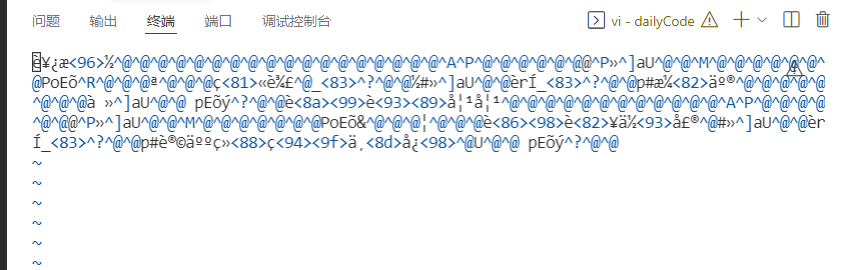

可以看到很多乱码，其实并不是文件的内容乱，而是vi无法识别文件的格式，把内容当成ASCII码显示，如果内容刚好是ASCII码，就能正确显示，如果不是ASCII码（如年龄和身高是整数），就无法正常显示了。


**从文件中读取数据**

fread函数用来从文件中读取数据块，它的原型为：

```c
size_t fread(void *ptr, size_t size, size_t nmemb, FILE *fp);
```

ptr：用于存放从文件中读取数据的变量地址，它可以是数组、变量、结构体等。

size：固定填1。

nmemb：表示打算读取的数据的字节数。

fp：表示文件指针。

调用fread函数如果成功的读取到内容，函数返回读取到的内容的字节数，如果读取错误或文件已结束，返回空，即0。如果fread返回空，可以认为是文件结束而不是发生了错误，因为发生错误的情况极少出现

**示例（book117.c）**

```c
#include <stdio.h>
#include <string.h>
 
struct st_girl
{
  char name[50];     // 姓名
  int  age;          // 年龄
  int  height;       // 身高，单位：厘米cm
  char sc[30];       // 身材，火辣；普通；飞机场。
  char yz[30];       // 颜值，漂亮；一般；歪瓜裂枣。
};
 
int main()
{
  struct st_girl stgirl;  // 定义超女数据结构变量
  FILE *fp=0;     // 定义文件指针变量fp
 
  // 以只读的方式打开文件/tmp/test1.dat
  if ( (fp=fopen("/tmp/test1.dat","rb")) == 0)
  {
    printf("fopen(/tmp/test1.dat) failed.\n"); return -1;
  }
 
  while (1)
  {
    // 从文件中读取数据，存入超女数据结构变量中
    if (fread(&stgirl,1,sizeof(struct st_girl),fp)==0) break;
    // 显示超女数据结构变量的值
    printf("name=%s,age=%d,height=%d,sc=%s,yz=%s\n",\
          stgirl.name,stgirl.age,stgirl.height,stgirl.sc,stgirl.yz);
  }
 
  // 关闭文件
  fclose(fp);
}
```

运行结果：

>name = 西施, age = 18, height = 170, sc= 火辣, yz = 漂亮
>name = 芙蓉妹妹, age = 38, height = 166, sc= 膘肥体壮, yz = 让人终生不忘

**文件定位**

在文件内部有一个位置指针，用来指向文件当前读写的位置。在文件打开时，如果打开方式是r和w，位置指针指向文件的第一个字节，如果打开方式是a，位置指针指向文件的尾部。每当从文件里读取n个字节或文件里写入n个字节后，位置指针也会向后移动n个字节。

文件位置指针与C语言中的指针不是一回事。位置指针仅仅是一个标志，表示文件读写到的位置，不是变量的地址。文件每读写一次，位置指针就会移动一次，它不需要您在程序中定义和赋值，而是由系统自动设置，对程序员来说是隐藏的。

在实际开发中，偶尔需要移动位置指针，实现对指定位置数据的读写。我们把移动位置指针称为文件定位。

C语言提供了ftell、rewind和fseek三个库函数来实现文件定位功能。

**ftell函数**

ftell函数用来返回当前文件位置指针的值，这个值是当前位置相对于文件开始位置的字节数。它的声明如下：

```c
long ftell(FILE *fp);
```

**rewind函数**

rewind函数用来将位置指针移动到文件开头，它的声明如下：

```c
void rewind ( FILE *fp );
```

**fseek函数**

fseek() 用来将位置指针移动到任意位置，它的声明如下：

```c
int fseek ( FILE *fp, long offset, int origin );
```

参数说明：

1）fp 为文件指针，也就是被移动的文件。

2）offset 为偏移量，也就是要移动的字节数。之所以为 long 类型，是希望移动的范围更大，能处理的文件更大。offset 为正时，向后移动；offset 为负时，向前移动。

3）origin 为起始位置，也就是从何处开始计算偏移量。C语言规定的起始位置有三种，分别为：0-文件开头；1-当前位置；2-文件末尾。

```
  fseek(fp,100,0);     // 从文件的开始位置计算，向后移动100字节。
  fseek(fp,100,1);     // 从文件的当前位置计算，向后移动100字节。
  fseek(fp,-100,2);    // 从文件的尾部位置计算，向前移动100字节。
```

**注意事项**

当offset是向文件尾方向偏移的时候，无论偏移量是否超出文件尾，fseek都是返回0，当偏移量没有超出文件尾的时候，文件指针式指向正常的偏移地址的，当偏移量超出文件尾的时候，文件指针是指向文件尾的，不会返回偏移出错-1值。

当offset是向文件头方向偏移的时候，如果offset没有超出文件头，是正常偏移，文件指针指向正确的偏移地址，fseek返回值为0，当offset超出文件头时，fseek返回出错-1值，文件指针还是处于原来的位置。

**文件缓冲区**

在操作系统中，存在一个内存缓冲区，当调用fprintf、fwrite等函数往文件写入数据的时候，数据并不会立即写入磁盘文件，而是先写入缓冲区，等缓冲区的数据满了之后才写入文件。还有一种情况就是程序调用了fclose时也会把缓冲区的数据写入文件。

在实际开发中，如果程序员想把缓冲区的数据立即写入文件，可以调用fflush库函数，它的声明如下：

```c
int fflush(FILE *fp);
```

函数的参数只有一个，即文件指针，返回0成功，其它失败，程序员一般不关心它的返回值。

**标准输入、标准输出和标准错误**

Linux操作系统为每个程序默认打开三个文件，即标准输入stdin、标准输出stdout和标准错误输出stderr，其中0就是stdin，表示输入流，指从键盘输入，1代表stdout，2代表stderr，1,2默认是显示器。

```c
  printf("Hello world.\n");
```

等同于

```c
  fprintf(stdout,"Hello world.\n");
```

这几个文件指针没什么用，让大家了解一下就行。在实际开发中，我们一般会关闭这几个文件指针。

## 文件目录操作

 **获取当前工作目录**

在shell中我们可以直接输入命令pwd 来显示当前的工作目录，在C程序中调用getcwd函数可以获取当前的工作目录。函数声明：

```c
char *getcwd(char * buf,size_t size);
```

 getcwd函数把当前工作目录存入buf中，如果目录名超出了参数size长度，函数返回NULL，如果成功，返回buf。例如：

```c
  char strpwd[301];
  memset(strpwd,0,sizeof(strpwd));
  getcwd(strpwd,300);
  printf("当前目录是：%s\n",strpwd);
```

 **切换工作目录**

函数声明：

```c
int chdir(const char *path);
```

就像我们在shell中使用cd命令切换目录一样，在C程序中使用chdir函数来改变工作目录。 

返回值：0-切换成功；非0-失败。

**目录的创建和删除**

 在shell中可以通过mkdir/rmdir命令来创建/删除目录，C程序中用mkdir/rmdir函数来创建/删除目录。

创建目录函数的声明：

```c
int mkdir(const char *pathname, mode_t mode);
```

mode的含义将按open系统调用的O_CREAT选项中的有关定义设置，当然，它还要服从umask的设置况，是不是看不明白？那先固定填0755，注意，0不要省略哦，它表示八进制。

 例如：

```c
  mkdir("/tmp/aaa",0755);   // 创建/tmp/aaa目录
```

删除目录函数的声明：

```c
int rmdir(const char *pathname);
```

**获取目录中的文件列表**

在实际开发中，文件是存放在目录中的，在处理文件之前，必须先知道目录中有哪些文件，所以要获取目录中的文件列表。涉及到的库函数如下：

**包含头文件**

```c
#include <dirent.h>
```

 **相关的库函数**

打开目录的函数opendir的声明：

```c
DIR *opendir(const char *pathname);
```

读取目录的函数readdir的声明：

```c
struct dirent *readdir(DIR *dirp);
```

关闭目录的函数closedir的声明：

```c
int closedir(DIR *dirp);
```

 **数据结构**

1）目录指针DIR

```
DIR *目录指针名;
```

2）struct dirent结构体

每调用一次readdir函数会返回一个struct dirent的地址，存放了本次读取到的内容，它的原理与fgets函数读取文件相同。

```c
struct dirent
{
   long d_ino;                    // inode number 索引节点号
   off_t d_off;                   // offset to this dirent 在目录文件中的偏移
   unsigned short d_reclen;     // length of this d_name 文件名长
   unsigned char d_type;         // the type of d_name 文件类型
   char d_name [NAME_MAX+1];    // file name文件名，最长255字符
};
```

我们只需要关注结构体的d_type和d_name成员，其它的不必关心。

d_name文件名或目录名。

d_type描述了文件的类型，有多种取值，最重要的是8和4，8-常规文件（A regular file）；4-目录（A directory），其它的暂时不关心。

 **读取目录**

book.c

```c
#include <stdio.h>
#include <dirent.h>
 
int main(int argc,char *argv[])
{
  if (argc != 2)  { printf("请指定目录名。\n"); return -1; }
 
  DIR *dir;   // 定义目录指针
 
  // 打开目录
  if ( (dir=opendir(argv[1])) == 0 ) return -1;
 
  // 用于存放从目录中读取到的文件和目录信息
  struct dirent *stdinfo;
 
  while (1)
  {
    // 读取一条记录并显示到屏幕
    if ((stdinfo=readdir(dir)) == 0) break;
 
    printf("name=%s,type=%d\n",stdinfo->d_name,stdinfo->d_type);
  }
 
  closedir(dir);   // 关闭目录指针
}
```

运行结果：

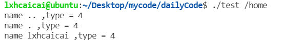


实际需求是这样的，文件存放在某目录中，该目录下还会有多级子目录，程序员想要的是列出该目录及其子目录下全部的文件名。

test.c

```c
#include <stdio.h>
#include <dirent.h>
 
// 列出目录及子目录下的文件
int ReadDir(const char *strpathname);
 
int main(int argc,char *argv[])
{
  if (argc != 2)  { printf("请指定目录名。\n"); return -1; }
 
  // 列出目录及子目录下的文件
  ReadDir(argv[1]);
}
 
// 列出目录及子目录下的文件
int ReadDir(const char *strpathname)
{
  DIR *dir;   // 定义目录指针
  char strchdpath[256];  // 子目录的全路径
 
  if ( (dir=opendir(strpathname)) == 0 ) return -1; // 打开目录
 
  struct dirent *stdinfo; // 用于存放从目录读取到的文件和目录信息
 
  while (1)
  {
    if ((stdinfo=readdir(dir)) == 0) break;   // 读取一记录
 
    if (strncmp(stdinfo->d_name,".",1)==0) continue;  // 以.开始的文件不读
 
    if (stdinfo->d_type==8)    // 如果是文件，显示出来
      printf("name=%s/%s\n",strpathname,stdinfo->d_name);
 
    if (stdinfo->d_type==4)   // 如果是目录，再调用一次ReadDir
    {
      sprintf(strchdpath,"%s/%s",strpathname,stdinfo->d_name);
      ReadDir(strchdpath);
    }
  }
 
  closedir(dir);   // 关闭目录指针
}
```

运行结果：

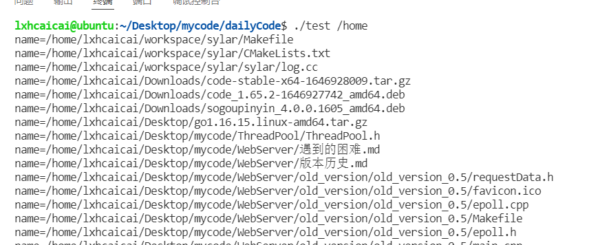

## c语言 时间操作

在C语言中，用time_t来表示时间数据类型，它是一个long（长整数）类型的别名，在time.h文件中定义，表示一个日历时间，是从1970年1月1日0时0分0秒到现在的秒数。

```c
typedef long time_t;
```

 **time库函数**

time函数的用途是返回一个值，也就是从1970年1月1日0时0分0秒到现在的秒数。

time函数是C语言标准库中的函数，在time.h文件中声明。

```c
time_t time(time_t *t);
```

time函数有两种调用方法：

```c
  time_t tnow;
  tnow =time(0);     // 将空地址传递给time函数，并将time返回值赋给变量tnow
```

或

```c
  time(&tnow);       // 将变量tnow的地址作为参数传递给time函数
```


time_t只是一个长整型，不符合我们的使用习惯，需要转换成可以方便表示时间的结构体，即tm结构体，tm结构体在time.h中声明，如下：

```c
struct tm
{
  int tm_sec;     // 秒：取值区间为[0,59]
  int tm_min;     // 分：取值区间为[0,59]
  int tm_hour;    // 时：取值区间为[0,23]
  int tm_mday;    // 日期：一个月中的日期：取值区间为[1,31]
  int tm_mon;     // 月份：（从一月开始，0代表一月），取值区间为[0,11]
  int tm_year;    // 年份：其值等于实际年份减去1900
  int tm_wday;    // 星期：取值区间为[0,6]，其中0代表星期天，1代表星期一，以此类推
  int tm_yday;    // 从每年的1月1日开始的天数：取值区间为[0,365]，其中0代表1月1日，1代表1月2日，以此类推
  int tm_isdst;   // 夏令时标识符，该字段意义不大，我们不用夏令时。
};
```

这个结构定义了年、月、日、时、分、秒、星期、当年中的某一天、夏令时。用这个结构体可以很方便的显示时间。

 **localtime库函数**

localtime函数用于把time_t表示的时间转换为struct tm结构体表示的时间，函数返回struct tm结构体的地址。

函数声明：

```c
 struct tm * localtime(const time_t *);
```

struct tm结构体包含了时间的各要素，但还不是我们习惯的时间表达方式，我们可以用格式化输出printf、sprintf或fprintf等函数，把struct tm结构体转换为我们想要的结果。

**示例（test.c）**

```c
#include <stdio.h>
#include <time.h>
 
int main(int argc,char *argv[])
{
  time_t tnow;
  tnow=time(0);      // 获取当前时间
  printf("tnow=%lu\n",tnow);   // 输出整数表示的时间
 
  struct tm *sttm; 
  sttm=localtime(&tnow);  // 把整数的时间转换为struct tm结构体的时间
 
  // yyyy-mm-dd hh24:mi:ss格式输出，此格式用得最多
  printf("%04u-%02u-%02u %02u:%02u:%02u\n",sttm->tm_year+1900,sttm->tm_mon+1,\
          sttm->tm_mday,sttm->tm_hour,sttm->tm_min,sttm->tm_sec);
 
  printf("%04u年%02u月%02u日%02u时%02u分%02u秒\n",sttm->tm_year+1900,\
          sttm->tm_mon+1,sttm->tm_mday,sttm->tm_hour,sttm->tm_min,sttm->tm_sec);
 
  // 只输出年月日
  printf("%04u-%02u-%02u\n",sttm->tm_year+1900,sttm->tm_mon+1,sttm->tm_mday);
}
```

运行结果：

>tnow=1648461596
>2022-03-28 02:59:56
>2022年03月28日02时59分56秒
>2022-03-28

**mktime库函数**

mktime函数的功能与localtime函数相反。

localtime函数用于把time_t表示的时间转换为struct tm表示的时间。

mktime 函数用于把struct tm表示的时间转换为time_t表示的时间。

```c
time_t mktime(struct tm *tm);
```

函数返回time_t的值。

test.c

```c
#include <stdio.h>
#include <time.h>
#include <string.h>
 
int main(int argc,char *argv[])
{
  // 2019-12-25 15:05:03整数表示是1577257503
  struct tm sttm; 
  memset(&sttm,0,sizeof(sttm));
 
  sttm.tm_year=2019-1900; // 注意，要减1900
  sttm.tm_mon=12-1;        // 注意，要减1
  sttm.tm_mday=25;
  sttm.tm_hour=15;
  sttm.tm_min=5;
  sttm.tm_sec=3;
  sttm.tm_isdst = 0;
  printf("2019-12-25 15:05:03 is %lu\n",mktime(&sttm));
}
```

运行结果：

>2019-12-25 15:05:03 is 1577261103

 **程序睡眠**


在实际开发中，我们经常需要把程序挂起一段时间，可以使用sleep和usleep两个库函数，需要包含unistd.h头文件中。函数的声明如下：

```c
unsigned int sleep(unsigned int seconds);
int usleep(useconds_t usec);
```

sleep函数的参数是秒，usleep函数的参数是微秒，1秒=1000000微秒。

```c
  sleep(1);           // 程序睡眠1秒。
  sleep(10);          // 程序睡眠10秒。
  usleep(100000);    // 程序睡眠十分之一秒。
  usleep(1000000);   // 程序睡眠一秒。
```

程序员不关心sleep和usleep函数的返回值。

 **精确到微秒的计时器**

**精确到微秒的timeval结构体**

timeval结构体在sys/time.h文件中定义，声明为：

```c
struct timeval
{
  long  tv_sec;  // 1970年1月1日到现在的秒。
  long  tv_usec; // 当前秒的微妙，即百万分之一秒。
};
```

 **时区timezone 结构体**

timezone 结构体在sys/time.h文件中定义，声明为：

```c
struct timezone
  int tz_minuteswest;  // 和UTC（格林威治时间）差了多少分钟。
  int tz_dsttime;      // type of DST correction，修正参数据，忽略
};
```

 **gettimeofday库函数**

gettimeofday是获得当前的秒和微秒的时间，其中的秒是指1970年1月1日到现在的秒，微秒是指当前秒已逝去的微秒数，可以用于程序的计时。调用gettimeofday函数需要包含sys/time.h头文件。

函数声明：

```c
int gettimeofday(struct  timeval *tv, struct  timezone *tz )
```

当前的时间存放在tv 结构体中，当地时区的信息则放到tz所指的结构体中，tz可以为空。

函数执行成功后返回0，失败后返回-1。

在使用gettimeofday()函数时，第二个参数一般都为空，我们一般都只是为了获得当前时间，不关心时区的信息。

**示例（book132.c）**

```c

#include <stdio.h>
#include <sys/time.h>   // 注意，不是time.h
 
int main()
{
  struct timeval begin,end;  // 定义用于存放开始和结束的时间
 
  gettimeofday(&begin,0);    // 计时器开始
  printf("begin time(0)=%d,tv_sec=%d,tv_usec=%d\n",time(0),begin.tv_sec,begin.tv_usec);
 
  sleep(2);
  usleep(100000);     // 程序睡眠十分之一秒。
 
  gettimeofday(&end,0);      // 计时器结束
  printf("end   time(0)=%d,tv_sec=%d,tv_usec=%d\n",time(0),end.tv_sec,end.tv_usec);
 
  printf("计时过去了%d微秒。\n",\
         (end.tv_sec-begin.tv_sec)*1000000+(end.tv_usec-begin.tv_usec));
}
```

## c 语言预处理

在C语言的程序中包括各种以符号#开头的编译指令，这些指令称为预处理命令。预处理命令属于C语言编译器，而不是C语言的组成部分，通过预处理命令可扩展C语言程序设计的环境。

预处理指令是以#号开头的代码行，#号必须是该行除了任何空白字符外的第一个字符。

\#后是指令关键字，在关键字和#号之间允许存在任意个数的空白字符，整行语句构成了一条预处理指令，该指令将在编译器进行编译之前对源代码做某些转换。

预处理指令主要有以下三种：

1）包含文件：将源文件中以**#include**格式包含的文件复制到编译的源文件中，可以是头文件，也可以是其它的程序文件。

2）宏定义指令：**#define**指令定义一个宏，**#undef**指令删除一个宏定义。

3）条件编译：根据**#ifdef**和**#ifndef**后面的条件决定需要编译的代码。

**包含文件**

当一个C语言程序由多个文件模块组成时，主模块中一般包含main函数和一些当前程序专用的函数。程序从main函数开始执行，在执行过程中，可调用当前文件中的函数，也可调用其他文件模块中的函数。

如果在模块中要调用其他文件模块中的函数，首先必须在主模块中声明该函数原型。一般都是采用文件包含的方法，包含其他文件模块的头文件。

文件包含中指定的文件名即可以用引号括起来，也可以用尖括号括起来，格式如下：

```c
#include <文件名>
```

或

```c
#include "文件名"
```

如果使用尖括号<>括起文件名，则编译程序将到C语言开发环境中设置好的 include文件中去找指定的文件（/usr/include）

因为C语言的标准头文件都存放在/usr/include文件夹中，所以一般对标准头文件采用尖括号；对程序员自己编写的文件，则使用双引号。

如果自己编写的文件不是存放在当前工作文件夹，可以在#include命令后面加在路径。

\#include命令的作用是把指定的文件模块内容插入到#include所在的位置，当程序编译链接时，系统会把所有#include指定的文件链接生成可执行代码。

\#include包含文件，可以是 “.h”,表示C语言程序的头文件，也可以是“.c”,表示包含普通C语言源程序。

**宏定义指令**

使用#define命令并不是真正的定义符号常量，而是定义一个可以替换的宏。被定义为宏的标识符称为“宏名”。在编译预处理过程时，对程序中所有出现的“宏名”，都用宏定义中的字符串去代换，这称为“宏替换”或“宏展开”。

在C语言中，宏分为有参数和无参数两种。

## 无参数的宏

其定义格式如下：

```
#define 宏名  字符串
```

在以上宏定义语句中，各部分的含义如下：

表示这是一条预处理命令(凡是以“#”开始的均为预处理命令)。

**define** 关键字“define”为宏定义命令。

**宏名** 是一个标示符，必须符合C语言标示符的规定，一般以大写字母标识宏名。

**字符串** 可以是常数，表达式，格式串等。在前面使用的符号常量的定义就是一个无参数宏定义。

注意：预处理命令语句后面一般不会添加分号，如果在#define最后有分号，在宏替换时分号也将替换到源代码中去。在宏名和字符串之间可以有任意个空格。

```
#define PI 3.141592
```

**带参数的宏**

\#define命令定义宏时，还可以为宏设置参数。与函数中的参数类似，在宏定义中的参数为形式参数，在宏调用中的参数称为实际参数。对带参数的宏，在调用中，不仅要宏展开，还要用实参去代换形参。

带参宏定义的一般形式为：

```
#define 宏名(形参表) 字符串
```

在定义带参数的宏时，宏名和形参表之间不能有空格出现，否则，就将宏定义成为无参数形式，而导致程序出错。

```
#define MAX(x,y)  ((x)>(y) ? (x) : (y))
```

以上的宏定义中，如果x的值大于y，得到x，否则得到y。

**条件编译**

条件编译有多种格式，在这里我只介绍最常用的两种格式#ifdef和#ifndef。

 **#ifdef**

\#ifdef命令的使用格式如下：

```
#ifdef 标识符
  程序段 1
#else
  程序段 2
#endif
```

其意义是，如果#ifdef后面的标识符已被定义过，则对“程序段1”进行编译；如果没有定义标识符，则编译“程序段2”。一般不使用#else及后面的“程序2”。

示例

book.c

```c
#define LINUX
 
int main()
{
  #ifdef LINUX
    printf("这是Linux操作系统。\n");
  #else
    printf("未知的操作系统。\n");
  #endif
}
```

执行预编译指令gcc -E -o book153.E book153.c，得到book153.E文件，如下：

```c
# 1 "book.c"
# 1 "<built-in>"
# 1 "<命令行>"
# 1 "/usr/include/stdc-predef.h" 1 3 4
# 1 "<命令行>" 2
# 1 "book153.c"
 
int main()
{
  printf("这是Linux操作系统。\n");
}
```

 **#ifndef**

而#ifndef的意义与#ifdef相反，其格式如下：

```
#ifndef 标识符
  程序段 1
#else
  程序段 2 
#endif
```

其意义是，如果未定义标识符，则编译“程序段1”；否则编译“程序段2”

在实际开发中，程序员用#ifndef来防止头文件被重复包含。

我们打开/usr/include/stdio.h文件。

第一条有效行的代码是。

```
#ifndef _STDIO_H
```

接下来是。

```
#define _STDIO_H  1
```

最后一行是。

```
#endif
```

程序员自定义的头文件，我们也会这么写

```c
#ifndef _PUBLIC_H
#define _PUBLIC_H 1
 
// 把字符串格式的时间转换为整数的时间，函数的声明如下：
int strtotime(const char *strtime,time_t *ti);
 
#endif
```

## c 语言系统错误

函数声明：

```c
char *strerror(int errno);
```

函数说明：strerror()用来依参数errno 的错误代码来查询其错误原因的描述字符串，然后将该字符串指针返回。

返回值：返回描述错误原因的字符串地址。

在gcc4.4.7版本中，定义了131个错误代码，我们用程序把它们全部显示出来。

示例

book.c

```c
#include <stdio.h>
#include <string.h>

int main() {
  for(int errorno = 0; errorno < 132; errorno ++) {
    printf("%d:%s\n", errorno, strerror(errorno));
  }
  return 0;
}
```

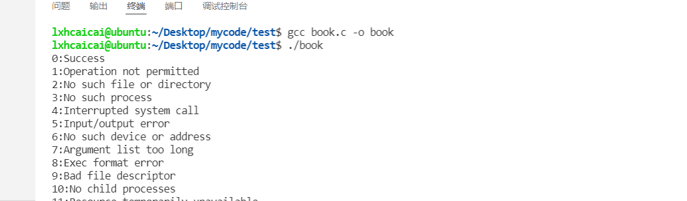

 **errno的细节**

 **调用库函数失败不一定会设置errno**

如果库函数调用失败，库函数会设置errno的值，程序员通过 errno 的值来判断出错的具体原因，但是，并不是全部的库函数在调用失败时都会设置errno的值，那么，哪些库函数会设置errno的值呢，要看函数的说明，例如fopen函数，在命令行下输入man fopen，在诸多的文字中，有以下行说明文字。

```c
The fopen() function may also fail and set errno for any of the errors specified for the routine open(2).
```

不属于系统调用的函数不会设置errno，属于系统调用的函数才会设置errno。

 **程序员可以不用errno**

关注errno的目的是为了获取更详细错误信息，这些错误信息对程序员诊断程序可能会有帮助，但不是必须的。

book.c

```c
#include <stdio.h>
#include <string.h>
#include <errno.h>
 
int main()
{
  FILE *fp=0;     // 定义文件指针变量fp
 
  // 以只读的方式打开文件/tmp/book1.c
  if ( (fp=fopen("/tmp/book1.c","r")) == 0 )
  {
    printf("打开文件/tmp/book1.c失败（%d：%s）。\n",errno,strerror(errno)); 
  }
  
  // 关闭文件
  if ( fp!=0 ) fclose(fp);
 
  return 0;
}
```

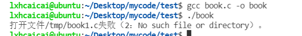

 **c语言目录和文件操作拓展**

**access库函数**

access函数用于判断当前操作系统用户对文件或目录的存取权限。

包含头文件：

```c
#include <unistd.h>
```

函数声明：

```c
int access(const char *pathname, int mode);
```

参数说明：

pathname文件名或目录名，可以是当前目录的文件或目录，也可以列出全路径。

mode 需要判断的存取权限。在头文件unistd.h中的预定义如下：

```c
#define R_OK 4     // R_OK 只判断是否有读权限
#define W_OK 2    // W_OK 只判断是否有写权限
#define X_OK 1     // X_OK 判断是否有执行权限
#define F_OK 0     // F_OK 只判断是否存在
```

返回值：

当pathname满足mode的条件时候返回0，不满足返回-1。

在实际开发中，access函数主要用于判断文件或目录是否是存在。

 **stat库函数**

 **stat结构体**

struct stat结构体用于存放文件和目录的状态信息，如下：

```c
struct stat
{
  dev_t st_dev;   // device 文件的设备编号
  ino_t st_ino;   // inode 文件的i-node
  mode_t st_mode;   // protection 文件的类型和存取的权限
  nlink_t st_nlink;   // number of hard links 连到该文件的硬连接数目, 刚建立的文件值为1.
  uid_t st_uid;   // user ID of owner 文件所有者的用户识别码
  gid_t st_gid;   // group ID of owner 文件所有者的组识别码
  dev_t st_rdev;  // device type 若此文件为设备文件, 则为其设备编号
  off_t st_size;  // total size, in bytes 文件大小, 以字节计算
  unsigned long st_blksize;  // blocksize for filesystem I/O 文件系统的I/O 缓冲区大小.
  unsigned long st_blocks;  // number of blocks allocated 占用文件区块的个数, 每一区块大小为512 个字节.
  time_t st_atime;  // time of lastaccess 文件最近一次被存取或被执行的时间, 一般只有在用mknod、 utime、read、write 与tructate 时改变.
  time_t st_mtime;  // time of last modification 文件最后一次被修改的时间, 一般只有在用mknod、 utime 和write 时才会改变
  time_t st_ctime;  // time of last change i-node 最近一次被更改的时间, 此参数会在文件所有者、组、 权限被更改时更新
};
```

struct stat结构体的成员变量比较多，对程序员来说，重点关注st_mode、st_size和st_mtime成员就可以了。注意st_mtime是一个整数表达的时间，需要程序员自己写代码转换格式。

st_mode成员的取值很多，或者使用如下两个宏来判断。

```c
 S_ISREG(st_mode)  // 是否为一般文件 
  S_ISDIR(st_mode)  // 是否为目录
```

 **stat库函数**

包含头文件：

```c
#include <sys/types.h>
#include <sys/stat.h>
#include <unistd.h>
```

函数声明：

```c
int stat(const char *path, struct stat *buf);
```

stat函数获取path指定文件或目录的信息，并将信息保存到结构体buf中，执行成功返回0，失败返回-1。

```c

#include <stdio.h>
#include <sys/stat.h>
#include <unistd.h>
 
// 本程序运行要带一个参数，即文件或目录名
int main(int argc,char *argv[])
{
  if (argc != 2)  { printf("请指定目录或文件名。\n"); return -1; }
 
  if (access(argv[1],F_OK) != 0) { printf("文件或目录%s不存在。\n",argv[1]); return -1; }
 
  struct stat ststat;
 
  // 获取文件的状态信息
  if (stat(argv[1],&ststat) != 0) return -1;
 
  if (S_ISREG(ststat.st_mode)) printf("%s是一个文件。\n",argv[1]);
  if (S_ISDIR(ststat.st_mode)) printf("%s是一个目录。\n",argv[1]);
}
```


**utime库函数**

utime函数用于修改文件的存取时间和更改时间。

包含头文件：

```c
#include <utime.h>
```

函数声明：

```c
int utime(const char *filename, const struct utimbuf *times);
```

函数说明：utime()用来修改参数filename 文件所属的inode 存取时间。如果参数times为空指针(NULL), 则该文件的存取时间和更改时间全部会设为目前时间。结构utimbuf 定义如下：

```c
struct utimbuf
{
  time_t actime;
  time_t modtime;
};
```

返回值：执行成功则返回0，失败返回-1。

 **rename库函数**

包含头文件：

```c
#include <stdio.h>
```

函数声明：

```c
int rename(const char *oldpath, const char *newpath);
```

参数说明：

oldpath 文件或目录的原名。

newpath 文件或目录的新的名称。

返回值：0-成功，-1-失败。

 **remove库函数**

remove函数用于删除文件或目录，相当于操作系统的rm命令。

包含头文件：

```c
#include <stdio.h>
```

函数声明：

```c
int remove(const char *pathname);
```

参数说明：

pathname 待删除的文件或目录名。

返回值：0-成功，-1-失败。

## c 语言makefile 文件

在linux和unix中，有一个强大的实用程序，叫make，可以用它来管理多模块程序的编译和链接，直至生成可执行文件。

make程序需要一个编译规则说明文件，称为makefile，makefile文件中描述了整个软件工程的编译规则和各个文件之间的依赖关系。

makefile就像是一个shell脚本一样，其中可以执行操作系统的命令，它带来的好处就是我们能够实现“自动化编译”，一旦写好，只要一个make命令，整个软件功能就完全自动编译，提高了软件开发的效率。

make是一个命令工具，是一个解释makefile中指令的命令工具，一般来说大多数编译器都有这个命令，使用make可以是重新编译的次数达到最小化。


### makefile的编写

makefile文件的规则可以非常复杂，比C程序还要复杂，我通过示例来介绍它的简单用法。

文件名：makefile，内容如下：

```makefile
all:book1 book46
 
book1:book1.c
        gcc -o book1 book1.c
 
book46:book46.c _public.h _public.c
        gcc -o book46 book46.c _public.c
 
clean:
        rm -f book1 book46
```

**第一行**

```makefile
all:book book46
```

all: 这是固定的写法。

book1 book46表示需要编译目标程序的清单，中间用空格分隔开，如果清单很长，可以用\换行。

**第二行**

makefile文件中的空行就像C程序中的空行一样，只是为了书写整洁，没有什么意义。

**第三行**

```makefile
book1:book1.c
```

book1:表示需要编译的目标程序。

如果要编译目标程序book1，需要依赖源程序book1.c，当book1.c的内容发生了变化，执行make的时候就会重新编译book1。

**第四行**

```
        gcc -o book1 book1.c
```

这是一个编译命令，和在操作系统命令行输入的命令一样，但是要注意一个问题，在gcc之前要用tab键，看上去像8个空格，实际不是，一定要用tab，空格不行。

**第六行**

```
book46:book46.c _public.h _public.c
```

与第三行的含义相同。

book46:表示编译的目标程序。

如果要编译目标程序book46，需要依赖源程序book46.c、_public.h和_public.c三个文件，只要任何一个的内容发生了变化，执行make的时候就会重新编译book46。

**第七行**

```
        gcc -o book46 book46.c _public.c
```

与第四行的含义相同。

**第九行**

```
clean:
```

清除目标文件，清除的命令由第十行之后的脚本来执行。

**第十行**

```
        rm  -f  book1 book46
```

清除目标文件的脚本命令，注意了，rm之前也是一个tab键，不是空格。

### makefile文件中的变量

makefile中，变量就是一个名字，变量的值就是一个文本字符串。在makefile中的目标，依赖，命令或其他地方引用变量时，变量会被它的值替代。

我通过示例来介绍它的简单用法。

```makefile
CC=gcc
FLAG=-g
 
all:book1 book46
 
book1:book1.c
        $(CC) $(FLAG) -o book1 book1.c
 
book46:book46.c _public.h _public.c
        $(CC) $(FLAG) -o book46 book46.c _public.c
 
clean:
        rm -f book1 book46
```

**第一行**

```makefile
CC=gcc
```

定义变量CC，赋值gcc。

**第二行**

```makefile
FLAG=-g
```

定义变量FLAG，赋值-g。

**第七行**

```makefile
        $(CC)  $(FLAG) -o book1 book1.c
```

$(CC)和$(FLAG)就是使用变量CC和FLAG的值，类似于C语言的宏定义，替换后的结果是：

```makefile
        gcc -g -o book1 book1.c
```

# c++部分

## 第二章

myfirst.cpp

```cpp
// myfirst.cpp--displays a message

#include <iostream>                           // a PREPROCESSOR directive
int main()                                    // function header
{                                             // start of function body
    using namespace std;                      // make definitions visible
    cout << "Come up and C++ me some time.";  // message
    cout << endl;                             // start a new line
    cout << "You won't regret it!" << endl;   // more output
// If the output window closes before you can read it,
// add the following code:
    // cout << "Press any key to continue." <<endl;
	// cin.get();                                                   
    return 0;                                 // terminate main()
}                                             // end of function body
```

运行结果：

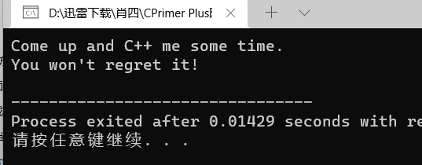

carrots.cpp

```cpp
// carrots.cpp -- food processing program
// uses and displays a variable

#include <iostream>

int main()
{
    using namespace std;
    
    int carrots;            // declare an integer variable
    
    carrots = 25;            // assign a value to the variable
    cout << "I have ";
    cout << carrots;        // display the value of the variable
    cout << " carrots.";
    cout << endl;
    carrots = carrots - 1;  // modify the variable
    cout << "Crunch, crunch. Now I have " << carrots << " carrots." << endl;
    // cin.get();
	return 0;
}
```

运行结果：

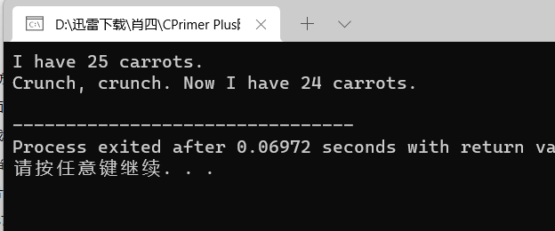

getinfo.cpp

```cpp
// getinfo.cpp -- input and output
#include <iostream>

int main()
{
    using namespace std;
    
    int carrots;
    
    cout << "How many carrots do you have?" << endl;
    cin >> carrots;                // C++ input
    cout << "Here are two more. ";
    carrots = carrots + 2;
// the next line concatenates output
    cout << "Now you have " << carrots << " carrots." << endl;
	// cin.get();
	// cin.get();
    return 0;
}
```

运行结果：

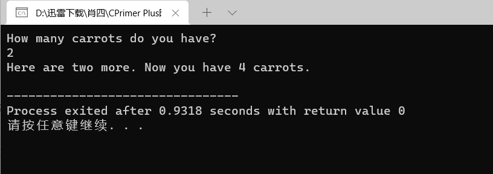

sqrt.cpp

```cpp
// sqrt.cpp -- using the sqrt() function

#include <iostream>
#include <cmath>    // or math.h

int main()
{
    using namespace std;
   
    double area;
    cout << "Enter the floor area, in square feet, of your home: ";
    cin >> area;
    double side;
    side = sqrt(area);
    cout << "That's the equivalent of a square " << side 
         << " feet to the side." << endl;
    cout << "How fascinating!" << endl;
	// cin.get();
	// cin.get();
    return 0;
}
```

运行结果：

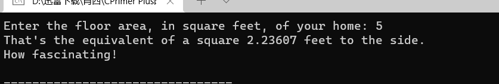

ourfunc.cpp

```cpp
// ourfunc.cpp -- defining your own function
#include <iostream>
void simon(int);    // function prototype for simon()

int main()
{
    using namespace std;
    simon(3);       // call the simon() function
    cout << "Pick an integer: ";
    int count;
    cin >> count;
    simon(count);   // call it again
    cout << "Done!" << endl;
	// cin.get();
    // cin.get();
    return 0;
}

void simon(int n)   // define the simon() function
{
    using namespace std;

    cout << "Simon says touch your toes " << n << " times." << endl;
}                   // void functions don't need return statements
```

运行结果：

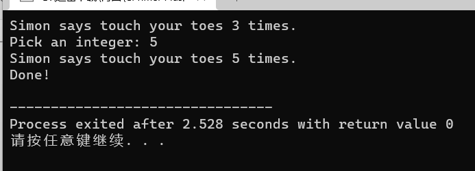

convert.cpp

```cpp
// convert.cpp -- converts stone to pounds
#include <iostream>
int stonetolb(int);     // function prototype
int main()
{
    using namespace std;
    int stone;
    cout << "Enter the weight in stone: ";
    cin >> stone;
    int pounds = stonetolb(stone);
    cout << stone << " stone = ";
    cout << pounds << " pounds." << endl;
	// cin.get();
    // cin.get();
    return 0;
}

int stonetolb(int sts)
{
     return 14 * sts;
}
```

运行结果：

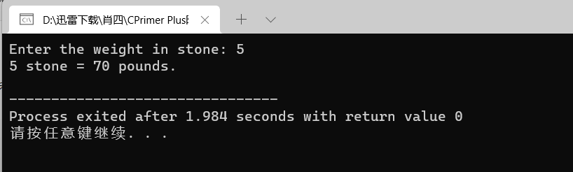