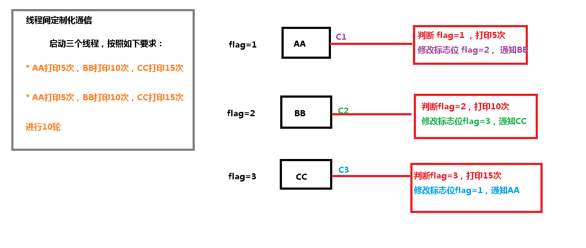

## JUC 学习

### lock 实现案例

```java
package com.atguigu.lock;

import java.util.concurrent.locks.Condition;
import java.util.concurrent.locks.Lock;
import java.util.concurrent.locks.ReentrantLock;

//第一步 创建资源类，定义属性和操作方法
class Share {
    private int number = 0;

    //创建Lock
    private Lock lock = new ReentrantLock();
    private Condition condition = lock.newCondition();

    //+1
    public void incr() throws InterruptedException {
        //上锁
        lock.lock();
        try {
            //判断
            while (number != 0) {
                condition.await();
            }
            //干活
            number++;
            System.out.println(Thread.currentThread().getName()+" :: "+number);
            //通知
            condition.signalAll();
        }finally {
            //解锁
            lock.unlock();
        }
    }

    //-1
    public void decr() throws InterruptedException {
        lock.lock();
        try {
            while(number != 1) {
                condition.await();
            }
            number--;
            System.out.println(Thread.currentThread().getName()+" :: "+number);
            condition.signalAll();
        }finally {
            lock.unlock();
        }
    }
}

public class ThreadDemo2 {

    public static void main(String[] args) {
        Share share = new Share();
        new Thread(()->{
            for (int i = 1; i <=10; i++) {
                try {
                    share.incr();
                } catch (InterruptedException e) {
                    e.printStackTrace();
                }
            }
        },"AA").start();
        new Thread(()->{
            for (int i = 1; i <=10; i++) {
                try {
                    share.decr();
                } catch (InterruptedException e) {
                    e.printStackTrace();
                }
            }
        },"BB").start();

        new Thread(()->{
            for (int i = 1; i <=10; i++) {
                try {
                    share.incr();
                } catch (InterruptedException e) {
                    e.printStackTrace();
                }
            }
        },"CC").start();
        new Thread(()->{
            for (int i = 1; i <=10; i++) {
                try {
                    share.decr();
                } catch (InterruptedException e) {
                    e.printStackTrace();
                }
            }
        },"DD").start();
    }

}

```

### 线程间定制化通信

关键字 synchronized 与 wait()/notify()这两个方法一起使用可以实现等待/通 知模式， Lock 锁的 newContition()方法返回 Condition 对象，Condition 类 也可以实现等待/通知模式。 用 notify()通知时，JVM 会随机唤醒某个等待的线程， 使用 Condition 类可以 进行选择性通知， Condition 比较常用的两个方法： 

- await()会使当前线程等待,同时会释放锁,当其他线程调用 signal()时,线程会重 新获得锁并继续执行。

- signal()用于唤醒一个等待的线程。 

  

  注意：在调用 Condition 的 await()/signal()方法前，也需要线程持有相关 的 Lock 锁，调用 await()后线程会释放这个锁，在 singal()调用后会从当前 Condition 对象的等待队列中，唤醒 一个线程，唤醒的线程尝试获得锁， 一旦 获得锁成功就继续执行。

 



```java
package com.atguigu.lock;

import java.util.ArrayList;
import java.util.List;
import java.util.UUID;
import java.util.concurrent.locks.Condition;
import java.util.concurrent.locks.Lock;
import java.util.concurrent.locks.ReentrantLock;

//第一步 创建资源类
class ShareResource {
    //定义标志位
    private int flag = 1;  // 1 AA     2 BB     3 CC

    //创建Lock锁
    private Lock lock = new ReentrantLock();

    //创建三个condition
    private Condition c1 = lock.newCondition();
    private Condition c2 = lock.newCondition();
    private Condition c3 = lock.newCondition();

    //打印5次，参数第几轮
    public void print5(int loop) throws InterruptedException {
        //上锁
        lock.lock();
        try {
            //判断
            while(flag != 1) {
                //等待
                c1.await();
            }
            //干活
            for (int i = 1; i <=5; i++) {
                System.out.println(Thread.currentThread().getName()+" :: "+i+" ：轮数："+loop);
            }
            //通知
            flag = 2; //修改标志位 2
            c2.signal(); //通知BB线程
        }finally {
            //释放锁
            lock.unlock();
        }
    }

    //打印10次，参数第几轮
    public void print10(int loop) throws InterruptedException {
        lock.lock();
        try {
            while(flag != 2) {
                c2.await();
            }
            for (int i = 1; i <=10; i++) {
                System.out.println(Thread.currentThread().getName()+" :: "+i+" ：轮数："+loop);
            }
            //修改标志位
            flag = 3;
            //通知CC线程
            c3.signal();
        }finally {
            lock.unlock();
        }
    }

    //打印15次，参数第几轮
    public void print15(int loop) throws InterruptedException {
        lock.lock();
        try {
            while(flag != 3) {
                c3.await();
            }
            for (int i = 1; i <=15; i++) {
                System.out.println(Thread.currentThread().getName()+" :: "+i+" ：轮数："+loop);
            }
            //修改标志位
            flag = 1;
            //通知AA线程
            c1.signal();
        }finally {
            lock.unlock();
        }
    }
}

public class ThreadDemo3 {
    public static void main(String[] args) {
        ShareResource shareResource = new ShareResource();
        new Thread(()->{
            for (int i = 1; i <=10; i++) {
                try {
                    shareResource.print5(i);
                } catch (InterruptedException e) {
                    e.printStackTrace();
                }
            }
        },"AA").start();

        new Thread(()->{
            for (int i = 1; i <=10; i++) {
                try {
                    shareResource.print10(i);
                } catch (InterruptedException e) {
                    e.printStackTrace();
                }
            }
        },"BB").start();

        new Thread(()->{
            for (int i = 1; i <=10; i++) {
                try {
                    shareResource.print15(i);
                } catch (InterruptedException e) {
                    e.printStackTrace();
                }
            }
        },"CC").start();
    }
}

```

