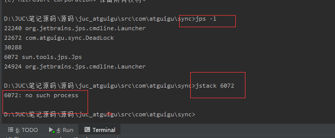

## JUC 学习

### 多线程锁

```java
package com.atguigu.sync;

import java.util.concurrent.TimeUnit;

class  Phone {

    public static synchronized void sendSMS() throws Exception {
        //停留4秒
        TimeUnit.SECONDS.sleep(4);
        System.out.println("------sendSMS");
    }

    public synchronized void sendEmail() throws Exception {
        System.out.println("------sendEmail");
    }

    public void getHello() {
        System.out.println("------getHello");
    }
}

/**
 * @Description: 8锁
 *
1 标准访问，先打印短信还是邮件
------sendSMS
------sendEmail

2 停4秒在短信方法内，先打印短信还是邮件
------sendSMS
------sendEmail

3 新增普通的hello方法，是先打短信还是hello
------getHello
------sendSMS

4 现在有两部手机，先打印短信还是邮件
------sendEmail
------sendSMS

5 两个静态同步方法，1部手机，先打印短信还是邮件
------sendSMS
------sendEmail

6 两个静态同步方法，2部手机，先打印短信还是邮件
------sendSMS
------sendEmail

7 1个静态同步方法,1个普通同步方法，1部手机，先打印短信还是邮件
------sendEmail
------sendSMS

8 1个静态同步方法,1个普通同步方法，2部手机，先打印短信还是邮件
------sendEmail
------sendSMS

 */

public class Lock_8 {
    public static void main(String[] args) throws Exception {

        Phone phone = new Phone();
        Phone phone2 = new Phone();

        new Thread(() -> {
            try {
                phone.sendSMS();
            } catch (Exception e) {
                e.printStackTrace();
            }
        }, "AA").start();

        Thread.sleep(100);

        new Thread(() -> {
            try {
               // phone.sendEmail();
               // phone.getHello();
                phone2.sendEmail();
            } catch (Exception e) {
                e.printStackTrace();
            }
        }, "BB").start();
    }
}

```

一个对象里面如果有多个 synchronized 方法，某一个时刻内，只要一个线程去调用其中的 一个 synchronized 方法了， 其它的线程都只能等待，换句话说，某一个时刻内，只能有唯一一个线程去访问这些 synchronized 方法 锁的是当前对象 this，被锁定后，其它的线程都不能进入到当前对象的其它的 synchronized 方法 加个普通方法后发现和同步锁无关 换成两个对象后，不是同一把锁了，情况立刻变化。 synchronized 实现同步的基础：Java 中的每一个对象都可以作为锁。 具体表现为以下 3 种形式。 **对于普通同步方法，锁是当前实例对象。 对于静态同步方法，锁是当前类的 Class 对象。 对于同步方法块，锁是 Synchonized 括号里配置的对象** 当一个线程试图访问同步代码块时，它首先必须得到锁，退出或抛出异常时必须释放锁。 也就是说如果一个实例对象的非静态同步方法获取锁后，该实例对象的其他非静态同步方 法必须等待获取锁的方法释放锁后才能获取锁， 可是别的实例对象的非静态同步方法因为跟该实例对象的非静态同步方法用的是不同的锁， 所以毋须等待该实例对象已获取锁的非静态同步方法释放锁就可以获取他们自己的锁。 所有的静态同步方法用的也是同一把锁——类对象本身，这两把锁是两个不同的对象，所 以静态同步方法与非静态同步方法之间是不会有竞态条件的。

### 可重入锁

也称 （递归锁）

synchronized(隐式) 和 lock(显式) 都是可重入锁

可重入锁

```java
package com.atguigu.sync;

import java.util.concurrent.locks.Lock;
import java.util.concurrent.locks.ReentrantLock;
import java.util.concurrent.locks.ReentrantReadWriteLock;

//可重入锁
public class SyncLockDemo {

    public synchronized void add() {
        add();
    }

    public static void main(String[] args) {
        //Lock演示可重入锁
        Lock lock = new ReentrantLock();
        //创建线程
        new Thread(()->{
            try {
                //上锁
                lock.lock();
                System.out.println(Thread.currentThread().getName()+" 外层");

                try {
                    //上锁
                    lock.lock();
                    System.out.println(Thread.currentThread().getName()+" 内层");
                }finally {
                    //释放锁
                    lock.unlock();
                }
            }finally {
                //释放做
                lock.unlock();
            }
        },"t1").start();

        //创建新线程
        new Thread(()->{
            lock.lock();
            System.out.println("aaaa");
            lock.unlock();
        },"aa").start();

       // new SyncLockDemo().add();
       // synchronized
//        Object o = new Object();
//        new Thread(()->{
//            synchronized(o) {
//                System.out.println(Thread.currentThread().getName()+" 外层");
//
//                synchronized (o) {
//                    System.out.println(Thread.currentThread().getName()+" 中层");
//
//                    synchronized (o) {
//                        System.out.println(Thread.currentThread().getName()+" 内层");
//                    }
//                }
//            }
//
//        },"t1").start();
    }

}

```


### 死锁

什么是死锁: 两个或者两个以上进程在执行过程中，因为争夺资源而造成一种相互等待的现象，如果没有外力干涉，他们无法进行下去


```java
package com.atguigu.sync;

import java.util.concurrent.TimeUnit;

/**
 * 演示死锁
 */
public class DeadLock {

    //创建两个对象
    static Object a = new Object();
    static Object b = new Object();

    public static void main(String[] args) {
        new Thread(()->{
            synchronized (a) {
                System.out.println(Thread.currentThread().getName()+" 持有锁a，试图获取锁b");
                try {
                    TimeUnit.SECONDS.sleep(1);
                } catch (InterruptedException e) {
                    e.printStackTrace();
                }
                synchronized (b) {
                    System.out.println(Thread.currentThread().getName()+" 获取锁b");
                }
            }
        },"A").start();

        new Thread(()->{
            synchronized (b) {
                System.out.println(Thread.currentThread().getName()+" 持有锁b，试图获取锁a");
                try {
                    TimeUnit.SECONDS.sleep(1);
                } catch (InterruptedException e) {
                    e.printStackTrace();
                }
                synchronized (a) {
                    System.out.println(Thread.currentThread().getName()+" 获取锁a");
                }
            }
        },"B").start();
    }
}

```


验证是否是死锁

（1） jps

