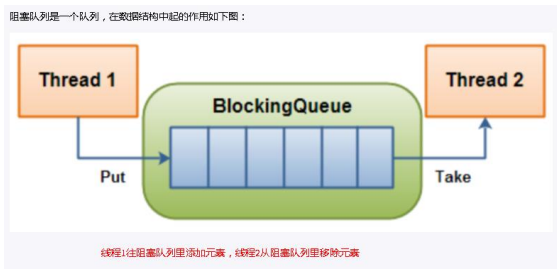
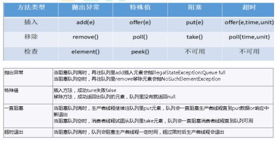
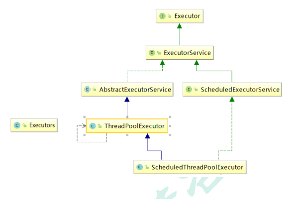
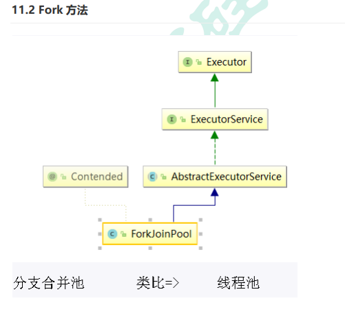

# JUC学习

##  **Callable&Future 接口**

## Callable 接口

两种创建线程的方法-一种是通过**创建 Thread 类**，**另一种是**

**通过使用 Runnable 创建线程。**但是，Runnable 缺少的一项功能是，当线程

终止时（即 run（）完成时），我们无法使线程返回结果。为了支持此功能，

Java 中提供了 Callable 接口。

==**现在我们学习的是创建线程的第三种方案---Callable 接口**==

**Callable 接口的特点如下(重点)**

为了实现 Runnable，需要实现不返回任何内容的 run（）方法，而对于

Callable，需要实现在完成时返回结果的 call（）方法。

• call（）方法可以引发异常，而 run（）则不能。

• 为实现 Callable 而必须重写 call 方法

• 不能直接替换 runnable,因为 Thread 类的构造方法根本没有 Callable

```java
// 创建新类 MyThread 实现 runnable 接口
class MyThread implements Runnable{
    @Override
    public void run() {
    }
}
// 新类 MyThread2 实现 callable 接口
class MyThread2 implements Callable<Integer>{
    @Override
    public Integer call() throws Exception {
    	return 200;
    }
}
```

### **Future 接口** 

当 call（）方法完成时，结果必须存储在主线程已知的对象中，以便主线程可

以知道该线程返回的结果。为此，可以使用 Future 对象。

将 Future 视为保存结果的对象–它可能暂时不保存结果，但将来会保存（一旦

Callable 返回）。Future 基本上是主线程可以跟踪进度以及其他线程的结果的

一种方式。要实现此接口，必须重写 5 种方法，这里列出了重要的方法,如下:


• **public boolean cancel（boolean mayInterrupt）：**用于停止任务。

==如果尚未启动，它将停止任务。如果已启动，则仅在 mayInterrupt 为 true

时才会中断任务。==

**public boolean isDone（）：**如果任务完成，则返回 true，否则返回 false

可以看到 Callable 和 Future 做两件事-Callable 与 Runnable 类似，因为它封

装了要在另一个线程上运行的任务，而 Future 用于存储从另一个线程获得的结

果。实际上，future 也可以与 Runnable 一起使用。

要创建线程，需要 Runnable。为了获得结果，需要 future。

###  **FutureTask**

Java 库具有具体的 FutureTask 类型，该类型实现 Runnable 和 Future，并方

便地将两种功能组合在一起。 可以通过为其构造函数提供 Callable 来创建

FutureTask。然后，将 FutureTask 对象提供给 Thread 的构造函数以创建

Thread 对象。因此，间接地使用 Callable 创建线程。

**核心原理:(重点)**

在主线程中需要执行比较耗时的操作时，但又不想阻塞主线程时，可以把这些

作业交给 Future 对象在后台完成。

当主线程将来需要时，就可以通过 Future 对象获得后台作业的计算结果或者执

行状态

一般 FutureTask 多用于耗时的计算，主线程可以在完成自己的任务后，再去

获取结果。

• 仅在计算完成时才能检索结果；如果计算尚未完成，则阻塞 get 方法

• 一旦计算完成，就不能再重新开始或取消计算

• get 方法而获取结果只有在计算完成时获取，否则会一直阻塞直到任务转入完

成状态，然后会返回结果或者抛出异常

• get 只计算一次,因此 get 方法放到最后

CallableDemo 案列

```java
package com.atguigu.callable;

import java.util.concurrent.Callable;
import java.util.concurrent.ExecutionException;
import java.util.concurrent.FutureTask;

//比较两个接口
//实现Runnable接口
class MyThread1 implements Runnable {
    @Override
    public void run() {

    }
}

//实现Callable接口
class MyThread2 implements Callable {

    @Override
    public Integer call() throws Exception {
        System.out.println(Thread.currentThread().getName()+" come in callable");
        return 200;
    }
}

public class Demo1 {
    public static void main(String[] args) throws ExecutionException, InterruptedException {
        //Runnable接口创建线程
        new Thread(new MyThread1(),"AA").start();

        //Callable接口,报错
       // new Thread(new MyThread2(),"BB").start();

        //FutureTask
        FutureTask<Integer> futureTask1 = new FutureTask<>(new MyThread2());

        //lam表达式
        FutureTask<Integer> futureTask2 = new FutureTask<>(()->{
            System.out.println(Thread.currentThread().getName()+" come in callable");
            return 1024;
        });

        //创建一个线程
        new Thread(futureTask2,"lucy").start();
        new Thread(futureTask1,"mary").start();

//        while(!futureTask2.isDone()) {
//            System.out.println("wait.....");
//        }
        //调用FutureTask的get方法
        System.out.println(futureTask2.get());

        System.out.println(futureTask1.get());

        System.out.println(Thread.currentThread().getName()+" come over");
        //FutureTask原理  未来任务
        /**
         * 1、老师上课，口渴了，去买票不合适，讲课线程继续。
         *   单开启线程找班上班长帮我买水，把水买回来，需要时候直接get
         *
         * 2、4个同学， 1同学 1+2...5   ，  2同学 10+11+12....50， 3同学 60+61+62，  4同学 100+200
         *      第2个同学计算量比较大，
         *     FutureTask单开启线程给2同学计算，先汇总 1 3 4 ，最后等2同学计算位完成，统一汇总
         *
         * 3、考试，做会做的题目，最后看不会做的题目
         *
         * 汇总一次
         *
         */

    }
}

```

## JUC三大辅助类

JUC 中提供了三种常用的辅助类，通过这些辅助类可以很好的解决线程数量过

多时 Lock 锁的频繁操作。这三种辅助类为：

• CountDownLatch: 减少计数

• CyclicBarrier: 循环栅栏

• Semaphore: 信号灯

### 减少计数

 CountDownLatch 主要有两个方法，当一个或多个线程调用 await 方法时，这 些线程会阻塞 • 其它线程调用 countDown 方法会将计数器减 1(调用 countDown 方法的线程 不会阻塞) • 当计数器的值变为 0 时，因 await 方法阻塞的线程会被唤醒，继续执行 场景: 6 个同学陆续离开教室后值班同学才可以关门。

```java
package com.atguigu.juc;

import java.util.concurrent.CountDownLatch;

//演示 CountDownLatch
public class CountDownLatchDemo {
    //6个同学陆续离开教室之后，班长锁门
    public static void main(String[] args) throws InterruptedException {

        //创建CountDownLatch对象，设置初始值
        CountDownLatch countDownLatch = new CountDownLatch(6);

        //6个同学陆续离开教室之后
        for (int i = 1; i <=6; i++) {
            new Thread(()->{
                System.out.println(Thread.currentThread().getName()+" 号同学离开了教室");

                //计数  -1
                countDownLatch.countDown();

            },String.valueOf(i)).start();
        }

        //等待
        countDownLatch.await();

        System.out.println(Thread.currentThread().getName()+" 班长锁门走人了");
    }
}

```

### 循环栅栏 CyclicBarrier

CyclicBarrier 看英文单词可以看出大概就是循环阻塞的意思，在使用中 CyclicBarrier 的构造方法第一个参数是目标障碍数，每次执行 CyclicBarrier 一 次障碍数会加一，如果达到了目标障碍数，才会执行 cyclicBarrier.await()之后 的语句。可以将 CyclicBarrier 理解为加 1 操作

```java
package com.atguigu.juc;

import java.util.concurrent.BrokenBarrierException;
import java.util.concurrent.CyclicBarrier;

//集齐7颗龙珠就可以召唤神龙
public class CyclicBarrierDemo {

    //创建固定值
    private static final int NUMBER = 7;

    public static void main(String[] args) {
        //创建CyclicBarrier
        CyclicBarrier cyclicBarrier =
                new CyclicBarrier(NUMBER,()->{
                    System.out.println("*****集齐7颗龙珠就可以召唤神龙");
                });

        //集齐七颗龙珠过程
        for (int i = 1; i <=7; i++) {
            new Thread(()->{
                try {
                    System.out.println(Thread.currentThread().getName()+" 星龙被收集到了");
                    //等待
                    cyclicBarrier.await();
                } catch (Exception e) {
                    e.printStackTrace();
                }
            },String.valueOf(i)).start();
        }
    }
}

```

### 信号灯 Semaphore 

Semaphore 的构造方法中传入的第一个参数是最大信号量（可以看成最大线 程池），每个信号量初始化为一个最多只能分发一个许可证。使用 acquire 方 法获得许可证，release 方法释放许可 场景: 抢车位, 6 部汽车 3 个停车位

```java
package com.atguigu.juc;

import java.util.Random;
import java.util.concurrent.Semaphore;
import java.util.concurrent.TimeUnit;

//6辆汽车，停3个车位
public class SemaphoreDemo {
    public static void main(String[] args) {
        //创建Semaphore，设置许可数量
        Semaphore semaphore = new Semaphore(3);

        //模拟6辆汽车
        for (int i = 1; i <=6; i++) {
            new Thread(()->{
                try {
                    //抢占
                    semaphore.acquire();

                    System.out.println(Thread.currentThread().getName()+" 抢到了车位");

                    //设置随机停车时间
                    TimeUnit.SECONDS.sleep(new Random().nextInt(5));

                    System.out.println(Thread.currentThread().getName()+" ------离开了车位");
                } catch (InterruptedException e) {
                    e.printStackTrace();
                } finally {
                    //释放
                    semaphore.release();
                }
            },String.valueOf(i)).start();
        }
    }
}

```

## 读写锁

现实中有这样一种场景：对共享资源有读和写的操作，且写操作没有读操作那 么频繁。在没有写操作的时候，多个线程同时读一个资源没有任何问题，所以 应该允许多个线程同时读取共享资源；但是如果一个线程想去写这些共享资源， 就不应该允许其他线程对该资源进行读和写的操作了。 针对这种场景，**JAVA 的并发包提供了读写锁 ReentrantReadWriteLock， 它表示两个锁，一个是读操作相关的锁，称为共享锁；一个是写相关的锁，称 为排他锁**


1. 线程进入读锁的前提条件： • 没有其他线程的写锁 • 没有写请求, 或者==有写请求，但调用线程和持有锁的线程是同一个(可重入 锁)。

2.  线程进入写锁的前提条件： • 没有其他线程的读锁 • 没有其他线程的写锁 而读写锁有以下三个重要的特性：

   （1）**公平选择性**：支持非公平（默认）和公平的锁获取方式，吞吐量还是非公 平优于公平。 

   （2）**重进入**：读锁和写锁都支持线程重进入。 

   （3）**锁降级**：遵循获取写锁、获取读锁再释放写锁的次序，写锁能够降级成为 读锁


**ReentrantReadWriteLock**  

ReentrantReadWriteLock 类的整体结构

```java
public class ReentrantReadWriteLock implements ReadWriteLock, 
java.io.Serializable {
 /** 读锁 */
 private final ReentrantReadWriteLock.ReadLock readerLock;
 /** 写锁 */
 private final ReentrantReadWriteLock.WriteLock writerLock;
 final Sync sync;
 
 /** 使用默认（非公平）的排序属性创建一个新的
ReentrantReadWriteLock */
 public ReentrantReadWriteLock() {
 this(false);
 }
 /** 使用给定的公平策略创建一个新的 ReentrantReadWriteLock */
 public ReentrantReadWriteLock(boolean fair) {
 sync = fair ? new FairSync() : new NonfairSync();
 readerLock = new ReadLock(this);
 writerLock = new WriteLock(this);
 }
 /** 返回用于写入操作的锁 */
 public ReentrantReadWriteLock.WriteLock writeLock() { return 
writerLock; }
 
 /** 返回用于读取操作的锁 */
 public ReentrantReadWriteLock.ReadLock readLock() { return 
readerLock; }
 abstract static class Sync extends AbstractQueuedSynchronizer {}
 static final class NonfairSync extends Sync {}
 static final class FairSync extends Sync {}
 public static class ReadLock implements Lock, java.io.Serializable {}
 public static class WriteLock implements Lock, java.io.Serializable {}
}

```

可以看到，ReentrantReadWriteLock 实现了 ReadWriteLock 接口， ReadWriteLock 接口定义了获取读锁和写锁的规范，具体需要实现类去实现； 同时其还实现了 Serializable 接口，表示可以进行序列化，在源代码中可以看 到 ReentrantReadWriteLock 实现了自己的序列化逻辑


```java
package com.atguigu.readwrite;

import java.util.HashMap;
import java.util.Map;
import java.util.concurrent.TimeUnit;
import java.util.concurrent.locks.Lock;
import java.util.concurrent.locks.ReadWriteLock;
import java.util.concurrent.locks.ReentrantReadWriteLock;

//资源类
class MyCache {
    //创建map集合
    private volatile Map<String,Object> map = new HashMap<>();

    //创建读写锁对象
    private ReadWriteLock rwLock = new ReentrantReadWriteLock();

    //放数据
    public void put(String key,Object value) {
        //添加写锁
        rwLock.writeLock().lock();

        try {
            System.out.println(Thread.currentThread().getName()+" 正在写操作"+key);
            //暂停一会
            TimeUnit.MICROSECONDS.sleep(300);
            //放数据
            map.put(key,value);
            System.out.println(Thread.currentThread().getName()+" 写完了"+key);
        } catch (InterruptedException e) {
            e.printStackTrace();
        } finally {
            //释放写锁
            rwLock.writeLock().unlock();
        }
    }

    //取数据
    public Object get(String key) {
        //添加读锁
        rwLock.readLock().lock();
        Object result = null;
        try {
            System.out.println(Thread.currentThread().getName()+" 正在读取操作"+key);
            //暂停一会
            TimeUnit.MICROSECONDS.sleep(300);
            result = map.get(key);
            System.out.println(Thread.currentThread().getName()+" 取完了"+key);
        } catch (InterruptedException e) {
            e.printStackTrace();
        } finally {
            //释放读锁
            rwLock.readLock().unlock();
        }
        return result;
    }
}

public class ReadWriteLockDemo {
    public static void main(String[] args) throws InterruptedException {
        MyCache myCache = new MyCache();
        //创建线程放数据
        for (int i = 1; i <=5; i++) {
            final int num = i;
            new Thread(()->{
                myCache.put(num+"",num+"");
            },String.valueOf(i)).start();
        }

        TimeUnit.MICROSECONDS.sleep(300);

        //创建线程取数据
        for (int i = 1; i <=5; i++) {
            final int num = i;
            new Thread(()->{
                myCache.get(num+"");
            },String.valueOf(i)).start();
        }
    }
}

```

在线程持有读锁的情况下，该线程不能取得写锁(因为获取写锁的时候，如果发 现当前的读锁被占用，就马上获取失败，不管读锁是不是被当前线程持有)。 • 在线程持有写锁的情况下，该线程可以继续获取读锁（获取读锁时如果发现写 锁被占用，只有写锁没有被当前线程占用的情况才会获取失败）。 原因: 当线程获取读锁的时候，可能有其他线程同时也在持有读锁，因此不能把 获取读锁的线程“升级”为写锁；而对于获得写锁的线程，它一定独占了读写 锁，因此可以继续让它获取读锁，当它同时获取了写锁和读锁后，还可以先释 放写锁继续持有读锁，这样一个写锁就“降级”为了读锁。


```java
package com.atguigu.readwrite;

import java.util.concurrent.locks.ReentrantReadWriteLock;

//演示读写锁降级
public class Demo1 {

    public static void main(String[] args) {
        //可重入读写锁对象
        ReentrantReadWriteLock rwLock = new ReentrantReadWriteLock();
        ReentrantReadWriteLock.ReadLock readLock = rwLock.readLock();//读锁
        ReentrantReadWriteLock.WriteLock writeLock = rwLock.writeLock();//写锁

        //锁降级
        //2 获取读锁
        readLock.lock();
        System.out.println("---read");

        //1 获取写锁
        writeLock.lock();
        System.out.println("atguigu");

        //3 释放写锁
        //writeLock.unlock();

        //4 释放读锁
        //readLock.unlock();
    }
}

```

## 阻塞队列

阻塞队列，顾名思义，首先它是一个队列, 通过一个共享的队列，可以使得数据 由队列的一端输入，从另外一端输出




当队列是空的，从队列中获取元素的操作将会被阻塞 当队列是满的，从队列中添加元素的操作将会被阻塞 试图从空的队列中获取元素的线程将会被阻塞，直到其他线程往空的队列插入新的元素

试图向已满的队列中添加新元素的线程将会被阻塞，直到其他线程从队列中移除一个或多 个元素或者完全清空，使队列变得空闲起来并后续新增

常用的队列主要有以下两种：

先进先出（FIFO）：先插入的队列的元素也最先出队列，类似于排队的功能。 从某种程度上来说这种队列也体现了一种公平性 • 后进先出（LIFO）：后插入队列的元素最先出队列，这种队列优先处理最近发 生的事件(栈) 在多线程领域：所谓阻塞，在某些情况下会挂起线程（即阻塞），一旦条件满足，被挂起 的线程又会自动被唤起

多线程环境中，通过队列可以很容易实现数据共享，比如经典的“生产者”和 “消费者”模型中，通过队列可以很便利地实现两者之间的数据共享。假设我 们有若干生产者线程，另外又有若干个消费者线程。如果生产者线程需要把准 备好的数据共享给消费者线程，利用队列的方式来传递数据，就可以很方便地 解决他们之间的数据共享问题。但如果生产者和消费者在某个时间段内，万一 发生数据处理速度不匹配的情况呢？理想情况下，如果生产者产出数据的速度 大于消费者消费的速度，并且当生产出来的数据累积到一定程度的时候，那么 生产者必须暂停等待一下（阻塞生产者线程），以便等待消费者线程把累积的 数据处理完毕，反之亦然。

当队列中没有数据的情况下，消费者端的所有线程都会被自动阻塞（挂起）， 直到有数据放入队列 • 当队列中填满数据的情况下，生产者端的所有线程都会被自动阻塞（挂起）， 直到队列中有空的位置，线程被自动唤醒

BlockingQueue 核心方法



BlockingQueue 的核心方法：

 1.放入数据

offer(anObject):表示如果可能的话,将 anObject 加到 BlockingQueue 里,即 如果 BlockingQueue 可以容纳,则返回 true,否则返回 false.（本方法不阻塞当 前执行方法的线程） • offer(E o, long timeout, TimeUnit unit)：可以设定等待的时间，如果在指定 的时间内，还不能往队列中加入 BlockingQueue，则返回失败 

• put(anObject):把 anObject 加到 BlockingQueue 里,如果 BlockQueue 没有 空间,则调用此方法的线程被阻断直到 BlockingQueue 里面有空间再继续

2.获取数

poll(time): 取走 BlockingQueue 里排在首位的对象,若不能立即取出,则可以等 time 参数规定的时间,取不到时返回 null 

• poll(long timeout, TimeUnit unit)：从 BlockingQueue 取出一个队首的对象， 如果在指定时间内，队列一旦有数据可取，则立即返回队列中的数据。否则知 道时间超时还没有数据可取，返回失败。 

• take(): 取走 BlockingQueue 里排在首位的对象,若 BlockingQueue 为空,阻断 进入等待状态直到 BlockingQueue 有新的数据被加入; 

• drainTo(): 一次性从 BlockingQueue 获取所有可用的数据对象（还可以指定 获取数据的个数），通过该方法，可以提升获取数据效率；不需要多次分批加 锁或释放锁。

```java
package com.atguigu.queue;

import java.util.concurrent.ArrayBlockingQueue;
import java.util.concurrent.BlockingQueue;
import java.util.concurrent.Executors;
import java.util.concurrent.TimeUnit;

//阻塞队列
public class BlockingQueueDemo {

    public static void main(String[] args) throws InterruptedException {
        //创建阻塞队列
        BlockingQueue<String> blockingQueue = new ArrayBlockingQueue<>(3);

        //第一组
//        System.out.println(blockingQueue.add("a"));
////        System.out.println(blockingQueue.add("b"));
////        System.out.println(blockingQueue.add("c"));
////        //System.out.println(blockingQueue.element());
////
////        //System.out.println(blockingQueue.add("w"));
////        System.out.println(blockingQueue.remove());
////        System.out.println(blockingQueue.remove());
////        System.out.println(blockingQueue.remove());
////        System.out.println(blockingQueue.remove());

        //第二组
//        System.out.println(blockingQueue.offer("a"));
//        System.out.println(blockingQueue.offer("b"));
//        System.out.println(blockingQueue.offer("c"));
//        System.out.println(blockingQueue.offer("www"));
//
//        System.out.println(blockingQueue.poll());
//        System.out.println(blockingQueue.poll());
//        System.out.println(blockingQueue.poll());
//        System.out.println(blockingQueue.poll());

        //第三组
//        blockingQueue.put("a");
//        blockingQueue.put("b");
//        blockingQueue.put("c");
//        //blockingQueue.put("w");
//
//        System.out.println(blockingQueue.take());
//        System.out.println(blockingQueue.take());
//        System.out.println(blockingQueue.take());
//        System.out.println(blockingQueue.take());

        //第四组
        System.out.println(blockingQueue.offer("a"));
        System.out.println(blockingQueue.offer("b"));
        System.out.println(blockingQueue.offer("c"));
        System.out.println(blockingQueue.offer("w",3L, TimeUnit.SECONDS));
    }
}

```

## ThreadPool线程池

线程池（英语：thread pool）：一种线程使用模式。线程过多会带来调度开销， 进而影响缓存局部性和整体性能。而线程池维护着多个线程，等待着监督管理 者分配可并发执行的任务。这避免了在处理短时间任务时创建与销毁线程的代 价。线程池不仅能够保证内核的充分利用，还能防止过分调度。 

例子： 10 年前单核 CPU 电脑，假的多线程，像马戏团小丑玩多个球，CPU 需 要来回切换。 现在是多核电脑，多个线程各自跑在独立的 CPU 上，不用切换 效率高。

 **线程池的优势：** 线程池做的工作只要是控制运行的线程数量，处理过程中将任 务放入队列，然后在线程创建后启动这些任务，如果线程数量超过了最大数量， 超出数量的线程排队等候，等其他线程执行完毕，再从队列中取出任务来执行。

**它的主要特点为：** 

• 降低资源消耗: 通过重复利用已创建的线程降低线程创建和销毁造成的销耗。

 • 提高响应速度: 当任务到达时，任务可以不需要等待线程创建就能立即执行。

 • 提高线程的可管理性: 线程是稀缺资源，如果无限制的创建，不仅会销耗系统资 源，还会降低系统的稳定性，使用线程池可以进行统一的分配，调优和监控。

 • Java 中的线程池是通过 Executor 框架实现的，该框架中用到了 Executor，Executors， ExecutorService，ThreadPoolExecutor 这几个类



**常用参数(重点)**

- corePoolSize 线程池的核心线程数 
-  maximumPoolSize 能容纳的最大线程数 
-  keepAliveTime 空闲线程存活时间 
- unit 存活的时间单位 
-  workQueue 存放提交但未执行任务的队列 
-  threadFactory 创建线程的工厂类 
- handler 等待队列满后的拒绝策略

线程池中，有三个重要的参数，决定影响了拒绝策略：corePoolSize - 核心线 程数，也即最小的线程数。

workQueue - 阻塞队列 。 maximumPoolSize - 最大线程数 

当提交任务数大于 corePoolSize 的时候，会优先将任务放到 workQueue 阻 塞队列中。当阻塞队列饱和后，会扩充线程池中线程数，直到达到 maximumPoolSize 最大线程数配置。此时，再多余的任务，则会触发线程池 的拒绝策略了。 

总结起来，也就是一句话，**当提交的任务数大于（workQueue.size() +  maximumPoolSize ），就会触发线程池的拒绝策略**。

```java
package com.atguigu.pool;

import java.util.concurrent.ExecutorService;
import java.util.concurrent.Executors;

//演示线程池三种常用分类
public class ThreadPoolDemo1 {
    public static void main(String[] args) {
        //一池五线程
        ExecutorService threadPool1 = Executors.newFixedThreadPool(5); //5个窗口

        //一池一线程
        ExecutorService threadPool2 = Executors.newSingleThreadExecutor(); //一个窗口

        //一池可扩容线程
        ExecutorService threadPool3 = Executors.newCachedThreadPool();
        //10个顾客请求
        try {
            for (int i = 1; i <=10; i++) {
                //执行
                threadPool3.execute(()->{
                    System.out.println(Thread.currentThread().getName()+" 办理业务");
                });
            }
        }catch (Exception e) {
            e.printStackTrace();
        }finally {
            //关闭
            threadPool3.shutdown();
        }

    }

}

```

### 拒绝策略

**CallerRunsPolicy:** 当触发拒绝策略，只要线程池没有关闭的话，则使用调用 线程直接运行任务。一般并发比较小，性能要求不高，不允许失败。但是，由 于调用者自己运行任务，如果任务提交速度过快，可能导致程序阻塞，性能效 率上必然的损失较大

**AbortPolicy**: 丢弃任务，并抛出拒绝执行 RejectedExecutionException 异常 信息。线程池默认的拒绝策略。必须处理好抛出的异常，否则会打断当前的执 行流程，影响后续的任务执行。

**DiscardPolicy**: 直接丢弃，其他啥都没有

**DiscardOldestPolicy**: 当触发拒绝策略，只要线程池没有关闭的话，丢弃阻塞 队列 workQueue 中最老的一个任务，并将新任务加入

**newCachedThreadPool(常用)**

作用：创建一个可缓存线程池，如果线程池长度超过处理需要，可灵活回收空 闲线程，若无可回收，则新建线程.

 线程池中数量没有固定，可达到最大值（Interger. MAX_VALUE） • 线程池中的线程可进行缓存重复利用和回收（回收默认时间为 1 分钟） • 当线程池中，没有可用线程，会重新创建一个线程


自定义线程池

```java
package com.atguigu.pool;

import java.util.concurrent.*;

//自定义线程池创建
public class ThreadPoolDemo2 {
    public static void main(String[] args) {
        ExecutorService threadPool = new ThreadPoolExecutor(
                2,
                5,
                2L,
                TimeUnit.SECONDS,
                new ArrayBlockingQueue<>(3),
                Executors.defaultThreadFactory(),
                new ThreadPoolExecutor.AbortPolicy()
        );

        //10个顾客请求
        try {
            for (int i = 1; i <=10; i++) {
                //执行
                threadPool.execute(()->{
                    System.out.println(Thread.currentThread().getName()+" 办理业务");
                });
            }
        }catch (Exception e) {
            e.printStackTrace();
        }finally {
            //关闭
            threadPool.shutdown();
        }
    }
}
 
```

## Fork/Join

Fork/Join 它可以将一个大的任务拆分成多个子任务进行并行处理，最后将子 任务结果合并成最后的计算结果，并进行输出。Fork/Join 框架要完成两件事 情：

1. **任务分割**：首先 Fork/Join 框架需要把大的任务分割成足够小的子任务，如果 子任务比较大的话还要对子任务进行继续分割 
2. **执行任务并合并结果**：分割的子任务分别放到双端队列里，然后几个启动线程 分别从双端队列里获取任务执行。子任务执行完的结果都放在另外一个队列里， 启动一个线程从队列里取数据，然后合并这些数据。 在 Java 的 Fork/Join 框架中，使用两个类完成上述操作

 **ForkJoinTask**:我们要使用 Fork/Join 框架，首先需要创建一个 ForkJoin 任务。 该类提供了在任务中执行 fork 和 join 的机制。通常情况下我们不需要直接集 成 ForkJoinTask 类，只需要继承它的子类，Fork/Join 框架提供了两个子类： a.RecursiveAction：用于没有返回结果的任务 b.RecursiveTask:用于有返回结果的任务

 **ForkJoinTask**:我们要使用 Fork/Join 框架，首先需要创建一个 ForkJoin 任务。 该类提供了在任务中执行 fork 和 join 的机制。通常情况下我们不需要直接集 成 ForkJoinTask 类，只需要继承它的子类，Fork/Join 框架提供了两个子类： a.RecursiveAction：用于没有返回结果的任务 b.RecursiveTask:用于有返回结果的任务

**Fork/Join 框架的实现原理** 

ForkJoinPool 由 ForkJoinTask 数组和 ForkJoinWorkerThread 数组组成， ForkJoinTask 数组负责将存放以及将程序提交给 ForkJoinPool，而 ForkJoinWorkerThread 负责执行这些任务。




Fork 方法的实现原理： 当我们调用 ForkJoinTask 的 fork 方法时，程序会把 任务放在 ForkJoinWorkerThread 的 pushTask 的 workQueue 中，异步地 执行这个任务，然后立即返回结果

生成一个计算任务，计算 1+2+3.........+1000,==每 100 个数切分一个 子任务==

```java
package com.atguigu.forkjoin;

import java.util.concurrent.*;

class MyTask extends RecursiveTask<Integer> {

    //拆分差值不能超过10，计算10以内运算
    private static final Integer VALUE = 10;
    private int begin ;//拆分开始值
    private int end;//拆分结束值
    private int result ; //返回结果

    //创建有参数构造
    public MyTask(int begin,int end) {
        this.begin = begin;
        this.end = end;
    }

    //拆分和合并过程
    @Override
    protected Integer compute() {
        //判断相加两个数值是否大于10
        if((end-begin)<=VALUE) {
            //相加操作
            for (int i = begin; i <=end; i++) {
                result = result+i;
            }
        } else {//进一步拆分
            //获取中间值
            int middle = (begin+end)/2;
            //拆分左边
            MyTask task01 = new MyTask(begin,middle);
            //拆分右边
            MyTask task02 = new MyTask(middle+1,end);
            //调用方法拆分
            task01.fork();
            task02.fork();
            //合并结果
            result = task01.join()+task02.join();
        }
        return result;
    }
}

public class ForkJoinDemo {
    public static void main(String[] args) throws ExecutionException, InterruptedException {
        //创建MyTask对象
        MyTask myTask = new MyTask(0,100);
        //创建分支合并池对象
        ForkJoinPool forkJoinPool = new ForkJoinPool();
        ForkJoinTask<Integer> forkJoinTask = forkJoinPool.submit(myTask);
        //获取最终合并之后结果
        Integer result = forkJoinTask.get();
        System.out.println(result);
        //关闭池对象
        forkJoinPool.shutdown();
    }
}

```

## CompleteableFuture

CompletableFuture 在 Java 里面被用于异步编程，异步通常意味着非阻塞， 可以使得我们的任务单独运行在与主线程分离的其他线程中，并且通过回调可 以在主线程中得到异步任务的执行状态，是否完成，和是否异常等信息。 CompletableFuture 实现了 Future, CompletionStage 接口，实现了 Future 接口就可以兼容现在有线程池框架，而 CompletionStage 接口才是异步编程 的接口抽象，里面定义多种异步方法，通过这两者集合，从而打造出了强大的 CompletableFuture 类。


Future 与 CompletableFutrue

Futrue 在 Java 里面，通常用来表示一个异步任务的引用，比如我们将任务提 交到线程池里面，然后我们会得到一个 Futrue，在 Future 里面有 isDone 方 法来 判断任务是否处理结束，还有 get 方法可以一直阻塞直到任务结束然后获 取结果，但整体来说这种方式，还是同步的，因为需要客户端不断阻塞等待或 者不断轮询才能知道任务是否完成。

Future 的主要缺点如下：

不支持手动完成 我提交了一个任务，但是执行太慢了，我通过其他路径已经获取到了任务结果， 现在没法把这个任务结果通知到正在执行的线程，所以必须主动取消或者一直 等待它执行完成


```java
package com.atguigu.completable;

import java.util.concurrent.CompletableFuture;
import java.util.concurrent.ExecutionException;

//异步调用和同步调用
public class CompletableFutureDemo {
    public static void main(String[] args) throws Exception {
        //同步调用
        CompletableFuture<Void> completableFuture1 = CompletableFuture.runAsync(()->{
            System.out.println(Thread.currentThread().getName()+" : CompletableFuture1");
        });
        completableFuture1.get();

        //mq消息队列
        //异步调用
        CompletableFuture<Integer> completableFuture2 = CompletableFuture.supplyAsync(()->{
            System.out.println(Thread.currentThread().getName()+" : CompletableFuture2");
            //模拟异常
            int i = 10/0;
            return 1024;
        });
        completableFuture2.whenComplete((t,u)->{
            System.out.println("------t="+t);
            System.out.println("------u="+u);
        }).get();

    }
}

```

