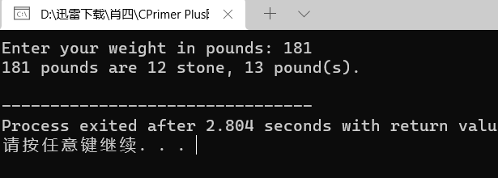

# 算法部分

[【模板】ST 表](https://www.luogu.com.cn/problem/P3865)

```cpp
#include <iostream>
#include <algorithm>
#include <cmath>
#include <vector>

using namespace std;

const int N = 1E5 + 100;

#define gc getchar
vector<vector<int>> f(N, vector<int>(30, 0));

int main() {
	int n, m;
	auto read = [&]() {
		int res = 0, f = 1;
		char ch = gc();
		while(!isdigit(ch)) f ^= ch == '-', ch = gc();
		while(isdigit(ch)) res = (res << 1) + (res << 3) + (ch ^ 48), ch = gc();
		return f? res: -res;
	};
	
	auto pre = [&]() {
		int t = log(n) / log(2) + 1;
		for(int j = 1; j < t; j ++)
			for(int i = 1; i <= n -(1 << j) + 1; i ++)
				f[i][j] = max(f[i][j-1], f[i + (1 << (j - 1))][j - 1]);
	};	
	
	auto query = [&](int l, int r){
		int k = log(r -l + 1) /log(2);
		return max(f[l][k], f[r - (1 <<k) + 1][k]);
	};
	
	n = read(), m = read();
	for(int i = 1; i <= n; i ++)
		f[i][0] = read();
	pre();
	while(m --) {
		int l = read(), r = read();
		printf("%d\n",query(l,r));
	}
}
```


# C ++ 部分

## 第3章

limits.cpp

```cpp
// limits.cpp -- some integer limits
#include <iostream>
#include <climits>              // use limits.h for older systems
int main()
{
    using namespace std;
    int n_int = INT_MAX;        // initialize n_int to max int value
    short n_short = SHRT_MAX;   // symbols defined in climits file
    long n_long = LONG_MAX;
	long long n_llong = LLONG_MAX;

    // sizeof operator yields size of type or of variable
    cout << "int is " << sizeof (int) << " bytes." << endl;
    cout << "short is " << sizeof n_short << " bytes." << endl;
    cout << "long is " << sizeof n_long << " bytes." << endl;
    cout << "long long is " << sizeof n_llong << " bytes." << endl;
    cout << endl;

    cout << "Maximum values:" << endl;
    cout << "int: " << n_int << endl;
    cout << "short: " << n_short << endl;
    cout << "long: " << n_long << endl;
    cout << "long long: " << n_llong << endl << endl;

    cout << "Minimum int value = " << INT_MIN << endl;
    cout << "Bits per byte = " << CHAR_BIT << endl;
	// cin.get();
    return 0;
}
```


exceed.cpp

```cpp
// exceed.cpp -- exceeding some integer limits
#include <iostream>
#define ZERO 0      // makes ZERO symbol for 0 value
#include <climits>  // defines INT_MAX as largest int value
int main()
{
    using namespace std;
    short sam = SHRT_MAX;     // initialize a variable to max value
    unsigned short sue = sam;// okay if variable sam already defined

    cout << "Sam has " << sam << " dollars and Sue has " << sue;
    cout << " dollars deposited." << endl
         << "Add $1 to each account." << endl << "Now ";
    sam = sam + 1;
    sue = sue + 1; 
    cout << "Sam has " << sam << " dollars and Sue has " << sue;
    cout << " dollars deposited.\nPoor Sam!" << endl;
    sam = ZERO;
    sue = ZERO;
    cout << "Sam has " << sam << " dollars and Sue has " << sue;
    cout << " dollars deposited." << endl;
    cout << "Take $1 from each account." << endl << "Now ";
    sam = sam - 1;
    sue = sue - 1;
    cout << "Sam has " << sam << " dollars and Sue has " << sue;
    cout << " dollars deposited." << endl << "Lucky Sue!" << endl;
	// cin.get();
    return 0; 
}
```


hexoct.cpp

```cpp
// hexoct1.cpp -- shows hex and octal literals
#include <iostream>
int main()
{
    using namespace std;
    int chest = 42;     // decimal integer literal
    int waist = 0x42;   // hexadecimal integer literal
    int inseam = 042;   // octal integer literal

    cout << "Monsieur cuts a striking figure!\n";
    cout << "chest = " << chest << " (42 in decimal)\n";
    cout << "waist = " << waist << " (0x42 in hex)\n";
    cout << "inseam = " << inseam << " (042 in octal)\n";
	// cin.get();
    return 0; 
}
```


hexoct2.cpp

```cpp
// hexoct2.cpp -- display values in hex and octal
#include <iostream>
using namespace std;
int main()
{
    using namespace std;
    int chest = 42;
    int waist = 42; 
    int inseam = 42;

    cout << "Monsieur cuts a striking figure!"  << endl;
    cout << "chest = " << chest << " (decimal for 42)" << endl;
    cout << hex;      // manipulator for changing number base
    cout << "waist = " << waist << " (hexadecimal for 42)" << endl;
    cout << oct;      // manipulator for changing number base
    cout << "inseam = " << inseam << " (octal for 42)" << endl;
    // cin.get();
    return 0; 
}
```


chartype.cpp

```cpp
// chartype.cpp -- the char type
#include <iostream>
int main( )
{
    using namespace std;
    char ch;        // declare a char variable

    cout << "Enter a character: " << endl;
    cin >> ch;
    cout << "Hola! ";
    cout << "Thank you for the " << ch << " character." << endl;
    // cin.get();
    // cin.get();
    return 0;
}
```


morechar.cpp

```cpp
// morechar.cpp -- the char type and int type contrasted
#include <iostream>
int main()
{
    using namespace std;
    char ch = 'M';       // assign ASCII code for M to ch
    int i = ch;          // store same code in an int
    cout << "The ASCII code for " << ch << " is " << i << endl;

    cout << "Add one to the character code:" << endl;
    ch = ch + 1;          // change character code in ch
    i = ch;               // save new character code in i
    cout << "The ASCII code for " << ch << " is " << i << endl;

    // using the cout.put() member function to display a char
    cout << "Displaying char ch using cout.put(ch): ";
    cout.put(ch);

    // using cout.put() to display a char constant
    cout.put('!');

    cout << endl << "Done" << endl;
	// cin.get();
    return 0;
}
```


bondini.cpp

```cpp
// bondini.cpp -- using escape sequences
#include <iostream>
int main()
{
    using namespace std;
    cout << "\aOperation \"HyperHype\" is now activated!\n";
    cout << "Enter your agent code:________\b\b\b\b\b\b\b\b";
    long code;
    cin >> code;
    cout << "\aYou entered " << code << "...\n";
    cout << "\aCode verified! Proceed with Plan Z3!\n";
    // cin.get();
    // cin.get();
    return 0; 
}
```


floatnum.cpp

```cpp
// floatnum.cpp -- floating-point types
#include <iostream>
int main()
{
    using namespace std; 
    cout.setf(ios_base::fixed, ios_base::floatfield); // fixed-point
    float tub = 10.0 / 3.0;     // good to about 6 places
    double mint = 10.0 / 3.0;   // good to about 15 places
    const float million = 1.0e6;

    cout << "tub = " << tub;
    cout << ", a million tubs = " << million * tub;
    cout << ",\nand ten million tubs = ";
    cout << 10 * million * tub << endl;

    cout << "mint = " << mint << " and a million mints = ";
    cout << million * mint << endl;
    // cin.get();
    return 0;
}
```


fltadd.cpp

```cpp
// fltadd.cpp -- precision problems with float
#include <iostream>
int main()
{
    using namespace std;
    float a = 2.34E+22f;
    float b = a + 1.0f;

    cout << "a = " << a << endl;
    cout << "b - a = " << b - a << endl;
    // cin.get();
    return 0; 
}
```


arith.cpp

```cpp
// arith.cpp -- some C++ arithmetic
#include <iostream>
int main()
{
    using namespace std;
    float hats, heads;

    cout.setf(ios_base::fixed, ios_base::floatfield); // fixed-point
    cout << "Enter a number: ";
    cin >> hats;
    cout << "Enter another number: ";
    cin >> heads;

    cout << "hats = " << hats << "; heads = " << heads << endl;
    cout << "hats + heads = " << hats + heads << endl;
    cout << "hats - heads = " << hats - heads << endl;
    cout << "hats * heads = " << hats * heads << endl;
    cout << "hats / heads = " << hats / heads << endl;
    // cin.get();
    // cin.get();
    return 0;
}
```


devide.cpp

```cpp
// divide.cpp -- integer and floating-point division
#include <iostream>
int main()
{
    using namespace std;
    cout.setf(ios_base::fixed, ios_base::floatfield);
    cout << "Integer division: 9/5 = " << 9 / 5  << endl;
    cout << "Floating-point division: 9.0/5.0 = ";
    cout << 9.0 / 5.0 << endl;
    cout << "Mixed division: 9.0/5 = " << 9.0 / 5  << endl;
    cout << "double constants: 1e7/9.0 = ";
    cout << 1.e7 / 9.0 <<  endl;
    cout << "float constants: 1e7f/9.0f = ";
    cout << 1.e7f / 9.0f <<  endl;
    // cin.get();
    return 0;
}
```


modules.cpp

```cpp
// modulus.cpp -- uses % operator to convert lbs to stone
#include <iostream>
int main()
{
    using namespace std;
    const int Lbs_per_stn = 14;
    int lbs;

    cout << "Enter your weight in pounds: ";
    cin >> lbs;
    int stone = lbs / Lbs_per_stn;      // whole stone
    int pounds = lbs % Lbs_per_stn;     // remainder in pounds
    cout << lbs << " pounds are " << stone
         << " stone, " << pounds << " pound(s).\n";
    // cin.get();
    // cin.get();
    return 0; 
}
```



assigned.cpp

```cpp
// assign.cpp -- type changes on assignment
#include <iostream>
int main()
{
    using namespace std;
    cout.setf(ios_base::fixed, ios_base::floatfield);
    float tree = 3;     // int converted to float
    int guess = 3.9832; // float converted to int
    int debt = 7.2E12;  // result not defined in C++
    cout << "tree = " << tree << endl;
    cout << "guess = " << guess << endl;
    cout << "debt = " << debt << endl;
    // cin.get();
    return 0;
}
```


typecast.cpp

```cpp
// typecast.cpp -- forcing type changes
#include <iostream>
int main()
{
    using namespace std;
    int auks, bats, coots;

    // the following statement adds the values as double,
    // then converts the result to int
    auks = 19.99 + 11.99;

    // these statements add values as int
    bats = (int) 19.99 + (int) 11.99;   // old C syntax
    coots = int (19.99) + int (11.99);  // new C++ syntax
    cout << "auks = " << auks << ", bats = " << bats;
    cout << ", coots = " << coots << endl;

    char ch = 'Z';
    cout << "The code for " << ch << " is ";    // print as char
    cout << int(ch) << endl;                    // print as int
    cout << "Yes, the code is ";
    cout << static_cast<int>(ch) << endl;       // using static_cast
   // cin.get();
    return 0; 
}
```


## 第4章 复合类型

arrayone.cpp

```cpp
// arrayone.cpp -- small arrays of integers
#include <iostream>
int main()
{
    using namespace std;
    int yams[3];    // creates array with three elements
    yams[0] = 7;    // assign value to first element
    yams[1] = 8;
    yams[2] = 6;

    int yamcosts[3] = {20, 30, 5}; // create, initialize array
// NOTE: If your C++ compiler or translator can't initialize
// this array, use static int yamcosts[3] instead of
// int yamcosts[3]

    cout << "Total yams = ";
    cout << yams[0] + yams[1] + yams[2] << endl;
    cout << "The package with " << yams[1] << " yams costs ";
    cout << yamcosts[1] << " cents per yam.\n";
    int total = yams[0] * yamcosts[0] + yams[1] * yamcosts[1];
    total = total + yams[2] * yamcosts[2];
    cout << "The total yam expense is " << total << " cents.\n";

    cout << "\nSize of yams array = " << sizeof yams;
    cout << " bytes.\n";
    cout << "Size of one element = " << sizeof yams[0];
    cout << " bytes.\n";
    // cin.get();
    return 0; 
}
```


strings.cpp

```cpp
// strings.cpp -- storing strings in an array
#include <iostream>
#include <cstring>  // for the strlen() function
int main()
{
    using namespace std;
    const int Size = 15;
    char name1[Size];               // empty array
    char name2[Size] = "C++owboy";  // initialized array
    // NOTE: some implementations may require the static keyword
    // to initialize the array name2

    cout << "Howdy! I'm " << name2;
    cout << "! What's your name?\n";
    cin >> name1;
    cout << "Well, " << name1 << ", your name has ";
    cout << strlen(name1) << " letters and is stored\n";
    cout << "in an array of " << sizeof(name1) << " bytes.\n";
    cout << "Your initial is " << name1[0] << ".\n";
    name2[3] = '\0';                // set to null character
    cout << "Here are the first 3 characters of my name: ";
    cout << name2 << endl;
    // cin.get();
    // cin.get();
    return 0;
}
```


instr1.cpp

```cpp
// instr1.cpp -- reading more than one string
#include <iostream>
int main()
{
    using namespace std;
    const int ArSize = 20;
    char name[ArSize];
    char dessert[ArSize];

    cout << "Enter your name:\n";
    cin >> name;
    cout << "Enter your favorite dessert:\n";
    cin >> dessert;
    cout << "I have some delicious " << dessert;
    cout << " for you, " << name << ".\n";
    // cin.get();
	// cin.get();
    return 0; 
}
```


instr2.cpp

```cpp
// instr2.cpp -- reading more than one word with getline
#include <iostream>
int main()
{
    using namespace std;
    const int ArSize = 20;
    char name[ArSize];
    char dessert[ArSize];

    cout << "Enter your name:\n";
    cin.getline(name, ArSize);  // reads through newline
    cout << "Enter your favorite dessert:\n";
    cin.getline(dessert, ArSize);
    cout << "I have some delicious " << dessert;
    cout << " for you, " << name << ".\n";
    // cin.get();
    return 0; 
}
```


instr3.cpp

```cpp
// instr3.cpp -- reading more than one word with get() & get()
#include <iostream>
int main()
{
    using namespace std;
    const int ArSize = 20;
    char name[ArSize];
    char dessert[ArSize];

    cout << "Enter your name:\n";
    cin.get(name, ArSize).get();    // read string, newline
    cout << "Enter your favorite dessert:\n";
    cin.get(dessert, ArSize).get();
    cout << "I have some delicious " << dessert;
    cout << " for you, " << name << ".\n";
    // cin.get();
    return 0; 
}
```


numstr.cpp

```cpp
// numstr.cpp -- following number input with line input
#include <iostream>
int main()
{
    using namespace std;
    cout << "What year was your house built?\n";
    int year;
    cin >> year;
    // cin.get();
    cout << "What is its street address?\n";
    char address[80];
    cin.getline(address, 80);
    cout << "Year built: " << year << endl;
    cout << "Address: " << address << endl;
    cout << "Done!\n";
    // cin.get();
    return 0; 
}
```


strtype1.cpp

``` cpp
// strtype1.cpp -- using the C++ string class
#include <iostream>
#include <string>               // make string class available
int main()
{
    using namespace std;
    char charr1[20];            // create an empty array
    char charr2[20] = "jaguar"; // create an initialized array
    string str1;                // create an empty string object
    string str2 = "panther";    // create an initialized string

    cout << "Enter a kind of feline: ";
    cin >> charr1;
    cout << "Enter another kind of feline: ";
    cin >> str1;                // use cin for input
    cout << "Here are some felines:\n";
    cout << charr1 << " " << charr2 << " "
         << str1 << " " << str2 // use cout for output
         << endl;
    cout << "The third letter in " << charr2 << " is "
         << charr2[2] << endl;
    cout << "The third letter in " << str2 << " is "
         << str2[2] << endl;    // use array notation
    // cin.get();
	// cin.get();

    return 0; 
}
```


strtype.cpp

```cpp
// strtype2.cpp ? assigning, adding, and appending
#include <iostream>
#include <string>               // make string class available
int main()
{
    using namespace std;
    string s1 = "penguin";
    string s2, s3;

    cout << "You can assign one string object to another: s2 = s1\n";
    s2 = s1;
    cout << "s1: " << s1 << ", s2: " << s2 << endl;
    cout << "You can assign a C-style string to a string object.\n";
    cout << "s2 = \"buzzard\"\n";
    s2 = "buzzard";
    cout << "s2: " << s2 << endl;
    cout << "You can concatenate strings: s3 = s1 + s2\n";
    s3 = s1 + s2;
    cout << "s3: " << s3 << endl;
    cout << "You can append strings.\n";
    s1 += s2;
    cout <<"s1 += s2 yields s1 = " << s1 << endl;
    s2 += " for a day";
    cout <<"s2 += \" for a day\" yields s2 = " << s2 << endl;

    //cin.get();
    return 0; 
}
```


strtype3.cpp

```cpp
// strtype3.cpp -- more string class features
#include <iostream>
#include <string>               // make string class available
#include <cstring>              // C-style string library
int main()
{
    using namespace std;
    char charr1[20]; 
    char charr2[20] = "jaguar"; 
    string str1;  
    string str2 = "panther";

    // assignment for string objects and character arrays
    str1 = str2;                // copy str2 to str1
    strcpy(charr1, charr2);     // copy charr2 to charr1
 
    // appending for string objects and character arrays
    str1 += " paste";           // add paste to end of str1
    strcat(charr1, " juice");   // add juice to end of charr1

    // finding the length of a string object and a C-style string
    int len1 = str1.size();     // obtain length of str1
    int len2 = strlen(charr1);  // obtain length of charr1
 
    cout << "The string " << str1 << " contains "
         << len1 << " characters.\n";
    cout << "The string " << charr1 << " contains "
         << len2 << " characters.\n";
    // cin.get();

    return 0; 
}
```


strtype4.cpp

```cpp
// strtype4.cpp -- line input
#include <iostream>
#include <string>               // make string class available
#include <cstring>              // C-style string library
int main()
{
    using namespace std;
    char charr[20]; 
    string str;

    cout << "Length of string in charr before input: " 
         << strlen(charr) << endl;
    cout << "Length of string in str before input: "
         << str.size() << endl;
    cout << "Enter a line of text:\n";
    cin.getline(charr, 20);     // indicate maximum length
    cout << "You entered: " << charr << endl;
    cout << "Enter another line of text:\n";
    getline(cin, str);          // cin now an argument; no length specifier
    cout << "You entered: " << str << endl;
    cout << "Length of string in charr after input: " 
         << strlen(charr) << endl;
    cout << "Length of string in str after input: "
         << str.size() << endl;
    // cin.get();

    return 0; 
}
```


assgn_st.cpp

```cpp
// assgn_st.cpp -- assigning structures
#include <iostream>
struct inflatable
{
    char name[20];
    float volume;
    double price;
};
int main()
{
    using namespace std;
    inflatable bouquet =
    {
        "sunflowers",
        0.20,
        12.49
    };
    inflatable choice;
    cout << "bouquet: " << bouquet.name << " for $";
    cout << bouquet.price << endl;

    choice = bouquet;  // assign one structure to another
    cout << "choice: " << choice.name << " for $";
    cout << choice.price << endl;
    // cin.get();
    return 0; 
}
```


arrstruct.cpp

```cpp
// arrstruc.cpp -- an array of structures
#include <iostream>
struct inflatable
{
    char name[20];
    float volume;
    double price;
};
int main()
{
    using namespace std;
    inflatable guests[2] =          // initializing an array of structs
    {
        {"Bambi", 0.5, 21.99},      // first structure in array
        {"Godzilla", 2000, 565.99}  // next structure in array
    };

    cout << "The guests " << guests[0].name << " and " << guests[1].name
         << "\nhave a combined volume of "
         << guests[0].volume + guests[1].volume << " cubic feet.\n";
    // cin.get();
    return 0; 
}
```


pointer.cpp

```cpp
// pointer.cpp -- our first pointer variable
#include <iostream>
int main()
{
    using namespace std;
    int updates = 6;        // declare a variable
    int * p_updates;        // declare pointer to an int

    p_updates = &updates;   // assign address of int to pointer

// express values two ways
    cout << "Values: updates = " << updates;
    cout << ", *p_updates = " << *p_updates << endl;

// express address two ways
    cout << "Addresses: &updates = " << &updates;
    cout << ", p_updates = " << p_updates << endl;

// use pointer to change value
    *p_updates = *p_updates + 1;
    cout << "Now updates = " << updates << endl;
    // cin.get();
    return 0; 
}
```


init_ptr.cpp

```cpp
// init_ptr.cpp -- initialize a pointer
#include <iostream>
int main()
{
    using namespace std;
    int higgens = 5;
    int * pt = &higgens;

    cout << "Value of higgens = " << higgens
         << "; Address of higgens = " << &higgens << endl;
    cout << "Value of *pt = " << *pt
         << "; Value of pt = " << pt << endl;
    // cin.get();
    return 0; 
}
```


use_new.cpp

```cpp
// use_new.cpp -- using the new operator
#include <iostream>
int main()
{
    using namespace std;
    int nights = 1001;
    int * pt = new int;         // allocate space for an int
    *pt = 1001;                 // store a value there

    cout << "nights value = ";
    cout << nights << ": location " << &nights << endl;
    cout << "int ";
    cout << "value = " << *pt << ": location = " << pt << endl;

    double * pd = new double;   // allocate space for a double
    *pd = 10000001.0;           // store a double there

    cout << "double ";
    cout << "value = " << *pd << ": location = " << pd << endl;
    cout << "location of pointer pd: " << &pd << endl;
    cout << "size of pt = " << sizeof(pt);
    cout << ": size of *pt = " << sizeof(*pt) << endl;
    cout << "size of pd = " << sizeof pd;
    cout << ": size of *pd = " << sizeof(*pd) << endl;
    // cin.get();
    return 0;
}
```


arraynew.cpp

```cpp
// arraynew.cpp -- using the new operator for arrays
#include <iostream>
int main()
{
    using namespace std;
    double * p3 = new double [3]; // space for 3 doubles
    p3[0] = 0.2;                  // treat p3 like an array name
    p3[1] = 0.5;
    p3[2] = 0.8;
    cout << "p3[1] is " << p3[1] << ".\n";
    p3 = p3 + 1;                  // increment the pointer
    cout << "Now p3[0] is " << p3[0] << " and ";
    cout << "p3[1] is " << p3[1] << ".\n";
    p3 = p3 - 1;                  // point back to beginning
    delete [] p3;                 // free the memory
    // cin.get();
    return 0; 
}
```


addpntrs.cpp

```cpp
// addpntrs.cpp -- pointer addition
#include <iostream>
int main()
{
    using namespace std;
    double wages[3] = {10000.0, 20000.0, 30000.0};
    short stacks[3] = {3, 2, 1};

// Here are two ways to get the address of an array
    double * pw = wages;     // name of an array = address
    short * ps = &stacks[0]; // or use address operator
// with array element
    cout << "pw = " << pw << ", *pw = " << *pw << endl;
    pw = pw + 1;
    cout << "add 1 to the pw pointer:\n";
    cout << "pw = " << pw << ", *pw = " << *pw << "\n\n";

    cout << "ps = " << ps << ", *ps = " << *ps << endl;
    ps = ps + 1;
    cout << "add 1 to the ps pointer:\n";
    cout << "ps = " << ps << ", *ps = " << *ps << "\n\n";

    cout << "access two elements with array notation\n";
    cout << "stacks[0] = " << stacks[0] 
         << ", stacks[1] = " << stacks[1] << endl;
    cout << "access two elements with pointer notation\n";
    cout << "*stacks = " << *stacks
         << ", *(stacks + 1) =  " << *(stacks + 1) << endl;

    cout << sizeof(wages) << " = size of wages array\n";
    cout << sizeof(pw) << " = size of pw pointer\n";
    // cin.get();
    return 0; 
}
```


  

ptrstr.cpp

```cpp
// ptrstr.cpp -- using pointers to strings
#include <iostream>
#include <cstring>              // declare strlen(), strcpy()
int main()
{
    using namespace std;
    char animal[20] = "bear";   // animal holds bear
    const char * bird = "wren"; // bird holds address of string
    char * ps;                  // uninitialized

    cout << animal << " and ";  // display bear
    cout << bird << "\n";       // display wren
    // cout << ps << "\n";      //may display garbage, may cause a crash

    cout << "Enter a kind of animal: ";
    cin >> animal;              // ok if input < 20 chars
    // cin >> ps; Too horrible a blunder to try; ps doesn't
    //            point to allocated space

    ps = animal;                // set ps to point to string
    cout << ps << "!\n";       // ok, same as using animal
    cout << "Before using strcpy():\n";
    cout << animal << " at " << (int *) animal << endl;
    cout << ps << " at " << (int *) ps << endl;

    ps = new char[strlen(animal) + 1];  // get new storage
    strcpy(ps, animal);         // copy string to new storage
    cout << "After using strcpy():\n";
    cout << animal << " at " << (int *) animal << endl;
    cout << ps << " at " << (int *) ps << endl;
    delete [] ps;
    // cin.get();
    // cin.get();
    return 0; 
}
```

 

newstrct.cpp

```cpp
// newstrct.cpp -- using new with a structure
#include <iostream>
struct inflatable   // structure definition
{
    char name[20];
    float volume;
    double price;
};
int main()
{
    using namespace std;
    inflatable * ps = new inflatable; // allot memory for structure
    cout << "Enter name of inflatable item: ";
    cin.get(ps->name, 20);            // method 1 for member access
    cout << "Enter volume in cubic feet: ";
    cin >> (*ps).volume;              // method 2 for member access
    cout << "Enter price: $";
    cin >> ps->price;
    cout << "Name: " << (*ps).name << endl;              // method 2
    cout << "Volume: " << ps->volume << " cubic feet\n"; // method 1
    cout << "Price: $" << ps->price << endl;             // method 1
    delete ps;                        // free memory used by structure
    // cin.get();
    // cin.get();
    return 0; 
}
```


delete.cpp

```cpp
// delete.cpp -- using the delete operator
#include <iostream>
#include <cstring>      // or string.h
using namespace std;
char * getname(void);   // function prototype
int main()
{
    char * name;        // create pointer but no storage

    name = getname();   // assign address of string to name
    cout << name << " at " << (int *) name << "\n";
    delete [] name;     // memory freed

    name = getname();   // reuse freed memory
    cout << name << " at " << (int *) name << "\n";
    delete [] name;     // memory freed again
    // cin.get();
    // cin.get();
    return 0;
}

char * getname()        // return pointer to new string
{
    char temp[80];      // temporary storage
    cout << "Enter last name: ";
    cin >> temp;
    char * pn = new char[strlen(temp) + 1];
    strcpy(pn, temp);   // copy string into smaller space

    return pn;          // temp lost when function ends
}
```


mixtypes.cpp

```cpp
// mixtypes.cpp --some type combinations
#include <iostream>

struct antarctica_years_end
{
    int year;
 /* some really interesting data, etc. */
};

int main()
{
    antarctica_years_end s01, s02, s03; 
    s01.year = 1998;
    antarctica_years_end * pa = &s02;
    pa->year = 1999;
    antarctica_years_end trio[3]; // array of 3 structures
    trio[0].year = 2003;
    std::cout << trio->year << std::endl;
    const antarctica_years_end * arp[3] = {&s01, &s02, &s03};
    std::cout << arp[1]->year << std::endl;
    const antarctica_years_end ** ppa = arp; 
    auto ppb = arp; // C++0x automatic type deduction
// or else use const antarctica_years_end ** ppb = arp; 
    std::cout << (*ppa)->year << std::endl;
    std::cout << (*(ppb+1))->year << std::endl;
    // std::cin.get();
    return 0;
}
```


choice.cpp

```cpp
// choices.cpp -- array variations
#include <iostream>
#include <vector>   // STL C++98
#include <array>    // C++0x
int main()
{
    using namespace std;
// C, original C++
    double a1[4] = {1.2, 2.4, 3.6, 4.8};
// C++98 STL
    vector<double> a2(4);   // create vector with 4 elements
// no simple way to initialize in C98
    a2[0] = 1.0/3.0;
    a2[1] = 1.0/5.0;
    a2[2] = 1.0/7.0;
    a2[3] = 1.0/9.0;
// C++0x -- create and initialize array object
    array<double, 4> a3 = {3.14, 2.72, 1.62, 1.41};  
    array<double, 4> a4;
    a4 = a3;     // valid for array objects of same size
// use array notation
    cout << "a1[2]: " << a1[2] << " at " << &a1[2] << endl;
    cout << "a2[2]: " << a2[2] << " at " << &a2[2] << endl;
    cout << "a3[2]: " << a3[2] << " at " << &a3[2] << endl;
    cout << "a4[2]: " << a4[2] << " at " << &a4[2] << endl;
// misdeed
    a1[-2] = 20.2;
    cout << "a1[-2]: " << a1[-2] <<" at " << &a1[-2] << endl;
    cout << "a3[2]: " << a3[2] << " at " << &a3[2] << endl;
    cout << "a4[2]: " << a4[2] << " at " << &a4[2] << endl;
    //  cin.get();
    return 0;
}
```


## 第5章  循环和关系表达式

forloop.cpp

```cpp
// forloop.cpp -- introducing the for loop
#include <iostream>
int main()
{
    using namespace std;
    int i;  // create a counter
//   initialize; test ; update
    for (i = 0; i < 5; i++)
        cout << "C++ knows loops.\n";
    cout << "C++ knows when to stop.\n";
    // cin.get();
    return 0;
}
```


num_test.cpp

```cpp
// num_test.cpp -- use numeric test in for loop
#include <iostream>
int main()
{
    using namespace std;
    cout << "Enter the starting countdown value: ";
    int limit;
    cin >> limit;
    int i;
    for (i = limit; i; i--)     // quits when i is 0
        cout << "i = " << i << "\n";
    cout << "Done now that i = " << i << "\n";
    // cin.get();
    // cin.get();
    return 0;
}
```


express.cpp

```cpp
// express.cpp -- values of expressions
#include <iostream>
int main()
{
    using namespace std;
    int x;

    cout << "The expression x = 100 has the value ";
    cout << (x = 100) << endl;
    cout << "Now x = " << x << endl;
    cout << "The expression x < 3 has the value ";
    cout << (x < 3) << endl;
    cout << "The expression x > 3 has the value ";
    cout << (x > 3) << endl;
    cout.setf(ios_base::boolalpha);   //a newer C++ feature
    cout << "The expression x < 3 has the value ";
    cout << (x < 3) << endl;
    cout << "The expression x > 3 has the value ";
    cout << (x > 3) << endl;
    /// cin.get();
    return 0; 
}
```


formore.cpp

```cpp
// formore.cpp -- more looping with for
#include <iostream>
const int ArSize = 16;      // example of external declaration
int main()
{
    long long factorials[ArSize];
    factorials[1] = factorials[0] = 1LL;
    for (int i = 2; i < ArSize; i++)
        factorials[i] = i * factorials[i-1];
    for (int i = 0; i < ArSize; i++)
        std::cout << i << "! = " << factorials[i] << std::endl;
	// std::cin.get();
    return 0;
}
```


bigstep.cpp

```cpp
// bigstep.cpp -- count as directed
#include <iostream>
int main()
{
	using std::cout;    // a using declaration
    using std::cin;
    using std::endl;;
    cout << "Enter an integer: ";
    int by;
    cin >> by;
    cout << "Counting by " << by << "s:\n";
    for (int i = 0; i < 100; i = i + by)
        cout << i << endl;
    // cin.get();
    // cin.get();
    return 0;
}
```

forstr1.cpp

```cpp
// forstr1.cpp -- using for with a string
#include <iostream>
#include <string>
int main()
{
    using namespace std;
    cout << "Enter a word: ";
    string word;
    cin >> word;

    // display letters in reverse order
    for (int i = word.size() - 1; i >= 0; i--)
        cout << word[i];
    cout << "\nBye.\n";
    // cin.get();
    // cin.get();
    return 0; 
}
```


plus_one.cpp

```cpp
// plus_one.cpp -- the increment operator
#include <iostream>
int main()
{
    using std::cout;
    int a = 20;
    int b = 20;

    cout << "a   = " << a << ":   b = " << b << "\n";
    cout << "a++ = " << a++ << ": ++b = " << ++b << "\n";
    cout << "a   = " << a << ":   b = " << b << "\n";
    // std::cin.get();
	return 0;
}
```


block.cpp

```cpp
// block.cpp -- use a block statement
#include <iostream>
int main()
{
    using namespace std;
    cout << "The Amazing Accounto will sum and average ";
    cout << "five numbers for you.\n";
    cout << "Please enter five values:\n";
    double number;
    double sum = 0.0;
    for (int i = 1; i <= 5; i++)
    {                                   // block starts here
        cout << "Value " << i << ": ";
        cin >> number;
        sum += number;
    }                                   // block ends here
    cout << "Five exquisite choices indeed! ";
    cout << "They sum to " << sum << endl;
    cout << "and average to " << sum / 5 << ".\n";
    cout << "The Amazing Accounto bids you adieu!\n";
    // cin.get();
    // cin.get();
    return 0; 
}
```


forstr2.cpp

```cpp
// forstr2.cpp -- reversing an array
#include <iostream>
#include <string>
int main()
{
    using namespace std;
    cout << "Enter a word: ";
    string word;
    cin >> word;

    // physically modify string object
    char temp;
    int i, j;
    for (j = 0, i = word.size() - 1; j < i; --i, ++j)
    {                       // start block
        temp = word[i];
        word[i] = word[j];
        word[j] = temp;
    }                       // end block
    cout << word << "\nDone\n";
    // cin.get();
    // cin.get();
    return 0; 
}
```


equalc.pp

```cpp
// equal.cpp -- equality vs assignment
#include <iostream>
int main()
{
    using namespace std;
    int quizscores[10] =
        { 20, 20, 20, 20, 20, 19, 20, 18, 20, 20};

    cout << "Doing it right:\n";
    int i;
    for (i = 0; quizscores[i] == 20; i++)
        cout << "quiz " << i << " is a 20\n";
// Warning: you may prefer reading about this program
// to actually running it.
    cout << "Doing it dangerously wrong:\n";
    for (i = 0; quizscores[i] = 20; i++)
        cout << "quiz " << i << " is a 20\n";
	// cin.get();
    return 0;
}
```

