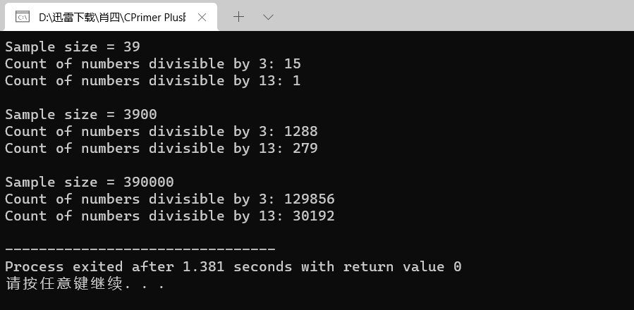

# 算法部分

[【模板】线段树 1](https://www.luogu.com.cn/problem/P3372)

```cpp
#include <iostream>
#include <vector>

using namespace std;

#define lc (p << 1)
#define rc (p << 1 | 1)
#define mid ((t[p].l + t[p].r) >> 1)

const int N = 1e5 + 100;

using i64 = long long;

struct Segment{
	int l, r;
	i64 dat, lz;
};

vector<Segment> t(N << 2);
vector<int> a(N);

auto pushup = [](int p) {
	t[p].dat = t[lc].dat + t[rc].dat;
};

auto build = [](auto self, int p, int l, int r) -> void {
	t[p].l = l, t[p].r = r;
	if(l == r) {
		t[p].dat = a[l];
		return;
	}
	self(self, lc, l, mid);
	self(self, rc, mid + 1, r);
	pushup(p);
};

auto spread = [](int p) -> void{
	if(t[p].lz == 0) return;
	t[lc].dat += (t[lc].r - t[lc].l + 1) * t[p].lz;
	t[rc].dat += (t[rc].r - t[rc].l + 1) * t[p].lz;
	t[lc].lz += t[p].lz;
	t[rc].lz += t[p].lz;
	t[p].lz = 0;
};

auto update = [](auto self, int p, int l, int r, int val) {
	if(l <= t[p].l && t[p].r <= r) {
		t[p].dat += (t[p].r - t[p].l + 1) * val;
		t[p].lz += val;
		return; 
	}
	spread(p);
	if(l <= mid) self(self, lc, l, r, val);
	if(r > mid) self(self, rc, l, r, val);
	pushup(p);
};

auto query = [](auto self, int p, int l, int r) {
	if(l <= t[p].l && t[p].r <= r) {
		return t[p].dat;
	}
	spread(p);
	i64 val = 0;
	if(l <= mid) val += self(self, lc, l, r);
	if(r > mid) val += self(self, rc, l, r);
	return val;
};

int main() {
	int n, m;
	cin >> n >> m;
	for(int i = 1; i <= n; i ++)
		cin >> a[i];
	build(build, 1, 1, n);
	while(m --) {
		int op, x, y, k;
		cin >> op >> x >> y;
		if(op == 1) {
			cin >> k;
			update(update, 1, x, y, k); 
		} 
		else cout << query(query, 1, x, y) << endl;
	} 
	return 0;
}
```

Go 版本

```go
package main

import (
	"bufio"
	"fmt"
	"os"
)

const (
	N int = 1e5 + 100
)

type Segment struct {
	l, r    int
	dat, lz int
}

var (
	a [N]int
	t [N << 2]Segment
)

func get(p int) (int, int, int) {
	return p << 1, p<<1 | 1, (t[p].l + t[p].r) >> 1
}

func pushup(p int) {
	lc, rc, _ := get(p)
	t[p].dat = t[lc].dat + t[rc].dat
}

func build(p, l, r int) {
	t[p].l = l
	t[p].r = r
	if l == r {
		t[p].dat = a[l]
		return
	}
	lc, rc, mid := get(p)
	build(lc, l, mid)
	build(rc, mid+1, r)
	pushup(p)
}

func spread(p int) {
	if t[p].lz == 0 {
		return
	}
	lc, rc, _ := get(p)
	t[lc].dat += (t[lc].r - t[lc].l + 1) * t[p].lz
	t[rc].dat += (t[rc].r - t[rc].l + 1) * t[p].lz
	t[lc].lz += t[p].lz
	t[rc].lz += t[p].lz
	t[p].lz = 0
}

func update(p, l, r, val int) {
	if l <= t[p].l && t[p].r <= r {
		t[p].dat += (t[p].r - t[p].l + 1) * val
		t[p].lz += val
		return
	}
	spread(p)
	lc, rc, mid := get(p)
	if l <= mid {
		update(lc, l, r, val)
	}
	if r > mid {
		update(rc, l, r, val)
	}
	pushup(p)
}

func query(p, l, r int) int {
	if l <= t[p].l && t[p].r <= r {
		return t[p].dat
	}
	spread(p)
	val := 0
	lc, rc, mid := get(p)
	if l <= mid {
		val += query(lc, l, r)
	}
	if r > mid {
		val += query(rc, l, r)
	}
	return val
}

func main() {
	in := bufio.NewReader(os.Stdin)
	out := bufio.NewWriter(os.Stdout)
	defer out.Flush()
	var n, m int
	fmt.Fscan(in, &n, &m)

	for i := 1; i <= n; i++ {
		fmt.Fscan(in, &a[i])
	}
	build(1, 1, n)
	for ; m > 0; m-- {
		var op, x, y, k int
		fmt.Fscan(in, &op, &x, &y)
		if op == 1 {
			fmt.Fscan(in, &k)
			update(1, x, y, k)
		} else {
			fmt.Fprintln(out, query(1, x, y))
		}

	}
}
```

Java 版本

```java


import java.io.*;


/**
 * @ClassName Main
 * @Description TODD
 * @Autor LXH
 * @Date 2022/6/10 22:30
 */
public class Main {
    // StreamTokenizer类接受一个输入流并将其解析为“令牌”，允许每次读取一个令牌, 解析过程由一个表和许多可以设置为各种状态的标志控制。
    static StreamTokenizer cin = new StreamTokenizer(new BufferedReader(new InputStreamReader(System.in)));
    // 加速输出 将格式化的对象表示形式打印到文本输出流。这个类实现了在PrintStream中找到的所有打印方法。
    // 它不包含用于写入原始字节的方法，对于这种方法，程序应该使用未编码的字节流。
    static PrintWriter out = new PrintWriter(new OutputStreamWriter(System.out));

    final static int N = (int) (1e5 + 100);

    static int a[] = new int[N];

    static  class Segment{
        int l, r;
        long dat, lz;
    };

    static Segment t[] = new Segment[N << 2];

    static void pushup(int p) {
        int lc = p << 1;
        int rc = p << 1 | 1;
        t[p].dat = t[lc].dat + t[rc].dat;
    }

    static  void build(int p, int l, int r) {
        t[p]=new Segment();
        t[p].l = l;
        t[p].r = r;
      //  System.out.println(l + " " + r + " " + p );
        if (l == r) {
            t[p].dat = a[l];
            return;
        }
        int lc = p << 1;
        int rc = p << 1 | 1;
        int mid = (t[p].l + t[p].r) >> 1;

        build(lc, l, mid);
        build(rc, mid + 1, r);
        pushup(p);
    }

    static void spread(int p) {
        if (t[p].lz == 0) {
            return;
        }
        int lc = p << 1;
        int rc = p << 1 | 1;
        t[lc].dat += (t[lc].r - t[lc].l + 1) * t[p].lz;
        t[rc].dat += (t[rc].r - t[rc].l + 1) * t[p].lz;
        t[lc].lz += t[p].lz;
        t[rc].lz += t[p].lz;
        t[p].lz = 0;

    }

    static  void  update(int p, int l, int r, int val) {
        if (l <= t[p].l && t[p].r <= r) {
            t[p].dat += (t[p].r - t[p].l + 1) * val;
            t[p].lz += val;
            return;
        }
        spread(p);
        int lc = p << 1;
        int rc = p << 1 | 1;
        int mid = (t[p].l + t[p].r) >> 1;
        if (l <= mid) {
            update(lc, l, r, val);
        }
        if (r > mid) {
            update(rc, l, r, val);
        }
        pushup(p);
    }

    static long query(int p, int l, int r) {
        if (l <= t[p].l && t[p].r <= r) {
            return t[p].dat;
        }
        spread(p);
        long val = 0;
        int lc = p << 1;
        int rc = p << 1 | 1;
        int mid = (t[p].l + t[p].r) >> 1;

        if (l <= mid) {val += query(lc, l, r);}
        if (r > mid) {val += query(rc, l, r); }
        return val;
    }

    public static void main(String[] args) throws IOException {
        cin.nextToken(); int n=(int)cin.nval;
        cin.nextToken(); int m=(int)cin.nval;

        for(int i = 1; i <= n; i ++) {
            cin.nextToken(); a[i]=(int)cin.nval;
        }
        build(1, 1, n);

        for(; m > 0; m --) {
            cin.nextToken(); int op =(int)cin.nval;
            cin.nextToken(); int x =(int)cin.nval;
            cin.nextToken(); int y = (int)cin.nval;

            if (op == 1) {
                cin.nextToken(); int k = (int)cin.nval;
                update(1, x, y, k);
            } else {
                out.println(query(1, x, y));
            }
        }
        out.flush();
    }
}

```


# C++ 部分

## 第18章 C++ 新标准

**右值引用**

rvref.cpp

```cpp
// rvref.cpp -- simple uses of rvalue references
#include <iostream>

inline double f(double tf) {return 5.0*(tf-32.0)/9.0;};
int main()
{
    using namespace std;
    double tc = 21.5;
    double && rd1 = 7.07;
    double && rd2 = 1.8 * tc + 32.0;
    double && rd3 = f(rd2);
    cout << " tc value and address: " << tc <<", " << &tc << endl;
    cout << "rd1 value and address: " << rd1 <<", " << &rd1 << endl;
    cout << "rd2 value and address: " << rd2 <<", " << &rd2 << endl;
    cout << "rd3 value and address: " << rd3 <<", " << &rd3 << endl;
    // cin.get();
    return 0;
}
```


**移动语义**

useless.cpp

```cpp
// useless.cpp -- an otherwise useless class with move semantics
#include <iostream>
using namespace std;

// interface
class Useless
{
private:
    int n;          // number of elements
    char * pc;      // pointer to data
    static int ct;  // number of objects
    void ShowObject() const;
public:
    Useless();
    explicit Useless(int k);
    Useless(int k, char ch);
    Useless(const Useless & f); // regular copy constructor
    Useless(Useless && f);      // move constructor
    ~Useless();
    Useless operator+(const Useless & f)const;
// need operator=() in copy and move versions
    void ShowData() const;
};

// implementation
int Useless::ct = 0;

Useless::Useless()
{
    ++ct;
    n = 0;
    pc = nullptr;
    cout << "default constructor called; number of objects: " << ct << endl;
    ShowObject();
}

Useless::Useless(int k) : n(k)
{
    ++ct; 
    cout << "int constructor called; number of objects: " << ct << endl;
    pc = new char[n];
    ShowObject();
}

Useless::Useless(int k, char ch) : n(k)
{
    ++ct;
    cout << "int, char constructor called; number of objects: " << ct << endl;
    pc = new char[n];
    for (int i = 0; i < n; i++)
        pc[i] = ch;
    ShowObject();
}

Useless::Useless(const Useless & f): n(f.n) 
{
    ++ct;
    cout << "copy const called; number of objects: " << ct << endl;
    pc = new char[n];
    for (int i = 0; i < n; i++)
        pc[i] = f.pc[i];
    ShowObject();
}

Useless::Useless(Useless && f): n(f.n) 
{
    ++ct;
    cout << "move constructor called; number of objects: " << ct << endl;
    pc = f.pc;       // steal address
    f.pc = nullptr;  // give old object nothing in return
    f.n = 0;
    ShowObject();
}

Useless::~Useless()
{
    cout << "destructor called; objects left: " << --ct << endl;
    cout << "deleted object:\n";
    ShowObject();
    delete [] pc;
}

Useless Useless::operator+(const Useless & f)const
{
    cout << "Entering operator+()\n";
    Useless temp = Useless(n + f.n);
    for (int i = 0; i < n; i++)
        temp.pc[i] = pc[i];
    for (int i = n; i < temp.n; i++)
        temp.pc[i] = f.pc[i - n];
    cout << "temp object:\n";
    cout << "Leaving operator+()\n";
    return temp;
}

void Useless::ShowObject() const
{ 
    cout << "Number of elements: " << n;
    cout << " Data address: " << (void *) pc << endl;
}

void Useless::ShowData() const
{
    if (n == 0)
        cout << "(object empty)";
    else
        for (int i = 0; i < n; i++)
            cout << pc[i];
    cout << endl;
}

// application
int main()
{
    {
        Useless one(10, 'x');
        Useless two = one;          // calls copy constructor
        Useless three(20, 'o');
        Useless four(one + three);  // calls operator+(), move constructor
        cout << "object one: ";
        one.ShowData();
        cout << "object two: ";
        two.ShowData();
        cout << "object three: ";
        three.ShowData();
        cout << "object four: ";
        four.ShowData();
    }
    // cin.get();
}
```


stdmove.cpp

```cpp
// stdmove.cpp -- using std::move()
#include <iostream>
#include <utility>
// use the following for g++4.5
// #define nullptr 0
// interface
class Useless
{
private:
    int n;          // number of elements
    char * pc;      // pointer to data
    static int ct;  // number of objects
    void ShowObject() const;
public:
    Useless();
    explicit Useless(int k);
    Useless(int k, char ch);
    Useless(const Useless & f); // regular copy constructor
    Useless(Useless && f);      // move constructor
    ~Useless();
    Useless operator+(const Useless & f)const;
    Useless & operator=(const Useless & f); // copy assignment
    Useless & operator=(Useless && f);      // move assignment 
    void ShowData() const;
};

// implementation
int Useless::ct = 0;

Useless::Useless()
{
    ++ct;
    n = 0;
    pc = nullptr;
 }

Useless::Useless(int k) : n(k)
{
    ++ct; 
    pc = new char[n];
}

Useless::Useless(int k, char ch) : n(k)
{
    ++ct;
    pc = new char[n];
    for (int i = 0; i < n; i++)
        pc[i] = ch;
}

Useless::Useless(const Useless & f): n(f.n) 
{
    ++ct;
    pc = new char[n];
    for (int i = 0; i < n; i++)
        pc[i] = f.pc[i];
}

Useless::Useless(Useless && f): n(f.n) 
{
    ++ct;
    pc = f.pc;       // steal address
    f.pc = nullptr;  // give old object nothing in return
    f.n = 0;
}

Useless::~Useless()
{
    delete [] pc;
}

Useless & Useless::operator=(const Useless & f)  // copy assignment
{
    std::cout << "copy assignment operator called:\n";
    if (this == &f)
        return *this;
    delete [] pc;
    n = f.n;
    pc = new char[n];
    for (int i = 0; i < n; i++)
        pc[i] = f.pc[i];
    return *this;
}

Useless & Useless::operator=(Useless && f)       // move assignment
{
    std::cout << "move assignment operator called:\n";
    if (this == &f)
        return *this;
    delete [] pc;
    n = f.n;
    pc = f.pc;
    f.n = 0;
    f.pc = nullptr;
    return *this;
}

Useless Useless::operator+(const Useless & f)const
{
    Useless temp = Useless(n + f.n);
    for (int i = 0; i < n; i++)
        temp.pc[i] = pc[i];
    for (int i = n; i < temp.n; i++)
        temp.pc[i] = f.pc[i - n];
    return temp;
}

void Useless::ShowObject() const
{ 
    std::cout << "Number of elements: " << n;
    std::cout << " Data address: " << (void *) pc << std::endl;
}

void Useless::ShowData() const
{
    if (n == 0)
        std::cout << "(object empty)";
    else
        for (int i = 0; i < n; i++)
            std::cout << pc[i];
    std::cout << std::endl;
}

// application
int main()
{
    using std::cout;
    {
        Useless one(10, 'x');
        Useless two = one +one;   // calls move constructor
        cout << "object one: ";
        one.ShowData();
        cout << "object two: ";
        two.ShowData();
        Useless three, four;
        cout << "three = one\n";
        three = one;              // automatic copy assignment
        cout << "now object three = ";
        three.ShowData();
        cout << "and object one = ";
        one.ShowData();
        cout << "four = one + two\n";
        four = one + two;         // automatic move assignment
        cout << "now object four = ";
        four.ShowData();
        cout << "four = move(one)\n";
        four = std::move(one);    // forced move assignment
        cout << "now object four = ";
        four.ShowData();
        cout << "and object one = ";
        one.ShowData();
    }
     std::cin.get();
}
```


Lambda 函数

```cpp
// lambda0.cpp -- using lambda expressions
#include <iostream>
#include <vector>
#include <algorithm>
#include <cmath>
#include <ctime>
const long Size1 = 39L;
const long Size2 = 100*Size1;
const long Size3 = 100*Size2;

bool f3(int x) {return x % 3 == 0;}
bool f13(int x) {return x % 13 == 0;}

int main()
{
    using std::cout;
    std::vector<int> numbers(Size1);

    std::srand(std::time(0));
    std::generate(numbers.begin(), numbers.end(), std::rand);

// using function pointers
    cout << "Sample size = " << Size1 << '\n';

    int count3 = std::count_if(numbers.begin(), numbers.end(), f3);
    cout << "Count of numbers divisible by 3: " << count3 << '\n';
    int count13 = std::count_if(numbers.begin(), numbers.end(), f13);
    cout << "Count of numbers divisible by 13: " << count13 << "\n\n";

// increase number of numbers
    numbers.resize(Size2);
    std::generate(numbers.begin(), numbers.end(), std::rand);
    cout << "Sample size = " << Size2 << '\n';
// using a functor
    class f_mod
    {
    private:
        int dv;
    public:
        f_mod(int d = 1) : dv(d) {}
        bool operator()(int x) {return x % dv == 0;}
    };

    count3 = std::count_if(numbers.begin(), numbers.end(), f_mod(3));
    cout << "Count of numbers divisible by 3: " << count3 << '\n';
    count13 = std::count_if(numbers.begin(), numbers.end(), f_mod(13));
    cout << "Count of numbers divisible by 13: " << count13 << "\n\n";

// increase number of numbers again
    numbers.resize(Size3);
    std::generate(numbers.begin(), numbers.end(), std::rand);
    cout << "Sample size = " << Size3 << '\n';
// using lambdas
    count3 = std::count_if(numbers.begin(), numbers.end(),
             [](int x){return x % 3 == 0;});
    cout << "Count of numbers divisible by 3: " << count3 << '\n';
    count13 = std::count_if(numbers.begin(), numbers.end(),
              [](int x){return x % 13 == 0;});
    cout << "Count of numbers divisible by 13: " << count13 << '\n';

    // std::cin.get();
    return 0;
}
```



lambda1.cpp

```cpp
// lambda1.cpp -- use captured variables
#include <iostream>
#include <vector>
#include <algorithm>
#include <cmath>
#include <ctime>
const long Size = 390000L;

int main()
{
    using std::cout;
    std::vector<int> numbers(Size);

    std::srand(std::time(0));
    std::generate(numbers.begin(), numbers.end(), std::rand);
    cout << "Sample size = " << Size << '\n';
// using lambdas
    int count3 = std::count_if(numbers.begin(), numbers.end(), 
		      [](int x){return x % 3 == 0;});
    cout << "Count of numbers divisible by 3: " << count3 << '\n';
    int count13 = 0;
    std::for_each(numbers.begin(), numbers.end(),
         [&count13](int x){count13 += x % 13 == 0;});
    cout << "Count of numbers divisible by 13: " << count13 << '\n';
// using a single lambda
    count3 = count13 = 0;
    std::for_each(numbers.begin(), numbers.end(),
         [&](int x){count3 += x % 3 == 0; count13 += x % 13 == 0;});
    cout << "Count of numbers divisible by 3: " << count3 << '\n';
    cout << "Count of numbers divisible by 13: " << count13 << '\n';

    // std::cin.get();
    return 0;
}
```


包装器

callable.cpp

```cpp
// callable.cpp -- callable types and templates
#include <iostream>
#include <math.h>
using namespace std;

template <typename T, typename F>
T use_f(T v, F f)
{
    static int count = 0;
    count++;
    cout << "  use_f count = " << count << ", &count = " << &count << endl;
    return f(v);
}

class Fp
{
private:
    double z_;
public:
    Fp(double z = 1.0) : z_(z) {}
    double operator()(double p) { return z_*p; }
};
 class Fq
{
private:
    double z_;
public:
    Fq(double z = 1.0) : z_(z) {}
    double operator()(double q) { return z_+ q; }
};

double dub(double x) {return 2.0*x;}
double square(double x) {return x*x;}

int main()
{
    double y = 1.21;
    cout << "Function pointer dub:\n";
    cout << "  " << use_f(y, dub) << endl;
    cout << "Function pointer sqrt:\n";
    cout << "  " << use_f(y, square) << endl;
    cout << "Function object Fp:\n";
    cout << "  " << use_f(y, Fp(5.0)) << endl;
    cout << "Function object Fq:\n";
    cout << "  " << use_f(y, Fq(5.0)) << endl;
    cout << "Lambda expression 1:\n";
    cout << "  " << use_f(y, [](double u) {return u*u;}) << endl;
    cout << "Lambda expresson 2:\n";
    cout << "  " << use_f(y, [](double u) {return u+u/2.0;}) << endl;
  
    cin.get();
    return 0;
}
```


**包装器**

包装器function 能让您能够一统一的方式处理多种类似函数的形式

wrapped.cpp

```cpp
// wrapped0.cpp  -- using a function wrapper
#include <iostream>
#include <math.h>
#include <functional>


template <typename T, typename F>
  T use_f(T v, F f)
  {
      static int count = 0;
      count++;
      std::cout << "use_f count = " << count
		        << ", &count = " << &count << std::endl;
      return f(v);
  }

  class Fp
  {
  private:
      double z_; 
  public:
      Fp(double z = 1.0) : z_(z) {}
      double operator()(double p) { return z_*p; }
  };

  class Fq
  {
  private:
      double z_;
  public:
      Fq(double z = 1.0) : z_(z) {}
      double operator()(double q) { return z_+ q; }
  };

double dub(double x) {return 2.0*x;}
double square(double x) {return x*x;}

int main()
{
	using std::cout;
	using std::endl;
	using std::function;
    typedef function<double(double)> fdd;
    double y = 1.21;
    function<double(double)> ef1 = dub;
    function<double(double)> ef2 = square;
    function<double(double)> ef3 = Fq(10.0);
    function<double(double)> ef4 = Fp(10.0);
    function<double(double)> ef5 =  [](double u) {return u*u;};
    function<double(double)> ef6 =  [](double u) {return u+u/2.0;};
    cout << use_f(y, ef1) << endl;
    cout << use_f(y, ef2) << endl;
    cout << use_f(y, ef3) << endl;
    cout << use_f(y, ef4) << endl;
    cout << use_f(y, ef5) << endl;
    cout << use_f(y, ef6) << endl;

    std::cin.get();
    return 0;
}
```


**可变长参数模板**

variadic1.cpp

```cpp
//variadic1.cpp -- using recursion to unpack a parameter pack
#include <iostream>
#include <string>
// definition for 0 parameters -- terminating call
void show_list3() {}

// definition for 1 or more parameters
template<typename T, typename... Args>
void show_list3( T value, Args... args)
{
    std::cout << value << ", ";
    show_list3(args...); 
}

int main()
{
    int n = 14;
    double x = 2.71828;
    std::string mr = "Mr. String objects!";
    show_list3(n, x);
    show_list3(x*x, '!', 7, mr);
    return 0;
}
```


variadic2.cpp

```cpp
// variadic2.cpp
#include <iostream>
#include <string>

// definition for 0 parameters
void show_list() {}

// definition for 1 parameter
template<typename T>
void show_list(const T& value)
{
    std::cout << value << '\n';
}

// definition for 2 or more parameters
template<typename T, typename... Args>
void show_list(const T& value, const Args&... args)
{
    std::cout << value << ", ";
    show_list(args...); 
}

int main()
{
    int n = 14;
    double x = 2.71828;
    std::string mr = "Mr. String objects!";
    show_list(n, x);
    show_list(x*x, '!', 7, mr);
    return 0;
}
```


