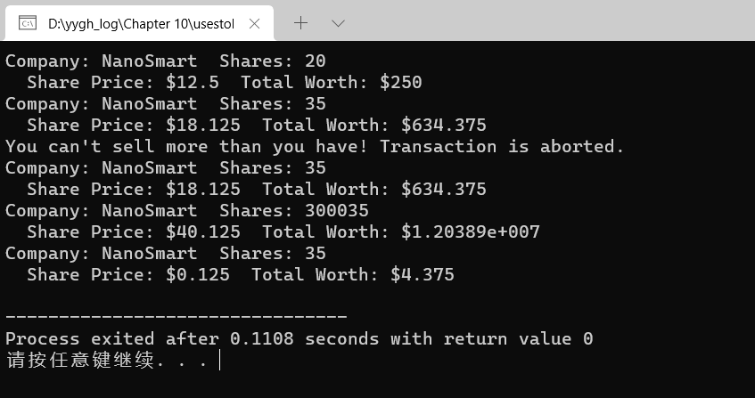
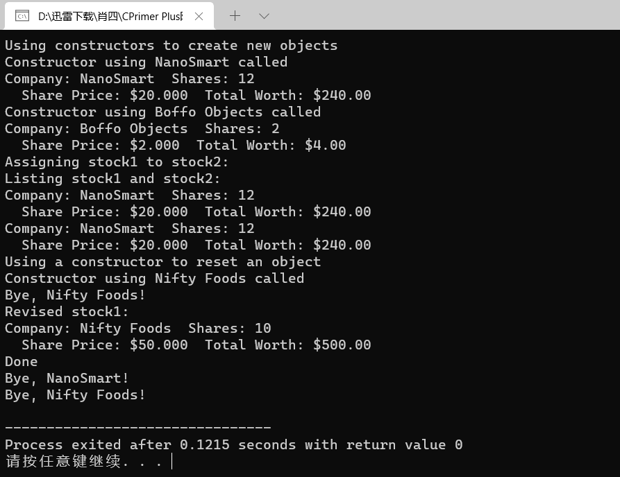
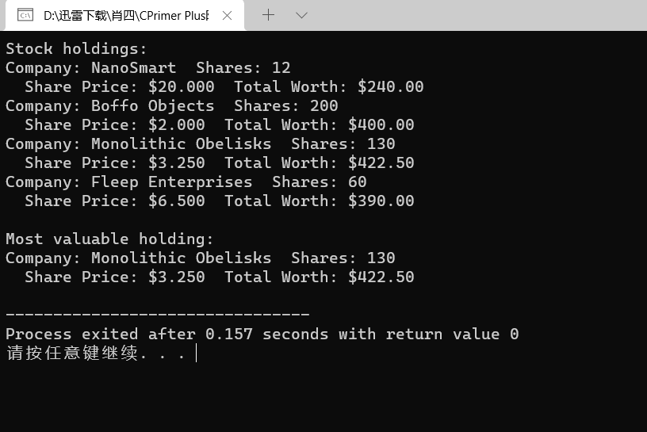
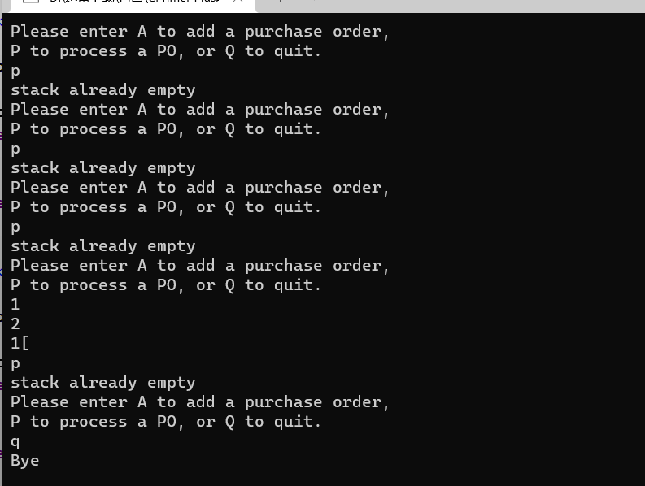

# c++ 部分

## 抽象和类

stock00.h

```cpp
// stock00.h -- Stock class interface
// version 00
#ifndef STOCK00_H_
#define STOCK00_H_

#include <string>  

class Stock  // class declaration
{
private: 
    std::string company;
    long shares;
    double share_val;
    double total_val;
    void set_tot() { total_val = shares * share_val; }
public:
    void acquire(const std::string & co, long n, double pr);
    void buy(long num, double price);
    void sell(long num, double price);
    void update(double price);
    void show();
};    // note semicolon at the end

#endif
```


stock00.cpp

```cpp
// stock00.cpp -- implementing the Stock class
// version 00
#include <iostream>
#include "stock00.h"

void Stock::acquire(const std::string & co, long n, double pr)
{
    company = co;
    if (n < 0)
    {
        std::cout << "Number of shares can't be negative; "
                  << company << " shares set to 0.\n";
        shares = 0;
    }
    else
        shares = n;
    share_val = pr;
    set_tot();
}

void Stock::buy(long num, double price)
{
     if (num < 0)
    {
        std::cout << "Number of shares purchased can't be negative. "
             << "Transaction is aborted.\n";
    }
    else
    {
        shares += num;
        share_val = price;
        set_tot();
    }
}

void Stock::sell(long num, double price)
{
    using std::cout;
    if (num < 0)
    {
        cout << "Number of shares sold can't be negative. "
             << "Transaction is aborted.\n";
    }
    else if (num > shares)
    {
        cout << "You can't sell more than you have! "
             << "Transaction is aborted.\n";
    }
    else
    {
        shares -= num;
        share_val = price;
        set_tot();
    }
}

void Stock::update(double price)
{
    share_val = price;
    set_tot();
}

void Stock::show()
{
    std::cout << "Company: " << company
              << "  Shares: " << shares << '\n'
              << "  Share Price: $" << share_val
              << "  Total Worth: $" << total_val << '\n';
}
```

usestok.cpp

```cpp
// usestok0.cpp -- the client program
// compile with stock.cpp
#include <iostream>
#include "stock00.cpp"

int main()
{
    Stock fluffy_the_cat;
    fluffy_the_cat.acquire("NanoSmart", 20, 12.50);
    fluffy_the_cat.show();
    fluffy_the_cat.buy(15, 18.125);
    fluffy_the_cat.show();
    fluffy_the_cat.sell(400, 20.00);
m,,m 
    // std::cin.get();
    return 0;
}
```



stock10.h

```cpp
// stock10.h ?Stock class declaration with constructors, destructor added
#ifndef STOCK1_H_
#define STOCK1_H_
#include <string>
class Stock
{
private:
    std::string company;
    long shares;
    double share_val;
    double total_val;
    void set_tot() { total_val = shares * share_val; }
public:
    Stock();        // default constructor
    Stock(const std::string & co, long n = 0, double pr = 0.0);
    ~Stock();       // noisy destructor
    void buy(long num, double price);
    void sell(long num, double price);
    void update(double price);
    void show();
};

#endif
```

stock10.cpp

```cpp
// stock1.cpp ?Stock class implementation with constructors, destructor added
#include <iostream>
#include "stock10.h"

// constructors (verbose versions)
Stock::Stock()        // default constructor
{
    std::cout << "Default constructor called\n";
    company = "no name";
    shares = 0;
    share_val = 0.0;
    total_val = 0.0;
}

Stock::Stock(const std::string & co, long n, double pr)
{
    std::cout << "Constructor using " << co << " called\n";
    company = co;

    if (n < 0)
    {
        std::cout << "Number of shares can't be negative; "
                   << company << " shares set to 0.\n";
        shares = 0;
    }
    else
        shares = n;
    share_val = pr;
    set_tot();
}
// class destructor
Stock::~Stock()        // verbose class destructor
{
    std::cout << "Bye, " << company << "!\n";
}

// other methods
void Stock::buy(long num, double price)
{
     if (num < 0)
    {
        std::cout << "Number of shares purchased can't be negative. "
             << "Transaction is aborted.\n";
    }
    else
    {
        shares += num;
        share_val = price;
        set_tot();
    }
}

void Stock::sell(long num, double price)
{
    using std::cout;
    if (num < 0)
    {
        cout << "Number of shares sold can't be negative. "
             << "Transaction is aborted.\n";
    }
    else if (num > shares)
    {
        cout << "You can't sell more than you have! "
             << "Transaction is aborted.\n";
    }
    else
    {
        shares -= num;
        share_val = price;
        set_tot();
    }
}

void Stock::update(double price)
{
    share_val = price;
    set_tot();
}

void Stock::show()
{
    using std::cout;
    using std::ios_base;
    // set format to #.###
    ios_base::fmtflags orig = 
        cout.setf(ios_base::fixed, ios_base::floatfield); 
    std::streamsize prec = cout.precision(3);

    cout << "Company: " << company
        << "  Shares: " << shares << '\n';
    cout << "  Share Price: $" << share_val;
    // set format to #.##
    cout.precision(2);
    cout << "  Total Worth: $" << total_val << '\n';

    // restore original format
    cout.setf(orig, ios_base::floatfield);
    cout.precision(prec);
}
```

usestok1.cpp

```cpp
// usestok1.cpp -- using the Stock class
// compile with stock10.cpp
#include <iostream>
#include "stock10.cpp"

int main()
{
  {
    using std::cout;
    cout << "Using constructors to create new objects\n";
    Stock stock1("NanoSmart", 12, 20.0);            // syntax 1
    stock1.show();
    Stock stock2 = Stock ("Boffo Objects", 2, 2.0); // syntax 2
    stock2.show();

    cout << "Assigning stock1 to stock2:\n";
    stock2 = stock1;
    cout << "Listing stock1 and stock2:\n";
    stock1.show();
    stock2.show();

    cout << "Using a constructor to reset an object\n";
    stock1 = Stock("Nifty Foods", 10, 50.0);    // temp object
    cout << "Revised stock1:\n";
    stock1.show();
    cout << "Done\n";
  }
	// std::cin.get();
    return 0; 
}
```



stock20.h

```cpp
// stock20.h -- augmented version
#ifndef STOCK20_H_
#define STOCK20_H_
#include <string>

class Stock
{
private:
    std::string company;
    int shares;
    double share_val;
    double total_val;
    void set_tot() { total_val = shares * share_val; }
public:
  //  Stock();        // default constructor
    Stock(const std::string & co, long n = 0, double pr = 0.0);
    ~Stock();       // do-nothing destructor
    void buy(long num, double price);
    void sell(long num, double price);
    void update(double price);
    void show()const;
    const Stock & topval(const Stock & s) const;
};

#endif
```

stock.cpp

```cpp
// stock20.cpp -- augmented version
#include <iostream>
#include "stock20.h"
using namespace std;
// constructors
Stock::Stock()        // default constructor
{
    shares = 0;
    share_val = 0.0;
    total_val = 0.0;
}

Stock::Stock(const std::string & co, long n, double pr)
{
    company = co;
    if (n < 0)
    {
        std::cout << "Number of shares can't be negative; "
                   << company << " shares set to 0.\n";
        shares = 0;
    }
    else
        shares = n;
    share_val = pr;
    set_tot();
}

// class destructor
Stock::~Stock()        // quiet class destructor
{
}

// other methods
void Stock::buy(long num, double price)
{
     if (num < 0)
    {
        std::cout << "Number of shares purchased can't be negative. "
             << "Transaction is aborted.\n";
    }
    else
    {
        shares += num;
        share_val = price;
        set_tot();
    }
}

void Stock::sell(long num, double price)
{
    using std::cout;
    if (num < 0)
    {
        cout << "Number of shares sold can't be negative. "
             << "Transaction is aborted.\n";
    }
    else if (num > shares)
    {
        cout << "You can't sell more than you have! "
             << "Transaction is aborted.\n";
    }
    else
    {
        shares -= num;
        share_val = price;
        set_tot();
    }
}

void Stock::update(double price)
{
    share_val = price;
    set_tot();
}

void Stock::show() const
{
    using std::cout;
    using std::ios_base;
    // set format to #.###
    ios_base::fmtflags orig = 
        cout.setf(ios_base::fixed, ios_base::floatfield); 
    std::streamsize prec = cout.precision(3);

    cout << "Company: " << company
        << "  Shares: " << shares << '\n';
    cout << "  Share Price: $" << share_val;
    // set format to #.##
    cout.precision(2);
    cout << "  Total Worth: $" << total_val << '\n';

    // restore original format
    cout.setf(orig, ios_base::floatfield);
    cout.precision(prec);
}

const Stock & Stock::topval(const Stock & s) const
{
    if (s.total_val > total_val)
        return s;
    else
        return *this; 
}
```

usestok2.cpp

```cpp
// usestok2.cpp -- using the Stock class
// compile with stock20.cpp
#include <iostream>
#include "stock20.cpp"

const int STKS = 4;
int main()
{{
// create an array of initialized objects
    Stock stocks[STKS] = {
        Stock("NanoSmart", 12, 20.0),
        Stock("Boffo Objects", 200, 2.0),
        Stock("Monolithic Obelisks", 130, 3.25),
        Stock("Fleep Enterprises", 60, 6.5)
        };

    std::cout << "Stock holdings:\n";
    int st;
    for (st = 0; st < STKS; st++)
        stocks[st].show();
// set pointer to first element
    const Stock * top = &stocks[0];
    for (st = 1; st < STKS; st++)
        top = &top->topval(stocks[st]);
// now top points to the most valuable holding
    std::cout << "\nMost valuable holding:\n";
	top->show();}
    // std::cin.get();
    return 0; 
}
```




stack.h

```cpp
// stack.h -- class definition for the stack ADT
#ifndef STACK_H_
#define STACK_H_

typedef unsigned long Item;

class Stack
{
private:
    enum {MAX = 10};    // constant specific to class
    Item items[MAX];    // holds stack items
    int top;            // index for top stack item
public:
    Stack();
    bool isempty() const;
    bool isfull() const;
    // push() returns false if stack already is full, true otherwise
    bool push(const Item & item);   // add item to stack
    // pop() returns false if stack already is empty, true otherwise
    bool pop(Item & item);          // pop top into item
};
#endif
```

stack.cpp

```cpp
// stack.cpp -- Stack member functions
#include "stack.h"
Stack::Stack()    // create an empty stack
{
    top = 0;
}

bool Stack::isempty() const
{
    return top == 0;
}

bool Stack::isfull() const
{
    return top == MAX;
}

bool Stack::push(const Item & item) 
{
    if (top < MAX)
    {
        items[top++] = item;
        return true;
    }
    else
        return false;
}

bool Stack::pop(Item & item)
{
    if (top > 0)
    {
        item = items[--top];
        return true;
    }
    else
        return false; 
}
```


stacker.cpp

```cpp
// stacker.cpp -- testing the Stack class
#include <iostream>
#include <cctype>  // or ctype.h
#include "stack.cpp"
int main()
{
    using namespace std;
    Stack st; // create an empty stack
    char ch;
    unsigned long po;
    cout << "Please enter A to add a purchase order,\n"
        << "P to process a PO, or Q to quit.\n";
    while (cin >> ch && toupper(ch) != 'Q')
    {
        while (cin.get() != '\n')   
            continue;
        if (!isalpha(ch))
        {
            cout << '\a';
            continue;
        }
        switch(ch)
        {
             case 'A':
             case 'a': cout << "Enter a PO number to add: ";
                       cin >> po;
                       if (st.isfull())
                           cout << "stack already full\n";
                       else
                           st.push(po);
                       break;
             case 'P':
             case 'p': if (st.isempty())
                           cout << "stack already empty\n";
                       else {
                           st.pop(po);
                           cout << "PO #" << po << " popped\n";
                       }
                       break;
        }
        cout << "Please enter A to add a purchase order,\n"
             << "P to process a PO, or Q to quit.\n";
    }
    cout << "Bye\n";
    return 0; 
}
```

