# 算法刷题

[滑动窗口 /【模板】单调队列](https://www.luogu.com.cn/problem/P1886)

Go 版本

```go
package main

import (
	"bufio"
	"fmt"
	"os"
)

func main() {
	in := bufio.NewReader(os.Stdin)
	out := bufio.NewWriter(os.Stdout)
	defer out.Flush()
	var n, m int
	fmt.Fscan(in, &n, &m)
	a := make([]int, n+2)
	q := make([]int, n+2)

	for i := 1; i <= n; i++ {
		fmt.Fscan(in, &a[i])
	}

	l, r := 0, 0
	for i := 1; i <= n; i++ {
		for l <= r && q[l] <= i-m {
			l++
		}
		for l <= r && a[q[r]] >= a[i] {
			r--
		}
		r++
		q[r] = i
		if i >= m {
			fmt.Fprintf(out, "%d ", a[q[l]])
		}
	}
	fmt.Fprintf(out, "\n")

	l, r = 0, 0
	for i := 1; i <= n; i++ {
		for l <= r && q[l] <= i-m {
			l++
		}
		for l <= r && a[q[r]] < a[i] {
			r--
		}
		r++
		q[r] = i
		if i >= m {
			fmt.Fprintf(out, "%d ", a[q[l]])
		}
	}
	fmt.Fprintf(out, "\n")
}

```


# Docker 学习

### 安装Docker

1. 卸载旧版本

```shell
 sudo apt-get remove docker docker-engine docker.io containerd runc
```

2. 安装 gcc, g ++

```shell
sudo apt-get install gcc
```

```shell
sudo apt-get install g++
```

3.  安装Docker的仓库

   更新apt包索引并安装包，以允许apt通过HTTPS使用存储库:

```shell
sudo apt-get update
```

```shell
sudo apt-get install \
    ca-certificates \
    curl \
    gnupg \
    lsb-release
```

​      添加Docker 官方密钥

```go
curl -fsSL https://download.docker.com/linux/ubuntu/gpg | sudo apt-key add -
```

   设置远程仓库

```shell
sudo add-apt-repository \
   "deb [arch=amd64] https://download.docker.com/linux/ubuntu \
  $(lsb_release -cs) \
  stable"

```

4.安装Docker 引擎

更新apt包索引，安装最新版本的Docker Engine、containerd和Docker Compose，或进入下一步安装特定版本:

```shell
 sudo apt-get update
```

```shell
 sudo apt-get install docker-ce docker-ce-cli containerd.io docker-compose-plugin
```

5. 通过运行hello-world映像来验证Docker Engine是否正确安装。

```shell
sudo docker run hello-world
```

6. 卸载

卸载Docker Engine、CLI、Containerd和Docker Compose包:

```shell
sudo apt-get purge docker-ce docker-ce-cli containerd.io docker-compose-plugin
```

主机上的映像、容器、卷或自定义配置文件不会被自动删除。删除所有镜像、容器和卷。

```shell
 sudo rm -rf /var/lib/docker
 sudo rm -rf /var/lib/containerd
```


### 阿里云镜像加速器

配置阿里镜像加速器地址

```
https://7k11fe2x.mirror.aliyuncs.com
```

1. 安装／升级Docker客户端

推荐安装1.10.0以上版本的Docker客户端，

2. 配置镜像加速器

针对Docker客户端版本大于 1.10.0 的用户

您可以通过修改daemon配置文件/etc/docker/daemon.json来使用加速器

```shell
sudo mkdir -p /etc/docker
```

```shell

sudo tee /etc/docker/daemon.json <<-'EOF'
{
  "registry-mirrors": ["https://7k11fe2x.mirror.aliyuncs.com"]
}
EOF
```

```shel
sudo systemctl daemon-reload
sudo systemctl restart docker
```

### 为什么Docker会比VM虚拟机快

(1)docker有着比虚拟机更少的抽象层

  由于docker不需要Hypervisor(虚拟机)实现硬件资源虚拟化,运行在docker容器上的程序直接使用的都是实际物理机的硬件资源。因此在CPU、内存利用率上docker将会在效率上有明显优势。

(2)docker利用的是宿主机的内核,而不需要加载操作系统OS内核

  当新建一个容器时,docker不需要和虚拟机一样重新加载一个操作系统内核。进而避免引寻、加载操作系统内核返回等比较费时费资源的过程,当新建一个虚拟机时,虚拟机软件需要加载OS,返回新建过程是分钟级别的。而docker由于直接利用宿主机的操作系统,则省略了返回过程,因此新建一个docker容器只需要几秒钟。

 

### 帮助启动类命令

帮助启动类命令：

启动docker： `systemctl start docker`

停止docker：` systemctl stop docker`

重启docker： `systemctl restart docker`

查看docker状态： `systemctl status docker`

开机启动：` systemctl enable docker`

查看docker概要信息： `docker info`

查看docker总体帮助文档： `docker --help`

查看docker命令帮助文档： docker 具体命令 --help


### 镜像命令

`docker images`  列出本地的镜像

- OPTIONS 说明 

  -a:列出本地所有的镜像(含历史版本)

  -q: 只显示镜像ID

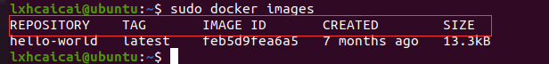

各个选项说明:

REPOSITORY：表示镜像的仓库源 TAG：镜像的标签版本号 IMAGE ID：镜像ID CREATED：镜像创建时间 SIZE：镜像大小

 同一仓库源可以有多个 TAG版本，代表这个仓库源的不同个版本，我们使用 REPOSITORY:TAG 来定义不同的镜像。

如果你不指定一个镜像的版本标签，例如你只使用 ubuntu，docker 将默认使用 ubuntu:latest 镜像


`docker search 某个XXX镜像名字`

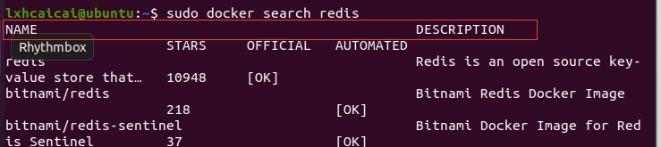

- OPTIONS 说明

  --limit : 只列出N个镜像，默认25个

  docker search --limit 5 redis


`docker pull 某个XXX镜像名字` 下载镜像

docker pull 镜像名字[:TAG]

docker pull 镜像名字没有TAG就是最新版 等价于 docker pull 镜像名字:latest 

docker pull ubuntu

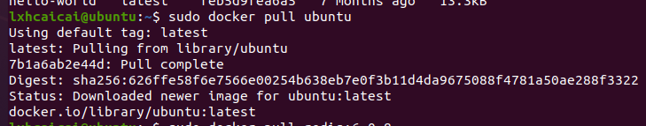


`docker system df` 查看镜像/容器/数据卷所占的空间

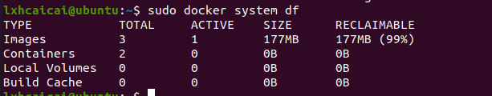


`docker rmi 某个XXX镜像名字ID`

删除镜像

删除单个 docker rmi  -f 镜像ID

删除多个 docker rmi -f 镜像名1:TAG 镜像名2:TAG 

删除全部  docker rmi -f $(docker images -qa)

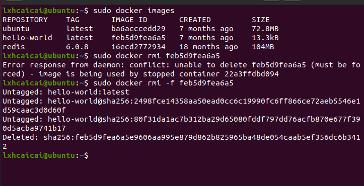


### 面试题：谈谈docker虚悬镜像是什么？

是什么： 仓库名、标签都是<none>的镜像，俗称虚悬镜像dangling image

长什么样：

### 容器命令

新建+启动容器 `docker run [OPTIONS] IMAGE [COMMAND] [ARG...]`

在docker上面启动后一个ubuntu镜像

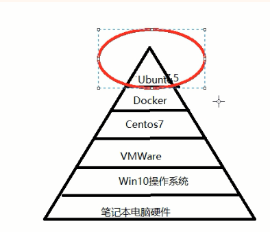

 OPTIONS说明（常用）：有些是一个减号，有些是两个减号

--name="容器新名字"    为容器指定一个名称；

-d: 后台运行容器并返回容器ID，也即启动守护式容器(后台运行)；

-i：以交互模式运行容器，通常与 -t 同时使用；

-t：为容器重新分配一个伪输入终端，通常与 -i 同时使用；

也即启动交互式容器(前台有伪终端，等待交互)；

-P: 随机端口映射，大写P

-p: 指定端口映射，小写p

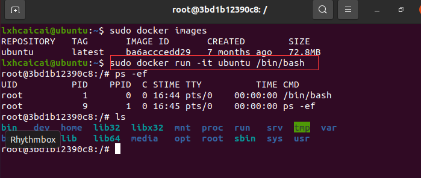


列出当前所有正在运行的容器  ` docker ps [OPTIONS]`

OPTIONS说明（常用）：

-a :列出当前所有正在运行的容器+历史上运行过的

-l :显示最近创建的容器。

-n：显示最近n个创建的容器。

-q :静默模式，只显示容器编号。

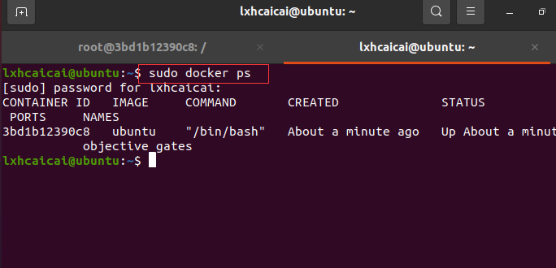


指定名称

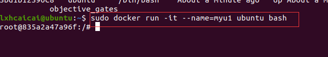

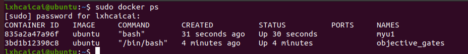


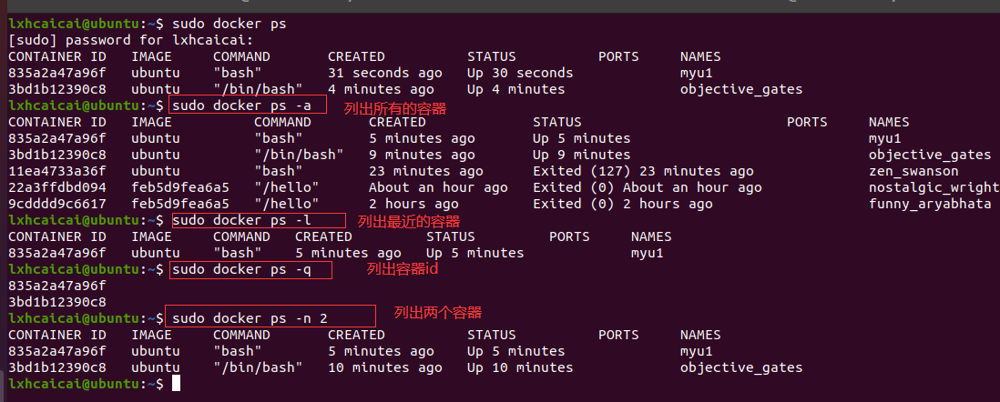


**退出容器**

两种退出方式:

` exit`

ctrl+p+q    ---》  run进去容器，`ctrl+p+q`退出，容器不停止

启动已停止运行的容器：`docker start 容器ID或者容器名`

重启容器： `docker restart 容器ID或者容器名`

停止容器： `docker stop 容器ID或者容器名`

强制停止容器 `docker kill 容器ID或容器名`

删除已停止的容器 `docker rm 容器ID`

强制删除运行中的容器 `docker rm -f  容器ID`

一次性删除多个容器实例

- `docker rm -f $(docker ps -a -q)`
- `docker ps -a -q | xargs docker rm`