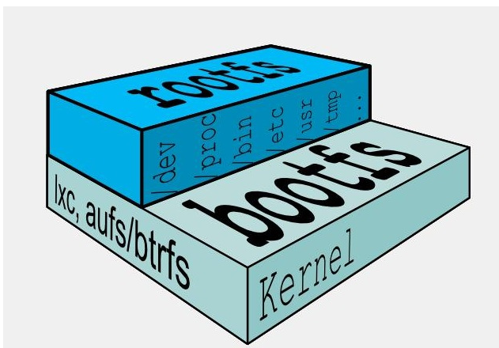
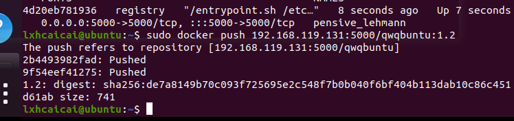

# 算法刷题

##  [愤怒的小鸟](https://www.acwing.com/problem/content/description/526/)

```cpp
#include <bits/stdc++.h>

using namespace std;

const int N = 18, M = 1 << 18;
const double eps = 1e-6;

#define PDD pair<double, double>
PDD p[N];
int path[N][N];
int f[M];

int cmp(double x, double y) {
    if (fabs(x - y) < eps) return 0;
    if (x > y) return 1;
    else return -1;
}

int main() {
    int T;
    cin >> T;
    while(T --) {
       
        int n, m;
        cin >> n >> m;
        for(int i = 0; i < n; i ++) {
            double x, y;
            cin >> x >> y;
            p[i] = {x, y};
        }
        
         memset(path, 0, sizeof(path));
        for(int i = 0; i < n; i ++) {
            path[i][i] = 1 << i;
            for(int j = 0; j < n; j ++) {
                double x1 = p[i].first, y1 = p[i].second;
                double x2 = p[j].first, y2 = p[j].second;
                
                if(!cmp(x1, x2)) continue;
                
                double a = (y1/x1 - y2/x2) / (x1 - x2);
                double b = y1/x1 - a * x1;
                
                if( cmp(a, 0) >= 0) continue;
                
                int state = 0;
                for(int k = 0; k < n; k ++) {
                    double x = p[k].first, y = p[k].second;
                    
                    if(!cmp(a*x*x + b*x, y)) state |= 1 << k;
                }
                path[i][j] = state;
            }
        }
        
        memset(f, 0x3f, sizeof f);
        f[0] = 0;
        
        for(int i = 0; i + 1 < (1 << n); i ++) {
            int x = 0;
            for(int j = 0; j < n; j ++) {
                if (!(i >> j & 1)){
                    x = j; 
                    break;
                }
            }
            
            for(int j = 0; j < n; j ++) {
                f[i|path[x][j]] = min(f[i|path[x][j]], f[i] + 1);
            }
        }
        
        cout << f[(1 << n) - 1] << endl;
    }
    return 0;
}
```


# 技术部分

## go 设计模式

### 简单工厂模式

go 语言没有构造函数一说，所以一般会定义NewXXX函数来初始化相关类。
NewXXX 函数返回接口时就是简单工厂模式，也就是说Golang的一般推荐做法就是简单工厂。

在这个simplefactory包中只有API 接口和NewAPI函数为包外可见，封装了实现细节。

#### simple.go

```go
package simplefactory

import "fmt"

//API is interface
type API interface {
	Say(name string) string
}

//NewAPI return Api instance by type
// 按照类型返回API的实例
func NewAPI(t int) API {
	if t == 1 {
		return &hiAPI{}
	} else if t == 2 {
		return &helloAPI{}
	}
	return nil
}

//hiAPI is one of API implement
// hiAPI 是API 的实现之一
type hiAPI struct{}

//Say hi to name
func (*hiAPI) Say(name string) string {
	return fmt.Sprintf("Hi, %s", name)
}

//HelloAPI is another API implement
type helloAPI struct{}

//Say hello to name
func (*helloAPI) Say(name string) string {
	return fmt.Sprintf("Hello, %s", name)
}

```

#### simple_test.go

```go
package simplefactory

import "testing"

//TestType1 test get hiapi with factory
func TestType1(t *testing.T) {
	api := NewAPI(1)
	s := api.Say("Tom")
	if s != "Hi, Tom" {
		t.Fatal("Type1 test fail")
	}
}

func TestType2(t *testing.T) {
	api := NewAPI(2)
	s := api.Say("Tom")
	if s != "Hello, Tom" {
		t.Fatal("Type2 test fail")
	}
}

```


### 工厂方法模式

工厂方法模式使用子类的方式延迟生成对象到子类中实现。

Go中不存在继承 所以使用匿名组合来实现

#### factorymethod.go

``` go
package factorymethod

//Operator 是被封装的实际类接口
type Operator interface {
	SetA(int)
	SetB(int)
	Result() int
}

//OperatorFactory 是工厂接口
type OperatorFactory interface {
	Create() Operator
}

//OperatorBase 是Operator 接口实现的基类，封装公用方法
type OperatorBase struct {
	a, b int
}

//SetA 设置 A
func (o *OperatorBase) SetA(a int) {
	o.a = a
}

//SetB 设置 B
func (o *OperatorBase) SetB(b int) {
	o.b = b
}

//PlusOperatorFactory 是 PlusOperator 的工厂类
type PlusOperatorFactory struct{}

func (PlusOperatorFactory) Create() Operator {
	return &PlusOperator{
		OperatorBase: &OperatorBase{},
	}
}

//PlusOperator Operator 的实际加法实现
type PlusOperator struct {
	*OperatorBase
}

//Result 获取结果
func (o PlusOperator) Result() int {
	return o.a + o.b
}

//MinusOperatorFactory 是 MinusOperator 的工厂类
type MinusOperatorFactory struct{}

func (MinusOperatorFactory) Create() Operator {
	return &MinusOperator{
		OperatorBase: &OperatorBase{},
	}
}

//MinusOperator Operator 的实际减法实现
type MinusOperator struct {
	*OperatorBase
}

//Result 获取结果
func (o MinusOperator) Result() int {
	return o.a - o.b
}

```

#### factorymethod_test.go

``` go
package factorymethod

import "testing"

func compute(factory OperatorFactory, a, b int) int {
    op := factory.Create()
    op.SetA(a)
    op.SetB(b)
    return op.Result()
}

func TestOperator(t *testing.T) {
    var (
        factory OperatorFactory
    )

    factory = PlusOperatorFactory{}
    if compute(factory, 1, 2) != 3 {
        t.Fatal("error with factory method pattern")
    }

    factory = MinusOperatorFactory{}
    if compute(factory, 4, 2) != 2 {
        t.Fatal("error with factory method pattern")
    }
}
```

## MySql 练习

## Docker 学习

### 容器命令

有镜像才能创建容器，这是根本前提(下载一个Redis6.0.8镜像演示)

#### 启动守护式容器(后台服务器)

在大部分的场景下，我们希望 docker 的服务是在后台运行的，

我们可以过 -d 指定容器的后台运行模式。

docker run -d 容器名

\#使用镜像centos:latest以后台模式启动一个容器

docker run -d ubuntu

问题：**然后docker ps -a 进行查看, 会发现容器已经退出**

很重要的要说明的一点: Docker容器后台运行,就必须有一个前台进程.

**容器运行的命令如果不是那些一直挂起的命令（比如运行top，tail），就是会自动退出的。**

这个是docker的机制问题,比如你的web容器,我们以nginx为例，正常情况下,

我们配置启动服务只需要启动响应的service即可。例如service nginx start

但是,这样做,nginx为后台进程模式运行,就导致docker前台没有运行的应用,

这样的容器后台启动后,会立即自杀因为他觉得他没事可做了.

所以，最佳的解决方案是,将你要运行的程序以前台进程的形式运行，

常见就是命令行模式，表示我还有交互操作，别中断，O(∩_∩)O哈哈~


redis 前后台启动演示case

前台交互式启动

-  `docker run -it redis:6.0.8`

后台守护式启动

- `docker run -d redis:6.0.8`


ctrl c 然后查看docker ps 发现 容器没有了

这个时候就要启动后台守护进程


#### 查看容器日志

docker logs 容器ID


#### 查看容器内运行的进程

docker top 容器ID


#### 查看容器内部细节

docker inspect 容器ID


#### 进入正在运行的容器并以命令行交互

##### docker exec -it 容器ID bashShell


exit 退出容器并不会导致容器死亡


##### 重新进入docker attach 容器ID


attach 直接进入容器启动命令的终端，不会启动新的进程

用exit退出，会导致容器的停止。

exec 是在容器中打开新的终端，并且可以启动新的进程

用exit退出，不会导致容器的停止。

推荐大家使用 docker exec 命令，因为退出容器终端，不会导致容器的停止。


#### 从容器内拷贝文件到主机上

容器→主机

docker cp  容器ID:容器内路径 目的主机路径


#### 导入和导出容器

export 导出容器的内容留作为一个tar归档文件[对应import命令]

import 从tar包中的内容创建一个新的文件系统再导入为镜像[对应export]


#### 小总结

attach   Attach to a running container         # 当前 shell 下 attach 连接指定运行镜像

build   Build an image from a Dockerfile        # 通过 Dockerfile 定制镜像

commit   Create a new image from a container changes  # 提交当前容器为新的镜像

cp     Copy files/folders from the containers filesystem to the host path  #从容器中拷贝指定文件或者目录到宿主机中

create   Create a new container             # 创建一个新的容器，同 run，但不启动容器

diff    Inspect changes on a container's filesystem  # 查看 docker 容器变化

events   Get real time events from the server      # 从 docker 服务获取容器实时事件

exec    Run a command in an existing container     # 在已存在的容器上运行命令

export   Stream the contents of a container as a tar archive  # 导出容器的内容流作为一个 tar 归档文件[对应 import ]

history  Show the history of an image          # 展示一个镜像形成历史

images   List images                  # 列出系统当前镜像

import   Create a new filesystem image from the contents of a tarball # 从tar包中的内容创建一个新的文件系统映像[对应export]

info    Display system-wide information        # 显示系统相关信息

inspect  Return low-level information on a container  # 查看容器详细信息

kill    Kill a running container            # kill 指定 docker 容器

load    Load an image from a tar archive        # 从一个 tar 包中加载一个镜像[对应 save]

login   Register or Login to the docker registry server   # 注册或者登陆一个 docker 源服务器

logout   Log out from a Docker registry server      # 从当前 Docker registry 退出

logs    Fetch the logs of a container         # 输出当前容器日志信息

port    Lookup the public-facing port which is NAT-ed to PRIVATE_PORT   # 查看映射端口对应的容器内部源端口

pause   Pause all processes within a container     # 暂停容器

ps     List containers                # 列出容器列表

pull    Pull an image or a repository from the docker registry server  # 从docker镜像源服务器拉取指定镜像或者库镜像

push    Push an image or a repository to the docker registry server   # 推送指定镜像或者库镜像至docker源服务器

restart  Restart a running container          # 重启运行的容器

rm     Remove one or more containers         # 移除一个或者多个容器

rmi    Remove one or more images    # 移除一个或多个镜像[无容器使用该镜像才可删除，否则需删除相关容器才可继续或 -f 强制删除]

run    Run a command in a new container        # 创建一个新的容器并运行一个命令

save    Save an image to a tar archive         # 保存一个镜像为一个 tar 包[对应 load]

search   Search for an image on the Docker Hub     # 在 docker hub 中搜索镜像

start   Start a stopped containers           # 启动容器

stop    Stop a running containers           # 停止容器

tag    Tag an image into a repository         # 给源中镜像打标签

top    Lookup the running processes of a container  # 查看容器中运行的进程信息

unpause  Unpause a paused container           # 取消暂停容器

version  Show the docker version information      # 查看 docker 版本号

wait    Block until a container stops, then print its exit code  # 截取容器停止时的退出状态值


### Docker 镜像

####  是什么

是一种轻量级、可执行的独立软件包，它包含运行某个软件所需的所有内容，我们把应用程序和配置依赖打包好形成一个可交付的运行环境(包括代码、运行时需要的库、环境变量和配置文件等)，这个打包好的运行环境就是image镜像文件。

只有通过这个镜像文件才能生成Docker容器实例(类似Java中new出来一个对象)。


以我们的pull为例，在下载的过程中我们可以看到docker的镜像好像是在一层一层的在下载


**UnionFS（联合文件系统）**：Union文件系统（UnionFS）是一种分层、轻量级并且高性能的文件系统，它支持对文件系统的修改作为一次提交来一层层的叠加，同时可以将不同目录挂载到同一个虚拟文件系统下(unite several directories into a single virtual filesystem)。Union 文件系统是 Docker 镜像的基础。镜像可以通过分层来进行继承，基于基础镜像（没有父镜像），可以制作各种具体的应用镜像。


特性：一次同时加载多个文件系统，但从外面看起来，只能看到一个文件系统，联合加载会把各层文件系统叠加起来，这样最终的文件系统会包含所有底层的文件和目录

 **Docker镜像加载原理：**

  docker的镜像实际上由一层一层的文件系统组成，这种层级的文件系统UnionFS。

bootfs(boot file system)主要包含bootloader和kernel, bootloader主要是引导加载kernel, Linux刚启动时会加载bootfs文件系统，在Docker镜像的最底层是引导文件系统bootfs。这一层与我们典型的Linux/Unix系统是一样的，包含boot加载器和内核。当boot加载完成之后整个内核就都在内存中了，此时内存的使用权已由bootfs转交给内核，此时系统也会卸载bootfs。

rootfs (root file system) ，在bootfs之上。包含的就是典型 Linux 系统中的 /dev, /proc, /bin, /etc 等标准目录和文件。rootfs就是各种不同的操作系统发行版，比如Ubuntu，Centos等等。




**为什么 Docker 镜像要采用这种分层结构呢**

镜像分层最大的一个好处就是共享资源，方便复制迁移，就是为了复用。

比如说有多个镜像都从相同的 base 镜像构建而来，那么 Docker Host 只需在磁盘上保存一份 base 镜像；

同时内存中也只需加载一份 base 镜像，就可以为所有容器服务了。而且镜像的每一层都可以被共享。

#### 重点理解

Docker镜像层都是只读的，容器层是可写的

当容器启动时，一个新的可写层被加载到镜像的顶部。

这一层通常被称作“容器层”，“容器层”之下的都叫“镜像层”。


#### Docker镜像commit操作案例

docker commit提交容器副本使之成为一个新的镜像


docker commit -m="提交的描述信息" -a="作者" 容器ID 要创建的目标镜像名:[标签名]


外网连通的情况下，安装vim

docker容器内执行两条命令：

apt-get update

apt-get -y install vim


### 本地镜像发布到阿里云


设置容器镜像访问凭证


ubuntu 下执行如下命令

1. 登录阿里云Docker Registry

```
$ docker login --username=废材少女qwq酱 registry.cn-hangzhou.aliyuncs.com
```

用于登录的用户名为阿里云账号全名，密码为开通服务时设置的密码。

您可以在访问凭证页面修改凭证密码。

2. 从Registry中拉取镜像

```
$ docker pull registry.cn-hangzhou.aliyuncs.com/lxhcaicai/myubuntu1.1:[镜像版本号]
```

3. 将镜像推送到Registry

```
$ docker login --username=废材少女qwq酱 registry.cn-hangzhou.aliyuncs.com$ docker tag [ImageId] registry.cn-hangzhou.aliyuncs.com/lxhcaicai/myubuntu1.1:[镜像版本号]$ docker push registry.cn-hangzhou.aliyuncs.com/lxhcaicai/myubuntu1.1:[镜像版本号]
```

请根据实际镜像信息替换示例中的[ImageId]和[镜像版本号]参数。


拉取


### 将本地镜像推送到私有库

#### 下载镜像Docker Registry


#### 运行私有库Registry，相当于本地有个私有Docker hub


```
sudo docker run -d -p 5000:5000  -v /zzyyuse/myregistry/:/tmp/registry --privileged=true registry
```

默认情况，仓库被创建在容器的/var/lib/registry目录下，建议自行用容器卷映射，方便于宿主机联调

#### 案例演示创建一个新镜像，ubuntu安装ifconfig命令

docker容器内执行上述两条命令：

apt-get update

apt-get install net-tools


安装完成后，commit 我的自己的新镜像

公式：

docker commit -m="提交的描述信息" -a="作者" 容器ID 要创建的目标镜像名:[标签名]

命令：在容器外执行，记得

docker commit -m="ifconfig cmd add" -a="zzyy" a69d7c825c4f zzyyubuntu:1.2

```
sudo docker commit -m="ifconfig cmd add" -a="lxhcaicai" 793c11db1b05 qwqbuntu:1.2

```


#### curl验证私服库上有什么镜像

镜像修改为192.168.119.131:5000/qwqbuntu:1.2

docker tag qwqbuntu:1.2 192.168.119.131:5000/qwqbuntu:1.2

```shell
docker tag qwqbuntu:1.2 192.168.119.131:5000/qwqbuntu:1.2
```


#### 修改配置文件使之支持http

别无脑照着复制，registry-mirrors 配置的是国内阿里提供的镜像加速地址，不用加速的话访问官网的会很慢。
2个配置中间有个逗号 ','别漏了，这个配置是json格式的。
2个配置中间有个逗号 ','别漏了，这个配置是json格式的。
2个配置中间有个逗号 ','别漏了，这个配置是json格式的。

vim命令新增如下红色内容：`vim /etc/docker/daemon.json`

```
{
  "registry-mirrors": ["https://aa25jngu.mirror.aliyuncs.com"],
  "insecure-registries": ["192.168.119.131:5000"]
}
```


上述理由：docker默认不允许http方式推送镜像，通过配置选项来取消这个限制。====> 修改完后如果不生效，建议重启docker

重启docker `systemctl restart docker`

```
systemctl restart docker
```


#### push推送到私服库

`docker push 192.168.119.131:5000/qwqbuntu:1.2`



#### curl验证私服库上有什么镜像2

```
curl -XGET http://192.168.119.131:5000/v2/_catalog
```


#### pull到本地并运行

```
docker pull 192.168.119.131:5000/qwqbuntu:1.2
```

### Docker容器数据卷

坑：容器卷记得加入

--privileged=true


Docker挂载主机目录访问如果出现cannot open directory .: Permission denied

解决办法：在挂载目录后多加一个--privileged=true参数即可

如果是CentOS7安全模块会比之前系统版本加强，不安全的会先禁止，所以目录挂载的情况被默认为不安全的行为，

在SELinux里面挂载目录被禁止掉了额，如果要开启，我们一般使用--privileged=true命令，扩大容器的权限解决挂载目录没有权限的问题，也即

使用该参数，container内的root拥有真正的root权限，否则，container内的root只是外部的一个普通用户权限。

还记得蓝色框框中的内容吗？


#### 是什么?

一句话：有点类似我们Redis里面的rdb和aof文件

将docker容器内的数据保存进宿主机的磁盘中

运行一个带有容器卷存储功能的容器实例

-  docker run -it --privileged=true -v /宿主机绝对路径目录:/容器内目录      镜像名

#### 能干嘛？

\* 将运用与运行的环境打包镜像，run后形成容器实例运行 ，但是我们对数据的要求希望是持久化的

Docker容器产生的数据，如果不备份，那么当容器实例删除后，容器内的数据自然也就没有了。

为了能保存数据在docker中我们使用卷。

特点：

1：数据卷可在容器之间共享或重用数据

2：卷中的更改可以直接实时生效，爽

3：数据卷中的更改不会包含在镜像的更新中

4：数据卷的生命周期一直持续到没有容器使用它为止