# 算法刷题

[【模板】三分法](https://www.luogu.com.cn/problem/P3382)

Go版本

```go
package main

import (
	"fmt"
	"math"
)

const (
	N   int     = 20
	eps float64 = 1e-6
)

var (
	a [N]float64
	n int
)

func f(x float64) (res float64) {
	res = 0
	for i := 0; i <= n; i++ {
		res = res*x + a[i]
	}
	return res
}

func main() {
	var L, R float64
	fmt.Scan(&n, &L, &R)
	for i := 0; i <= n; i++ {
		fmt.Scan(&a[i])
	}
	var ans float64 = 0
	for math.Abs(L-R) > eps {
		mid := (L + R) / 2
		if f(mid+eps) > f(mid-eps) {
			L = mid
			ans = mid
		} else {
			R = mid
			ans = mid
		}
	}
	fmt.Printf("%.6f", ans)
}

```

# 技术学习

## Go 设计模式

### 抽象工厂模式

抽象工厂模式用于生成产品族的工厂，所生成的对象是有关联的。

如果抽象工厂退化成生成的对象无关联则成为工厂函数模式。

比如本例子中使用RDB和XML存储订单信息，抽象工厂分别能生成相关的主订单信息和订单详情信息。
如果业务逻辑中需要替换使用的时候只需要改动工厂函数相关的类就能替换使用不同的存储方式了。

#### abstractfactory.go

```go
package abstractfactory

import "fmt"

//OrderMainDAO 为订单主记录
type OrderMainDAO interface {
	SaveOrderMain()
}

//OrderDetailDAO 为订单详情纪录
type OrderDetailDAO interface {
	SaveOrderDetail()
}

//DAOFactory DAO 抽象模式工厂接口
type DAOFactory interface {
	CreateOrderMainDAO() OrderMainDAO
	CreateOrderDetailDAO() OrderDetailDAO
}

//RDBMainDAP 为关系型数据库的OrderMainDAO实现
type RDBMainDAO struct{}

//SaveOrderMain ...
func (*RDBMainDAO) SaveOrderMain() {
	fmt.Print("rdb main save\n")
}

//RDBDetailDAO 为关系型数据库的OrderDetailDAO实现
type RDBDetailDAO struct{}

// SaveOrderDetail ...
func (*RDBDetailDAO) SaveOrderDetail() {
	fmt.Print("rdb detail save\n")
}

//RDBDAOFactory 是RDB 抽象工厂实现
type RDBDAOFactory struct{}

func (*RDBDAOFactory) CreateOrderMainDAO() OrderMainDAO {
	return &RDBMainDAO{}
}

func (*RDBDAOFactory) CreateOrderDetailDAO() OrderDetailDAO {
	return &RDBDetailDAO{}
}

//XMLMainDAO XML存储
type XMLMainDAO struct{}

//SaveOrderMain ...
func (*XMLMainDAO) SaveOrderMain() {
	fmt.Print("xml main save\n")
}

//XMLDetailDAO XML存储
type XMLDetailDAO struct{}

// SaveOrderDetail ...
func (*XMLDetailDAO) SaveOrderDetail() {
	fmt.Print("xml detail save")
}

//XMLDAOFactory 是RDB 抽象工厂实现
type XMLDAOFactory struct{}

func (*XMLDAOFactory) CreateOrderMainDAO() OrderMainDAO {
	return &XMLMainDAO{}
}

func (*XMLDAOFactory) CreateOrderDetailDAO() OrderDetailDAO {
	return &XMLDetailDAO{}
}

```

#### abstractfactory_test.go

```go
package abstractfactory

func getMainAndDetail(factory DAOFactory) {
	factory.CreateOrderMainDAO().SaveOrderMain()
	factory.CreateOrderDetailDAO().SaveOrderDetail()
}

func ExampleRdbFactory() {
	var factory DAOFactory
	factory = &RDBDAOFactory{}
	getMainAndDetail(factory)
	// Output:
	// rdb main save
	// rdb detail save
}

func ExampleXmlFactory() {
	var factory DAOFactory
	factory = &XMLDAOFactory{}
	getMainAndDetail(factory)
	// Output:
	// xml main save
	// xml detail save
}

```

### 创建者模式

将一个复杂对象的构建分离成多个简单对象的构建组合

#### builder.go

```go
package builder

//Builder 是生成器接口
type Builder interface {
	Part1()
	Part2()
	Part3()
}

type Director struct {
	builder Builder
}

// NewDirector ...
func NewDirector(builder Builder) *Director {
	return &Director{
		builder: builder,
	}
}

//Construct Product
func (d *Director) Construct() {
	d.builder.Part1()
	d.builder.Part2()
	d.builder.Part3()
}

type Builder1 struct {
	result string
}

func (b *Builder1) Part1() {
	b.result += "1"
}

func (b *Builder1) Part2() {
	b.result += "2"
}

func (b *Builder1) Part3() {
	b.result += "3"
}

func (b *Builder1) GetResult() string {
	return b.result
}

type Builder2 struct {
	result int
}

func (b *Builder2) Part1() {
	b.result += 1
}

func (b *Builder2) Part2() {
	b.result += 2
}

func (b *Builder2) Part3() {
	b.result += 3
}

func (b *Builder2) GetResult() int {
	return b.result
}

```

#### build_test.go

```go
package builder

import "testing"

func TestBuilder1(t *testing.T) {
	builder := &Builder1{}
	director := NewDirector(builder)
	director.Construct()
	res := builder.GetResult()
	if res != "123" {
		t.Fatalf("Builder1 fail expect 123 acture %s", res)
	}
}

func TestBuilder2(t *testing.T) {
	builder := &Builder2{}
	director := NewDirector(builder)
	director.Construct()
	res := builder.GetResult()
	if res != 6 {
		t.Fatalf("Builder2 fail expect 6 acture %d", res)
	}
}

```

## Gin 框架

### 简介

#### 介绍

- Gin是一个golang的微框架，封装比较优雅，API友好，源码注释比较明确，具有快速灵活，容错方便等特点
- 对于golang而言，web框架的依赖要远比Python，Java之类的要小。自身的`net/http`足够简单，性能也非常不错
- 借助框架开发，不仅可以省去很多常用的封装带来的时间，也有助于团队的编码风格和形成规范

#### 安装

要安装Gin软件包，您需要安装Go并首先设置Go工作区。

1.首先需要安装Go（需要1.10+版本），然后可以使用下面的Go命令安装Gin。

```
go get -u github.com/gin-gonic/gin
```


2.将其导入您的代码中：

```
import "github.com/gin-gonic/gin"
```


3.（可选）导入net/http。例如，如果使用常量，则需要这样做http.StatusOK。

```
import "net/http"
```

#### helloworld

```go
package main

import (
	"github.com/gin-gonic/gin"
	"net/http"
)

func main() {
	// 1. 创建路由 Default() 返回一个已经附加了Logger和Recovery中间件的Engine实例。
	r := gin.Default()
	// 2.绑定路由顾泽铭,执行函数
	// gin.Context, 封装了request 和 response
	r.GET("/", func(c *gin.Context) {
		c.String(http.StatusOK, "Hello World!")
	})

	// 3.监听端口，默认在8080
	// Run("里面不指定端口号默认为8080")
	// Run将路由器连接到http。服务器并开始监听和服务HTTP请求。
	r.Run(":8000")
}

```

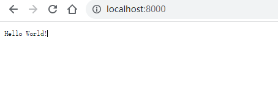

### gin 路由

#### 基本路由

- gin 框架中采用的路由库是基于httprouter做的
- 地址为：https://github.com/julienschmidt/httprouter

```go 
package main

import (
	"github.com/gin-gonic/gin"
	"net/http"
)

func main() {
	// 1. 创建路由 Default() 返回一个已经附加了Logger和Recovery中间件的Engine实例。
	r := gin.Default()
	// 2.绑定路由顾泽铭,执行函数
	// gin.Context, 封装了request 和 response
	r.GET("/", func(c *gin.Context) {
		c.String(http.StatusOK, "Hello World!")
	})
	
	r.POST("/xxxpost", getting)
	r.PUT("/xxxput")
	// 3.监听端口，默认在8080
	// Run("里面不指定端口号默认为8080")
	// Run将路由器连接到http。服务器并开始监听和服务HTTP请求。
	r.Run(":8000")
}

```

#### Restful风格的API

- gin支持Restful风格的API
- 即Representational State Transfer的缩写。直接翻译的意思是"表现层状态转化"，是一种互联网应用程序的API设计理念：URL定位资源，用HTTP描述操作

1.获取文章 /blog/getXxx Get blog/Xxx

2.添加 /blog/addXxx POST blog/Xxx

3.修改 /blog/updateXxx PUT blog/Xxx

4.删除 /blog/delXxxx DELETE blog/Xxx

#### API参数

- 可以通过Context的Param方法来获取API参数
- localhost:8000/xxx/zhangsan

```go
package main

import (
	"github.com/gin-gonic/gin"
	"net/http"
	"strings"
)

func main() {
	r := gin.Default()
	r.GET("/user/:name/*action", func(c *gin.Context) {
		// Param 返回 URL 参数的值
		name := c.Param("name")
		action := c.Param("action")
		// 截取
		action = strings.Trim(action, "/")
		// String 将给定的字符串写入响应体。
		c.String(http.StatusOK, name+" is "+action)
	})
	// 默认监听8080
	r.Run(":8000")
}

```

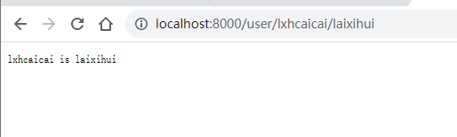

#### URL 参数

- URL参数可以通过DefaultQuery()或Query()方法获取
- DefaultQuery()若参数不村则，返回默认值，Query()若不存在，返回空串
- API ? name=zs

```go
package main

import (
	"fmt"
	"github.com/gin-gonic/gin"
	"net/http"
)

func main() {
	r := gin.Default()
	r.GET("/user", func(c *gin.Context) {
		// 指定默认值
		// http://localhost:8080/user 才会打印出来默认值
		name := c.DefaultQuery("name", "lxhcaicai")
		c.String(http.StatusOK, fmt.Sprintf("hello %s", name))
	})

	r.Run()
}
```

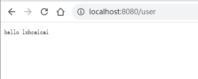

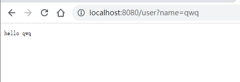

#### 表单参数

- 表单传输为post请求，http常见的传输格式为四种：
  - application/json
  - application/x-www-form-urlencoded
  - application/xml
  - multipart/form-data
- 表单参数可以通过PostForm()方法获取，该方法默认解析的是x-www-form-urlencoded或from-data格式的参数

```html
<!DOCTYPE html>
<html lang="en">
<head>
    <meta charset="UTF-8">
    <meta name="viewport" content="width=device-width, initial-scale=1.0">
    <meta http-equiv="X-UA-Compatible" content="ie=edge">
    <title>Document</title>
</head>
<body>
    <form action="http://localhost:8080/form" method="post" action="application/x-www-form-urlencoded">
        用户名：<input type="text" name="username" placeholder="请输入你的用户名">  <br>
        密&nbsp;&nbsp;&nbsp;码：<input type="password" name="userpassword" placeholder="请输入你的密码">  <br>
        <input type="submit" value="提交">
    </form>
</body>
</html>
```

```go
package main

import (
	"fmt"
	"github.com/gin-gonic/gin"
	"net/http"
)

func main() {
	r := gin.Default()
	r.POST("/form", func(c *gin.Context) {
		// DefaultForm 如果表单存在这个键值的话就返回这个键值，如果不存在的话就返回默认的键值defaultValue
		types := c.DefaultPostForm("type", "post")
		// ：PostForm返回指定的键值，否则返回空字符串' ("")'
		username := c.PostForm("username")
		password := c.PostForm("userpasssword")

		c.String(http.StatusOK, fmt.Sprintf("username:%s, password:%s, type:%s", username, password, types))
	})
	r.Run()
}

```

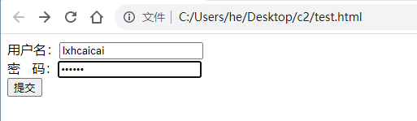

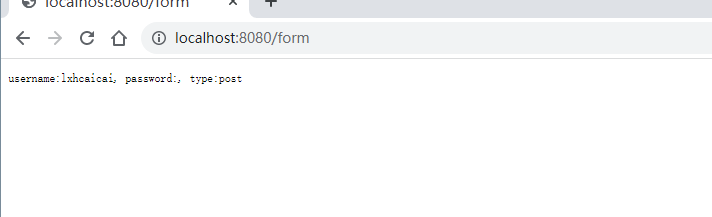

#### 上传单个文件

- multipart/form-data格式用于文件上传
- gin文件上传与原生的net/http方法类似，不同在于gin把原生的request封装到c.Request中

```html
<!DOCTYPE html>
<html lang="en">
<head>
    <meta charset="UTF-8">
    <meta name="viewport" content="width=device-width, initial-scale=1.0">
    <meta http-equiv="X-UA-Compatible" content="ie=edge">
    <title>Document</title>
</head>
<body>
    <form action="http://localhost:8080/upload" method="post" enctype="multipart/form-data">
          上传文件:<input type="file" name="file" >
          <input type="submit" value="提交">
    </form>
</body>
</html>
```

```go
package main

import (
	"github.com/gin-gonic/gin"
	"net/http"
)

func main() {
	r := gin.Default()
	r.MaxMultipartMemory = 8 << 20
	r.POST("/upload", func(c *gin.Context) {
		// FormFile返回提供的表单键的第一个文件。
		file, err := c.FormFile("file")
		if err != nil {
			c.String(500, "上传图片出错")
		}

		// c.JSON(200, gin.H{"message": file.Header.Context})
		c.SaveUploadedFile(file, file.Filename)
		c.String(http.StatusOK, file.Filename)
	})
	r.Run()
}

```

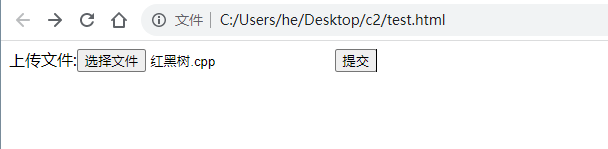

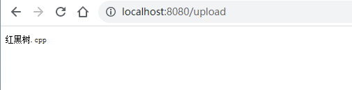

 上传特定文件

有的用户上传文件需要限制上传文件的类型以及上传文件的大小，但是gin框架暂时没有这些函数(也有可能是我没找到)，因此基于原生的函数写法自己写了一个可以限制大小以及文件类型的上传函数

```go
package main

import (
	"fmt"
	"log"
	"net/http"

	"github.com/gin-gonic/gin"
)

func main() {
	r := gin.Default()
	r.POST("/upload", func(c *gin.Context) {
		_, headers, err := c.Request.FormFile("file")
		if err != nil {
			log.Printf("Error when try to get file: %v", err)
		}
		//headers.Size 获取文件大小
		if headers.Size > 1024*1024*2 {
			fmt.Println("文件太大了")
			return
		}
		//headers.Header.Get("Content-Type")获取上传文件的类型
		if headers.Header.Get("Content-Type") != "image/png" {
			fmt.Println("只允许上传png图片")
			return
		}
		c.SaveUploadedFile(headers, "./video/"+headers.Filename)
		c.String(http.StatusOK, headers.Filename)
	})
	r.Run()
}

```

#### 上传多个文件

```html
<!DOCTYPE html>
<html lang="en">
<head>
    <meta charset="UTF-8">
    <meta name="viewport" content="width=device-width, initial-scale=1.0">
    <meta http-equiv="X-UA-Compatible" content="ie=edge">
    <title>Document</title>
</head>
<body>
    <form action="http://localhost:8000/upload" method="post" enctype="multipart/form-data">
          上传文件:<input type="file" name="files" multiple>
          <input type="submit" value="提交">
    </form>
</body>
</html>
```


```go
package main

import (
	"fmt"
	"github.com/gin-gonic/gin"
	"net/http"
)

// gin的helloWorld

func main() {
	// 1.创建路由
	// 默认使用了2个中间件Logger(), Recovery()
	r := gin.Default()
	// 限制表单上传大小 8MB，默认为32MB
	r.MaxMultipartMemory = 8 << 20
	r.POST("/upload", func(c *gin.Context) {

		// MultipartForm 经解析的多部分表单，包括文件上传
		form, err := c.MultipartForm()
		if err != nil {
			c.String(http.StatusBadRequest, fmt.Sprintf("get err %s", err.Error()))
		}
		// 获取所有图片
		files := form.File["files"]
		// 遍历所有图片
		for _, file := range files {
			// 逐个存起来
			if err := c.SaveUploadedFile(file, file.Filename); err != nil {
				// 文件上传错误，返回错误的值
				c.String(http.StatusBadRequest, fmt.Sprintf("upload err %s", err.Error()))
				return
			}
		}
		c.String(200, fmt.Sprintf("upload ok %d files", len(files)))
	})
	//默认端口号是8080
	r.Run(":8000")
}
```

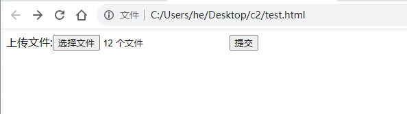

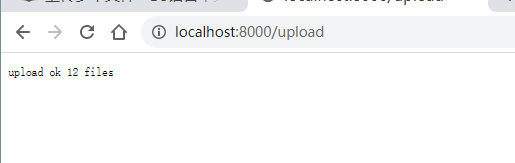

#### routes group

- routes group是为了管理一些相同的URL

```go
package main

import (
	"fmt"
	"github.com/gin-gonic/gin"
)

// gin的helloWorld

func main() {
	// 1.创建路由
	// 默认使用了2个中间件Logger(), Recovery()
	r := gin.Default()
	// 路由组1 ，处理GET请求
	v1 := r.Group("/v1")
	// {} 是书写规范
	{
		v1.GET("/login", login)
		v1.GET("submit", submit)
	}
	v2 := r.Group("/v2")
	{
		v2.POST("/login", login)
		v2.POST("/submit", submit)
	}
	r.Run(":8000")
}

func login(c *gin.Context) {
	name := c.DefaultQuery("name", "jack")
	c.String(200, fmt.Sprintf("hello %s\n", name))
}

func submit(c *gin.Context) {
	name := c.DefaultQuery("name", "lily")
	c.String(200, fmt.Sprintf("hello %s\n", name))
}

```

#### 路由原理

- httproter会将所有路由规则构造一颗前缀树
- 例如有 root and as at cn com


#### 路由拆分与注册

##### 基本的路由注册

下面最基础的gin路由注册方式，适用于路由条目比较少的简单项目或者项目demo。

```go
package main

import (
	"fmt"
	"github.com/gin-gonic/gin"
	"net/http"
)

func helloHandler(c *gin.Context) {
	// type H map[string]any // H是map[string]interface{}的快捷方式
	c.JSON(http.StatusOK, gin.H{
		"message:": "hello world",
	})
}

func main() {
	r := gin.Default()
	r.GET("/lxhcaicai", helloHandler)
	if err := r.Run(); err != nil {
		fmt.Println("startu service failed, err %v", err)
	}
}

```

##### 路由拆分成单独文件或包

当项目的规模增大后就不太适合继续在项目的main.go文件中去实现路由注册相关逻辑了，我们会倾向于把路由部分的代码都拆分出来，形成一个单独的文件或包：

我们在routers.go文件中定义并注册路由信息：

```go
package main

import (
    "net/http"

    "github.com/gin-gonic/gin"
)

func helloHandler(c *gin.Context) {
    c.JSON(http.StatusOK, gin.H{
        "message": "Hello www.topgoer.com!",
    })
}

func setupRouter() *gin.Engine {
    r := gin.Default()
    r.GET("/topgoer", helloHandler)
    return r
}
```

此时main.go中调用上面定义好的setupRouter函数：

```go
func main() {
    r := setupRouter()
    if err := r.Run(); err != nil {
        fmt.Println("startup service failed, err:%v\n", err)
    }
}
```

此时的目录结构：

```
gin_demo
├── go.mod
├── go.sum
├── main.go
└── routers.go
```

把路由部分的代码单独拆分成包的话也是可以的，拆分后的目录结构如下：

```
gin_demo
├── go.mod
├── go.sum
├── main.go
└── routers
    └── routers.go
```

routers/routers.go需要注意此时setupRouter需要改成首字母大写：

```go
package routers

import (
	"github.com/gin-gonic/gin"
	"net/http"
)

func helloHandler(c *gin.Context) {
	c.JSON(http.StatusOK, gin.H{
		"message": "hello world!",
	})
}

// SetupRouter 配置路由信息
func SetupRouter() *gin.Engine {
	// Default 返回 * Engine
	r := gin.Default()
	r.GET("/lxh", helloHandler)
	return r
}

```

main.go文件内容如下：

```go
package main

import (
	"awesomeProject2/routers"
	"fmt"
)

func main() {
	r := routers.SetupRouter()
	if err := r.Run(); err != nil {
		fmt.Printf("startup service failed, err %v\n", err)
	}
}

```


##### 路由拆分成多个文件

当我们的业务规模继续膨胀，单独的一个routers文件或包已经满足不了我们的需求了，

``` go
func SetupRouter() *gin.Engine {
    r := gin.Default()
    r.GET("/topgoer", helloHandler)
  r.GET("/xx1", xxHandler1)
  ...
  r.GET("/xx30", xxHandler30)
    return r
}
```

因为我们把所有的路由注册都写在一个SetupRouter函数中的话就会太复杂了。

我们可以分开定义多个路由文件，例如：

```go
gin_demo
├── go.mod
├── go.sum
├── main.go
└── routers
    ├── blog.go
    └── shop.go
```

routers/shop.go中添加一个LoadShop的函数，将shop相关的路由注册到指定的路由器：

``` go
func LoadShop(e *gin.Engine)  {
    e.GET("/hello", helloHandler)
  e.GET("/goods", goodsHandler)
  e.GET("/checkout", checkoutHandler)
  ...
}
```

在main函数中实现最终的注册逻辑如下：

```  go
func main() {
    r := gin.Default()
    routers.LoadBlog(r)
    routers.LoadShop(r)
    if err := r.Run(); err != nil {
        fmt.Println("startup service failed, err:%v\n", err)
    }
}
```

#####  路由拆分到不同的APP

有时候项目规模实在太大，那么我们就更倾向于把业务拆分的更详细一些，例如把不同的业务代码拆分成不同的APP。

因此我们在项目目录下单独定义一个app目录，用来存放我们不同业务线的代码文件，这样就很容易进行横向扩展。大致目录结构如下：

```
gin_demo
├── app
│   ├── blog
│   │   ├── handler.go
│   │   └── router.go
│   └── shop
│       ├── handler.go
│       └── router.go
├── go.mod
├── go.sum
├── main.go
└── routers
    └── routers.go
```

其中app/blog/router.go用来定义post相关路由信息，具体内容如下：

```go
func Routers(e *gin.Engine) {
    e.GET("/post", postHandler)
    e.GET("/comment", commentHandler)
}
```

app/shop/router.go用来定义shop相关路由信息，具体内容如下：

``` go
func Routers(e *gin.Engine) {
    e.GET("/goods", goodsHandler)
    e.GET("/checkout", checkoutHandler)
}
```

routers/routers.go中根据需要定义Include函数用来注册子app中定义的路由，Init函数用来进行路由的初始化操作：

```go
type Option func(*gin.Engine)

var options = []Option{}

// 注册app的路由配置
func Include(opts ...Option) {
    options = append(options, opts...)
}

// 初始化
func Init() *gin.Engine {
    r := gin.New()
    for _, opt := range options {
        opt(r)
    }
    return r
}
```

main.go中按如下方式先注册子app中的路由，然后再进行路由的初始化：

``` go
func main() {
    // 加载多个APP的路由配置
    routers.Include(shop.Routers, blog.Routers)
    // 初始化路由
    r := routers.Init()
    if err := r.Run(); err != nil {
        fmt.Println("startup service failed, err:%v\n", err)
    }
}
```

### gin 数据解析和绑定

#### 各种数据格式的响应

```go 
package main

import (
	"github.com/gin-gonic/gin"
	"github.com/gin-gonic/gin/testdata/protoexample"
)

// 多种响应方式
func main() {
	// 1.创建路由
	// 默认使用了2个中间件Logger(), Recovery()
	r := gin.Default()
	// 1.json
	r.GET("/someJSON", func(c *gin.Context) {
		c.JSON(200, gin.H{"message": "someJSON", "status": 200})
	})
	// 2. 结构体响应
	r.GET("/someStruct", func(c *gin.Context) {
		var msg struct {
			Name    string
			Message string
			Number  int
		}
		msg.Name = "root"
		msg.Message = "message"
		msg.Number = 123
		c.JSON(200, msg)
	})
	// 3.XML
	r.GET("/someXML", func(c *gin.Context) {
		c.XML(200, gin.H{"message": "abc"})
	})
	// 4.YAML响应
	r.GET("/someYAML", func(c *gin.Context) {
		c.YAML(200, gin.H{"name": "zhangsan"})
	})
	// 5.protobuf格式,谷歌开发的高效存储读取的工具
	// 数组？切片？如果自己构建一个传输格式，应该是什么格式？
	r.GET("/someProtoBuf", func(c *gin.Context) {
		reps := []int64{int64(1), int64(2)}
		// 定义数据
		label := "label"
		// 传protobuf格式数据
		data := &protoexample.Test{
			Label: &label,
			Reps:  reps,
		}
		c.ProtoBuf(200, data)
	})

	r.Run(":8000")
}

```

#### HTML模板渲染

- gin支持加载HTML模板, 然后根据模板参数进行配置并返回相应的数据，本质上就是字符串替换
- LoadHTMLGlob()方法可以加载模板文件

```go
package main

import (
	"net/http"

	"github.com/gin-gonic/gin"
)

func main() {
	r := gin.Default()
	r.LoadHTMLGlob("cehtml/*")
	r.GET("/index", func(c *gin.Context) {
		c.HTML(http.StatusOK, "index.html", gin.H{"title": "我是测试", "ce": "123456"})
	})
	r.Run()
}

```

```html
<!DOCTYPE html>
<html lang="en">
<head>
    <meta charset="UTF-8">
    <meta name="viewport" content="width=device-width, initial-scale=1.0">
    <meta http-equiv="X-UA-Compatible" content="ie=edge">
    <title>{{.title}}</title>
</head>
    <body>
        fgkjdskjdsh{{.ce}}
    </body>
</html>
```

目录结构:

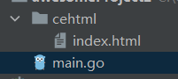

如果你向进行头尾部分离就是下面这种写法了：

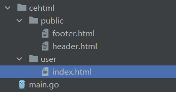

```go
package main

import (
	"net/http"

	"github.com/gin-gonic/gin"
)

func main() {
	r := gin.Default()
	r.LoadHTMLGlob("tem/**/*")
	r.GET("/index", func(c *gin.Context) {
		c.HTML(http.StatusOK, "user/index.html", gin.H{"title": "我是测试", "address": "www.5lmh.com"})
	})
	r.Run()
}

```

`user/index.html`文件代码：

```html
{{ define "user/index.html" }}
{{template "public/header" .}}
        fgkjdskjdsh{{.address}}
{{template "public/footer" .}}
{{ end }}
```

`public/header.html`文件代码：

```html
{{define "public/header"}}
<!DOCTYPE html>
<html lang="en">
<head>
    <meta charset="UTF-8">
    <meta name="viewport" content="width=device-width, initial-scale=1.0">
    <meta http-equiv="X-UA-Compatible" content="ie=edge">
    <title>{{.title}}</title>
</head>
    <body>

{{end}}
```

`public/footer.html`文件代码：

```html
{{define "public/footer"}}
</body>
</html>
{{ end }}
```

- 如果你需要引入静态文件需要定义一个静态文件目录

```
    r.Static("/assets", "./assets")
```

#### 重定向

```go
package main

import (
	"github.com/gin-gonic/gin"
	"net/http"
)

func main() {
	r := gin.Default()
	r.GET("/index", func(c *gin.Context) {
		c.Redirect(http.StatusMovedPermanently, "http://www.baidu.com")
	})
	r.Run()
}

```

#### 同步异步

- goroutine机制可以方便地实现异步处理
- 另外，在启动新的goroutine时，不应该使用原始上下文，必须使用它的只读副

```go
package main

import (
    "log"
    "time"

    "github.com/gin-gonic/gin"
)

func main() {
    // 1.创建路由
    // 默认使用了2个中间件Logger(), Recovery()
    r := gin.Default()
    // 1.异步
    r.GET("/long_async", func(c *gin.Context) {
        // 需要搞一个副本
        copyContext := c.Copy()
        // 异步处理
        go func() {
            time.Sleep(3 * time.Second)
            log.Println("异步执行：" + copyContext.Request.URL.Path)
        }()
    })
    // 2.同步
    r.GET("/long_sync", func(c *gin.Context) {
        time.Sleep(3 * time.Second)
        log.Println("同步执行：" + c.Request.URL.Path)
    })

    r.Run(":8000")
}
```

### gin 中间件

#### 全局中间件

- 所有请求都经过此中间件

```go
package main

import (
    "fmt"
    "time"

    "github.com/gin-gonic/gin"
)

// 定义中间
func MiddleWare() gin.HandlerFunc {
    return func(c *gin.Context) {
        t := time.Now()
        fmt.Println("中间件开始执行了")
        // 设置变量到Context的key中，可以通过Get()取
        c.Set("request", "中间件")
        status := c.Writer.Status()
        fmt.Println("中间件执行完毕", status)
        t2 := time.Since(t)
        fmt.Println("time:", t2)
    }
}

func main() {
    // 1.创建路由
    // 默认使用了2个中间件Logger(), Recovery()
    r := gin.Default()
    // 注册中间件
    r.Use(MiddleWare())
    // {}为了代码规范
    {
        r.GET("/ce", func(c *gin.Context) {
            // 取值
            req, _ := c.Get("request")
            fmt.Println("request:", req)
            // 页面接收
            c.JSON(200, gin.H{"request": req})
        })

    }
    r.Run()
}
```


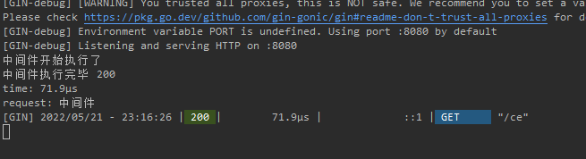

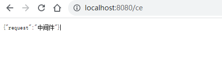

#### Next()方法

```go
package main

import (
	"fmt"
	"time"

	"github.com/gin-gonic/gin"
)

// 定义中间
func MiddleWare() gin.HandlerFunc {
	return func(c *gin.Context) {
		t := time.Now()
		fmt.Println("中间件开始执行了")
		// 设置变量到Context的key中，可以通过Get()取
		c.Set("request", "中间件")

		// 执行函数 ：Next应该只在中间件内部使用。它执行调用处理程序内部链中的挂起处理程序。
		c.Next()
		// 中间件执行完后续的一些事情
		status := c.Writer.Status()
		fmt.Println("中间件执行完毕", status)
		t2 := time.Since(t)
		fmt.Println("time:", t2)
	}
}

func main() {
	// 1.创建路由
	// 默认使用了2个中间件Logger(), Recovery()
	r := gin.Default()
	// 注册中间件
	r.Use(MiddleWare())
	// {}为了代码规范
	{
		r.GET("/ce", func(c *gin.Context) {
			// 取值
			req, _ := c.Get("request")
			fmt.Println("request:", req)
			// 页面接收
			c.JSON(200, gin.H{"request": req})
		})

	}
	r.Run()
}

```

输出结果：

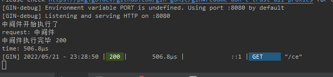

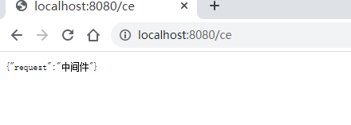

#### 局部中间件

```go
package main

import (
    "fmt"
    "time"

    "github.com/gin-gonic/gin"
)

// 定义中间
func MiddleWare() gin.HandlerFunc {
    return func(c *gin.Context) {
        t := time.Now()
        fmt.Println("中间件开始执行了")
        // 设置变量到Context的key中，可以通过Get()取
        c.Set("request", "中间件")
        // 执行函数
        c.Next()
        // 中间件执行完后续的一些事情
        status := c.Writer.Status()
        fmt.Println("中间件执行完毕", status)
        t2 := time.Since(t)
        fmt.Println("time:", t2)
    }
}

func main() {
    // 1.创建路由
    // 默认使用了2个中间件Logger(), Recovery()
    r := gin.Default()
    //局部中间键使用
    r.GET("/ce", MiddleWare(), func(c *gin.Context) {
        // 取值
        req, _ := c.Get("request")
        fmt.Println("request:", req)
        // 页面接收
        c.JSON(200, gin.H{"request": req})
    })
    r.Run()
}
```

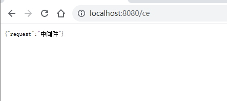

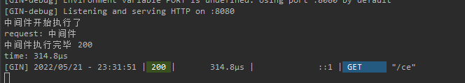

#### 中间件练习

- 定义程序计时中间件，然后定义2个路由，执行函数后应该打印统计的执行时间，如下：

```go
package main

import (
	"fmt"
	"time"

	"github.com/gin-gonic/gin"
)

// 定义中间
func myTime(c *gin.Context) {
	start := time.Now()
	c.Next()
	// 统计时间
	since := time.Since(start)
	fmt.Println("程序用时：", since)
}

func main() {
	// 1.创建路由
	// 默认使用了2个中间件Logger(), Recovery()
	r := gin.Default()
	// 注册中间件
	r.Use(myTime)
	// {}为了代码规范
	shoppingGroup := r.Group("/shopping")
	{
		shoppingGroup.GET("/index", shopIndexHandler)
		shoppingGroup.GET("/home", shopHomeHandler)
	}
	r.Run(":8000")
}

func shopIndexHandler(c *gin.Context) {
	time.Sleep(5 * time.Second)
}

func shopHomeHandler(c *gin.Context) {
	time.Sleep(3 * time.Second)
}

```

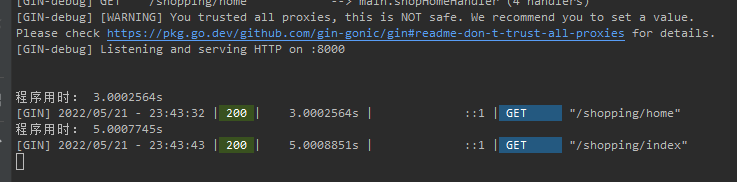

### 中间件推荐

- [RestGate](https://github.com/pjebs/restgate) - REST API端点的安全身份验证
- [staticbin](https://github.com/olebedev/staticbin) - 用于从二进制数据提供静态文件的中间件/处理程序
- [gin-cors](https://github.com/gin-contrib/cors) - CORS杜松子酒的官方中间件
- [gin-csrf](https://github.com/utrack/gin-csrf) - CSRF保护
- [gin-health](https://github.com/utrack/gin-health) - 通过[gocraft/health](https://github.com/gocraft/health)报告的中间件
- [gin-merry](https://github.com/utrack/gin-merry) - 带有上下文的漂亮 [打印](https://github.com/ansel1/merry) 错误的中间件
- [gin-revision](https://github.com/appleboy/gin-revision-middleware) - 用于Gin框架的修订中间件
- [gin-jwt](https://github.com/appleboy/gin-jwt) - 用于Gin框架的JWT中间件
- [gin-sessions](https://github.com/kimiazhu/ginweb-contrib/tree/master/sessions) - 基于mongodb和mysql的会话中间件
- [gin-location](https://github.com/drone/gin-location) - 用于公开服务器的主机名和方案的中间件
- [gin-nice-recovery](https://github.com/ekyoung/gin-nice-recovery) - 紧急恢复中间件，可让您构建更好的用户体验
- [gin-limit](https://github.com/aviddiviner/gin-limit) - 限制同时请求；可以帮助增加交通流量
- [gin-limit-by-key](https://github.com/yangxikun/gin-limit-by-key) - 一种内存中的中间件，用于通过自定义键和速率限制访问速率。
- [ez-gin-template](https://github.com/michelloworld/ez-gin-template) - gin简单模板包装
- [gin-hydra](https://github.com/janekolszak/gin-hydra) - gin中间件[Hydra](https://github.com/ory-am/hydra)
- [gin-glog](https://github.com/zalando/gin-glog) - 旨在替代Gin的默认日志
- [gin-gomonitor](https://github.com/zalando/gin-gomonitor) - 用于通过Go-Monitor公开指标
- [gin-oauth2](https://github.com/zalando/gin-oauth2) - 用于OAuth2
- [static](https://github.com/hyperboloide/static) gin框架的替代静态资产处理程序。
- [xss-mw](https://github.com/dvwright/xss-mw) - XssMw是一种中间件，旨在从用户提交的输入中“自动删除XSS”
- [gin-helmet](https://github.com/danielkov/gin-helmet) - 简单的安全中间件集合。
- [gin-jwt-session](https://github.com/ScottHuangZL/gin-jwt-session) - 提供JWT / Session / Flash的中间件，易于使用，同时还提供必要的调整选项。也提供样品。
- [gin-template](https://github.com/foolin/gin-template) - 用于gin框架的html / template易于使用。
- [gin-redis-ip-limiter](https://github.com/Salvatore-Giordano/gin-redis-ip-limiter) - 基于IP地址的请求限制器。它可以与redis和滑动窗口机制一起使用。
- [gin-method-override](https://github.com/bu/gin-method-override) - _method受Ruby的同名机架启发而被POST形式参数覆盖的方法
- [gin-access-limit](https://github.com/bu/gin-access-limit) - limit-通过指定允许的源CIDR表示法的访问控制中间件。
- [gin-session](https://github.com/go-session/gin-session) - 用于Gin的Session中间件
- [gin-stats](https://github.com/semihalev/gin-stats) - 轻量级和有用的请求指标中间件
- [gin-statsd](https://github.com/amalfra/gin-statsd) - 向statsd守护进程报告的Gin中间件
- [gin-health-check](https://github.com/RaMin0/gin-health-check) - check-用于Gin的健康检查中间件
- [gin-session-middleware](https://github.com/go-session/gin-session) - 一个有效，安全且易于使用的Go Session库。
- [ginception](https://github.com/kubastick/ginception) - 漂亮的例外页面
- [gin-inspector](https://github.com/fatihkahveci/gin-inspector) - 用于调查http请求的Gin中间件。
- [gin-dump](https://github.com/tpkeeper/gin-dump) - Gin中间件/处理程序，用于转储请求和响应的标头/正文。对调试应用程序非常有帮助。
- [go-gin-prometheus](https://github.com/zsais/go-gin-prometheus) - Gin Prometheus metrics exporter
- [ginprom](https://github.com/chenjiandongx/ginprom) - Gin的Prometheus指标导出器
- [gin-go-metrics](https://github.com/bmc-toolbox/gin-go-metrics) - Gin middleware to gather and store metrics using [rcrowley/go-metrics](https://github.com/rcrowley/go-metrics)
- [ginrpc](https://github.com/xxjwxc/ginrpc) - Gin 中间件/处理器自动绑定工具。通过像beego这样的注释路线来支持对象注册