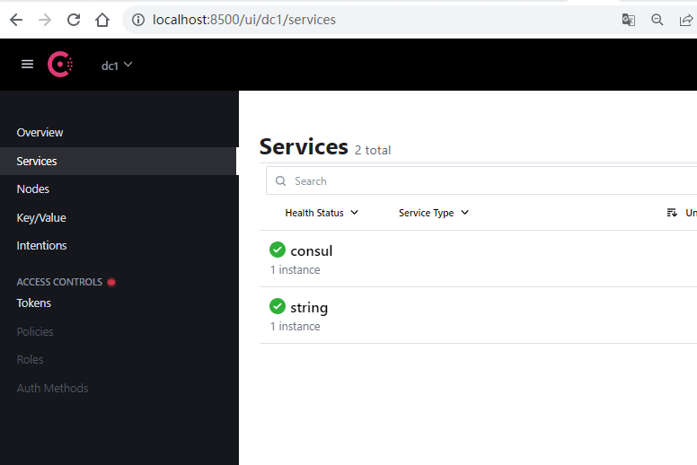

# 算法刷题

## [小国王](https://www.acwing.com/problem/content/1066/)

状态压缩DP

```c++
#include <bits/stdc++.h>

using namespace std;
using LL = long long;

const int N = 12, M = 12 * 12, S = 1 << 10;

LL f[N][M][S]; //f[i][j][s] 表示第 i 行 一共摆放了 j 个且第 i 行状态为 s 的方案数
vector<int> state;
vector<int> head[M];
int cnt[S];
int n, m;

// 检测合法状态
bool check(int state) {
    for(int i = 0; i < n; i ++) {
        if ((state >> i & 1) && (state >> (i + 1 )& 1)) 
            return false;
    }
    return true;
}

// 计算同一行的1的个数
int count(int x) {
    int ans = 0;
    for(int i = 0; i < n; i ++) 
        ans += (x >> i & 1);
    return ans;
}

int main() {
    cin >> n >> m;
    
    for(int i = 0; i < (1 << n); i ++) {
        if(check(i)) {
            state.push_back(i);
            cnt[i] = count(i);
        }
    }
    
    for(int i = 0; i < state.size(); i ++) {
        for(int j = 0; j < state.size(); j ++) {
            int a = state[i], b = state[j];
            if((a & b) == 0 && check(a | b)) {
                head[i].push_back(j);
            }
        }
    }
    
    f[0][0][0] = 1;
    for(int i = 1; i <= n + 1; i ++) {
        for(int j = 0; j <= m; j ++) {
            for(int a = 0; a < state.size(); a ++) {
                for(int b : head[a]){
                    int c = cnt[state[b]];
                    if (j >= c) 
                        f[i][j][b] += f[i - 1][j- c][a];
                } 
            }
        }
    }
    
    cout << f[n + 1][m][0] << endl;
    
}
```


# 技术学习

## 基于服务注册与发现的string-service

目录如下


### service层

service.go

```go
package service

import (
	"errors"
	"strings"
)

// Service constants
const (
	StrMaxSize = 1024
)

// Service errors
var (
	ErrMaxSize = errors.New("maximum size of 1024 bytes exceeded")

	ErrStrValue = errors.New("maximum size of 1024 bytes exceeded")
)

// Service Define a service interface
type Service interface {
	// Concat a and b
	// 连接字符串 a 和 b
	Concat(a, b string) (string, error)

	// a,b pkg string value
	// 获取a 和 b 的公共字符
	Diff(a, b string) (string, error)

	// HealthCheck check service health status
	HealthCheck() bool
}

//ArithmeticService implement Service interface
type StringService struct {
}

func (s StringService) Concat(a, b string) (string, error) {
	// test for length overflow
	if len(a)+len(b) > StrMaxSize {
		return "", ErrMaxSize
	}
	return a + b, nil
}

func (s StringService) Diff(a, b string) (string, error) {
	if len(a) < 1 || len(b) < 1 {
		return "", nil
	}
	res := ""
	if len(a) >= len(b) {
		for _, char := range b {
			if strings.Contains(a, string(char)) {
				res = res + string(char)
			}
		}
	} else {
		for _, char := range a {
			if strings.Contains(b, string(char)) {
				res = res + string(char)
			}
		}
	}
	return res, nil
}

// HealthCheck implement Service method
// 用于检查服务的健康状态，这里仅仅返回true。
func (s StringService) HealthCheck() bool {
	return true
}

// ServiceMiddleware define service middleware
type ServiceMiddleware func(Service) Service

```

### plugins层

每当方法被调用时都会有对应的日志输出

logging.go

```go
package service

import (
	"errors"
	"strings"
)

// Service constants
const (
	StrMaxSize = 1024
)

// Service errors
var (
	ErrMaxSize = errors.New("maximum size of 1024 bytes exceeded")

	ErrStrValue = errors.New("maximum size of 1024 bytes exceeded")
)

// Service Define a service interface
type Service interface {
	// Concat a and b
	// 连接字符串 a 和 b
	Concat(a, b string) (string, error)

	// a,b pkg string value
	// 获取a 和 b 的公共字符
	Diff(a, b string) (string, error)

	// HealthCheck check service health status
	HealthCheck() bool
}

//ArithmeticService implement Service interface
type StringService struct {
}

func (s StringService) Concat(a, b string) (string, error) {
	// test for length overflow
	if len(a)+len(b) > StrMaxSize {
		return "", ErrMaxSize
	}
	return a + b, nil
}

func (s StringService) Diff(a, b string) (string, error) {
	if len(a) < 1 || len(b) < 1 {
		return "", nil
	}
	res := ""
	if len(a) >= len(b) {
		for _, char := range b {
			if strings.Contains(a, string(char)) {
				res = res + string(char)
			}
		}
	} else {
		for _, char := range a {
			if strings.Contains(b, string(char)) {
				res = res + string(char)
			}
		}
	}
	return res, nil
}

// HealthCheck implement Service method
// 用于检查服务的健康状态，这里仅仅返回true。
func (s StringService) HealthCheck() bool {
	return true
}

// ServiceMiddleware define service middleware
type ServiceMiddleware func(Service) Service

```

### endpoint层

```go
package endpoint

import (
	"context"
	"errors"
	"github.com/go-kit/kit/endpoint"
	"github.com/longjoy/micro-go-book/ch10-resiliency/string-service/service"
	"strings"
)

// StringEndpoint define endpoint
type StringEndpoints struct {
	StringEndpoint      endpoint.Endpoint
	HealthCheckEndpoint endpoint.Endpoint
}


var (
	ErrInvalidRequestType = errors.New("RequestType has only two type: Concat, Diff")
)

// StringRequest define request struct
type StringRequest struct {
	RequestType string `json:"request_type"`
	A           string `json:"a"`
	B           string `json:"b"`
}

// StringResponse define response struct
type StringResponse struct {
	Result string `json:"result"`
	Error  error  `json:"error"`
}

// MakeStringEndpoint make endpoint
func MakeStringEndpoint(svc service.Service) endpoint.Endpoint {
	return func(ctx context.Context, request interface{}) (response interface{}, err error) {
		req := request.(StringRequest)

		var (
			res, a, b string
			opError   error
		)

		a = req.A
		b = req.B
		// 根据请求操作类型请求具体的操作方法
		if strings.EqualFold(req.RequestType, "Concat") {
			res, _ = svc.Concat(a, b)
		} else if strings.EqualFold(req.RequestType, "Diff") {
			res, _ = svc.Diff(a, b)
		} else {
			return nil, ErrInvalidRequestType
		}

		return StringResponse{Result: res, Error: opError}, nil
	}
}

// HealthRequest 健康检查请求结构
type HealthRequest struct{}

// HealthResponse 健康检查响应结构
type HealthResponse struct {
	Status bool `json:"status"`
}

// MakeHealthCheckEndpoint 创建健康检查Endpoint
func MakeHealthCheckEndpoint(svc service.Service) endpoint.Endpoint {
	return func(ctx context.Context, request interface{}) (response interface{}, err error) {
		status := svc.HealthCheck()
		return HealthResponse{status}, nil
	}
}

```

### config层

config.go

``` go
package config

import (
	kitlog "github.com/go-kit/kit/log"
	"log"
	"os"
)


var Logger *log.Logger
var KitLogger kitlog.Logger


func init() {
	Logger = log.New(os.Stderr, "", log.LstdFlags)

	KitLogger = kitlog.NewLogfmtLogger(os.Stderr)
	KitLogger = kitlog.With(KitLogger, "ts", kitlog.DefaultTimestampUTC)
	KitLogger = kitlog.With(KitLogger, "caller", kitlog.DefaultCaller)


}
```

### discover层

discover_client.go

```go
package discover

import (
	"log"
)

type DiscoveryClient interface {

	/**
	 * 服务注册接口
	 * @param serviceName 服务名
	 * @param instanceId 服务实例Id
	 * @param instancePort 服务实例端口
	 * @param healthCheckUrl 健康检查地址
	 * @param instanceHost 服务实例地址
	 * @param meta 服务实例元数据
	 */
	Register(serviceName, instanceId, healthCheckUrl string, instanceHost string, instancePort int, meta map[string]string, logger *log.Logger) bool

	/**
	 * 服务注销接口
	 * @param instanceId 服务实例Id
	 */
	DeRegister(instanceId string, logger *log.Logger) bool

	/**
	 * 发现服务实例接口
	 * @param serviceName 服务名
	 */
	DiscoverServices(serviceName string, logger *log.Logger) []interface{}
}


```

kit_discover_client.go

```go
package discover

import (
	"github.com/go-kit/kit/sd/consul"
	"github.com/hashicorp/consul/api"
	"github.com/hashicorp/consul/api/watch"
	"log"
	"strconv"
	"sync"
)

type KitDiscoverClient struct {
	Host   string // Consul Host
	Port   int    // Consul Port
	client consul.Client
	// 连接 consul 的配置
	config *api.Config
	mutex sync.Mutex
	// 服务实例缓存字段
	instancesMap sync.Map
}

func NewKitDiscoverClient(consulHost string, consulPort int) (DiscoveryClient, error) {
	// 通过 Consul Host 和 Consul Port 创建一个 consul.Client
	consulConfig := api.DefaultConfig()
	consulConfig.Address = consulHost + ":" + strconv.Itoa(consulPort)
	apiClient, err := api.NewClient(consulConfig)
	if err != nil {
		return nil, err
	}
	client := consul.NewClient(apiClient)
	return &KitDiscoverClient{
		Host:   consulHost,
		Port:   consulPort,
		config:consulConfig,
		client: client,
	}, err
}

func (consulClient *KitDiscoverClient) Register(serviceName, instanceId, healthCheckUrl string, instanceHost string, instancePort int, meta map[string]string, logger *log.Logger) bool {

	// 1. 构建服务实例元数据
	serviceRegistration := &api.AgentServiceRegistration{
		ID:      instanceId,
		Name:    serviceName,
		Address: instanceHost,
		Port:    instancePort,
		Meta:    meta,
		Check: &api.AgentServiceCheck{
			DeregisterCriticalServiceAfter: "30s",
			HTTP:                           "http://" + instanceHost + ":" + strconv.Itoa(instancePort) + healthCheckUrl,
			Interval:                       "15s",
		},
	}

	// 2. 发送服务注册到 Consul 中
	err := consulClient.client.Register(serviceRegistration)

	if err != nil {
		log.Println("Register Service Error!")
		return false
	}
	log.Println("Register Service Success!")
	return true
}

func (consulClient *KitDiscoverClient) DeRegister(instanceId string, logger *log.Logger) bool {

	// 构建包含服务实例 ID 的元数据结构体
	serviceRegistration := &api.AgentServiceRegistration{
		ID: instanceId,
	}
	// 发送服务注销请求
	err := consulClient.client.Deregister(serviceRegistration)

	if err != nil {
		logger.Println("Deregister Service Error!")
		return false
	}
	log.Println("Deregister Service Success!")

	return true
}

func (consulClient *KitDiscoverClient) DiscoverServices(serviceName string, logger *log.Logger) []interface{} {

	//  该服务已监控并缓存
	instanceList, ok := consulClient.instancesMap.Load(serviceName)
	if ok {
		return instanceList.([]interface{})
	}
	// 申请锁
	consulClient.mutex.Lock()
	// 再次检查是否监控
	instanceList, ok = consulClient.instancesMap.Load(serviceName)
	if ok {
		return instanceList.([]interface{})
	} else {
		// 注册监控
		go func() {
			// 使用 consul 服务实例监控来监控某个服务名的服务实例列表变化
			params := make(map[string]interface{})
			params["type"] = "service"
			params["service"] = serviceName
			plan, _ := watch.Parse(params)
			plan.Handler = func(u uint64, i interface{}) {
				if i == nil {
					return
				}
				v, ok := i.([]*api.ServiceEntry)
				if !ok {
					return // 数据异常，忽略
				}
				// 没有服务实例在线
				if len(v) == 0 {
					consulClient.instancesMap.Store(serviceName, []interface{}{})
				}
				var healthServices []interface{}
				for _, service := range v {
					if service.Checks.AggregatedStatus() == api.HealthPassing {
						healthServices = append(healthServices, service.Service)
					}
				}
				consulClient.instancesMap.Store(serviceName, healthServices)
			}
			defer plan.Stop()
			plan.Run(consulClient.config.Address)
		}()
	}
	defer consulClient.mutex.Unlock()

	// 根据服务名请求服务实例列表
	entries, _, err := consulClient.client.Service(serviceName, "", false, nil)
	if err != nil {
		consulClient.instancesMap.Store(serviceName, []interface{}{})
		logger.Println("Discover Service Error!")
		return nil
	}
	instances := make([]interface{}, len(entries))
	for i := 0; i < len(instances); i++ {
		instances[i] = entries[i].Service
	}
	consulClient.instancesMap.Store(serviceName, instances)
	return instances
}

```

### main.go

```go
package main

import (
	"context"
	"flag"
	"fmt"
	uuid "github.com/satori/go.uuid"
	"net/http"
	"os"
	"os/signal"
	"strconv"
	"string-service/config"
	"string-service/discover"
	"string-service/endpoint"
	"string-service/plugins"
	"string-service/service"
	"string-service/transport"
	"syscall"
)

func main() {

	// 获取命令行参数
	var (
		servicePort = flag.Int("service.port", 10085, "service port")
		serviceHost = flag.String("service.host", "127.0.0.1", "service host")
		consulPort  = flag.Int("consul.port", 8500, "consul port")
		consulHost  = flag.String("consul.host", "127.0.0.1", "consul host")
		serviceName = flag.String("service.name", "string", "service name")
	)

	flag.Parse()

	ctx := context.Background()
	errChan := make(chan error)
	var discoveryClient discover.DiscoveryClient
	discoveryClient, err := discover.NewKitDiscoverClient(*consulHost, *consulPort)

	if err != nil {
		config.Logger.Println("Get Consul Client failed")
		os.Exit(-1)

	}
	var svc service.Service
	svc = service.StringService{}
	// add logging middleware
	svc = plugins.LoggingMiddleware(config.KitLogger)(svc)

	stringEndpoint := endpoint.MakeStringEndpoint(svc)

	//创建健康检查的Endpoint
	healthEndpoint := endpoint.MakeHealthCheckEndpoint(svc)

	//把算术运算Endpoint和健康检查Endpoint封装至StringEndpoints
	endpts := endpoint.StringEndpoints{
		StringEndpoint:      stringEndpoint,
		HealthCheckEndpoint: healthEndpoint,
	}

	//创建http.Handler
	r := transport.MakeHttpHandler(ctx, endpts, config.KitLogger)

	instanceId := *serviceName + "-" + uuid.NewV4().String()

	//http server
	go func() {

		config.Logger.Println("Http Server start at port:" + strconv.Itoa(*servicePort))
		//启动前执行注册
		if !discoveryClient.Register(*serviceName, instanceId, "/health", *serviceHost, *servicePort, nil, config.Logger) {
			config.Logger.Printf("string-service for service %s failed.", serviceName)
			// 注册失败，服务启动失败
			os.Exit(-1)
		}
		handler := r
		errChan <- http.ListenAndServe(":"+strconv.Itoa(*servicePort), handler)
	}()

	go func() {
		c := make(chan os.Signal, 1)
		signal.Notify(c, syscall.SIGINT, syscall.SIGTERM)
		errChan <- fmt.Errorf("%s", <-c)
	}()

	error := <-errChan
	//服务退出取消注册
	discoveryClient.DeRegister(instanceId, config.Logger)
	config.Logger.Println(error)
}

```

在终端上输入

```shell
consul agent -dev
```

 

打开 `localhost:8500`

