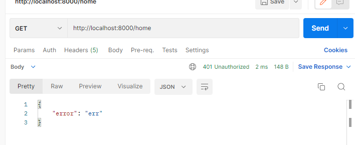
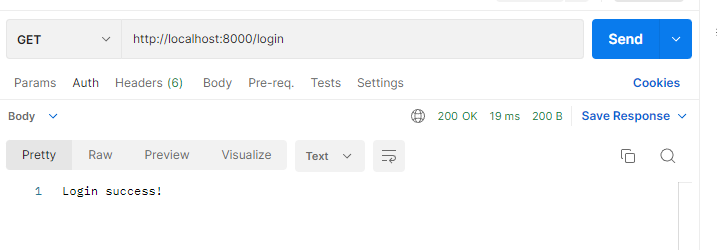
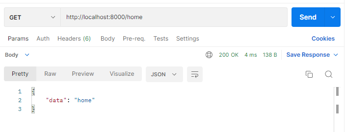
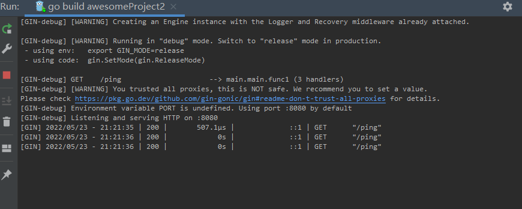
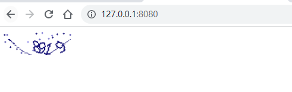
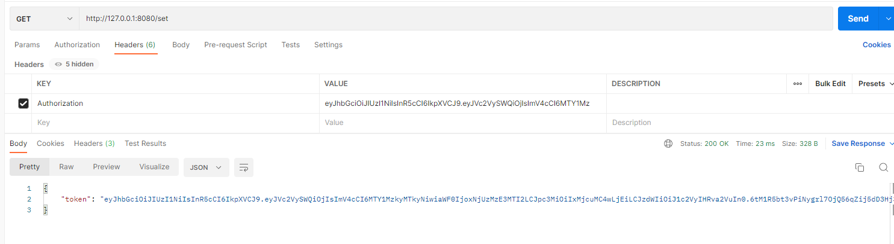
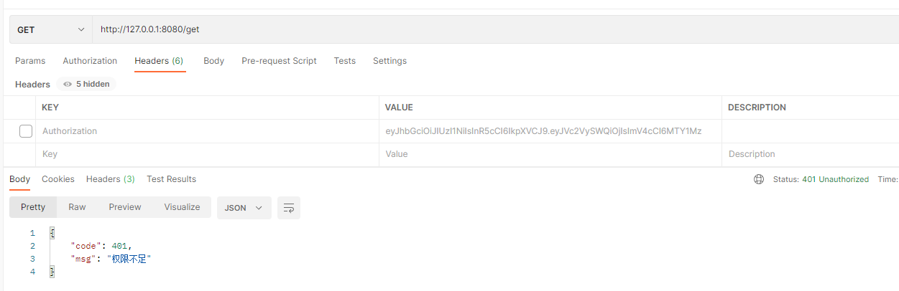
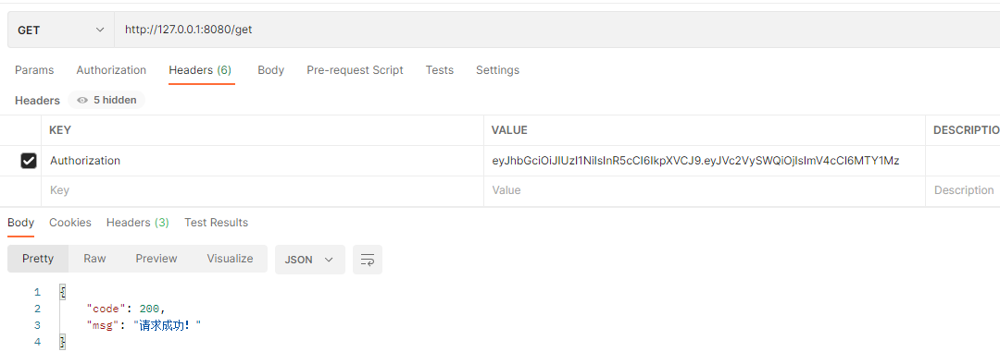

# 算法刷题

[最长回文子串](https://www.acwing.com/problem/content/description/1526)

Go 版本

```go
package main

import (
	"bufio"
	"fmt"
	"os"
)

const (
	N    int    = 1e5 + 100
	base uint64 = 131
)

var (
	f1 [N]uint64
	f2 [N]uint64
	p  [N]uint64
)

func hash1(l, r int) uint64 {
	return f1[r] - f1[l-1]*p[r-l+1]
}

func hash2(l, r int) uint64 {
	return f2[l] - f2[r+1]*p[r-l+1]
}

func main() {
	reader := bufio.NewReader(os.Stdin)
	// 从ReadLine返回的文本不包括行尾回车，读入一行包含空格
	s, _, _ := reader.ReadLine()
	ss := string(s)
	ss = "#" + ss
	n := len(ss) - 1

	f1[0], f2[n+1], p[0] = 0, 0, 1
	for i := 1; i <= n; i++ {
		f1[i] = f1[i-1]*base + uint64(ss[i]-' ')
		p[i] = p[i-1] * base
	}

	for i := n; i > 0; i-- {
		f2[i] = f2[i+1]*base + uint64(ss[i]-' ')
	}

	min := func(a, b int) int {
		if a > b {
			return b
		}
		return a
	}

	max := func(a, b int) int {
		if a < b {
			return b
		}
		return a
	}

	ans := 0
	for i := 1; i <= n; i++ {
		// 这里的长度是 i - 1 和 n - i 比较 
		l, r := 0, min(i-1, n-i)
		res := 0

		for l <= r {
			mid := (l + r) >> 1
			if hash1(i-mid, i-1) == hash2(i+1, i+mid) {
				l = mid + 1
				res = mid
			} else {
				r = mid - 1
			}
		}
		ans = max(ans, 2*res+1)
		// 这里的长度是 i 和 n - i 比较 
		l, r = 0, min(i, n-i)
		for l <= r {
			mid := (l + r) >> 1
			if hash1(i-mid+1, i) == hash2(i+1, i+mid) {
				l = mid + 1
				res = mid
			} else {
				r = mid - 1
			}
		}
		ans = max(ans, 2*res)
	}
	fmt.Println(ans)
}

```


# 技术学习

## gin 框架

### 会话控制

#### Cookie介绍

- HTTP是无状态协议，服务器不能记录浏览器的访问状态，也就是说服务器不能区分两次请求是否由同一个客户端发出
- Cookie就是解决HTTP协议无状态的方案之一，中文是小甜饼的意思
- Cookie实际上就是服务器保存在浏览器上的一段信息。浏览器有了Cookie之后，每次向服务器发送请求时都会同时将该信息发送给服务器，服务器收到请求后，就可以根据该信息处理请求
- Cookie由服务器创建，并发送给浏览器，最终由浏览器保存

**Cookie的用途**

- 测试服务端发送cookie给客户端，客户端请求时携带cookie

#### Cookie的使用

```go
package main

import (
	"fmt"
	"github.com/gin-gonic/gin"
)

func main() {
	// 1.创建路由
	// 默认使用了2个中间件Logger(), Recovery()
	r := gin.Default()
	// 服务端要给客户端cookie
	r.GET("cookie", func(c *gin.Context) {
		// 获取客户端是否携带cookie
		cookie, err := c.Cookie("key_cookie")
		if err != nil {
			cookie = "NotSet"
			// 给客户端设置cookie
			//  maxAge int, 单位为秒
			// path,cookie所在目录
			// domain string,域名
			//   secure 是否智能通过https访问
			// httpOnly bool  是否允许别人通过js获取自己的cookie
			c.SetCookie("key_cookie", "value_cookie", 60, "/",
				"localhost", false, true)
		}
		fmt.Printf("cookie的值是： %s\n", cookie)
	})
	r.Run(":8000")
}

```

#### Cookie 练习

- 模拟实现权限验证中间件
  - 有2个路由，login和home
  - login用于设置cookie
  - home是访问查看信息的请求
  - 在请求home之前，先跑中间件代码，检验是否存在cookie
- 访问home，会显示错误，因为权限校验未通过







```go
package main

import (
	"github.com/gin-gonic/gin"
	"net/http"
)

func AuthMiddleWare() gin.HandlerFunc {
	return func(c *gin.Context) {
		// 获取客户端cookie并校验
		if cookie, err := c.Cookie("abc"); err == nil {
			if cookie == "123" {
				c.Next()
				return
			}
		}
		// 返回错误
		c.JSON(http.StatusUnauthorized, gin.H{"error": "err"})
		// 若验证不通过，不再调用后续的函数处理
		c.Abort()
		return
	}
}

func main() {
	// 1.创建路由
	r := gin.Default()
	r.GET("/login", func(c *gin.Context) {
		// 设置cookie
		c.SetCookie("abc", "123", 60, "/",
			"localhost", false, true)
		// 返回信息
		c.String(200, "Login success!")
	})
	r.GET("/home", AuthMiddleWare(), func(c *gin.Context) {
		c.JSON(200, gin.H{"data": "home"})
	})
	r.Run(":8000")
}

```

#### Cookie的缺点

- 不安全，明文
- 增加带宽消耗
- 可以被禁用
- cookie有上限

#### Sessions

gorilla/sessions为自定义session后端提供cookie和文件系统session以及基础结构。

主要功能是：

- 简单的API：将其用作设置签名（以及可选的加密）cookie的简便方法。
- 内置的后端可将session存储在cookie或文件系统中。
- Flash消息：一直持续读取的session值。
- 切换session持久性（又称“记住我”）和设置其他属性的便捷方法。
- 旋转身份验证和加密密钥的机制。
- 每个请求有多个session，即使使用不同的后端也是如此。
- 自定义session后端的接口和基础结构：可以使用通用API检索并批量保存来自不同商店的session。

```go
package main

import (
    "fmt"
    "net/http"

    "github.com/gorilla/sessions"
)

// 初始化一个cookie存储对象
// something-very-secret应该是一个你自己的密匙，只要不被别人知道就行
var store = sessions.NewCookieStore([]byte("something-very-secret"))

func main() {
    http.HandleFunc("/save", SaveSession)
    http.HandleFunc("/get", GetSession)
    err := http.ListenAndServe(":8080", nil)
    if err != nil {
        fmt.Println("HTTP server failed,err:", err)
        return
    }
}

func SaveSession(w http.ResponseWriter, r *http.Request) {
    // Get a session. We're ignoring the error resulted from decoding an
    // existing session: Get() always returns a session, even if empty.

    //　获取一个session对象，session-name是session的名字
    session, err := store.Get(r, "session-name")
    if err != nil {
        http.Error(w, err.Error(), http.StatusInternalServerError)
        return
    }

    // 在session中存储值
    session.Values["foo"] = "bar"
    session.Values[42] = 43
    // 保存更改
    session.Save(r, w)
}
func GetSession(w http.ResponseWriter, r *http.Request) {
    session, err := store.Get(r, "session-name")
    if err != nil {
        http.Error(w, err.Error(), http.StatusInternalServerError)
        return
    }
    foo := session.Values["foo"]
    fmt.Println(foo)
}
```

删除session的值：

```go
    // 删除
    // 将session的最大存储时间设置为小于零的数即为删除
    session.Options.MaxAge = -1
    session.Save(r, w)
```

### 参数验证

#### 结构体验证

用gin框架的数据验证，可以不用解析数据，减少if else，会简洁许多。

```go
package main

import (
    "fmt"
    "time"

    "github.com/gin-gonic/gin"
)

//Person ..
type Person struct {
    //不能为空并且大于10
    Age      int       `form:"age" binding:"required,gt=10"`
    Name     string    `form:"name" binding:"required"`
    Birthday time.Time `form:"birthday" time_format:"2006-01-02" time_utc:"1"`
}

func main() {
    r := gin.Default()
    r.GET("/qwq", func(c *gin.Context) {
        var person Person
        if err := c.ShouldBind(&person); err != nil {
            c.String(500, fmt.Sprint(err))
            return
        }
        c.String(200, fmt.Sprintf("%#v", person))
    })
    r.Run()
}
```

演示地址：

```
http://localhost:8080/qwq?age=11&name=lxhcaicai&birthday=1999-09-16
```

### 其他

#### 日志文件

```go
package main

import (
    "io"
    "os"

    "github.com/gin-gonic/gin"
)

func main() {
    gin.DisableConsoleColor()

    // Logging to a file.
    f, _ := os.Create("gin.log")
    gin.DefaultWriter = io.MultiWriter(f)

    // 如果需要同时将日志写入文件和控制台，请使用以下代码。
    // gin.DefaultWriter = io.MultiWriter(f, os.Stdout)
    r := gin.Default()
    r.GET("/ping", func(c *gin.Context) {
        c.String(200, "pong")
    })
    r.Run()
}
```

效果演示:



#### Air 实时加载

本章我们要介绍一个神器——Air能够实时监听项目的代码文件，在代码发生变更之后自动重新编译并执行，大大提高gin框架项目的开发效率

**为什么需要实时加载**

之前使用Python编写Web项目的时候，常见的Flask或Django框架都是支持实时加载的，你修改了项目代码之后，程序能够自动重新加载并执行（live-reload），这在日常的开发阶段是十分方便的。

在使用Go语言的gin框架在本地做开发调试的时候，经常需要在变更代码之后频繁的按下Ctrl+C停止程序并重新编译再执行，这样就不是很方便。

**Air介绍**

怎样才能在基于gin框架开发时实现实时加载功能呢？像这种烦恼肯定不会只是你一个人的烦恼，所以我报着肯定有现成轮子的心态开始了全网大搜索。果不其然就在Github上找到了一个工具：Air[1]。它支持以下特性：

- 彩色日志输出
- 自定义构建或二进制命令
- 支持忽略子目录
- 启动后支持监听新目录
- 更好的构建过程

**安装Air**

 Go

这也是最经典的安装方式：

```
    go get -u github.com/cosmtrek/air
```

 MacOS

```
    curl -fLo air https://git.io/darwin_air
```

 Linux

```
    curl -fLo air https://git.io/linux_air
```

Windows

```
    curl -fLo air.exe https://git.io/windows_air
```

 Docker

```
docker run -it --rm \
    -w "<PROJECT>" \
    -e "air_wd=<PROJECT>" \
    -v $(pwd):<PROJECT> \
    -p <PORT>:<APP SERVER PORT> \
    cosmtrek/air
    -c <CONF>
```

然后按照下面的方式在docker中运行你的项目：

```
docker run -it --rm \
    -w "/go/src/github.com/cosmtrek/hub" \
    -v $(pwd):/go/src/github.com/cosmtrek/hub \
    -p 9090:9090 \
    cosmtrek/air
```

**使用Air**

为了敲命令更简单更方便，你应该把`alias air='~/.air'`加到你的`.bashrc`或`.zshrc`中。

首先进入你的项目目录：

首先进入你的项目目录：

```
    cd /path/to/your_project
```

最简单的用法就是直接执行下面的命令：

```
# 首先在当前目录下查找 `.air.conf`配置文件，如果找不到就使用默认的
air -c .air.conf
```

推荐的使用方法是：

```
# 1. 在当前目录创建一个新的配置文件.air.conf
touch .air.conf

# 2. 复制 `air.conf.example` 中的内容到这个文件，然后根据你的需要去修改它

# 3. 使用你的配置运行 air, 如果文件名是 `.air.conf`，只需要执行 `air`。
air
```

####  air_example.conf示例

完整的air_example.conf示例配置如下，可以根据自己的需要修改。

```
# [Air](https://github.com/cosmtrek/air) TOML 格式的配置文件

# 工作目录
# 使用 . 或绝对路径，请注意 `tmp_dir` 目录必须在 `root` 目录下
root = "."
tmp_dir = "tmp"

[build]
# 只需要写你平常编译使用的shell命令。你也可以使用 `make`
cmd = "go build -o ./tmp/main ."
# 由`cmd`命令得到的二进制文件名
bin = "tmp/main"
# 自定义的二进制，可以添加额外的编译标识例如添加 GIN_MODE=release
full_bin = "APP_ENV=dev APP_USER=air ./tmp/main"
# 监听以下文件扩展名的文件.
include_ext = ["go", "tpl", "tmpl", "html"]
# 忽略这些文件扩展名或目录
exclude_dir = ["assets", "tmp", "vendor", "frontend/node_modules"]
# 监听以下指定目录的文件
include_dir = []
# 排除以下文件
exclude_file = []
# 如果文件更改过于频繁，则没有必要在每次更改时都触发构建。可以设置触发构建的延迟时间
delay = 1000 # ms
# 发生构建错误时，停止运行旧的二进制文件。
stop_on_error = true
# air的日志文件名，该日志文件放置在你的`tmp_dir`中
log = "air_errors.log"

[log]
# 显示日志时间
time = true

[color]
# 自定义每个部分显示的颜色。如果找不到颜色，使用原始的应用程序日志。
main = "magenta"
watcher = "cyan"
build = "yellow"
runner = "green"

[misc]
# 退出时删除tmp目录
clean_on_exit = true
```

#### gin 验证码

在开发的过程中，我们有些接口为了防止被恶意调用，我们会采用加验证码的方式，例如：发送短信的接口，为了防止短信接口被频繁调用造成损失；注册的接口，为了防止恶意注册。在这里为大家推荐一个验证码的类库，方便大家学习使用。

```
     github.com/dchest/captcha
```

web端是怎么实现验证码的功能呢？

- 提供一个路由，先在session里写入键值对（k->v），把值写在图片上，然后生成图片，显示在浏览器上面
- 前端将图片中的内容发送给后后端，后端根据session中的k取得v，比对校验。如果通过继续下一步的逻辑，失败给出错误提示

API接口验证码实现方式类似，可以把键值对存储在起来，验证的时候把键值对传输过来一起校验。这里我只给出了web端的方法，爱动手的小伙伴可以自己尝试一下。

后端：

```go
package main

import (
    "bytes"
    "github.com/dchest/captcha"
    "github.com/gin-contrib/sessions"
    "github.com/gin-contrib/sessions/cookie"
    "github.com/gin-gonic/gin"
    "net/http"
    "time"
)

// 中间件，处理session
func Session(keyPairs string) gin.HandlerFunc {
    store := SessionConfig()
    return sessions.Sessions(keyPairs, store)
}
func SessionConfig() sessions.Store {
    sessionMaxAge := 3600
    sessionSecret := "topgoer"
    var store sessions.Store
    store = cookie.NewStore([]byte(sessionSecret))
    store.Options(sessions.Options{
        MaxAge: sessionMaxAge, //seconds
        Path:   "/",
    })
    return store
}

func Captcha(c *gin.Context, length ...int) {
    l := captcha.DefaultLen
    w, h := 107, 36
    if len(length) == 1 {
        l = length[0]
    }
    if len(length) == 2 {
        w = length[1]
    }
    if len(length) == 3 {
        h = length[2]
    }
    captchaId := captcha.NewLen(l)
    session := sessions.Default(c)
    session.Set("captcha", captchaId)
    _ = session.Save()
    _ = Serve(c.Writer, c.Request, captchaId, ".png", "zh", false, w, h)
}
func CaptchaVerify(c *gin.Context, code string) bool {
    session := sessions.Default(c)
    if captchaId := session.Get("captcha"); captchaId != nil {
        session.Delete("captcha")
        _ = session.Save()
        if captcha.VerifyString(captchaId.(string), code) {
            return true
        } else {
            return false
        }
    } else {
        return false
    }
}
func Serve(w http.ResponseWriter, r *http.Request, id, ext, lang string, download bool, width, height int) error {
    w.Header().Set("Cache-Control", "no-cache, no-store, must-revalidate")
    w.Header().Set("Pragma", "no-cache")
    w.Header().Set("Expires", "0")

    var content bytes.Buffer
    switch ext {
    case ".png":
        w.Header().Set("Content-Type", "image/png")
        _ = captcha.WriteImage(&content, id, width, height)
    case ".wav":
        w.Header().Set("Content-Type", "audio/x-wav")
        _ = captcha.WriteAudio(&content, id, lang)
    default:
        return captcha.ErrNotFound
    }

    if download {
        w.Header().Set("Content-Type", "application/octet-stream")
    }
    http.ServeContent(w, r, id+ext, time.Time{}, bytes.NewReader(content.Bytes()))
    return nil
}

func main() {
    router := gin.Default()
    router.LoadHTMLGlob("./*.html")
    router.Use(Session("topgoer"))
    router.GET("/captcha", func(c *gin.Context) {
        Captcha(c, 4)
    })
    router.GET("/", func(c *gin.Context) {
        c.HTML(http.StatusOK, "index.html", nil)
    })
    router.GET("/captcha/verify/:value", func(c *gin.Context) {
        value := c.Param("value")
        if CaptchaVerify(c, value) {
            c.JSON(http.StatusOK, gin.H{"status": 0, "msg": "success"})
        } else {
            c.JSON(http.StatusOK, gin.H{"status": 1, "msg": "failed"})
        }
    })
    router.Run(":8080")
}
```

前端页面

```go
<!DOCTYPE html>
<html lang="en">
<head>
    <meta charset="UTF-8">
    <title>www.topgoer.com验证码</title>
</head>
<body>

</body>
</html>
```

[http://127.0.0.1:8080](http://127.0.0.1:8080/)

浏览器访问[http://127.0.0.1:8080](http://127.0.0.1:8080/)



访问http://127.0.0.1:8080/captcha/verify/8919 进行验证

```
    {
        "msg": "failed",
        "status": 1
    }
```

#### 生成解析Token

如今有很多将身份验证内置到API中的方法 -JSON Web令牌只是其中之一。JSON Web令牌（JWT）作为令牌系统而不是在每次请求时都发送用户名和密码，因此比其他方法（如基本身份验证）具有固有的优势。要了解更多信息，请直接进入jwt.io上的介绍，然后再直接学习。

以下是JWT的实际应用示例。主要有两个部分：提供用户名和密码以获取令牌；并根据请求检查该令牌。

在此示例中，我们使用了两个库，即Go中的JWT实现以及将其用作中间件的方式。

最后，在使用此代码之前，您需要将APP_KEY常量更改为机密（理想情况下，该常量将存储在代码库外部），并改进用户名/密码检查中的内容，TokenHandler以检查不仅仅是myusername/ mypassword组合。

下面的代码是gin框架对jwt的封装

```go
package main

import (
	"fmt"
	"net/http"
	"time"

	"github.com/dgrijalva/jwt-go"
	"github.com/gin-gonic/gin"
)

//自定义一个字符串
var jwtkey = []byte("www.topgoer.com")
var str string

type Claims struct {
	UserId uint
	jwt.StandardClaims
}

func main() {
	r := gin.Default()
	r.GET("/set", setting)
	r.GET("/get", getting)
	//监听端口默认为8080
	r.Run(":8080")
}

//颁发token
func setting(ctx *gin.Context) {
	expireTime := time.Now().Add(7 * 24 * time.Hour)
	claims := &Claims{
		UserId: 2,
		StandardClaims: jwt.StandardClaims{
			ExpiresAt: expireTime.Unix(), //过期时间
			IssuedAt:  time.Now().Unix(),
			Issuer:    "127.0.0.1",  // 签名颁发者
			Subject:   "user token", //签名主题
		},
	}
	token := jwt.NewWithClaims(jwt.SigningMethodHS256, claims)
	// fmt.Println(token)
	tokenString, err := token.SignedString(jwtkey)
	if err != nil {
		fmt.Println(err)
	}
	str = tokenString
	ctx.JSON(200, gin.H{"token": tokenString})
}

//解析token
func getting(ctx *gin.Context) {
	tokenString := ctx.GetHeader("Authorization")
	//vcalidate token formate
	if tokenString == "" {
		ctx.JSON(http.StatusUnauthorized, gin.H{"code": 401, "msg": "权限不足"})
		ctx.Abort()
		return
	}

	token, claims, err := ParseToken(tokenString)
	if err != nil || !token.Valid {
		ctx.JSON(http.StatusUnauthorized, gin.H{"code": 401, "msg": "权限不足"})
		ctx.Abort()
		return
	}
	ctx.JSON(http.StatusOK, gin.H{"code": 200, "msg": "请求成功!"})
	fmt.Println(111)
	fmt.Println(claims.UserId)
}

func ParseToken(tokenString string) (*jwt.Token, *Claims, error) {
	Claims := &Claims{}
	token, err := jwt.ParseWithClaims(tokenString, Claims, func(token *jwt.Token) (i interface{}, err error) {
		return jwtkey, nil
	})
	return token, Claims, err
}

```





