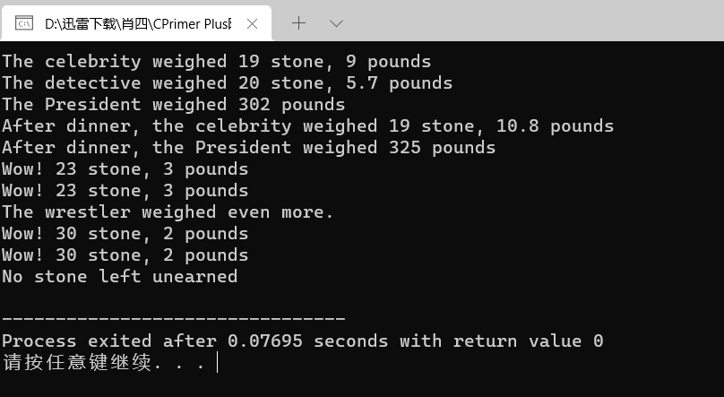

# 算法部分

[【模板】树状数组 2](https://www.luogu.com.cn/problem/P3368)

```cpp
#include <iostream>
#include <vector>
using namespace std;

const int N = 5e5 + 100;

int main() {
	
	auto read = [&]() {
		#define gc getchar 
		int res = 0, f = 1;
		char ch = gc();
		while(!isdigit(ch)) f ^= ch == '-', ch = gc();
		while(isdigit(ch)) res = (res << 1) + (res << 3) + (ch ^ 48), ch= gc(); 
		#undef gc
		return f? res: -res;
	};
	
	int n = read(), m = read();
	vector<int> a(N, 0);
	vector<int> c(N, 0);
	
	auto add = [&](int x, int val) {
		for(; x <= n; x += x&-x)
			c[x] += val;
	};
	
	for(int i = 1; i <= n; i ++){
		cin >> a[i];
		add(i, a[i] - a[i - 1]);
	}
	
	auto query = [&](int x) {
		int res = 0;
		for(; x; x -= x&-x)
			res += c[x];
		return res;
	};
	
	while(m --) {
		int op, x, y, k;
		op = read(), x = read();
		if(op == 1) {
			y = read(), k = read();
			add(x, k);
			add(y + 1, -k); 
		}
		else{
			printf("%d\n", query(x));
		}
	}
	
	return 0;
}
```


[【模板】线段树 2](https://www.luogu.com.cn/problem/P3373)

```cpp
#include <iostream>
#include <vector>

using i64 = long long;

#define lc (p << 1)
#define rc (p << 1 | 1)
#define mid ((t[p].l + t[p].r) >> 1)

const int N = 1e5 + 100; 

struct Segment{
	int l, r;
	i64 dat, alz, mlz;
};

int MOD; 

std::vector<Segment> t(N << 2);
std::vector<int> a(N);

auto pushup = [](int p){
	t[p].dat = (t[lc].dat + t[rc].dat) % MOD;
};

auto build = [](auto self, int p, int l, int r) -> void {
	t[p].l = l, t[p].r =r;
	t[p].alz=0,t[p].mlz=1;
	if(l == r){
		t[p].dat = a[l];
		return;
	}
	self(self, lc, l, mid);
	self(self, rc, mid + 1, r);
	pushup(p);
}; 

auto spread = [](int p) {
	t[lc].dat=(t[lc].dat*t[p].mlz+(t[lc].r-t[lc].l+1)*t[p].alz)% MOD;
	t[rc].dat=(t[rc].dat*t[p].mlz+(t[rc].r-t[rc].l+1)*t[p].alz)% MOD;
	t[lc].mlz=t[lc].mlz*t[p].mlz%MOD;
	t[rc].mlz=t[rc].mlz*t[p].mlz%MOD;
	t[lc].alz=(t[lc].alz*t[p].mlz+t[p].alz)%MOD;
	t[rc].alz=(t[rc].alz*t[p].mlz+t[p].alz)%MOD;
	t[p].alz=0,t[p].mlz=1;
}; 

auto query = [](auto self, int p, int l, int r) {
	if(l <= t[p].l && t[p].r <= r) {
		return t[p].dat;
	}
	spread(p);
	i64 val = 0;
	if(l <= mid) val += self(self, lc, l, r);
	if(r > mid) val += self(self, rc, l, r);
	return val % MOD;
};

auto addUpdate = [](auto self, int p, int l, int r, int val) -> void {
	if(l <= t[p].l && t[p].r <= r) {
		t[p].alz = (t[p].alz + val) % MOD;
		t[p].dat = (t[p].dat + (t[p].r - t[p].l + 1)*val) % MOD;
		return;
	}
	spread(p);
	if(l <= mid) self(self, lc, l, r, val);
	if(r > mid) self(self, rc, l, r, val);
	pushup(p);
};

auto mulUpdate = [](auto self, int p, int l, int r, int val) -> void {
	if(l <= t[p].l && t[p].r <= r) {
		t[p].mlz = (t[p].mlz * val) % MOD;
		t[p].alz = (t[p].alz * val) % MOD;
		t[p].dat = t[p].dat * val % MOD;
		return;
	}
	spread(p);
	if(l <= mid) self(self, lc, l, r, val);
	if(r > mid) self(self, rc, l, r, val);
	pushup(p);
};

int main() {
	int n, m;
	std::cin >> n >> m >> MOD;
	for(int i = 1; i <= n; i++)
		std::cin >> a[i];
	build(build, 1, 1, n);
	while(m --) {
		int op, x, y, k;
		std::cin >> op >> x >> y;
		if(op == 1) {
			std::cin >> k;
			mulUpdate(mulUpdate, 1, x, y, k);
		}
		else if(op == 2) {
			std::cin >> k;
			addUpdate(addUpdate, 1, x, y, k);
		}
		else std::cout << query(query, 1, x, y) << std::endl;
	} 
	return 0;
}

```


# C++ 部分

## 第 11 章使用类

mytime0.h

```cpp
// mytime0.h -- Time class before operator overloading
#ifndef MYTIME0_H_
#define MYTIME0_H_

class Time
{
private:
    int hours;
    int minutes;
public:
    Time();
    Time(int h, int m = 0);
    void AddMin(int m);
    void AddHr(int h);
    void Reset(int h = 0, int m = 0);
    const Time Sum(const Time & t) const;
    void Show() const;
};
#endif
```

mytime.cpp

```cpp
// mytime0.cpp  -- implementing Time methods
#include <iostream>
#include "mytime0.h"

Time::Time()
{
    hours = minutes = 0;
}

Time::Time(int h, int m )
{
    hours = h;
    minutes = m;
}

void Time::AddMin(int m)
{
    minutes += m;
    hours += minutes / 60;
    minutes %= 60;
}

void Time::AddHr(int h)
{
    hours += h;
}

void Time::Reset(int h, int m)
{
    hours = h;
    minutes = m;
}

const Time Time::Sum(const Time & t) const
{
    Time sum;
    sum.minutes = minutes + t.minutes;
    sum.hours = hours + t.hours + sum.minutes / 60;
    sum.minutes %= 60;
    return sum;
}

void Time::Show() const
{
    std::cout << hours << " hours, " << minutes << " minutes";
}
```

usetime0.cpp

```cpp
// usetime0.cpp -- using the first draft of the Time class
// compile usetime0.cpp and mytime0.cpp together
#include <iostream>
#include "mytime.cpp"

int main()
{
    using std::cout;
    using std::endl;
    Time planning;
    Time coding(2, 40);
    Time fixing(5, 55);
    Time total;

    cout << "planning time = ";
    planning.Show();
    cout << endl;
 
    cout << "coding time = ";
    coding.Show();
    cout << endl;
    
    cout << "fixing time = ";
    fixing.Show();
    cout << endl;

    total = coding.Sum(fixing);
    cout << "coding.Sum(fixing) = ";
  	total.Show();
    cout << endl;
    // std::cin.get();
    return 0;
}
```


mytime1.h

```cpp
// mytime1.h -- Time class before operator overloading
#ifndef MYTIME1_H_
#define MYTIME1_H_

class Time
{
private:
    int hours;
    int minutes;
public:
    Time();
    Time(int h, int m = 0);
    void AddMin(int m);
    void AddHr(int h);
    void Reset(int h = 0, int m = 0);
    Time operator+(const Time & t) const;
    void Show() const;
};
#endif
```

mytime1.cpp

```cpp
// mytime1.cpp  -- implementing Time methods
#include <iostream>
#include "mytime1.h"

Time::Time()
{
    hours = minutes = 0;
}

Time::Time(int h, int m )
{
    hours = h;
    minutes = m;
}

void Time::AddMin(int m)
{
    minutes += m;
    hours += minutes / 60;
    minutes %= 60;
}

void Time::AddHr(int h)
{
    hours += h;
}

void Time::Reset(int h, int m)
{
    hours = h;
    minutes = m;
}

Time Time::operator+(const Time & t) const
{
    Time sum;
    sum.minutes = minutes + t.minutes;
    sum.hours = hours + t.hours + sum.minutes / 60;
    sum.minutes %= 60;
    return sum;
}

void Time::Show() const
{
    std::cout << hours << " hours, " << minutes << " minutes";
}
```

usetime1.cpp

```cpp
// usetime1.cpp -- using the second draft of the Time class
// compile usetime1.cpp and mytime1.cpp together
#include <iostream>
#include "mytime1.cpp"

int main()
{
    using std::cout;
    using std::endl;
    Time planning;
    Time coding(2, 40);
    Time fixing(5, 55);
    Time total;

    cout << "planning time = ";
    planning.Show();
    cout << endl;
 
    cout << "coding time = ";
    coding.Show();
    cout << endl;
    
    cout << "fixing time = ";
    fixing.Show();
    cout << endl;

    total = coding + fixing;
    // operator notation
    cout << "coding + fixing = ";
    total.Show();
    cout << endl;

    Time morefixing(3, 28);
    cout << "more fixing time = ";
    morefixing.Show();
    cout << endl;
    total = morefixing.operator+(total);
    // function notation
    cout << "morefixing.operator+(total) = ";
    total.Show();
    cout << endl;
    // std::cin.get();
    return 0;
}
```


mytime2.h

```cpp
// mytime2.h -- Time class after operator overloading
#ifndef MYTIME2_H_
#define MYTIME2_H_

class Time
{
private:
    int hours;
    int minutes;
public:
    Time();
    Time(int h, int m = 0);
    void AddMin(int m);
    void AddHr(int h);
    void Reset(int h = 0, int m = 0);
    Time operator+(const Time & t) const;
    Time operator-(const Time & t) const;
    Time operator*(double n) const;
    void Show() const;
};
#endif
```

mytime2.cpp

```cpp
// mytime2.cpp  -- implementing Time methods
#include <iostream>
#include "mytime2.h"

Time::Time()
{
    hours = minutes = 0;
}

Time::Time(int h, int m )
{
    hours = h;
    minutes = m;
}

void Time::AddMin(int m)
{
    minutes += m;
    hours += minutes / 60;
    minutes %= 60;
}
void Time::AddHr(int h)
{
    hours += h;
}

void Time::Reset(int h, int m)
{
    hours = h;
    minutes = m;
}

Time Time::operator+(const Time & t) const
{
    Time sum;
    sum.minutes = minutes + t.minutes;
    sum.hours = hours + t.hours + sum.minutes / 60;
    sum.minutes %= 60;
    return sum;
}

Time Time::operator-(const Time & t) const
{
    Time diff;
    int tot1, tot2;
    tot1 = t.minutes + 60 * t.hours;
    tot2 = minutes + 60 * hours;
    diff.minutes = (tot2 - tot1) % 60;
    diff.hours = (tot2 - tot1) / 60;
    return diff;
}

Time Time::operator*(double mult) const
{
    Time result;
    long totalminutes = hours * mult * 60 + minutes * mult;
    result.hours = totalminutes / 60;
    result.minutes = totalminutes % 60;
    return result;
}

void Time::Show() const
{
    std::cout << hours << " hours, " << minutes << " minutes";
}
```

usetime2.cpp

```cpp
// usetime2.cpp -- using the third draft of the Time class
// compile usetime2.cpp and mytime2.cpp together
#include <iostream>
#include "mytime2.cpp"

int main()
{
    using std::cout;
    using std::endl;
    Time weeding(4, 35);
    Time waxing(2, 47);
    Time total;
    Time diff;
    Time adjusted;

    cout << "weeding time = ";
    weeding.Show();
    cout << endl;
 
    cout << "waxing time = ";
    waxing.Show();
    cout << endl;
    
    cout << "total work time = ";
    total = weeding + waxing;   // use operator+()
    total.Show();
    cout << endl;

    diff = weeding - waxing;    // use operator-()
    cout << "weeding time - waxing time = ";
    diff.Show();
    cout << endl;

    adjusted = total * 1.5;      // use operator+()
    cout << "adjusted work time = ";
    adjusted.Show();
    cout << endl;
    // std::cin.get();    
    return 0;
}
```


mytime3.h

```cpp
// mytime3.h -- Time class with friends
#ifndef MYTIME3_H_
#define MYTIME3_H_
#include <iostream>

class Time
{
private:
    int hours;
    int minutes;
public:
    Time();
    Time(int h, int m = 0);
    void AddMin(int m);
    void AddHr(int h);
    void Reset(int h = 0, int m = 0);
    Time operator+(const Time & t) const;
    Time operator-(const Time & t) const;
    Time operator*(double n) const;
    friend Time operator*(double m, const Time & t)
        { return t * m; }   // inline definition
    friend std::ostream & operator<<(std::ostream & os, const Time & t);

};
#endif
```

mytime3.cpp

```cpp
// mytime3.cpp  -- implementing Time methods
#include "mytime3.h"

Time::Time()
{
    hours = minutes = 0;
}

Time::Time(int h, int m )
{
    hours = h;
    minutes = m;
}

void Time::AddMin(int m)
{
    minutes += m;
    hours += minutes / 60;
    minutes %= 60;
}

void Time::AddHr(int h)
{
    hours += h;
}

void Time::Reset(int h, int m)
{
    hours = h;
    minutes = m;
}

Time Time::operator+(const Time & t) const
{
    Time sum;
    sum.minutes = minutes + t.minutes;
    sum.hours = hours + t.hours + sum.minutes / 60;
    sum.minutes %= 60;
    return sum;
}

Time Time::operator-(const Time & t) const
{
    Time diff;
    int tot1, tot2;
    tot1 = t.minutes + 60 * t.hours;
    tot2 = minutes + 60 * hours;
    diff.minutes = (tot2 - tot1) % 60;
    diff.hours = (tot2 - tot1) / 60;
    return diff;
}

Time Time::operator*(double mult) const
{
    Time result;
    long totalminutes = hours * mult * 60 + minutes * mult;
    result.hours = totalminutes / 60;
    result.minutes = totalminutes % 60;
    return result;
}

std::ostream & operator<<(std::ostream & os, const Time & t)
{
    os << t.hours << " hours, " << t.minutes << " minutes";
    return os; 
}
```

usetime3.cpp

```cpp
//usetime3.cpp -- using the fourth draft of the Time class
// compile usetime3.cpp and mytime3.cpp together
#include <iostream>
#include "mytime3.cpp"

int main()
{
    using std::cout;
    using std::endl;
    Time aida(3, 35);
    Time tosca(2, 48);
    Time temp;

    cout << "Aida and Tosca:\n";
    cout << aida<<"; " << tosca << endl;
    temp = aida + tosca;     // operator+()
    cout << "Aida + Tosca: " << temp << endl;
    temp = aida* 1.17;  // member operator*()
    cout << "Aida * 1.17: " << temp << endl;
    cout << "10.0 * Tosca: " << 10.0 * tosca << endl;
	// std::cin.get();
    return 0; 
}
```


vect.h

```cpp
// vect.h -- Vector class with <<, mode state
#ifndef VECTOR_H_
#define VECTOR_H_
#include <iostream>
namespace VECTOR
{
    class Vector
    {
    public:
        enum Mode {RECT, POL};
    // RECT for rectangular, POL for Polar modes
    private:
        double x;          // horizontal value
        double y;          // vertical value
        double mag;        // length of vector
        double ang;        // direction of vector in degrees
        Mode mode;         // RECT or POL
    // private methods for setting values
        void set_mag();
        void set_ang();
        void set_x();
        void set_y();
    public:
       Vector();
        Vector(double n1, double n2, Mode form = RECT);
        void reset(double n1, double n2, Mode form = RECT);
        ~Vector();
        double xval() const {return x;}       // report x value
        double yval() const {return y;}       // report y value
        double magval() const {return mag;}   // report magnitude
        double angval() const {return ang;}   // report angle
        void polar_mode();                    // set mode to POL
        void rect_mode();                     // set mode to RECT
    // operator overloading
        Vector operator+(const Vector & b) const;
        Vector operator-(const Vector & b) const;
        Vector operator-() const;
        Vector operator*(double n) const;
    // friends
        friend Vector operator*(double n, const Vector & a);
        friend std::ostream & operator<<(std::ostream & os, const Vector & v);
    };

}   // end namespace VECTOR
#endif
```

vect.cpp

```cpp
// vect.cpp -- methods for the Vector class
#include <cmath>
#include "vect.h"   // includes <iostream>
using std::sqrt;
using std::sin;
using std::cos;
using std::atan;
using std::atan2;
using std::cout;

namespace VECTOR
{
    // compute degrees in one radian
    const double Rad_to_deg = 45.0 / atan(1.0);
    // should be about 57.2957795130823

    // private methods
    // calculates magnitude from x and y
    void Vector::set_mag()
    {
        mag = sqrt(x * x + y * y);
    }

    void Vector::set_ang()
    {
        if (x == 0.0 && y == 0.0)
            ang = 0.0;
        else
            ang = atan2(y, x);
    }

    // set x from polar coordinate
    void Vector::set_x()
    {
        x = mag * cos(ang);
    }

    // set y from polar coordinate
    void Vector::set_y()
    {
        y = mag * sin(ang);
    }

    // public methods
    Vector::Vector()             // default constructor
    {
        x = y = mag = ang = 0.0;
        mode = RECT;
    }

    // construct vector from rectangular coordinates if form is r
    // (the default) or else from polar coordinates if form is p
    Vector::Vector(double n1, double n2, Mode form)
    {
        mode = form;
        if (form == RECT)
         {
             x = n1;
             y = n2;
             set_mag();
             set_ang();
        }
        else if (form == POL)
        {
             mag = n1;
             ang = n2 / Rad_to_deg;
             set_x();
             set_y();
        }
        else
        {
             cout << "Incorrect 3rd argument to Vector() -- ";
             cout << "vector set to 0\n";
             x = y = mag = ang = 0.0;
             mode = RECT;
        }
    }

    // reset vector from rectangular coordinates if form is
    // RECT (the default) or else from polar coordinates if
    // form is POL
    void Vector:: reset(double n1, double n2, Mode form)
    {
        mode = form;
        if (form == RECT)
         {
             x = n1;
             y = n2;
             set_mag();
             set_ang();
        }
        else if (form == POL)
        {
             mag = n1;
             ang = n2 / Rad_to_deg;
             set_x();
             set_y();
        }
        else
        {
             cout << "Incorrect 3rd argument to Vector() -- ";
             cout << "vector set to 0\n";
             x = y = mag = ang = 0.0;
             mode = RECT;
        }
    }

    Vector::~Vector()    // destructor
    {
    }

    void Vector::polar_mode()    // set to polar mode
    {
        mode = POL;
    }

    void Vector::rect_mode()     // set to rectangular mode
    {
        mode = RECT;
    }

    // operator overloading
    // add two Vectors
    Vector Vector::operator+(const Vector & b) const
    {
        return Vector(x + b.x, y + b.y);
    }

    // subtract Vector b from a
    Vector Vector::operator-(const Vector & b) const
    {
        return Vector(x - b.x, y - b.y);
    }

    // reverse sign of Vector
    Vector Vector::operator-() const
    {
        return Vector(-x, -y);
    }

    // multiply vector by n
    Vector Vector::operator*(double n) const
    {
        return Vector(n * x, n * y);
    }

    // friend methods
    // multiply n by Vector a
    Vector operator*(double n, const Vector & a)
    {
        return a * n;
    }

    // display rectangular coordinates if mode is RECT,
    // else display polar coordinates if mode is POL
    std::ostream & operator<<(std::ostream & os, const Vector & v)
    {
        if (v.mode == Vector::RECT)
             os << "(x,y) = (" << v.x << ", " << v.y << ")";
        else if (v.mode == Vector::POL)
        {
             os << "(m,a) = (" << v.mag << ", "
                 << v.ang * Rad_to_deg << ")";
        }
        else
             os << "Vector object mode is invalid";
        return os; 
    }

}  // end namespace VECTOR
```

randwalk.cpp

```cpp
// randwalk.cpp -- using the Vector class
// compile with the vect.cpp file
#include <iostream>
#include <cstdlib>      // rand(), srand() prototypes
#include <ctime>        // time() prototype
#include "vect.cpp"
int main()
{
    using namespace std;
    using VECTOR::Vector;
    srand(time(0));     // seed random-number generator
    double direction;
    Vector step;
    Vector result(0.0, 0.0);
    unsigned long steps = 0;
    double target;
    double dstep;
    cout << "Enter target distance (q to quit): ";
    while (cin >> target)
    {
        cout << "Enter step length: ";
        if (!(cin >> dstep))
            break;

        while (result.magval() < target)
        {
            direction = rand() % 360;
            step.reset(dstep, direction, Vector::POL);
            result = result + step;
            steps++;
        }
        cout << "After " << steps << " steps, the subject "
            "has the following location:\n";
        cout << result << endl;
        result.polar_mode();
        cout << " or\n" << result << endl;
        cout << "Average outward distance per step = "
            << result.magval()/steps << endl;
        steps = 0;
        result.reset(0.0, 0.0);
        cout << "Enter target distance (q to quit): ";
    }
    cout << "Bye!\n";
/* keep window open
    cin.clear();
    while (cin.get() != '\n')
        continue;
    cin.get();
*/
    return 0; 
}
```


stonewt.h

```cpp
// stonewt.h -- definition for the Stonewt class
#ifndef STONEWT_H_
#define STONEWT_H_
class Stonewt
{
private:
    enum {Lbs_per_stn = 14};      // pounds per stone
    int stone;                    // whole stones
    double pds_left;              // fractional pounds
    double pounds;                // entire weight in pounds
public:
    Stonewt(double lbs);          // constructor for double pounds
    Stonewt(int stn, double lbs); // constructor for stone, lbs
    Stonewt();                    // default constructor
    ~Stonewt();
    void show_lbs() const;        // show weight in pounds format
    void show_stn() const;        // show weight in stone format
};
#endif
```

stonewt.cpp

```cpp
// stonewt.cpp -- Stonewt methods
#include <iostream>
using std::cout;
#include "stonewt.h"

// construct Stonewt object from double value
Stonewt::Stonewt(double lbs)
{
    stone = int (lbs) / Lbs_per_stn;    // integer division
    pds_left = int (lbs) % Lbs_per_stn + lbs - int(lbs);
    pounds = lbs;
}

// construct Stonewt object from stone, double values
Stonewt::Stonewt(int stn, double lbs)
{
    stone = stn;
    pds_left = lbs;
    pounds =  stn * Lbs_per_stn +lbs;
}

Stonewt::Stonewt()          // default constructor, wt = 0
{
    stone = pounds = pds_left = 0;
}

Stonewt::~Stonewt()         // destructor
{
}

// show weight in stones
void Stonewt::show_stn() const
{
    cout << stone << " stone, " << pds_left << " pounds\n";
}

// show weight in pounds
void Stonewt::show_lbs() const
{
    cout << pounds << " pounds\n";
}
```

stone.cpp

```cpp
// stone.cpp -- user-defined conversions
// compile with stonewt.cpp
#include <iostream>
using std::cout;
#include "stonewt.cpp"
void display(const Stonewt & st, int n);
int main()
{
    Stonewt incognito = 275; // uses constructor to initialize
    Stonewt wolfe(285.7);    // same as Stonewt wolfe = 285.7;
    Stonewt taft(21, 8);

    cout << "The celebrity weighed ";
    incognito.show_stn();
    cout << "The detective weighed ";
    wolfe.show_stn();
    cout << "The President weighed ";
    taft.show_lbs();
    incognito = 276.8;      // uses constructor for conversion
    taft = 325;             // same as taft = Stonewt(325);
    cout << "After dinner, the celebrity weighed ";
    incognito.show_stn();
    cout << "After dinner, the President weighed ";
    taft.show_lbs();
    display(taft, 2);
    cout << "The wrestler weighed even more.\n";
    display(422, 2);
    cout << "No stone left unearned\n";
    // std::cin.get();
    return 0;
}

void display(const Stonewt & st, int n)
{
    for (int i = 0; i < n; i++)
    {
        cout << "Wow! ";
        st.show_stn();
    }
}
```



stonewt1.h

```cpp
// stonewt1.h -- revised definition for the Stonewt class
#ifndef STONEWT1_H_
#define STONEWT1_H_
class Stonewt
{
private:
    enum {Lbs_per_stn = 14};      // pounds per stone
    int stone;                    // whole stones
    double pds_left;              // fractional pounds
    double pounds;                // entire weight in pounds
public:
    Stonewt(double lbs);          // construct from double pounds
    Stonewt(int stn, double lbs); // construct from stone, lbs
    Stonewt();                    // default constructor
    ~Stonewt();
    void show_lbs() const;        // show weight in pounds format
    void show_stn() const;        // show weight in stone format
// conversion functions
    operator int() const;
    operator double() const;
};
#endif
```

stonewt1.cpp

```cpp
// stonewt1.cpp -- Stonewt class methods + conversion functions
#include <iostream>
using std::cout;
#include "stonewt1.h"

// construct Stonewt object from double value
Stonewt::Stonewt(double lbs)
{
    stone = int (lbs) / Lbs_per_stn;    // integer division
    pds_left = int (lbs) % Lbs_per_stn + lbs - int(lbs);
    pounds = lbs;
}

// construct Stonewt object from stone, double values
Stonewt::Stonewt(int stn, double lbs)
{
    stone = stn;
    pds_left = lbs;
    pounds =  stn * Lbs_per_stn +lbs;
}

Stonewt::Stonewt()          // default constructor, wt = 0
{
    stone = pounds = pds_left = 0;
}

Stonewt::~Stonewt()         // destructor
{
}

// show weight in stones
void Stonewt::show_stn() const
{
    cout << stone << " stone, " << pds_left << " pounds\n";
}

// show weight in pounds
void Stonewt::show_lbs() const
{
    cout << pounds << " pounds\n";
}

// conversion functions
Stonewt::operator int() const
{

    return int (pounds + 0.5);

}

Stonewt::operator double()const
{
    return pounds; 
}
```

stone1.cpp

```cpp
// stone1.cpp -- user-defined conversion functions
// compile with stonewt1.cpp
#include <iostream>
#include "stonewt1.cpp"

int main()
{
    using std::cout;
    Stonewt poppins(9,2.8);     // 9 stone, 2.8 pounds
    double p_wt = poppins;      // implicit conversion
    cout << "Convert to double => ";
    cout << "Poppins: " << p_wt << " pounds.\n";
    cout << "Convert to int => ";
    cout << "Poppins: " << int (poppins) << " pounds.\n";
	// std::cin.get();
    return 0; 
}
```

