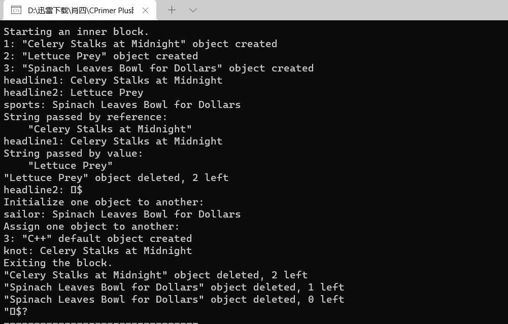
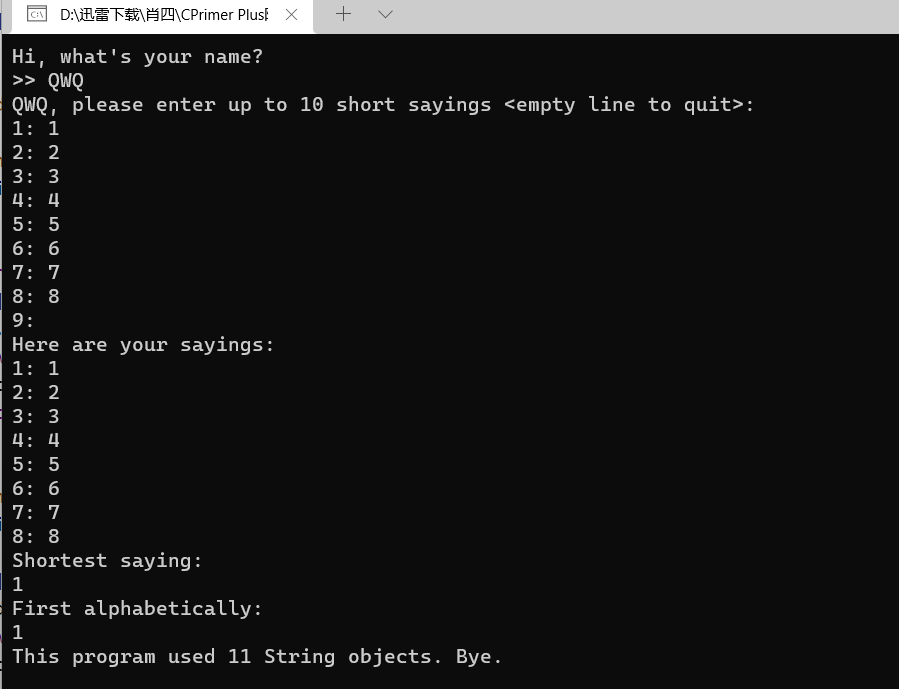
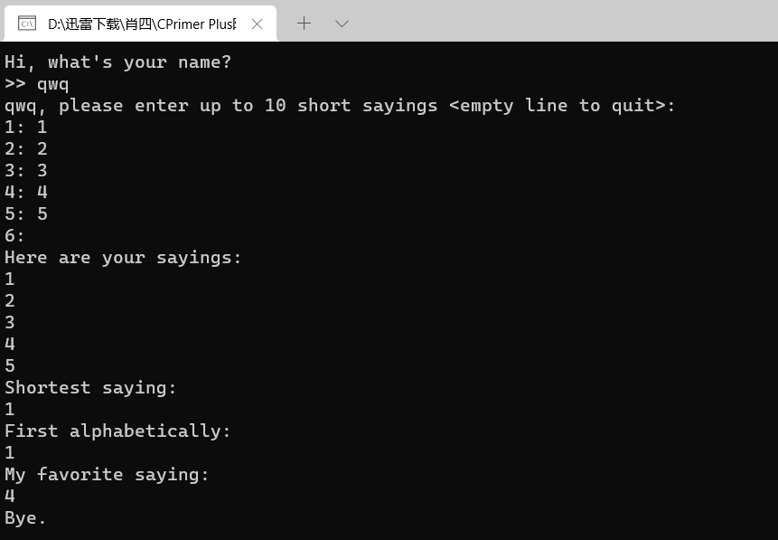
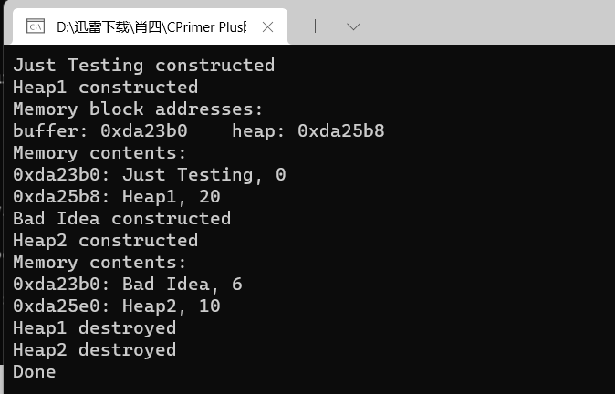
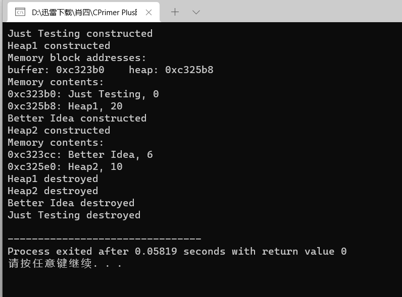
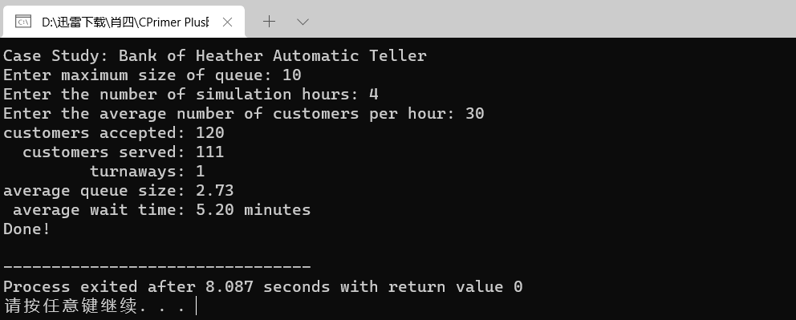

# 算法部分

[【模板】并查集](https://www.luogu.com.cn/problem/P3367)

```cpp
#include <iostream>
#include <vector>

using namespace std;

const int N = 1E4 + 100;

int main() {
	int n, m;
	cin >> n >> m;
	vector<int> fa(N);
	for(int i = 1; i <= n; i ++)  fa[i] = i;
	
	auto find = [&](auto self, int x) {
		if( x == fa[x]) return x;
		else{
			fa[x] = self(self, fa[x]);
			return fa[x];
		}
	};
	
	while(m --) {
		int op, x, y;
		std::cin >> op >> x >> y;
		if(op == 1) {
			x = find(find, x);
			y = find(find, y);
			if(x != y) fa[x] = y;
		}
		else{
			x = find(find, x);
			y = find(find, y);
			if(x == y) cout << 'Y' << endl;
			else cout << 'N' << endl;
		}
	}
	
	return 0;
}
```

# 技术部分

strngbad.h

```cpp
// strngbad.h -- flawed string class definition
#include <iostream>
#ifndef STRNGBAD_H_
#define STRNGBAD_H_
class StringBad
{
private:
    char * str;                // pointer to string
    int len;                   // length of string
    static int num_strings;    // number of objects
public:
    StringBad(const char * s); // constructor
    StringBad();               // default constructor
    ~StringBad();              // destructor
// friend function
    friend std::ostream & operator<<(std::ostream & os, 
                       const StringBad & st);
};
#endif
```

strngbad.cpp

```cpp
// strngbad.cpp -- StringBad class methods
#include <cstring>                    // string.h for some
#include "strngbad.h"
using std::cout;

// initializing static class member
int StringBad::num_strings = 0;

// class methods

// construct StringBad from C string
StringBad::StringBad(const char * s)
{
    len = std::strlen(s);             // set size
    str = new char[len + 1];          // allot storage
    std::strcpy(str, s);              // initialize pointer
    num_strings++;                    // set object count
    cout << num_strings << ": \"" << str
         << "\" object created\n";    // For Your Information
}

StringBad::StringBad()                // default constructor
{
    len = 4;
    str = new char[4];
    std::strcpy(str, "C++");          // default string
    num_strings++;
    cout << num_strings << ": \"" << str
         << "\" default object created\n";  // FYI
}

StringBad::~StringBad()               // necessary destructor
{
    cout << "\"" << str << "\" object deleted, ";    // FYI
    --num_strings;                    // required
    cout << num_strings << " left\n"; // FYI
    delete [] str;                    // required
}

std::ostream & operator<<(std::ostream & os, const StringBad & st)
{
    os << st.str;
    return os; 
}
```

vegnews.cpp

```cpp
// vegnews.cpp -- using new and delete with classes
// compile with strngbad.cpp
#include <iostream>
using std::cout;
#include "strngbad.cpp"

void callme1(StringBad &);  // pass by reference
void callme2(StringBad);    // pass by value

int main()
{
    using std::endl;
    {
        cout << "Starting an inner block.\n";
        StringBad headline1("Celery Stalks at Midnight");
        StringBad headline2("Lettuce Prey");
        StringBad sports("Spinach Leaves Bowl for Dollars");
        cout << "headline1: " << headline1 << endl;
        cout << "headline2: " << headline2 << endl;
        cout << "sports: " << sports << endl;
        callme1(headline1);
        cout << "headline1: " << headline1 << endl;
        callme2(headline2);
        cout << "headline2: " << headline2 << endl;
        cout << "Initialize one object to another:\n";
        StringBad sailor = sports;
        cout << "sailor: " << sailor << endl;
        cout << "Assign one object to another:\n";
        StringBad knot;
        knot = headline1;
        cout << "knot: " << knot << endl; 
        cout << "Exiting the block.\n";
    }
    cout << "End of main()\n";
    // std::cin.get();
    return 0;
}

void callme1(StringBad & rsb)
{
    cout << "String passed by reference:\n";
    cout << "    \"" << rsb << "\"\n";
}

void callme2(StringBad sb)
{
    cout << "String passed by value:\n";
    cout << "    \"" << sb << "\"\n";
}
```



string1.h

```cpp
// Standard iostream objects -*- C++ -*-

// Copyright (C) 1997-2019 Free Software Foundation, Inc.
//
// This file is part of the GNU ISO C++ Library.  This library is free
// software; you can redistribute it and/or modify it under the
// terms of the GNU General Public License as published by the
// Free Software Foundation; either version 3, or (at your option)
// any later version.

// This library is distributed in the hope that it will be useful,
// but WITHOUT ANY WARRANTY; without even the implied warranty of
// MERCHANTABILITY or FITNESS FOR A PARTICULAR PURPOSE.  See the
// GNU General Public License for more details.

// Under Section 7 of GPL version 3, you are granted additional
// permissions described in the GCC Runtime Library Exception, version
// 3.1, as published by the Free Software Foundation.

// You should have received a copy of the GNU General Public License and
// a copy of the GCC Runtime Library Exception along with this program;
// see the files COPYING3 and COPYING.RUNTIME respectively.  If not, see
// <http://www.gnu.org/licenses/>.

/** @file include/iostream
 *  This is a Standard C++ Library header.
 */

//
// ISO C++ 14882: 27.3  Standard iostream objects
//

#ifndef _GLIBCXX_IOSTREAM
#define _GLIBCXX_IOSTREAM 1

#pragma GCC system_header

#include <bits/c++config.h>
#include <ostream>
#include <istream>

namespace std _GLIBCXX_VISIBILITY(default)
{
_GLIBCXX_BEGIN_NAMESPACE_VERSION

  /**
   *  @name Standard Stream Objects
   *
   *  The &lt;iostream&gt; header declares the eight <em>standard stream
   *  objects</em>.  For other declarations, see
   *  http://gcc.gnu.org/onlinedocs/libstdc++/manual/io.html
   *  and the @link iosfwd I/O forward declarations @endlink
   *
   *  They are required by default to cooperate with the global C
   *  library's @c FILE streams, and to be available during program
   *  startup and termination. For more information, see the section of the
   *  manual linked to above.
  */
  //@{
  extern istream cin;		/// Linked to standard input
  extern ostream cout;		/// Linked to standard output
  extern ostream cerr;		/// Linked to standard error (unbuffered)
  extern ostream clog;		/// Linked to standard error (buffered)

#ifdef _GLIBCXX_USE_WCHAR_T
  extern wistream wcin;		/// Linked to standard input
  extern wostream wcout;	/// Linked to standard output
  extern wostream wcerr;	/// Linked to standard error (unbuffered)
  extern wostream wclog;	/// Linked to standard error (buffered)
#endif
  //@}

  // For construction of filebuffers for cout, cin, cerr, clog et. al.
  static ios_base::Init __ioinit;

_GLIBCXX_END_NAMESPACE_VERSION
} // namespace

#endif /* _GLIBCXX_IOSTREAM */
```


string1.cpp

```cpp
// string1.cpp -- String class methods
#include <cstring>                 // string.h for some
#include "string1.h"               // includes <iostream>
using std::cin;
using std::cout;

// initializing static class member

int String::num_strings = 0;

// static method
int String::HowMany()
{
    return num_strings;
}

// class methods
String::String(const char * s)     // construct String from C string
{
    len = std::strlen(s);          // set size
    str = new char[len + 1];       // allot storage
    std::strcpy(str, s);           // initialize pointer
    num_strings++;                 // set object count
}

String::String()                   // default constructor
{
    len = 4;
    str = new char[1];
    str[0] = '\0';                 // default string
    num_strings++;
}

String::String(const String & st)
{
    num_strings++;             // handle static member update
    len = st.len;              // same length
    str = new char [len + 1];  // allot space
    std::strcpy(str, st.str);  // copy string to new location
}

String::~String()                     // necessary destructor
{
    --num_strings;                    // required
    delete [] str;                    // required
}

// overloaded operator methods    

    // assign a String to a String
String & String::operator=(const String & st)
{
    if (this == &st)
        return *this;
    delete [] str;
    len = st.len;
    str = new char[len + 1];
    std::strcpy(str, st.str);
    return *this;
}

    // assign a C string to a String
String & String::operator=(const char * s)
{
    delete [] str;
    len = std::strlen(s);
    str = new char[len + 1];
    std::strcpy(str, s);
    return *this;
}

    // read-write char access for non-const String
char & String::operator[](int i)
{
    return str[i];
}

    // read-only char access for const String
const char & String::operator[](int i) const
{
    return str[i];
}

// overloaded operator friends

bool operator<(const String &st1, const String &st2)
{
    return (std::strcmp(st1.str, st2.str) < 0);
}

bool operator>(const String &st1, const String &st2)
{
    return st2 < st1;
}

bool operator==(const String &st1, const String &st2)
{
    return (std::strcmp(st1.str, st2.str) == 0);
}

    // simple String output
ostream & operator<<(ostream & os, const String & st)
{
    os << st.str;
    return os; 
}

    // quick and dirty String input
istream & operator>>(istream & is, String & st)
{
    char temp[String::CINLIM];
    is.get(temp, String::CINLIM);
    if (is)
        st = temp;
    while (is && is.get() != '\n')
        continue;
    return is; 
}
```

sayings1.cpp

```CPP
// sayings1.cpp -- using expanded String class
// compile with string1.cpp
#include <iostream>
#include "string1.cpp" 
const int ArSize = 10;
const int MaxLen =81;
int main()
{
    using std::cout;
    using std::cin;
    using std::endl;
    String name;
    cout <<"Hi, what's your name?\n>> ";
    cin >> name;

    cout << name << ", please enter up to " << ArSize
         << " short sayings <empty line to quit>:\n";
    String sayings[ArSize];     // array of objects
    char temp[MaxLen];          // temporary string storage
    int i;
    for (i = 0; i < ArSize; i++)
    {
        cout << i+1 << ": ";
        cin.get(temp, MaxLen);
        while (cin && cin.get() != '\n')
            continue;
        if (!cin || temp[0] == '\0')    // empty line?
            break;              // i not incremented
        else
            sayings[i] = temp;  // overloaded assignment
    }
    int total = i;              // total # of lines read

    if ( total > 0)
    {
        cout << "Here are your sayings:\n";
        for (i = 0; i < total; i++)
            cout << sayings[i][0] << ": " << sayings[i] << endl;

        int shortest = 0;
        int first = 0;
        for (i = 1; i < total; i++)
        {
            if (sayings[i].length() < sayings[shortest].length())
                shortest = i;
            if (sayings[i] < sayings[first])
                first = i;
        }
        cout << "Shortest saying:\n" << sayings[shortest] << endl;;
        cout << "First alphabetically:\n" << sayings[first] << endl;
        cout << "This program used "<< String::HowMany() 
             << " String objects. Bye.\n";
    }
    else
        cout << "No input! Bye.\n";
// keep window open 
/*    if (!cin)
        cin.clear();
    while (cin.get() != '\n')
        continue; */ 
   return 0; 
}
```



sayings2.cpp

```cpp
// sayings2.cpp -- using pointers to objects
// compile with string1.cpp
#include <iostream>
#include <cstdlib>      // (or stdlib.h) for rand(), srand()
#include <ctime>        // (or time.h) for time()
#include "string1.cpp"
const int ArSize = 10;
const int MaxLen = 81;
int main()
{
    using namespace std;
    String name;
    cout <<"Hi, what's your name?\n>> ";
    cin >> name;

    cout << name << ", please enter up to " << ArSize
         << " short sayings <empty line to quit>:\n";
    String sayings[ArSize];
    char temp[MaxLen];               // temporary string storage
    int i;
    for (i = 0; i < ArSize; i++)
    {
        cout << i+1 << ": ";
        cin.get(temp, MaxLen);
        while (cin && cin.get() != '\n')
            continue;
        if (!cin || temp[0] == '\0') // empty line?
            break;                   // i not incremented
        else
            sayings[i] = temp;       // overloaded assignment
    }
    int total = i;                   // total # of lines read

    if (total > 0)
    {
        cout << "Here are your sayings:\n";
        for (i = 0; i < total; i++)
            cout << sayings[i] << "\n";

    // use pointers to keep track of shortest, first strings
        String * shortest = &sayings[0]; // initialize to first object
        String * first = &sayings[0];
        for (i = 1; i < total; i++)
        {
            if (sayings[i].length() < shortest->length())
                shortest = &sayings[i];
            if (sayings[i] < *first)     // compare values
                first = &sayings[i];     // assign address
        }
        cout << "Shortest saying:\n" << * shortest << endl;
        cout << "First alphabetically:\n" << * first << endl;

        srand(time(0));
        int choice = rand() % total; // pick index at random
    // use new to create, initialize new String object
        String * favorite = new String(sayings[choice]);
        cout << "My favorite saying:\n" << *favorite << endl;
        delete favorite;
    }
    else
        cout << "Not much to say, eh?\n";
    cout << "Bye.\n";
// keep window open
/*    if (!cin)
        cin.clear();
    while (cin.get() != '\n')
        continue;
    cin.get();
*/
    return 0; 
}
```



placenew1.cpp

```cpp
// placenew1.cpp  -- new, placement new, no delete
#include <iostream>
#include <string>
#include <new>
using namespace std;
const int BUF = 512;

class JustTesting
{
private:
    string words;
    int number;
public:
    JustTesting(const string & s = "Just Testing", int n = 0) 
    {words = s; number = n; cout << words << " constructed\n"; }
    ~JustTesting() { cout << words << " destroyed\n";}
    void Show() const { cout << words << ", " << number << endl;}
};
int main()
{
    char * buffer = new char[BUF];       // get a block of memory

    JustTesting *pc1, *pc2;

    pc1 = new (buffer) JustTesting;      // place object in buffer
    pc2 = new JustTesting("Heap1", 20);  // place object on heap
    
    cout << "Memory block addresses:\n" << "buffer: "
        << (void *) buffer << "    heap: " << pc2 <<endl;
    cout << "Memory contents:\n";
    cout << pc1 << ": ";
    pc1->Show();
    cout << pc2 << ": ";
    pc2->Show();

    JustTesting *pc3, *pc4;
    pc3 = new (buffer) JustTesting("Bad Idea", 6);
    pc4 = new JustTesting("Heap2", 10);
    cout << "Memory contents:\n";
    cout << pc3 << ": ";
    pc3->Show();
    cout << pc4 << ": ";
    pc4->Show();
    
    delete pc2;                          // free Heap1         
    delete pc4;                          // free Heap2
    delete [] buffer;                    // free buffer
    cout << "Done\n";
    // std::cin.get();
    return 0;
}
```



placenew2.cpp

```cpp
// placenew2.cpp  -- new, placement new, no delete
#include <iostream>
#include <string>
#include <new>
using namespace std;
const int BUF = 512;

class JustTesting
{
private:
    string words;
    int number;
public:
    JustTesting(const string & s = "Just Testing", int n = 0) 
    {words = s; number = n; cout << words << " constructed\n"; }
    ~JustTesting() { cout << words << " destroyed\n";}
    void Show() const { cout << words << ", " << number << endl;}
};
int main()
{
    char * buffer = new char[BUF];       // get a block of memory

    JustTesting *pc1, *pc2;

    pc1 = new (buffer) JustTesting;      // place object in buffer
    pc2 = new JustTesting("Heap1", 20);  // place object on heap
    
    cout << "Memory block addresses:\n" << "buffer: "
        << (void *) buffer << "    heap: " << pc2 <<endl;
    cout << "Memory contents:\n";
    cout << pc1 << ": ";
    pc1->Show();
    cout << pc2 << ": ";
    pc2->Show();

    JustTesting *pc3, *pc4;
// fix placement new location
    pc3 = new (buffer + sizeof (JustTesting))
                JustTesting("Better Idea", 6);
    pc4 = new JustTesting("Heap2", 10);
    
    cout << "Memory contents:\n";
    cout << pc3 << ": ";
    pc3->Show();
    cout << pc4 << ": ";
    pc4->Show();
    
    delete pc2;           // free Heap1         
    delete pc4;           // free Heap2
// explicitly destroy placement new objects
    pc3->~JustTesting();  // destroy object pointed to by pc3
    pc1->~JustTesting();  // destroy object pointed to by pc1
    delete [] buffer;     // free buffer
    // std::cin.get();
    return 0;
}
```



queue.h

```cpp
// queue.h -- interface for a queue
#ifndef QUEUE_H_
#define QUEUE_H_
// This queue will contain Customer items
class Customer
{
private:
    long arrive;        // arrival time for customer
    int processtime;    // processing time for customer
public:
    Customer() : arrive(0), processtime (0){}
    void set(long when);
    long when() const { return arrive; }
    int ptime() const { return processtime; }
};

typedef Customer Item;

class Queue
{
private:
// class scope definitions
    // Node is a nested structure definition local to this class
    struct Node { Item item; struct Node * next;};
    enum {Q_SIZE = 10};
// private class members
    Node * front;       // pointer to front of Queue
    Node * rear;        // pointer to rear of Queue
    int items;          // current number of items in Queue
    const int qsize;    // maximum number of items in Queue
    // preemptive definitions to prevent public copying
    Queue(const Queue & q) : qsize(0) { }
    Queue & operator=(const Queue & q) { return *this;}
public:
    Queue(int qs = Q_SIZE); // create queue with a qs limit
    ~Queue();
    bool isempty() const;
    bool isfull() const;
    int queuecount() const;
    bool enqueue(const Item &item); // add item to end
    bool dequeue(Item &item);       // remove item from front
};
#endif
```

queue.cpp

```cpp
// queue.cpp -- Queue and Customer methods
#include "queue.h"
#include <cstdlib>         // (or stdlib.h) for rand()

// Queue methods
Queue::Queue(int qs) : qsize(qs)
{
    front = rear = NULL;    // or nullptr
    items = 0;
}

Queue::~Queue()
{
    Node * temp;
    while (front != NULL)   // while queue is not yet empty
    {
        temp = front;       // save address of front item
        front = front->next;// reset pointer to next item
        delete temp;        // delete former front
    }
}

bool Queue::isempty() const
{
    return items == 0;
}

bool Queue::isfull() const
{
    return items == qsize;
}

int Queue::queuecount() const
{
    return items;
}

// Add item to queue
bool Queue::enqueue(const Item & item)
{
    if (isfull())
        return false;
    Node * add = new Node;  // create node
// on failure, new throws std::bad_alloc exception
    add->item = item;       // set node pointers
    add->next = NULL;       // or nullptr;
    items++;
    if (front == NULL)      // if queue is empty,
        front = add;        // place item at front
    else
        rear->next = add;   // else place at rear
    rear = add;             // have rear point to new node
    return true;
}

// Place front item into item variable and remove from queue
bool Queue::dequeue(Item & item)
{
    if (front == NULL)
        return false;
    item = front->item;     // set item to first item in queue
    items--;
    Node * temp = front;    // save location of first item
    front = front->next;    // reset front to next item
    delete temp;            // delete former first item
    if (items == 0)
        rear = NULL;
    return true;
}

// customer method

// when is the time at which the customer arrives
// the arrival time is set to when and the processing
// time set to a random value in the range 1 - 3
void Customer::set(long when)
{
    processtime = std::rand() % 3 + 1;
    arrive = when; 
}
```

bank.cpp

```cpp
// bank.cpp -- using the Queue interface
// compile with queue.cpp
#include <iostream>
#include <cstdlib> // for rand() and srand()
#include <ctime>   // for time()
#include "queue.cpp"
const int MIN_PER_HR = 60;

bool newcustomer(double x); // is there a new customer?

int main()
{
    using std::cin;
    using std::cout;
    using std::endl;
    using std::ios_base;
// setting things up
    std::srand(std::time(0));    //  random initializing of rand()

    cout << "Case Study: Bank of Heather Automatic Teller\n";
    cout << "Enter maximum size of queue: ";
    int qs;
    cin >> qs;
    Queue line(qs);         // line queue holds up to qs people

    cout << "Enter the number of simulation hours: ";
    int hours;              //  hours of simulation
    cin >> hours;
    // simulation will run 1 cycle per minute
    long cyclelimit = MIN_PER_HR * hours; // # of cycles

    cout << "Enter the average number of customers per hour: ";
    double perhour;         //  average # of arrival per hour
    cin >> perhour;
    double min_per_cust;    //  average time between arrivals
    min_per_cust = MIN_PER_HR / perhour;

    Item temp;              //  new customer data
    long turnaways = 0;     //  turned away by full queue
    long customers = 0;     //  joined the queue
    long served = 0;        //  served during the simulation
    long sum_line = 0;      //  cumulative line length
    int wait_time = 0;      //  time until autoteller is free
    long line_wait = 0;     //  cumulative time in line


// running the simulation
    for (int cycle = 0; cycle < cyclelimit; cycle++)
    {
        if (newcustomer(min_per_cust))  // have newcomer
        {
            if (line.isfull())
                turnaways++;
            else
            {
                customers++;
                temp.set(cycle);    // cycle = time of arrival
                line.enqueue(temp); // add newcomer to line
            }
        }
        if (wait_time <= 0 && !line.isempty())
        {
            line.dequeue (temp);      // attend next customer
            wait_time = temp.ptime(); // for wait_time minutes
            line_wait += cycle - temp.when();
            served++;
        }
        if (wait_time > 0)
            wait_time--;
        sum_line += line.queuecount();
    }

// reporting results
    if (customers > 0)
    {
        cout << "customers accepted: " << customers << endl;
        cout << "  customers served: " << served << endl;
        cout << "         turnaways: " << turnaways << endl;
        cout << "average queue size: ";
        cout.precision(2);
        cout.setf(ios_base::fixed, ios_base::floatfield);
        cout << (double) sum_line / cyclelimit << endl;
        cout << " average wait time: "
             << (double) line_wait / served << " minutes\n";
    }
    else
        cout << "No customers!\n";
    cout << "Done!\n";
    // cin.get();
    // cin.get();
    return 0;
}

//  x = average time, in minutes, between customers
//  return value is true if customer shows up this minute
bool newcustomer(double x)
{
    return (std::rand() * x / RAND_MAX < 1); 
}
```

