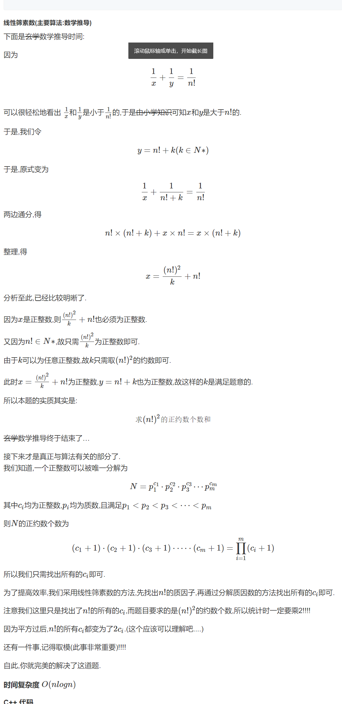

## 算法学习

### [樱花](https://www.acwing.com/problem/content/1296/)



```java


import java.util.LinkedList;
import java.util.List;
import java.util.Scanner;

public class Main {
    static final int N = (int) (1E6 + 100);

    static final int MOD = (int) (1E9 + 7);

    static List<Integer> primes = new LinkedList<>();
    static int[] vis = new int[N];
    static void getprime(int n) {
        for(int i = 2; i <= n; i ++) {
            if(vis[i] == 0) {
                primes.add(i);
            }
            for(int j = 0; j < primes.size() && i * primes.get(j) <= n; j ++) {
                vis[i * primes.get(j)] = 1;
                if(i % primes.get(j) == 0) break;
            }
        }
    }

    static int get(int n, int s) {
        int ans = 0;
        while(n != 0) {
            ans += n/s;
            n /= s;
        }
        return ans;
    }


    public static void main(String[] args) {
        Scanner scanner = new Scanner(System.in);
        int n = scanner.nextInt();
        getprime(n);
        long ans = 1;
        for(int x:primes) {
            ans = ans * (2 * get(n, x) + 1) % MOD;
        }
        System.out.println(ans);
    }
}


```

