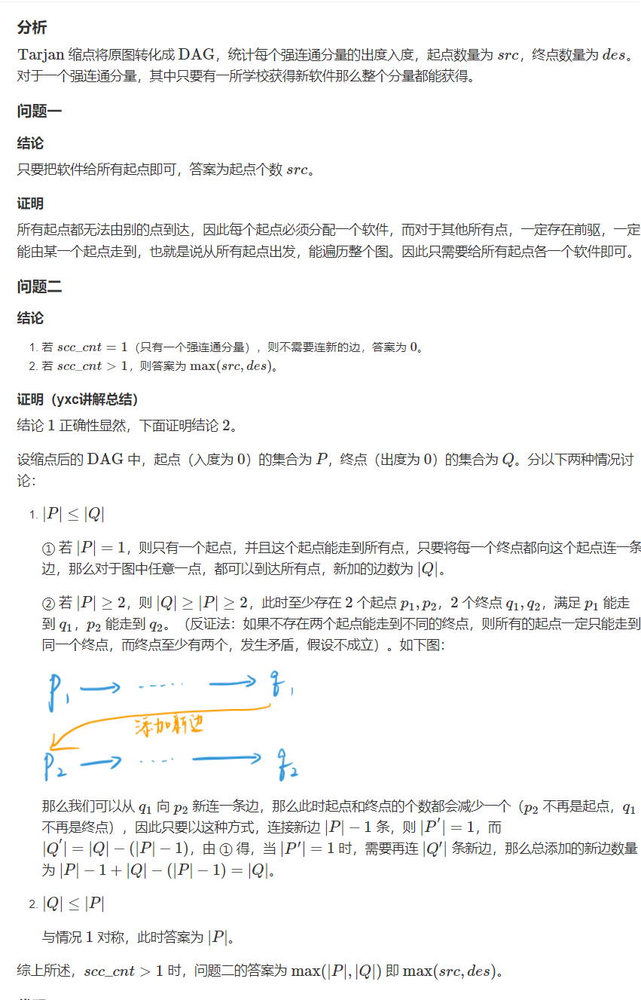

## 算法学习

### [学校网络](https://www.acwing.com/problem/content/description/369/)



```java
import java.util.*;

public class Main {

    static final int N = (int) (1e4 + 100);

    static int[] head = new int[N];
    static int[] ver = new int[N];
    static int[] nex = new int[N];

    static int tot = 0;

    static void addedge(int x, int y) {
        ver[++ tot] = y;
        nex[tot] = head[x];
        head[x] = tot;
    }

    static int[] dfn = new int[N];
    static boolean[] ins= new boolean[N];
    static int num = 0;
    static Stack<Integer> stack = new Stack<>();
    static int[] low = new int[N];
    static int cnt = 0;
    static int[] color = new int[N];
    static void tarjan(int x) {
        dfn[x] = low[x] = ++ num;
        ins[x] = true;stack.push(x);
        for(int i = head[x]; i!=0; i = nex[i]) {
            int y = ver[i];
            if(dfn[y] == 0) {
                tarjan(y);
                low[x] = Math.min(low[x], low[y]);
            }
            else if(ins[y])
                low[x] = Math.min(low[x], dfn[y]);
        }
        if(dfn[x] == low[x]) {
            int y;
            cnt ++;
            do {
                y = stack.peek(); stack.pop();
                color[y] = cnt;
                ins[y] = false;
            }while(x != y);
        }
    }


    static int[] din = new int[N];
    static int[] dout = new int[N];

    public static void main(String[] args) {
        Scanner scanner = new Scanner(System.in);
        int n = scanner.nextInt();
        for(int i = 1; i <= n; i ++) {
            while(true) {
                int x = scanner.nextInt();
                if(x == 0) break;
                addedge(i, x);
            }
        }

        for(int i = 1; i <= n; i ++) {
            if(dfn[i]==0) {
                tarjan(i);
            }
        }

        for(int x = 1; x <= n; x ++) {
            for(int i = head[x]; i != 0; i = nex[i]) {
                int y = ver[i];
                int a = color[x], b = color[y];
                if(a != b) {
                    dout[a] ++;
                    din[b] ++;
                }
            }
        }

        int a = 0, b = 0;
        for(int i = 1; i <= cnt; i ++) {
            if(din[i] == 0) a ++;
            if(dout[i] == 0) b ++;
        }
        System.out.println(a);
        if(cnt == 1) System.out.println(0);
        else System.out.println(Math.max(a,b));
    }
}


```


